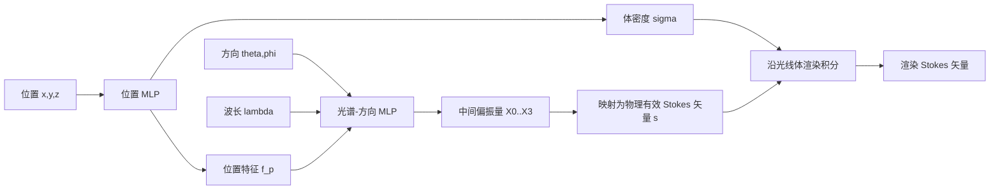

## 一句话总结

本文提出 NeSpoF，一种把位置、方向、波长映射到"物理有效的斯托克斯矢量（Stokes vector）"的神经场表示，第一次实现了对场景光波的光谱+偏振信息进行建模与新视角合成，并配套发布了首个多视角高光谱-偏振图像数据集。

## 研究背景

- 领域现状：以 NeRF 为代表的神经场已经把"光的空间强度分布（位置+方向）"建模做得很成熟，广泛用于新视角合成、渲染、分析。但这些方法都把光谱压进 RGB 三通道、把偏振彻底忽略。
- 核心痛点：光谱与偏振这两种光的波动属性蕴含了丰富的材质与几何线索，可现有的高维表示（如张量方法）为了同时装下"位置×方向×光谱×偏振"会带来爆炸性的内存开销，而且对高光谱-偏振采集中常见的低信噪比噪声非常敏感。作者报告张量模型要吃 58 GB。
- 本文 idea：定义"光谱-偏振场"——即任意位置、方向、波长下光线的斯托克斯矢量分布，并用一个坐标式神经网络（NeSpoF）来紧凑地表示它（仅 13.6 MB），同时在网络输出端强制斯托克斯矢量满足物理有效性约束，天然具备降噪能力。

## 方法

整体框架：NeSpoF 在 NeRF 的基础上增加"波长"作为输入变量，输出不再是 RGB 辐射，而是一个 4 维斯托克斯矢量 $$\boldsymbol{s}=[s_0,s_1,s_2,s_3]^\top$$ 加体密度 $$\sigma$$。网络分成两部分：位置 MLP 负责密度与位置特征，光谱-方向 MLP 融合方向与波长后输出偏振特征；再沿光线做体渲染积分得到该像素在该波长下的斯托克斯矢量。

关键设计：

1. **波长作为输入**：与 NeRF 只吃方向、输出 RGB 三值不同，光谱-方向 MLP 额外接收波长 $$\lambda$$，因此可以在任意连续波长处查询斯托克斯矢量，适配高光谱分析。波长同样做位置编码，但只用低频（$$k=1$$），因为光谱维度变化远比空间平滑。

2. **物理有效的斯托克斯矢量输出**：斯托克斯矢量必须满足 $$s_0^2 \geq s_1^2 + s_2^2 + s_3^2$$。若让网络直接回归四个分量无法保证这一约束。作者改为输出四个中间偏振量，再映射到总强度 $$s_0=S(X_0)$$、偏振度 $$\rho=S(X_1)$$（$$S$$ 为 sigmoid，限制在 0~1）、椭圆率 $$\chi=X_2$$、方位角 $$\psi=X_3$$，最后用 $$s_1=s_0\rho\cos 2\chi\cos 2\psi$$、$$s_2=s_0\rho\cos 2\chi\sin 2\psi$$、$$s_3=s_0\rho\sin 2\chi$$ 重构，从构造上保证物理有效。

3. **斯托克斯矢量坐标系对齐**：斯托克斯矢量的取值依赖参考坐标系。作者把输出矢量的 z 轴对齐到光线反方向，另两轴用解析法确定性构造出正交基 $$\boldsymbol{x}_{ws},\boldsymbol{y}_{ws}=g(\boldsymbol{z}_{ws})$$，从而能把各视角局部坐标下测得的偏振图统一到世界坐标下训练。

4. **偏振加权损失**：四个斯托克斯分量尺度差异巨大（小尺度分量往往携带重要物理信息）。作者按各分量标准差的倒数设置自适应权重 $$w_i=\mathrm{std}([\boldsymbol{s}_{meas}]_0)/\mathrm{std}([\boldsymbol{s}_{meas}]_i)$$，让训练均衡地拟合所有分量而不被大尺度的强度项主导。

此外，为了在真实场景验证，作者搭建了基于单色相机 + 液晶可调滤波片（LCTF）+ 四分之一波片（QWP）的扫描式高光谱-偏振成像系统，并针对 LCTF 空间非均匀的偏振调制提出了逐像素空间变化穆勒矩阵（Mueller matrix）标定方法，最后通过最小二乘重建每像素斯托克斯矢量。

## 实验结果

在合成数据集上，NeSpoF 能在新视角准确合成高光谱斯托克斯矢量。下表汇总合成场景的主要重建精度（PSNR 越高越好，RMSE 越低越好）：

| 评估维度 | PSNR↑ | RMSE↓ |
|----------|-------|-------|
| 630 nm 波长处 | 35 dB | 0.020 |
| 辐射分量 $$s_0$$（变化最复杂） | 33 dB | 0.023 |
| 其余斯托克斯分量 | 更高 | 更低 |
| 逐场景最低值 | 30.4 dB | — |

消融与鲁棒性分析进一步表明：加权损失相比均匀权重 MSE 能显著改善小尺度分量（如 ToP/CoP）的重建；波长位置编码取 $$k=1$$ 时 DoP/AoLP 合成质量最佳；对中等噪声（高斯-泊松噪声标准差 16）PSNR 仅下降 0.58 dB，但极端噪声（标准差 80）下降约 7 dB；输入视角数从 52 减到 13、分辨率从 1024 降到 512 都会带来性能退化。真实场景上，NeSpoF 成功还原了手机贴膜应力偏振、CD 衍射的独特光谱-偏振图案、天空光的部分线偏振，并能做光谱重光照与漫反射/镜面/层间反射的分离。

## 亮点与局限

- 亮点：
  - 首个专门面向"物理有效光谱-偏振场"的神经表示，把波长纳入连续输入，实现视角-光谱-偏振三维联合合成。
  - 通过中间偏振量映射从构造上保证斯托克斯矢量物理有效，避免非法输出。
  - 内存极其紧凑（13.6 MB vs 张量方法 58 GB），且对低信噪比测量有天然正则/降噪效果。
  - 配套的成像系统标定方法与首个多视角高光谱-偏振数据集（合成+真实）具有较高的社区价值。

- 局限：
  - 性能对测量噪声、输入视角数量、图像分辨率敏感，重噪声下明显退化。
  - 对不同材质的重建精度差异较大（表面偏振行为复杂的材质更难），缺乏材质鲁棒的统一表示。
  - 假设光在传播过程中偏振态不变、场景静态且光照恒定，对动态或强散射介质不适用。
  - 真实采集依赖扫描式系统，单张高光谱-偏振图约需 10 秒，采集成本较高。

## 延伸思考

NeSpoF 把"神经场 = 坐标到某种物理量的连续映射"这一范式从 RGB 辐射推广到了完整的斯托克斯矢量，思路上和把 NeRF 扩展到声学、SDF、BRDF 等物理量的工作一脉相承，核心贡献在于"如何在网络输出端嵌入物理约束"。一个自然的延伸方向是把它与偏振 BRDF、逆渲染结合，从光谱-偏振场反解材质与几何，而不仅是做视角插值。另一方面，当前显式建模的是"场"而非"反射过程"，若能引入显式光传输或与 3D Gaussian Splatting 这类高效表示结合，或许能缓解采集成本高、噪声敏感的问题，并推动光谱-偏振在材质分类、透明物体重建、去雾等下游任务中的落地。
