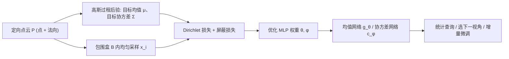

## 一句话总结

用神经网络重新参数化"随机泊松表面重建"里隐式场的均值与协方差，既保留了对重建不确定性的完整统计刻画，又避免了过拟合、摆脱了对离散网格的依赖，还能把不确定性无缝接进 3D 扫描流水线（选下一个视角、增量更新重建）。

## 研究背景

- 领域现状：从点云恢复表面是欠定问题，需要靠先验来"挑一个"输出面。泊松表面重建（PSR）用一个偏微分方程编码平滑先验，稳健高效，是通用重建的主力算法；随机泊松表面重建（Stochastic PSR）进一步把 PSR 重新解释成一个高斯过程，第一次给出了"所有可能重建"的后验分布，从而能回答光线投射、点云修补、碰撞检测等统计查询。
- 核心痛点：随机 PSR 依赖复杂的有限元离散，需要多重近似与子空间逼近，重建的特征尺度还和离散网格间距耦合在一起；另一条思路（Dai & Nießner 的神经 PSR 近似）虽绕开了 PDE，却丢掉了理论保证、在稀疏点云上过拟合，且需要额外的传感器位置信息。
- 本文 idea：不再用有限元离散那些均值/协方差函数，而是**直接用神经网络参数化它们**，再用基于梯度的优化去解泊松方程的变分形式。这样既保住了完整的统计刻画，又天然是 PSR 的严格推广，还能把随机视角从原始 PSR 扩展到 Screened PSR。

## 方法

整体框架：把随机 PSR 中待求的隐式场均值函数 $$g_\theta$$ 和协方差函数 $$c_\phi$$ 各用一个 MLP 表示；先按随机 PSR 的做法，从输入定向点云出发算出高斯过程后验的目标均值 $$\boldsymbol{\mu}$$ 与目标协方差 $$\Sigma$$，再把泊松方程的变分能量写成蒙特卡洛采样的损失，梯度下降优化网络权重，使网络输出逼近这些目标。

关键设计：

1. **变分损失即泊松解**：在包围盒 $$B$$ 内均匀采样 $$x_1,\dots,x_s$$，把均值的 Dirichlet 能量写成蒙特卡洛估计 $$L_D^m(\theta)=\frac{\lvert B\rvert}{s}\sum_i \lVert \boldsymbol{\mu}(x_i)-\nabla g_\theta(x_i)\rVert^2$$，协方差同理对二阶导算子 $$D c_\phi$$ 做双重积分近似。最小化这些损失得到的网络就是泊松方程在"神经网络函数空间"里的解。作者特别强调：**采样必须与点云解耦、从整个体积均匀抽样**——若只在点云点上采样，就退化成 Dai & Nießner 的损失，也就丢掉了体积平滑先验，正是这一点让方法成为 PSR 的严格推广并避免过拟合。

2. **扩展到 Screened PSR**：神经视角带来的直接好处是能低成本地把统计形式主义从原始 PSR 推广到屏蔽版。只需给均值与协方差各加一项屏蔽损失 $$L_S^m(\theta)=\frac1n\sum_i \lVert g_\theta(p_i)\rVert^2$$、$$L_S^k(\phi)=\frac1n\sum_i \lVert c_\phi(p_i,p_i)\rVert^2$$，与 Dirichlet 损失加权（固定屏蔽权重 $$\lambda_S=100$$）合成总损失即可，用来平衡平滑性与对输入点的保真。

3. **保证正定与对称的网络结构**：均值和协方差都用五层、每层 512 隐单元、正弦激活的 MLP（借鉴 SIREN 对 Dirichlet 型问题的良好表现）。协方差网络额外接一个 SoftPlus 层强制正性，再做 $$(c_\phi(x_1,x_2)+c_\phi(x_2,x_1))/2$$ 的对称化，结合 Schwarz 定理即可让二阶导算子 $$D c_\phi$$ 天然对称。训练用 Adam，学习率 $$10^{-4}$$、权重衰减 $$10^{-5}$$，每轮各采 10 万个均值/协方差样本，跑 50~200 轮。

4. **接入扫描流水线的可微效用**：因为重建由网络参数化，很多量都对相机参数可微。作者指出把光线终止概率写成"沿途处处在表面外"的**联合概率** $$o(t)=P(f(\mathbf{r}+\tau\mathbf{d})>0,\ \forall \tau<t)$$，比旧方法只用边缘概率 $$p(t)=P(f(\mathbf{r}+t\mathbf{d})\le 0)$$ 更准确（后者错误假设了沿光线各点独立，对"不确定的实体"不成立）。由此定义相机效用 $$u(\mathbf{r},\mathbf{d})=c_{\phi^\star}(\mathbf{p}^\star,\mathbf{p}^\star)$$（期望碰撞点处的方差），可对相机位姿求梯度、用梯度下降找局部最优视角，并配合全局采样比较不同局部最优。新扫描到来后，只需在预训练模型上**微调几轮**即可增量更新重建，省去传统 PSR 的重新离散与重新求解。

## 实验结果

主实验是"下一最佳视角选择"的质量对比：在一个机械件上按扫描迭代次数比较到真值的 Chamfer 距离，衡量所选视角带来的重建改善。

| 视角选择策略 | 到真值的 Chamfer 距离 | 适用性 |
|------|------|------|
| 随机采样 | 最高（最差） | 通用 |
| 最远点采样（启发式） | 较低 | 仅在简化设置（球面采样、方向都指向同一点）下可用 |
| 本文（可微效用 + 全局搜索） | 匹配或优于最远点采样 | 通用，无需启发式 |

结论：本文方法明显优于随机采样，并在最远点采样适用的简化场景里达到匹配或更优；而本文的效用直接来自统计化的重建过程、无需任何启发式，适用范围更广。其余能力用文字与定性结果佐证：均匀体积采样能有效抑制过拟合；增量微调让序列扫描明显快于从头重建；模型还能用 autodecoder 方式学一个潜空间，对相似形状（如 20 个人体扫描）做测试期潜码优化实现快速重建，并借点云平均负对数似然识别异常/缺陷件。

## 亮点与局限

- 亮点：
  - 用神经网络同时解决了随机 PSR 的三大工程痛点——摆脱复杂有限元离散、去掉特征尺度与网格间距的耦合、免去子空间逼近。
  - 采样与点云解耦这一关键选择，让方法在理论上成为 PSR 的严格推广、在实践上抑制过拟合，逻辑闭环干净。
  - 可微性打通了"重建—选视角—再扫描—增量更新"的端到端扫描闭环，还顺带给出停止准则与异常检测等应用。
  - 指出并修正了旧方法用边缘概率算光线终止的独立性错误，改用联合概率更贴合"不确定实体"的物理直觉。

- 局限：
  - 不确定性其实由生成数据的高斯过程编码，网络只是在解 PDE；真正的机器学习式不确定性量化（直接从点云得后验、摆脱协方差矩阵 lumping）仍是未来方向。
  - 未做超出渐近层面的运行时优化，未优化实现每轮训练约 30 秒，瓶颈在二阶导算子的反向传播。
  - 所有泛化实验都用相同的虚拟扫描设备、且输入点云都缩放到单位立方体，作者明确表示不指望结果能推广到这些设定之外。
  - 完整的下一最佳视角规划（全局搜索、行程时间、避障、机器人约束）不在本文范围内。

## 延伸思考

- 这条"神经网络当泊松求解器"的路线本质属于变分型神经 PDE 求解（深度 Ritz、PINN、SIREN 一脉），把几何重建问题翻译成损失最小化后，"可微性"就成了免费红利——凡是想让下游决策（选视角、检测异常）对输入可微的几何任务，都可借鉴这种参数化思路。
- 作者自己点出的最诱人方向是"绕开高斯过程"：若能用现代不确定性量化技术直接从点云学后验，就能容忍传感器特定的非高斯噪声，也不必再对协方差矩阵做集总近似，可能是精度与适用性的双重跃迁。
- 把不确定性显式暴露给下游，在图形学里仍不常见（相比 CV/机器人已成惯例）。这类"带方差的重建"对主动扫描、机器人抓取、工业质检等需要"知道自己不知道什么"的场景尤其有价值，值得作为一类基础能力去推广。
