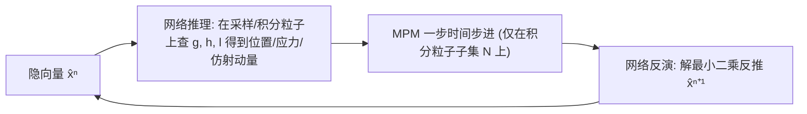

## 一句话总结

用隐式神经场为 Kirchhoff 应力场直接学习一个低维流形，配合神经形变场与仿射场，把物质点法（MPM）的弹塑性与断裂仿真压缩到只有几维的隐空间里演化，从而在保真度几乎不损失的前提下实现最高 $$10^5$$ 倍的降维和 $$10\times$$ 的加速。

## 研究背景

- 领域现状：物质点法（MPM）结合拉格朗日粒子与欧拉网格，擅长处理大变形、拓扑变化和自接触，是模拟弹塑性、砂土、金属、非牛顿流体、断裂等现象的主流方法。降阶建模（ROM）则通过学习高维仿真数据的低维隐嵌入来省算力，经典弹性 FEM 只需给形变映射 $$\boldsymbol{\phi}$$ 建低维嵌入即可。
- 核心痛点：MPM 要跟踪数百万粒子的状态变量，运行慢、内存大，且难以在 VR、云游戏等需要低延迟同步的场景中部署。而经典 ROM 只嵌入形变场对 MPM 不够用——MPM 存在历史依赖的塑性状态变量，而且形变梯度 $$\boldsymbol{F}$$ 是独立演化的状态量，单靠形变嵌入既捕捉不到塑性，也算不准 $$\boldsymbol{F}$$（尤其是断裂时）。已有的神经场 ROM 工作只给形变场建流形，无法处理塑性，且从形变场微分得到的形变梯度在大变形/断裂时严重失真。
- 本文 idea：作者观察到所有这些额外状态变量的最终目的都是算出动量方程里的应力 $$\boldsymbol{P}$$。于是绕开中间状态，直接为应力场本身学一个低维隐嵌入。神经应力场（NSF）加上神经形变场，就包含了 MPM 时间步进所需的全部信息。

## 方法

整体框架：为三个物理场——形变场、Kirchhoff 应力场、仿射动量场——各自训练一个隐式神经场（神经场），它们共享同一个低维隐空间 $$\mathcal{L} \subset \mathbb{R}^r$$（$$r$$ 通常只取 5 或 6）。训练完成后，新仿真不再演化上百万粒子的高维状态，而是只在隐空间里对隐向量 $$\hat{\boldsymbol{x}}_t$$ 做时间步进；用户间同步也只需传这一个低维向量。

关键设计：

1. **三个共享隐空间的神经场**。形变场 $$\boldsymbol{g}(\boldsymbol{X}, \hat{\boldsymbol{x}})$$ 逼近形变映射，$$\boldsymbol{g}(\boldsymbol{X}, \hat{\boldsymbol{x}}_t) \approx \boldsymbol{\phi}(\boldsymbol{X}, t)$$；应力场 $$\boldsymbol{h}(\boldsymbol{X}, \hat{\boldsymbol{x}})$$ 逼近 Kirchhoff 应力 $$\boldsymbol{h}(\boldsymbol{X}, \hat{\boldsymbol{x}}_t) \approx \boldsymbol{\tau}$$；仿射场 $$\boldsymbol{l}(\boldsymbol{X}, \hat{\boldsymbol{x}})$$ 逼近 APIC/RPIC 传输所需的仿射动量 $$\boldsymbol{C}$$。三者可在任意参考位置 $$\boldsymbol{X} \in \Omega_0$$ 处高效求值，从而支持 MPM 网格力的组装。

2. **为什么直接学应力而不是微分形变场**。一个替代做法是从神经形变场微分出 $$\boldsymbol{F} \approx \partial \boldsymbol{f} / \partial \boldsymbol{X}$$ 再算应力，但 MPM 里真正使用的形变梯度不是解析微分而是数值积分得到的。发生数值断裂时，两块分离粒子的 $$\boldsymbol{F}$$ 各自独立演化，$$\partial \boldsymbol{\phi} / \partial \boldsymbol{X}$$ 与 MPM 实际用的 $$\boldsymbol{F}_{\text{MPM}}$$ 不再吻合，会给出错误的网格力。直接学应力场则能提供 MPM 网格更新真正需要的力。此外由于应力由回映射后的弹性形变梯度 $$\boldsymbol{F}_E = \mathrm{returnMap}(\boldsymbol{F}_{\text{trial}})$$ 算得，塑性流动被隐式存储，部署时可跳过回映射计算——这让方法天然适配所有标准塑性模型。

3. **训练流程**。分三步：先用编码器-解码器联合训位移网络（编码器把高维位置 $$\boldsymbol{x}^n$$ 压成隐向量 $$\hat{\boldsymbol{x}}^n$$）；再固定隐向量训练应力解码器 $$\boldsymbol{h}$$；最后训练仿射动量网络 $$\boldsymbol{l}$$。均为 L2 重建损失。若问题参数 $$\mu$$ 含回映射信息，应力解码器可显式依赖 $$\mu$$。

4. **基于投影的隐空间动力学**。部署时一步分三段：（1）网络推理——在积分粒子上查询三个场得到位置、速度、应力、仿射动量；（2）MPM 时间步进——只在小的积分粒子子集 $$\mathcal{N}$$ 上跑一步标准 MPM，保证采样粒子的结果与全阶 MPM 完全一致（此步无近似）；（3）网络反演——用新位置解最小二乘 $$\hat{\boldsymbol{x}}^{n+1} = \arg\min_{\hat{\boldsymbol{x}}} \sum_{p \in \mathcal{S}} \lVert \boldsymbol{g}(\boldsymbol{X}_p, \hat{\boldsymbol{x}}) - \boldsymbol{x}^{n+1}_p \rVert_2^2$$，用 Gauss-Newton 迭代 2-3 次即收敛。这里采样粒子 $$\mathcal{S}$$ 与积分粒子 $$\mathcal{N}$$ 满足 $$\mathcal{S} \subset \mathcal{N} \ll \mathcal{P}$$，类似降阶 FEM 里的求积点思想，只需 $$\lvert \mathcal{S} \rvert \ge r/3$$ 即可良置。

## 实验结果

主实验以蛋糕切割（cake cutting）为例，直接对比全阶 MPM 与本文降阶模型在同一场景下的运行时间、内存和精度：

| 指标 | 全阶 MPM | 本文降阶模型（NSF） |
|------|----------|---------------------|
| 粒子数 / 隐空间维度 | 200,000 | $$r=6$$（降维比 $$\gamma \approx 10^6$$）|
| 墙钟时间 | 14.495 s | 1.417 s（$$10.23\times$$ 加速）|
| 内存占用 | 1.61 G | 0.79 G |
| 相对形变误差 $$\delta$$ | 基准 | 1.3% |

跨多种材料验证均保持高保真：撕面包（纯弹性断裂）误差 1.2%，而只微分形变场的基线方法误差高达 6.5% 且无法产生干净断裂；砂土柱坍塌（Drucker-Prager）误差 0.4%；金属挤压（von Mises 硬化）用仅 50 个采样粒子达 0.2% 误差，20 个粒子也只有 0.5%；牙膏涂抹（Herschel-Bulkley 非牛顿流体）0.6%；果冻方块碰撞旋转误差 0.20%，而缺乏仿射动量的基线方法误差 16.6%；弹性球斜面自接触 0.19%（基线 4.7%）。此外，低分辨率训练后可零成本地把部署分辨率提升 $$100\times$$，只需在更多参考点上查询连续神经场。

## 亮点与局限

- 亮点：
  - 关键洞见"直接学应力场"简洁而有效——一举绕开了历史依赖塑性状态与不可靠形变梯度两大难题，使降阶模型首次能同时处理塑性与断裂。
  - 隐空间动力学完全基于 PDE 与原始数值方法演化，无数据驱动黑箱，能定量预测应力等物理量，而不像端到端 ML 只能预测粒子位置。
  - 通用性强：适用于任何受弹性动力学方程支配的现象，涵盖弹性、砂、金属、非牛顿流体、断裂、接触、碰撞。神经仿射场恢复了角动量守恒，显著抑制了基线方法的过度耗散。

- 局限：
  - 无法处理极端分布外的外推，用激进的泛化能力换取了巨大的压缩与加速；每个场景需单独训练一个网络。
  - 训练时间长，2 到 20 小时不等，仅适合"训一次、反复部署"的场景（如 VR、游戏）。
  - MPM 应力场常含高频细节与剧烈空间变化，现有神经架构难以准确拟合，限制了可处理场景的规模。
  - 隐向量仅由位置决定，而塑性本质是路径依赖的——相同位置场不一定对应相同应力场，属未彻底解决的近似。

## 延伸思考

- 路径依赖问题作者已给出思路：把位置与应力拼接后共同编码，或让隐空间同时依据形变更新与应力更新演化，值得跟进验证其对复杂加载历史的鲁棒性。
- "直接为最终物理量（应力）建隐流形而非中间状态"的思想可迁移到其他有大量中间状态变量的仿真管线，比如布料、流固耦合。
- 结合数据无关（physics-informed loss）的降阶框架，或探索能表达高频的神经架构（如 SIREN、Fourier features），有望突破当前场景规模与高频细节的瓶颈。
- 训练"一个场景泛化到多材料/多物体"是提升实用性的关键方向，也是把该框架真正推向大规模交互式应用的前提。
