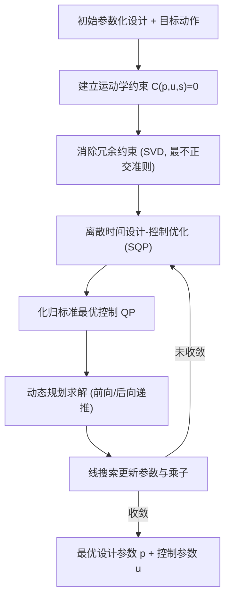

## 一句话总结

给定初始参数化设计与目标动作，本文把机器人角色的运动学设计问题重铸为离散时间最优控制问题，用动态规划同时求解设计参数与控制参数，并通过一套与具体机构无关的冗余约束消除策略，稳健高效地处理带运动学环路、过驱动、过约束的复杂空间连杆机构。

## 研究背景

由复杂机构和多个驱动器共同驱动的机器人角色，其设计长期依赖反复试错。已有的计算设计方法大多局限于单驱动、平面、或树状（无环路）的运动学结构，对带有空间闭环运动学的连杆机构支持不足。

难点主要有两个。其一，局部改动难以预测其对整段动作的影响，尤其是含运动学环路且由多驱动器驱动的设计；因为设计参数一旦改变，最优控制参数也随之改变，两者必须联立求解。其二，长时间跨度动作对应的优化问题规模庞大、数值上难以求解，而迭代式设计流程又要求工具能快速稳健地给出结果。

本文的目标是：输入一个全驱动或过驱动机器人的初始设计（用一组可配置关节参数化），配合一组高层目标，既能编辑已有设计以改变其功能，也能优化新机器人的参数化设计，使其尽可能贴近期望动作。

## 方法

核心思路是把"设计-控制"联合优化问题离散化，并借助其沿时间维的递归结构，用动态规划高效求解。

运动学表示。机器人由一组刚体构成，每个刚体状态用 7 维向量编码位置 $\boldsymbol{c}$ 与朝向四元数 $\boldsymbol{q}$，并以单位长度约束 $\boldsymbol{q}\cdot\boldsymbol{q}=1$ 保证四元数有效。关节、驱动器、可配置关节都以约束形式限制成对刚体间的相对运动，写成统一形式：

$$\boldsymbol{C}(\boldsymbol{p},\boldsymbol{u},\boldsymbol{s})=0$$

其中 $\boldsymbol{p}$ 是设计参数（整段动作中固定），$\boldsymbol{u}$ 是随时间变化的控制参数，$\boldsymbol{s}$ 是状态。可配置关节类似驱动器，但其参数只在动作开始时设定一次，用于参数化关节/驱动器的位置和朝向、或部件"长度"。

离散时间最优设计问题。把目标动作离散为 $n$ 个时间步，引入中间目标 $f$（度量跟踪性能、约束驱动器位置与速度限制）与终端目标 $F$：

$$\min_{\boldsymbol{p}_k,\boldsymbol{u}_k,\boldsymbol{v}_k,\boldsymbol{s}_k}\ \sum_{k=0}^{n-1} f(\boldsymbol{p}_k,\boldsymbol{u}_k,\boldsymbol{v}_k,\boldsymbol{s}_k)+F(\boldsymbol{p}_n,\boldsymbol{u}_n,\boldsymbol{s}_n)$$

约束包含逐步设计参数相等 $\boldsymbol{p}_{k+1}-\boldsymbol{p}_k=0$、速度关系 $(\boldsymbol{u}_{k+1}-\boldsymbol{u}_k)/\Delta t - \boldsymbol{v}_k=0$、四元数单位长度约束，以及每步的运动学约束 $\boldsymbol{C}(\boldsymbol{p}_k,\boldsymbol{u}_k,\boldsymbol{s}_k)=0$。特意采用逐时间步设计参数（而非单一 $\boldsymbol{p}$），是为了保持 Lagrangian Hessian 的带状（三对角块）结构，从而支持动态规划所需的递归、局部依赖性质。

求解策略。作者放弃"内层解状态、外层解参数"的敏感度分析法，因为很容易选到一组参数使内层无满足所有运动学约束的解。转而采用序列二次规划（SQP）：引入 Lagrange 乘子构造 Lagrangian，对 KKT 条件做 Newton 迭代，等价于每步求解一个 QP，并用 $L_1$ 罚函数做线搜索确定步长 $\alpha$。关键在于把该 QP 化归为标准的线性离散时间最优控制问题：

$$\tilde{\boldsymbol{s}}_k:=\begin{bmatrix}1\\ \Delta\boldsymbol{p}_k\\ \Delta\boldsymbol{u}_k\end{bmatrix},\quad \tilde{\boldsymbol{u}}_k:=\Delta\boldsymbol{v}_k$$

其中设计与控制变量充当"状态"，速度变量充当"控制"，状态里的前导 1 用于把 Lagrangian 的梯度与 Hessian 合并成单一二次型。运动学约束用于把状态增量 $\Delta\boldsymbol{s}_k$ 显式消去，四元数单位长度约束则通过对 Jacobian 做奇异值分解、投影到降维子空间来移除。最终得到只含反向递推 $\tilde{\boldsymbol{P}}_k$、正向递推 $\tilde{\boldsymbol{s}}_k$ 的动态规划算法，无需组装完整系统矩阵。

冗余约束消除。带运动学环路的机器人（如四连杆）常出现约束数多于状态自由度的冗余，导致 $\boldsymbol{C}_s$ 不可逆、QP 不可行。作者的处理办法与具体机构无关：先把驱动器换成对应被动关节以暴露"可动性"，对逐行归一化后的 Jacobian $\boldsymbol{C}_s$ 做奇异值分解，取零奇异值对应的左奇异向量 $\boldsymbol{Z}$（满足 $\boldsymbol{Z}^T\boldsymbol{C}_s=0$），每一行给出一个线性相关关系。按"最不正交"准则

$$j=\arg\min_j \min_k \sum_{i\neq j}\frac{z_{ik}^2}{z_{jk}^2}$$

逐个挑出可被其余约束张成、可安全删除的约束，迭代直至用尽所有相关关系，从而得到满秩的方阵 Jacobian。过驱动情形再在被动冗余移除后，对驱动约束重复该过程。

目标函数方面支持位置跟踪 $f_{\text{pos}}=\tfrac12\lVert \boldsymbol{x}(\boldsymbol{s}_k)-\hat{\boldsymbol{x}}\rVert_{\boldsymbol{W}}^2$、朝向跟踪、平滑障碍函数形式的位置/速度限制，以及使参数靠近初值的正则项。

## 实验结果

在 Kickbot（小型人形踢腿）、Legs（6 自由度、8 驱动器、过约束的闭环腿部机构）、Bear（动画熊挥爪）、Biker（空间 2 自由度骑行机构）四个示例上验证，其中两个制作了物理样机。下表为各示例优化前后关键目标的跟踪误差与总目标改善：

| 示例 | 状态 | 位置误差 最大/均值 (cm) | 朝向误差 最大/均值 (°) | 目标改善 |
| --- | --- | --- | --- | --- |
| Kickbot (1) | 初始 | 26.3 / 7.3 | 126.7 / 49.5 | 93.82% |
| Kickbot (1) | 优化 | 8.8 / 2.2 | 49.4 / 14.4 | |
| Kickbot (2) | 初始 | 26.7 / 3.2 | 57.0 / 16.0 | 67.02% |
| Kickbot (2) | 优化 | 13.8 / 2.3 | 45.2 / 13.7 | |
| Legs | 初始 | 0.41 / 0.17 | 29.4 / 10.0 | 99.97% |
| Legs | 优化 | 0.01 / 0.001 | 1.3 / 0.09 | |
| Bear | 初始 | 7.0 / 1.1 | 27.3 / 5.9 | 78.31% |
| Bear | 优化 | 3.7 / 0.6 | 18.3 / 3.7 | |
| Biker | 初始 | 0.37 / 0.04 | 30.2 / 16.2 | 99.19% |
| Biker | 优化 | 1.19 / 0.34 | 10.0 / 3.6 | |

各示例总目标改善普遍在 67%~99% 之间，优化后的设计在有限驱动器数量下明显更贴合目标动作。速度限制实验显示，相比逐帧顺序 IK 会滞后于目标、错失关键姿态，本文的全局联立表述能把误差在整段动作上最优分配，并提前起势以在速度受限下命中踢腿峰值姿态。

在时间性能上，动态规划策略相比稀疏直接求解器（SparseLU）在所有规模上都更快更稳健：如 Kickbot (1) 从 10 分 24 秒降至 1 分 5 秒；把 Biker 动作延长到 10 个周期（约 45 万变量）时，稀疏求解器因系统矩阵过大内存耗尽，而本文方法仍能在 44.4 秒内求解，随动作长度和机构复杂度良好扩展。物理样机（可重构 Legs、可制造 Biker）验证了方法在实际中可落地。

## 亮点与局限

亮点：一套与具体机构无关的冗余约束消除策略，使方法能通用地处理带任意运动学环路、过驱动、过约束的输入；把"设计-控制"联合优化巧妙化归为标准离散时间最优控制问题，用动态规划避免组装大型系统矩阵，兼顾速度、可扩展性与鲁棒性；可配置关节提供了贴合机械工程师 CAD 建模习惯的参数化接口，覆盖新设计与既有可重构机器人的编辑两类工作流。

局限：仅解决运动学问题，未涉及动力学，因而无法处理欠驱动/欠约束机器人或利用被动动力学；闭环机构可能出现的运动学奇异未做自动检测与规避；未实现自动碰撞规避；且假设机器人固定于地面，未处理与环境的变化接触状态，暂无法用于行走机器人。

## 延伸思考

把问题从运动学推广到动力学是最自然的下一步，这不仅能覆盖欠驱动/欠约束设计，还能优化那些主动利用系统被动动力学来产生更富表现力动作的机器人。另一个值得探索的方向是"只给定工作空间、设计时并不知道具体目标动作"的设计问题——如何在动作邻域研究设计敏感度、如何高效采样这样的工作空间都还是开放问题。此外，把冗余约束消除与降维子空间投影这套思路迁移到接触状态变化、行走与交互式角色的联合设计中，可能是让该框架走出"固定基座"限制的关键。
