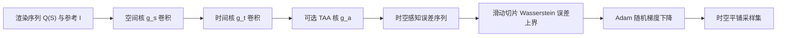

## 一句话总结

本文把图像空间的感知误差模型扩展到时间维度，提出一套时空联合的采样优化框架，让蒙特卡洛动画渲染的误差在空间和时间上都呈蓝噪声分布，从而在低采样率下获得比现有方法更高的感知质量。

## 研究背景

- 领域现状：蒙特卡洛渲染中，逐像素独立估计会让误差在图像上呈白噪声分布，感知上并不理想。半色调领域早已知道人眼视觉系统（HVS）对高频（蓝噪声）误差更不敏感，因此把误差整理成蓝噪声可显著提升感知保真度。前人（Georgiev 与 Fajardo、Heitz 等、Salaün 等）已针对静态图像做出多种蓝噪声采样方案。
- 核心痛点：这些方法大多只关注静态图像。若把同一套蓝噪声样本直接复用到每一帧，噪声图案会在画面上"钉死不动"，产生所谓的 shower-door effect（浴帘效应），破坏运动感知。Wolfe 等人首次尝试同时在屏幕空间和时间上做蓝噪声，但缺乏坚实的感知理论支撑，只是把空间和时间分开各自优化，结果并非最优。
- 本文 idea：把 Chizhov 等人的图像空间感知模型与 Mantiuk 等人的时间感知模型结合，用一个统一的时空感知核来量化动画渲染的感知误差，并把误差能量推到人眼"可见窗口"（window of visibility）之外；再在此模型上改造 Salaün 等人的先验优化方法，预计算出与场景无关、可在时空上平铺的采样集。

## 方法

整体框架：把"渲染序列与参考序列之差"依次经过空间感知核 $$g_s$$、时间感知核 $$g_t$$（可选再加时间抗锯齿核 $$g_a$$）卷积，得到感知误差序列；优化目标是让这个误差序列的范数最小。在先验设定下三个核可合并为单一时空核 $$g$$，再借助滤波最优传输给出误差上界，用随机梯度下降去最小化该上界，最终得到平铺采样集。

关键设计：

1. **时空感知误差模型**：空间上把 HVS 的点扩散函数近似为高斯核 $$g_s$$，误差为 $$\epsilon_i(S_i) = g_s * (Q_i(S_i) - I_i)$$。时间上引入 Mantiuk 等人的核 $$g_t$$（由 sustained 与 transient 两部分相加，分别响应慢变与快变信号），以滑动窗口方式作用于帧序列：$$\epsilon(S) = g_t * g_s * (Q(S) - I)$$。参考图像同样要经过感知核卷积。这样得到的时空核 $$g = g_t * g_s$$ 在频域上近似人眼的可见窗口，优化不仅压低误差幅度，还把能量推到窗口之外。

2. **纳入时间抗锯齿（TAA）**：TAA 把当前帧与历史帧加权平均，可写成显式核 $$g_a$$ 作用于原始渲染结果：$$Q_i = [g_a * R]_i$$。作者用指数滑动平均核，权重 $$g_a(j) = \alpha(1-\alpha)^j$$（取 $$\alpha = 0.2$$）。注意 $$g_a$$ 只作用于原始估计，不作用于参考。

3. **先验优化与误差上界**：先验方法假设真值图像恒定，因而对参考卷积 $$g_a$$ 变为恒等操作，三核合并为 $$\epsilon(S) = g * (R(S) - I)$$。由于 $$R(S)$$ 与 $$I$$ 都未知无法精确最小化，转而最小化基于滤波最优传输的误差上界：单像素误差被界为对阈值 $$z$$ 的积分，积分内是被核筛选后的样本分布 $$S_{g_{i,j}>z}$$ 与均匀分布 $$\mu$$ 之间的 Wasserstein 距离。为可计算，进一步用切片 Wasserstein 距离（只需一维 Wasserstein）上界替代。

4. **梯度下降流程**：对所有帧所有像素的误差上界求和作为目标，用蒙特卡洛估计其中的积分，Adam 优化器最适合（因核支撑稀疏、梯度估计噪声大）。每步随机选一个核，随机采一个阈值 $$z$$ 得到样本子集，再随机取一维切片 $$\theta$$ 估计切片 Wasserstein 梯度，多次重复降方差后做一次更新。优化时对核做环形（toroidal）包裹，保证采样集在时空上可无缝平铺。

## 实验结果

用 PBRTv3 计算光线追踪直接光照，动画 60Hz、默认每像素 1 样本，核尺寸 7×7×8，平铺块 128×128×30。以感知相对均方误差 pRelMSE 衡量，报告的是各方法相对于不相关（白噪声）采样的比值，越低越好。无论有无 TAA，本文方法在所有测试场景上都取得最低感知误差。

| 场景 | Salaün 等 (无TAA) | Wolfe 等 (无TAA) | 本文 (无TAA) | 本文 (TAA) |
|------|------|------|------|------|
| Chopper | 0.62× | 0.72× | 0.55× | 0.48× |
| Teapot | 0.63× | 0.78× | 0.58× | 0.56× |
| Modern Hall | 0.85× | 0.94× | 0.83× | 0.87× |
| Living room | 0.82× | 0.86× | 0.80× | 0.84× |
| Dragon | 0.52× | 0.67× | 0.51× | 0.48× |
| Veach MIS | 0.83× | 0.92× | 0.69× | 0.72× |

消融实验表明：只针对 TAA 核优化已经胜过前人，但比使用完整（感知核 + TAA 核）模型高出约 5–10% 的感知误差，验证了"优化目标越贴合真实滤波核，效果越好"这一假设。方法也适用于任意每像素样本数，四样本时相比前人依旧保持更好的蓝噪声分布。

## 亮点与局限

- 亮点：
  - 首个有坚实感知理论支撑的时空蓝噪声采样框架，把空间感知核、时间感知核与 TAA 核统一到同一卷积模型里，直接对"人眼实际看到的滤波结果"做优化。
  - 采样集与场景无关、可预计算并在时空平铺，实用性强；框架支持任意滤波核，可灵活替换更精确的 CSF 或适配不同 TAA。
  - 在多样场景、有无 TAA、不同样本数下均一致优于此前最优方法。
- 局限：
  - 先验优化依赖信号局部平滑（Lipschitz）假设，只在局部近似成立；在薄阴影半影（空间）或快速运动物体（时间）等剧烈变化区域感知误差会上升，时间上的变化可借运动矢量缓解，作者留作未来工作。
  - 先验方法难以推广到路径追踪等更高采样维度的复杂渲染算法；且当噪声本身很低时，误差分布对感知质量的影响也随之减弱。

## 延伸思考

- 本文只用了较基础的时空 CSF 模型，框架本身却支持任意滤波核，探索更先进的 CSF、或引入内容相关的视觉掩蔽（如按纹理预计算专用采样集）都是自然的延伸方向。
- 更有价值的方向是把这套时空感知目标用于后验（a posteriori）优化，若能做到实时并处理复杂动态场景，就能与交互式去噪方法结合，直接嵌入实时渲染管线。
- 运动矢量重投影是补齐"快速运动区域"短板的关键一环，如何在保持先验采样集可平铺、场景无关的同时引入运动信息，是理论与工程都值得深挖的问题。
