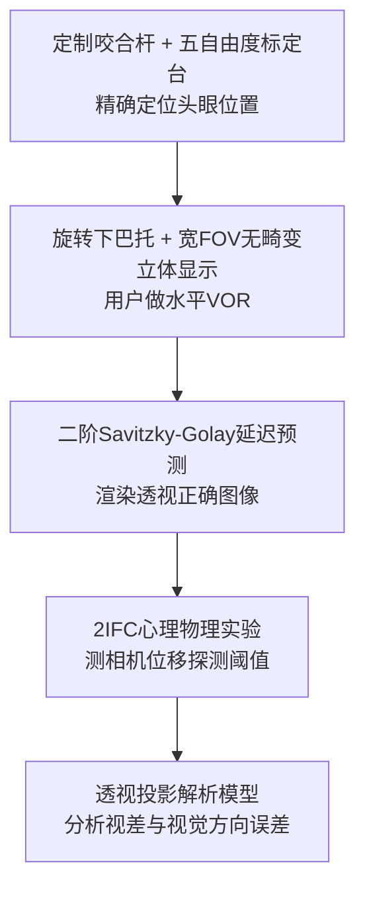

## 一句话总结

作者搭建了一套无畸变、宽视场、带高精度头眼追踪的实验平台，用心理物理学实验首次直接测出在 AR 与 VR 中要让虚拟内容"钉"在真实世界不漂移（world-locked rendering, WLR），渲染相机位置允许的误差有多大，并发现 AR 的容差比 VR 严苛整整一个数量级。

## 研究背景

- 领域现状：头显（HMD）靠头部与眼睛追踪来渲染透视正确的双目图像，理论上能让虚拟物体稳定地锁定在世界坐标里。但追踪误差、渲染延迟、畸变校正不准、佩戴位置偏移等都会让渲染相机偏离用户真实眼位，导致虚拟内容漂移、抖动，破坏沉浸感甚至引发眩晕。
- 核心痛点：达到"完美 WLR"到底需要多小的相机位置误差，一直没有精确答案。原因有二：一是市面上没有任何头显的追踪与渲染精度足够高，能对运动中的用户做到完整 WLR；二是真实头显和 CAVE 都带有显著的显示畸变，会给实验刺激引入无法泛化的额外几何误差。此外过去研究几乎都只针对静止观察者，而动态误差（用户运动时产生）比静态误差更容易被察觉。
- 本文 idea：不去迁就现有头显，而是自建一套能对主动观察者做到完整 WLR 的定制硬件（无畸变宽视场立体显示 + 咬合杆定制的高精度头眼模型），在这个"干净"的平台上系统测量 AR 和 VR 下可接受的渲染相机位移误差，再用几何模型解释实验现象。

## 方法

整体思路：先造一台能对运动用户做到完整 WLR 的测试平台，消除显示畸变与追踪误差这两个混淆变量；然后在平台上跑双目误差心理物理实验，测出不同类型相机位移误差的探测阈值；最后用透视投影几何模型分析视差误差与视觉方向误差，解释实验中的反直觉结论。

- **完整 WLR 测试平台**：用一台 88 英寸 OLED 电视放在离眼 50.7 cm 处，配合同步快门眼镜实现 120 Hz（每眼 60 Hz）无畸变、宽视场（$$125^\circ \times 94^\circ$$）立体显示。用户头动被限制在旋转下巴托里只做偏航旋转（类似摇头"不"），并注视固定点从而诱发前庭眼反射（VOR）。这样就能在没有光学畸变、追踪足够准的前提下研究 WLR。
- **咬合杆标定平台**：为每位用户定制咬合杆，用高精度五自由度（x、y、z、roll、yaw）平移旋转台加相机对准系统，把用户角膜顶点精确定位到距旋转中心 9.3 cm。标定好的咬合杆通过公共基准底板转移到实验用的下巴托上，使得标定时的头部测量能直接用于渲染与追踪。眼睛用半径 7.8 mm（旋转中心到投影中心）的球模型、以视轴而非光轴注视来建模 VOR 时的眼动。
- **精确延迟预测**：为在图像被看到的瞬间从正确眼位渲染，需要前向预测补偿渲染与显示延迟。先把软件栈总延迟压到 16.67 ms，实测运动到光子延迟 20–26 ms，再手动整定前向预测时间常数，发现 26 ms 最能实现 WLR。
- **心理物理任务**：用两区间强制选择（2IFC）——一个区间相机与投影中心重合，另一个区间相机被位移，用户在 VOR 头动中判断哪个区间更稳定（VR 场景则判断哪个畸变更小）。以 75% 正确率对应的误差定义"可接受相机位置"。实验区分两类与头显相关的误差组合：头部追踪/重投影误差（横向、纵向同号误差），以及佩戴误差（横向反号、纵向同号，对应 IPD 与眼距假设不准）。

## 实验结果

主实验（Experiment 1）在近显示距离（1.97 D，51 cm）下测出 AR 与 VR 各自可接受的相机位移误差面积（阈值围成的区域面积，数值越大表示越不敏感、容差越大）。核心结论是 VR 的容差比 AR 大一个数量级以上，且两者差异在 9 位完成全部条件的被试上具统计显著性（p=.0007）。

| 条件 | AR 容差 | VR 容差 | 说明 |
|------|---------|---------|------|
| 追踪误差 | 31.4 mm² ± 36.5 | 7.6 cm² ± 7.0 | 横向+纵向同号误差 |
| 佩戴误差 | 21.1 mm² ± 18.2 | 17.0 cm² ± 15.8 | IPD/眼距不准 |
| 追踪 vs 佩戴 | 无显著差异 (p=.35) | 有显著差异 (p=.02) | AR 中横向追踪与 IPD 误差同等敏感 |

其他发现（文字补充）：VR 中横向追踪误差比 IPD 误差更易察觉，这与几何模型预测（IPD 误差造成的畸变更大）相反；VR 还表现出对"朝向用户的负眼距误差"更宽容的偏置，而 AR 因有真实世界参照，误差以零为中心且追踪/佩戴阈值相当。显示距离与场景内容（城市场景 vs 倾斜文字）对容差的影响多数不显著。

## 亮点与局限

- 亮点：
  - 首次给出对主动观察者完整 WLR 的实验硬件，从根本上排除了显示畸变与追踪不准这两个长期混淆变量。
  - 首次在同一平台上直接对比 AR 与 VR 的 WLR 相机位置要求，得出"AR 比 VR 严苛一个数量级"的量化结论，对头显追踪、佩戴、光学设计有直接工程意义（如 MR 视频透传相机应位于名义眼位 15 mm 内）。
  - 用解析模型指出"视觉方向误差"而非仅"深度/视差误差"是 VR 中 WLR 敏感度的重要预测因子，解释了追踪误差比 IPD 误差更易察觉的反直觉现象。
- 局限：
  - 头眼运动被严格限制为水平 VOR，结论对平滑追踪、扫视等其他眼动不一定成立（作者认为 VOR 阈值可能偏严）。
  - 只有 11 名被试，且部分条件的参与者更少；被试均排除需戴眼镜者。
  - 未考虑瞳孔游移（pupil swim）与相机位移的联合效应，也未考虑视觉系统对超阈值误差的长期适应。
  - 固定焦显示缺乏准确的模糊与调焦线索，可能不足以在所有条件下实现完整 WLR。

## 延伸思考

这项工作把"世界锁定"从工程直觉变成了可量化的感知指标，为头显追踪精度、佩戴校准、光学厚度、MR 透传相机布置提供了明确的数值预算。一个自然的延伸是把水平 VOR 之外的头眼运动（扫视、平滑追踪、行走中的大幅度头动）纳入研究，看动态运动模糊与扫视抑制到底能放宽多少容差。另一个方向是把这里的感知阈值与眼动追踪驱动的动态畸变校正（ETDDC）、注视点渲染、重投影/新视角合成等系统结合，把有限的追踪与算力预算分配到人眼最敏感的维度上。对做实时渲染与神经重建的研究者而言，"视觉方向误差比深度误差更关键"这一发现，也提示在评估 novel view synthesis 或重投影质量时，横向稳定性可能比绝对深度精度更值得优化。
