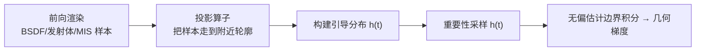

## 一句话总结

本文把可微渲染中棘手的可见性边界项化简为一个极其简洁的**局部积分**，并提出"投影采样"——把前向渲染中产生的普通样本投影到附近的物体轮廓上，构建出低方差的引导分布来高效、无偏地估计几何梯度，且能统一适配三角网格、隐式曲面和纤维曲线等多种几何表示。

## 研究背景

- 领域现状：逆向渲染依赖对渲染算法求导。对于顶点位置、曲线控制点、变换矩阵这类会影响**物体轮廓（silhouette）**的参数，蒙特卡洛渲染器算出的梯度会被严重的偏差污染，连最基本的优化都会失败。已有工作分为两类：边界法（在轮廓上额外撒样本）与面积法（用重参数化把不连续边界"冻住"，再对普通样本积分）。
- 核心痛点：边界法虽然概念优雅（Zhang 等 2020 的路径空间法把边界与内部解耦），但难以**按贡献比例**去采样边界——边界积分在采样空间里极度稀疏且高频，只有紧邻光源的一小段真正有贡献；已有方法用稠密网格或自适应 kd-tree 表示，前者内存爆炸，后者容易漏掉尖峰而过早停止细分。面积法（重参数化）则要追大量辅助光线感知周围几何运动，会向内部区域也注入方差，且难以在偏差与方差之间取得平衡。此外，边界法此前只支持多边形网格，难以推广到隐式曲面。
- 本文 idea：与其从零构造边界样本，不如**复用前向渲染的普通样本**——它们天然集中在图像里重要（高贡献）的区域。把这些样本"走"到附近轮廓上（投影），就能把任意成熟的内部采样技术（BSDF/发射体/多重重要性采样）直接变成针对边界的采样器。投影得到的密度不必精确，只需覆盖有贡献的区域，就能构建无偏估计。

## 方法

整体框架分三步：① 一次普通的前向渲染，同时把样本**投影**到附近轮廓上（即从难以刻画的密度 $$p(t)$$ 中采样）；② 用这些投影样本构建一个闭式的**引导分布** $$h(t)\approx p(t)$$；③ 对 $$h(t)$$ 做重要性采样来计算边界积分。只要 $$h$$ 覆盖了有贡献的区域，即便它只是近似的，估计仍然无偏。

**关键设计一：把边界导数化简为局部积分。** Zhang 等 2020 的边界项是一个涉及非局部"阴影域" $$B(\mathbf{x}_a)$$ 的复杂积分，且其推导里残留了对光线求交做自动微分产生的项。本文重新推导，把它化到"终极简化形式"，得到一个同时覆盖**周长项**（离散边，如网格的边）与**内部项**（光滑曲面的连续轮廓）的完整表达式：

$$\frac{\partial I}{\partial\theta}=\int_{\partial A}\int_{S^2}L_d(\mathbf{x}_b,\boldsymbol{\omega})\,W_i(\mathbf{x}_b,\boldsymbol{\omega})\,\sin\phi\,(\partial_\theta \mathbf{x}_b\cdot \mathbf{n}_b)\,\mathrm{d}\boldsymbol{\omega}\,\mathrm{d}l(\mathbf{x}_b)+\int_{A}\int_{S^1}L_d(\mathbf{x}_b,\phi)\,W_i(\mathbf{x}_b,\phi)\,\kappa(\phi)\,(\partial_\theta \mathbf{x}_b\cdot \mathbf{n}_b)\,\mathrm{d}\phi\,\mathrm{d}A(\mathbf{x}_b)$$

其中 $$L_d$$ 是前景与背景的辐射亮度差 $$L_d(\mathbf{x}_b,\omega)=L_o(\mathbf{x}_b,\omega)-L_i(\mathbf{x}_b,-\omega)$$，$$\sin\phi$$ 是方向与边切线的夹角，$$\kappa(\phi)$$ 是法曲率。这个式子有几个要害：两项都**不含**非局部域 $$B(\mathbf{x}_a)$$；也不含几何项 $$G$$（意味着可避免它带来的方差，而旧方法的引导分布里白白把 $$G$$ 制表进去）；光滑闭合几何 $$\partial A=\varnothing$$ 时只剩内部项，多边形网格 $$\kappa=0$$ 时只剩周长项。这是首个给出**内部项局部形式**的工作，正是它让方法能推广到隐式曲面与纤维曲线。

**关键设计二：投影算子（按几何类型定制）。** 用户只需为每种几何实现"把射线段投到附近轮廓"的投影，加上周长/内部的参数化。球面最简单（有解析解）；三角网格用 **Walk + Jump** 混合策略——Walk 是在相邻三角形间贪心游走、逐步增大法线与视线夹角直到接近 90°，无需光线求交、步子小而稳健；Jump 是基于局部线性近似的牛顿式迭代，一步跨过高度细分的平坦区。实践中先 Walk 30 步、失败再 Jump 一次、再 Walk 30 步，只需一次光线求交即可产出高质量投影。纤维曲线（三次 B 样条）通过解一个关于方位角 $$u$$ 的方程找轮廓，半径恒定时有解析解、否则 20 次二分。允许投影"不完美"：失败时把轮廓点吸附到最近的局部边界、取最接近原方向的切向；根查找也可提前终止而不求到机器精度。

**关键设计三：引导数据结构。** 提供两种。网格引导（3D 密度网格）适合较光滑的被积函数，且投影可直接累加进体素、无需存样本，内存友好，但高分辨率时内存吃紧。层次引导用**自底向上**构建的一组八叉树（每棵覆盖第一维的一段等分区间），从集中在稀疏特征上的投影样本出发，细分到最大深度（9）或节点内样本数 ≤1，从而自动匹配被积函数的时空-方向结构；再在每个叶节点撒 32 个均匀样本估计真实积分值。这与 Yan 等 2022 自顶向下的自适应求积相反——后者靠局部评估决定是否停止细分，容易漏掉尖峰。

## 实验结果

主实验（网格上的网格化引导对比，反射场景下的前向导数）表明：**投影采样只用 1 份样本**，就在误差（相对有限差分参考的 RMSE）上超过用 5 倍样本、甚至 50 倍样本的均匀基线（PSDR），同时初始化耗时最低。下表取 Bunny 与 Filigree 两个代表场景：

| 方法 | Bunny RMSE↓ | Filigree RMSE↓ | 初始化耗时(s)↓ Bunny/Filigree |
|------|-------------|----------------|------------------------------|
| Uniform 5x（PSDR 基线） | 4.635 | 1.557 | 0.49 / 0.46 |
| Uniform 50x（PSDR） | 0.400 | 0.726 | 4.05 / 3.71 |
| Projective 1x（本文） | 0.179 | 0.481 | 0.29 / 0.30 |

论文报告投影采样在 MAE 上稳定优于 PSDR 约 2.5–4.5×，因离群点的存在，RMSE 上的优势最高可达 25×；相较原论文摘要给出的整体数字，均匀引导平均降低 RMSE 约 8.1×，自适应（八叉树）引导再额外提升约 2.7×。其余实验用文字补充：与 Yan 等 2022 的自适应求积等时对比中，八叉树引导在 Neptune 场景上把 RMSE 差距拉开约 190×；纤维曲线实验里投影采样即使对手用 50× 样本也更优；端到端重建（单视图从阴影/反射恢复形状、Magic Lens 折射优化、含自阴影的人脸重建）验证了低方差梯度对优化收敛与稳定性的实际帮助；SDF 实验则验证了新局部积分对隐式曲面周长项与内部项的正确分解。

## 亮点与局限

- 亮点：
  - 理论上把边界导数化到最简局部形式，首次给出内部项的局部公式，消掉了非局部域与几何项 $$G$$，直接带来采样效率提升。
  - "投影 + 引导"复用前向渲染的成熟采样技术（MIS 等），天然把计算集中在可见、重要的几何上，避免了重参数化对内部区域注入方差的通病。
  - 模块化：新增一种几何只需实现投影与参数化两三个算子，统一支持三角网格、SDF、Bézier 纤维；已并入开源的 Mitsuba 3。
- 局限：
  - 依赖"有足够表面积收集样本"——像草叶那样周长/面积比很大的细长几何可能拿不到足够投影样本。
  - 投影本身需良态：把大量内部点映到同一轮廓位置的投影虽合法却无益。
  - SDF 目前只实现了均匀初始化的网格引导，未实现投影算子。
  - 边界采样空间本质离散、高频，边排序与自适应离散化只是"创可贴"，缺乏真正光滑的全局参数化。

## 延伸思考

- 结论上颇具启发：路径空间可微渲染当年的核心发现是"内部与边界解耦"，本文却指出两者之间存在强协同——完全分离通常并不可取，边界项能大量借用内部项模拟时收集到的信息。这提示后续工作可以更系统地在"内部信息复用于边界"上做文章。
- 投影的思路或许能推广到更一般的可微编程/着色器场景：对含 `if` 决策边界的程序，反复用扰动输入运行并加一步把样本投到决策边界的根查找迭代，来补齐其导数贡献。
- 作者留下的开放问题——为高频离散的边界采样空间找到"真正光滑的全局参数化"——很可能是把这类方法推向更复杂场景与更高统计效率的关键，值得关注。
