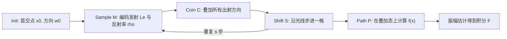

## 一句话总结

本文把光线步进（ray marching）重新表述为一次量子随机游走，构建了首个"从头到尾都跑在量子计算机上"的量子光传输模拟管线，能以多项式代价追踪指数数量的光路，并借助量子数值积分获得比经典蒙特卡洛更快的收敛。

## 研究背景

- 领域现状：把量子计算用于渲染近年受到关注。已有的量子渲染主要依赖 Grover 搜索来求光线与场景的求交，把"找与光线相交的图元"当成搜索问题，在 $$M$$ 个图元上以 $$O(\sqrt{M})$$ 完成，比朴素的 $$O(M)$$ 快。另一条线是量子数值积分（quantum numerical integration），它对 $$N$$ 次估计能达到 $$O(1/N)$$ 收敛，快于经典蒙特卡洛的 $$O(1/\sqrt{N})$$，且误差与被积函数方差无关。
- 核心痛点：作者指出基于 Grover 搜索的量子光线追踪有两个根本问题。其一，$$O(\sqrt{M})$$ 虽快于朴素法，却慢于经典带加速结构的 $$O(\log M)$$，即便量子硬件成熟也不划算；其二，"能以多项式代价并行处理指数条光路"这一美好设想对 Grover 搜索其实不成立——因为每个搜索结果都必须读出到经典比特，读出指数数量的结果依旧需要指数代价。若改用蒙特卡洛避免指数分叉，又会与量子数值积分不兼容。
- 本文 idea：抛开 Grover 搜索，改用光线步进作为核心——场景用体素网格表示，把步进过程建模为量子随机游走（quantum walk）。这样在体素数与步数上与经典步进同阶，同时天然地以叠加态并行承载指数条光路，且全程不读出量子比特，因此可以直接对接量子数值积分，获得 $$O(1/N)$$ 收敛。

## 方法

整体框架：给定相机与像素，先求出主光线的首个交点，从该点开始做离散随机游走；把游走升级成量子游走后，位置与方向都以叠加态存在，一次演化就覆盖了所有可能的分叉路径。沿途把每步的发射与反射率编码进量子比特，最后用一个 Path 电路在叠加态上直接算出路径贡献函数 $$f(x)$$，构造出编码积分值的量子比特并交给振幅估计。

关键设计：

1. 把光线步进写成随机游走。游走的状态是 3D 位置 $$p_i$$ 与方向 $$\omega_i$$，每步沿方向前进到下一个体素；命中表面则散射到新方向 $$\omega_s$$，否则方向不变。升级为量子游走后，每步不再随机挑一个方向，而是用硬币算子 $$C$$ 把当前状态铺成所有可能方向的叠加，再用移位算子 $$S$$ 把行走者按各方向同时推进：$$S\bigl(\lvert p_i\rangle \otimes \tfrac{1}{\sqrt{2}}(\lvert 0\rangle + \lvert 1\rangle)\bigr) = \tfrac{1}{\sqrt{2}}(\lvert p_{i-1}\rangle\lvert 0\rangle + \lvert p_{i+1}\rangle\lvert 1\rangle)$$。测量时叠加坍缩为一条随机路径，概率正比于行走者停留在该状态的振幅平方。

2. 位置相关的硬币门表达材质。用三种硬币建模不同表面：真空硬币是恒等门（不散射）；镜面硬币把入射方向映射到关于法线的反射方向；朗伯硬币把入射方向散射成出射方向的叠加。朗伯的难点在于不同入射方向会映射到同一组散射方向，而量子门必须可逆——作者的巧解是利用振幅可为负这一点，通过给振幅"洗牌符号"把不同入射方向映射到不同量子态，从而在保持可逆的同时实现散射。方向分布特意选成让 BRDF 与几何项和 PDF 相消，只留下反射率。

3. 在叠加态上直接求路径贡献。游走结束后得到编码各步发射与反射率的态 $$\lvert L_e\rangle\lvert\rho\rangle$$，还需算出路径贡献 $$f(x) = \sum_{i=0}^{s} L_e^{i} \prod_{k=0}^{i-1} \rho_k$$。作者借鉴量子振幅算术，加一组基编码的 $$\lvert \text{Steps}\rangle$$ 比特，用多控 $$X$$ 门按步号选取并累乘各项，得到 $$f'(x) = \frac{1}{s+1} f(x)$$（除以 $$s+1$$ 是副产物，事后乘回即可）。整个过程不做任何随机采样，$$f$$ 在所有可能路径的叠加上被同时求值。

4. 编码与场景表示。位置与方向用基编码（定点二进制），方向被预先列成一张 1D 方向表用整数索引以简化电路；发射与反射率用振幅编码以便参与 $$f(x)$$ 运算。场景为体素网格，每个体素存发射、反射率、平均法线与类型；假设发射各向同性、表面均为朗伯。因当前量子机没有存储器，场景需以电路"按需计算"体素数据（类似程序化建模），若未来有量子随机存储则可像经典机那样存取。最后用 Nakaji 与 Shimada-Hachisuka 的振幅放大式估计（而非相位估计）来读出积分，减少所需比特与多比特门。

## 实验结果

作为概念验证，作者在 2D 与 3D 分别测试。2D 场景（$$8\times 8$$ 网格）能在量子电路模拟器上完整跑通，成功捕捉直接与间接光照（如彩色墙面的颜色溢出到地板），但整幅图算了约五天。3D 因模拟量子电路代价过高不可行，改用一个"仿真器"——经典写的、按相同离散化与指数分叉行为采样的光线步进器——复现量子游走会产生的样本（代价退化为指数时间），再走 $$P$$ 门与振幅估计。收敛率实验用"采样次数 / 振幅估计实例数"作为公平的统一计算代价度量：

| 方法 | 收敛斜率（误差-代价对数图） | 说明 |
|------|--------|------|
| 经典蒙特卡洛 | 约 $$-0.471$$ | 接近理论 $$O(1/\sqrt{N})$$ |
| 本文量子光线步进 | 约 $$-1.407$$ | 优于预期的 $$O(1/N)$$ |

本文方法收敛更快，但起始误差高于经典蒙特卡洛，作者归因于测试场景以低方差、平滑光照为主（正是蒙特卡洛擅长的情形）。相较此前用经典光线追踪填充数值结果的量子工作，本文是完整的量子光传输，能内在处理多次弹射、软阴影与部分互反射，且是迄今在全量子渲染上测过的较复杂场景之一。

## 亮点与局限

- 亮点：
  - 首个端到端全量子的光传输管线，直到最后一步才读出量子比特，因而能真正对接量子数值积分并保住 $$O(1/N)$$ 的收敛优势。
  - 用量子随机游走替代 Grover 搜索，绕开了"读出指数结果需指数代价"的根本瓶颈，以叠加态承载指数条光路。
  - 比特宽度上 $$O(s + \log p + \log d)$$ 对位置数 $$p$$、方向数 $$d$$ 仅对数增长（对步数 $$s$$ 线性）；配合量子存储，体素数可对数级压缩。
- 局限：
  - 电路深度 $$O(s(p^3 + d))$$，对场景尺寸三次增长，源于无量子存储时每个体素都要编入电路。
  - 依赖大量多比特门，需分解为一/二比特门，显著增加深度并放大退相干误差。
  - 振幅编码存样本贡献时，光强大于 1 需额外缩放。
  - 作者明确不声称达到量子霸权——量子步进与"指数并行的经典步进"本质无异，霸权仍是开放问题。

## 延伸思考

这项工作把渲染里熟悉的"体素光线步进"翻译成量子随机游走，思路上的启示比它当下能渲的简单场景更重要：只要一个经典采样过程能被写成随机游走，就有希望升级成量子游走，从而以叠加态并行探索指数状态空间。朗伯散射那一步"用负振幅符号编码可逆性"的技巧尤其巧妙，也提示了扩展到光泽/玻璃材质、参与介质体散射的可能方向。真正的门槛仍在硬件——三次方深度、多比特门分解、缺乏量子存储都强依赖未来量子计算环境的进步；一旦有量子随机存储，场景表示与访存方式或将根本改变。与此同时，它与量子金融中的蒙特卡洛定价、凸体体积估计等跨领域量子均值估计方法遥相呼应，值得关注这些领域在状态制备上的新进展能否反哺渲染。
