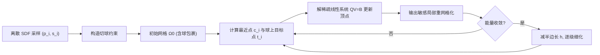

## 一句话总结

本文提出一个纯几何、无需训练的等值面重建方法：把每个离散 SDF 采样点解读为一个必须与目标表面相切的球，从而定义能量并用梯度流"收缩包裹"出一张三角网格，在低分辨率下显著优于 Marching Cubes 和基于学习的 Neural Dual Contouring。

## 研究背景

- 领域现状：从离散有向距离场（SDF）重建显式三角网格，长期由 Marching Cubes 及其变体主导；近年 Neural Marching Cubes、Neural Dual Contouring（NDC）通过在大规模 SDF 数据集上训练、使用更宽的采样模板取得了更好的逐格重建。
- 核心痛点：传统等值面方法把 SDF 当成一般隐式函数，只用相邻采样点的符号变化和线性插值定位零等值面，忽略了 SDF 自带的距离信息，导致重建严重过度光滑、丢失特征；尤其在低分辨率网格下会产生断裂的"块状"结果。而基于学习的方法虽有改进，却需要训练和存储网络权重。
- 本文 idea：一个关键洞察——每个采样值 $$\phi(\boldsymbol{x})$$ 对应一个以 $$\boldsymbol{x}$$ 为球心、半径为 $$\lvert \phi(\boldsymbol{x}) \rvert$$ 的球；真实表面必须与每个球至少相切一次，并且严格包含所有负值球、排除所有正值球。这个"切球"约束里隐藏了远比一般隐式表示更丰富的几何信息，本文要把它显式地挖出来利用。

## 方法

整体框架：把 SDF 约束 $$\phi(\boldsymbol{p}_i, \Omega) = s_i$$ 转写成一个"违背相切约束程度"的能量，从一张包裹住目标的初始三角网格出发，沿该能量的梯度流不断"收缩包裹"逼近真实表面，并在每步之后局部重网格化以维持网格质量，最终得到与所有切球约束一致的表面。

关键设计：

- **SDF 能量与球到达流（sphere reaching flow）**：定义能量为表面在各采样点处 SDF 值与观测值之差的平方和 $$E_\phi(\Omega) = \tfrac{1}{2} \sum_{i=1}^{n} (\phi(\boldsymbol{p}_i, \Omega) - s_i)^2$$。直接在整个表面空间搜索最小值不可行，于是从初始表面出发跟随梯度流 $$\tfrac{\partial \Omega}{\partial t} = -\nabla E_\phi(\Omega)$$，让表面去"够到"每个球：与每个球至少相切一次，同时严格包住负球、排除正球。

- **不可微能量的线性化处理**：$$E_\phi$$ 既非凸也不连续可微。作者对每个采样点找出表面上的最近点 $$\boldsymbol{c}_i(\Omega)$$（可写成顶点的重心坐标线性组合 $$\boldsymbol{a}_i(\Omega)\boldsymbol{V}$$），再把 $$\boldsymbol{p}_i$$ 沿 $$\boldsymbol{p}_i$$ 到 $$\boldsymbol{c}_i$$ 的连线投影到球面得到目标点 $$\boldsymbol{t}_i(\Omega)$$。用当前网格的法向判断内外，从而确定投影方向系数 $$\sigma_i \in \{+1, -1\}$$。有效解处 $$\boldsymbol{c}_i$$ 应与 $$\boldsymbol{t}_i$$ 重合，故把能量近似为 $$\tfrac{1}{2}\sum_i \lVert \boldsymbol{a}_i(\Omega)\boldsymbol{V} - \boldsymbol{t}_i \rVert^2$$。

- **隐式时间步与线性求解**：用隐式格式离散时间，每步求解 $$\boldsymbol{V}_t = \arg\min_{\boldsymbol{V}} \tfrac{1}{2\tau}\lVert \boldsymbol{V} - \boldsymbol{V}_{t-1} \rVert_{\boldsymbol{M}}^2 + \tfrac{1}{2}\lVert \boldsymbol{A}\boldsymbol{V} - \boldsymbol{S} \rVert_F^2$$，固定 $$\boldsymbol{t}_i$$ 后归结为稀疏线性系统 $$\boldsymbol{Q}\boldsymbol{V}_t = \boldsymbol{B}$$，其中 $$\boldsymbol{Q} = \boldsymbol{M} + \tau \boldsymbol{A}^\top \boldsymbol{A}$$，可用 Cholesky 高效求解。步长 $$\tau$$ 用受 Armijo 条件启发的启发式自适应选取，避免过小低效或过大失稳。

- **重网格化与逐级细化分辨率**：梯度流会迅速使网格退化（薄三角、翻转、自交），故每步后用局部重网格算法修复，且只对"是某采样点最近点且违背约束超过容差"的活跃区域做输出敏感的重网格，节省开销。分辨率由目标边长 $$h$$ 控制：从较大的 $$h$$ 起步跑到收敛得到粗略近似，再不断把 $$h$$ 减半、只细化贡献能量的区域，直到达到 $$h_{\min}$$（默认取采样点间平均距离），从而得到"能解释全部 SDF 样本的最低分辨率网格"。对大规模问题（如 $$n > 50^3$$）只对外部球做随机批处理，因为内部球对稳定性更关键。

## 实验结果

主实验在一组多来源形状、多种网格分辨率上，比较本文方法、Marching Cubes（MC）与 Neural Dual Contouring（NDCx）的重建误差（Hausdorff 距离 Hdf、Chamfer 距离 Chr、SDF 能量 $$E_\phi$$，均为在各分辨率上平均），越低越好。

| 网格分辨率 | Hdf MC | Hdf NDCx | Hdf 本文 | Chr MC | Chr NDCx | Chr 本文 | $$E_\phi$$ 本文 |
|------|------|------|------|------|------|------|------|
| $$6^3$$ | 0.3351 | 0.2597 | **0.1236** | 0.1918 | 0.1135 | **0.0569** | 0.1091 |
| $$10^3$$ | 0.2518 | 0.1954 | **0.0846** | 0.1053 | 0.0662 | **0.0343** | 0.1152 |
| $$20^3$$ | 0.1486 | 0.1163 | **0.0631** | 0.0465 | 0.0311 | **0.0210** | 0.1377 |
| $$30^3$$ | 0.0756 | 0.0494 | **0.0396** | 0.0206 | 0.0127 | **0.0118** | 0.0280 |
| $$40^3$$ | 0.0581 | **0.0366** | 0.0417 | 0.0143 | **0.0089** | 0.0100 | 0.0135 |
| $$50^3$$ | 0.0501 | 0.0360 | **0.0253** | 0.0107 | 0.0077 | **0.0074** | 0.0050 |

在低到中分辨率下，本文方法在三项指标上普遍优于 MC（常达数倍），并超过或持平需要训练的 NDCx；在较高分辨率（如 $$40^3$$ 的 Hdf）上略逊于 NDCx 但仍具竞争力。作者指出 MC 需要 $$20^3$$ 到 $$30^3$$ 的采样才能达到本文方法在 $$6^3$$ 网格的精度，等效于把相同表面精度下的内存需求降低约 37 到 125 倍。方法还能自然推广到无符号距离场、截断/钳制 SDF、以及扫掠体等保守 SDF。

## 亮点与局限

- 亮点：
  - 提出"切球"这一对 SDF 的新几何解读，揭示了离散 SDF 中被以往方法忽视的亚格子信息，纯几何、无需任何训练或权重存储。
  - 在低分辨率下重建质量显著领先，能以极低内存达到传统方法高分辨率的精度，为轻量级低分辨率 SDF 表示提供了新价值。
  - 方法不依赖网格结构，可直接处理非结构化点云采样，甚至在收敛后增补少量样本进一步提升质量；框架易于推广到无符号距离场、钳制 SDF 与扫掠体。

- 局限：
  - 流与重网格保持初始网格拓扑，无法处理拓扑变化，因此对多连通或非零亏格形状要求初始表面拓扑正确（可用 MC 提供初始网格）。
  - 尚不鲁棒于自交，梯度流可能产生自交与"夹断"奇异点，这也限制了它在噪声 SDF 上的表现（噪声标准差达包围盒 0.5% 时会在收敛前触发奇异点）。
  - 满足离散 SDF 的表面在精细尺度上仍有自由度，缺乏针对具体应用的先验或正则；性能上最近点查询、线性求解与重网格也都有优化空间。

## 延伸思考

- 把 SDF 从"通用隐式函数"重新理解为"切球集合"是很轻的一层认知转变，却带来可观收益；作者明确提出将这一视角推广到依赖离散 SDF 的其他图形任务（仿真、几何处理、渲染）——例如碰撞检测、流体表面追踪中能否同样受益，值得追问。
- 拓扑与自交的短板与几何流领域的经典难题一致，作者建议借鉴基于网格的流体表面追踪技术来动态处理拓扑变化，这条路线若打通将大幅拓宽适用范围。
- "最低分辨率网格解释全部样本"的思路与压缩/自适应表示天然契合；结合逐级细化，或可为低带宽、低存储的 SDF 资产管线提供实践价值。后续工作 Reach for the Arcs 正是把该思路进一步推进到点云与切点重表述。
