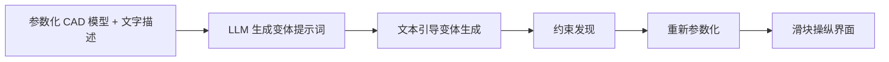

## 一句话总结

本文提出一个零样本流水线，借助预训练大语言模型和文生图模型推断一个 CAD 模型"有意义的变化空间"，据此把过参数化的构造式 CAD 程序重新参数化为少数几个语义化的操纵参数，让设计者通过滑块直观探索设计空间。

## 研究背景

- 领域现状：参数化 CAD 是几乎所有制造物的起点，其核心愿景是通过调节构造参数（如拉伸距离）在一族形状里自由变化。
- 核心痛点：现实中直接调参很难。CAD 程序通常**过参数化**，而构造参数之间的语义约束往往缺失或未明确指定，导致改动单个参数就会破坏结构（比如椅子腿脱离座面）。这些约束反映的是"设计意图"，无法单凭几何或程序表示推断出来——它源自设计者的现实经验与语义理解。
- 本文 idea：先"理解应该怎么操纵这个形状"，再据此做分析推导约束。关键在于利用预训练基础模型（LLM + 扩散模型）已经学到的"合理形状空间"，先归纳出一批有意义的变体，再用符号方法演绎出各变体共有的几何约束，从而在原参数空间里切出一个语义子空间。整个过程零样本，不依赖大规模类别化形状数据集。

## 方法

系统输入一个用简化 CSG 语言表达的参数化模型加一句文字描述（如"chair"），输出一个参数更少、暴露语义操纵参数的新 CAD 程序，配一个滑块界面。整体分三步：LLM 生成变体提示词 → 文本引导下优化 CAD 参数得到一批变体 → 从变体中发现共有约束并重新参数化。

关键设计：

1. **简化 CAD 语言**：基于 CSG，只保留并集操作（去掉交、差以简化可微渲染），支持三种基元（立方体、圆柱、变顶半径圆柱）和平移/缩放两种变换。不假设输入含高层变量，直接从底层构造参数学习抽象。

2. **文本条件变体生成**：对每个提示词，迭代地用 stable diffusion（图到图）在当前渲染基础上生成目标图像，再用可微渲染器（Nvdiffrast）的像素损失做梯度下降，把 CAD 参数拟合到该图像。损失同时含一个把参数拉回初始值 $$x_0$$ 的正则项：
$$L(x) := \sum_a \lVert \mathrm{sharpen}(R_a(x)) - \mathrm{sharpen}(I_a) \rVert^2 + \lambda \lVert x - x_0 \rVert^2$$
作者发现直接用 CLIP 或 DreamFusion 式蒸馏损失会让基元断裂，改用**图像空间损失**能让"参数—网格—图像"之间的投影更顺畅。为对付扩散模型跨视角几何不一致（细腿消失等），每步生成多张图像并**挑与当前渲染最接近的一张**做引导。

3. **约束发现（含噪声）**：在干净的初始模型上枚举共面、共轴、关键点重合、尺寸相等等线性几何关系，再用贪心策略从中挑出对所有变体都近似成立的子集。评分先用一个立方体近似的 IoU 体积度量（可用一次线性最小二乘求解，快），最后用像素损失通过变化点检测确定约束数量的截断点。此外还通过"逐个移除基元看像素损失是否低于阈值"来发现**离散变化**（如椅子扶手可有可无），作为二值开关。

4. **重新参数化**：用高斯-约当消元为约束子空间构造保留自由变量身份的基，以初始模型为中心建立可插值混合的第二套参数化；再用发现的变体作为边界，得到一个有界、可安全探索的子空间，并加入离散可选自由度。

## 实验结果

在五个复杂度不同的模型（瓶子、相机、椅子、桌子、汽车）上运行完整流水线。核心结论是约束发现显著降维、同时保持结构连贯。主实验（Table 1）统计各模型的参数量、基础模型约束数、推断出的共有约束数与重参数化后的维度：

| 模型 | 参数量 | 基础约束数 | 共有约束数 | 重参数化维度 |
|------|--------|-----------|-----------|-------------|
| 瓶子 | 19 | 20 | 8 | 9 |
| 相机 | 24 | 21 | 9 | 15 |
| 椅子 | 48 | 172 | 37 | 11 |
| 桌子 | 36 | 90 | 22 | 14 |
| 汽车 | 42 | 94 | 26 | 13 |

发现的约束语义合理（车轮共轴、椅子扶手保持在座面两侧、桌椅腿等高），同时会拒绝过度具体的约束（如座面为正方形且与扶手同厚）。消融对比表明：纯神经方法（只用生成模型、无约束）会产生大量断裂伪影；纯符号方法（只用初始模型的几何约束、不看生成图像）过度受限，变体多为呆板的缩放。损失函数消融显示，CLIP 与单步蒸馏损失效果差，完整扩散过程的图像空间损失最能保持结构连通性。

## 亮点与局限

- 亮点：
  - 神经符号结合——用基础模型"归纳"语义变化，用符号分析"演绎"几何约束，既有语义又保结构。
  - 真正零样本，不需类别化数据集，因而不局限于已有数据集覆盖的少数类别。
  - 提出针对低维 CAD 参数空间的图像空间损失与多图挑选策略，缓解了通用文生 3D 损失导致的基元断裂问题。
- 局限：
  - CAD 语言仅支持并集，缺交、差操作（受可微网格渲染器所限）。
  - 依赖 vanilla stable diffusion，缺强 3D 先验，难生成复杂几何，且计算开销大。
  - 约束发现依赖约束的线性假设，扩展到非线性约束成本高；难以区分扩散伪影与真实设计变化。
  - 结果质量高度依赖文本提示词的质量。

## 延伸思考

- 用 SDF 可微渲染器或可微 CAD 内核替换网格渲染器，有望补全交/差等布尔操作，扩展到更完整的 B-rep 历史式建模。
- 把近年更强 3D 先验的文生 3D 方法接入变体生成环节，或能覆盖更复杂的几何并降低生成成本。
- "先用基础模型归纳意图、再用符号方法约束"的范式，可迁移到其他程序化内容（材质图、建筑布局、装配体）的语义重参数化。
- 区分"生成噪声"与"有意设计变化"仍是开放问题，引入物理理解或让基础模型判别二者是值得追问的方向。
