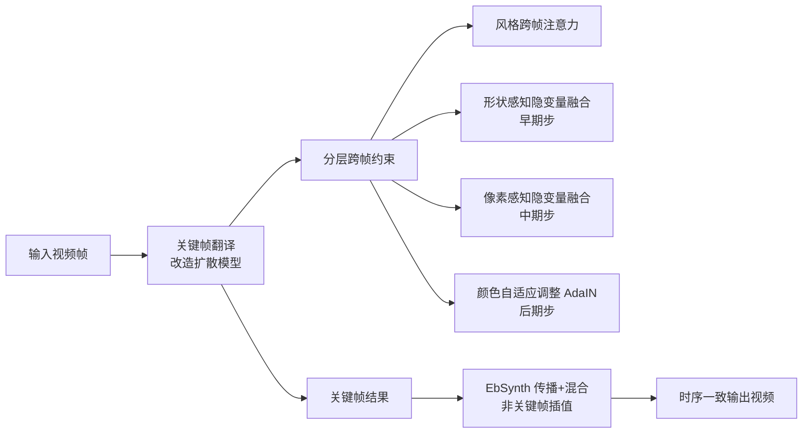

## 一句话总结
提出一个免训练的零样本框架，把预训练图像扩散模型直接用于文本引导的视频风格迁移，通过分层跨帧约束和基于光流的分块传播，在保持全局风格的同时实现像素级的时序一致性。

## 研究背景
- 领域现状：大规模文生图扩散模型（Stable Diffusion 等）在图像生成与编辑上表现出色，但直接逐帧套用到视频上会产生严重的闪烁问题。已有三类视频方案——训练视频模型、在单条视频上微调、以及零样本方法。
- 核心痛点：训练视频模型代价高且与现成图像模型不兼容；单视频微调对长视频效率低且易过拟合；已有零样本方法只在扩散采样中对隐变量施加跨帧约束，只能维持全局风格，无法保住局部结构与纹理，纹理与细节仍会抖动。
- 本文 idea：坚持零样本路线以保持与现成图像模型的兼容性，用光流建立稠密跨帧对应，把"首帧作锚点、前一帧作低层参考"的思路拆到扩散采样的不同阶段，分层约束形状、纹理、颜色，从而同时获得全局与局部的时序一致。

## 方法
整体框架分两部分：关键帧翻译（用改造后的扩散模型渲染均匀采样的关键帧）与全视频翻译（用 EbSynth 把关键帧传播插值到非关键帧）。扩散生成擅长造内容但多步采样慢，分块传播能高效推出像素级连贯帧但不能造新内容，二者互补以平衡质量与效率。

关键设计：

1. **风格感知跨帧注意力**：把 U-Net 中的自注意力替换为跨帧注意力，当前帧的查询 $$Q$$ 去检索首帧与前一帧的键值，即 $$K'=W^K[v_1;v_{i-1}]$$、$$V'=W^V[v_1;v_{i-1}]$$，让当前帧的全局风格继承锚点帧与前一帧。此约束贯穿所有采样步。

2. **形状感知隐变量融合（早期步）**：用光流 $$w^i_j$$ 与遮挡掩码 $$M^i_j$$ 把参考帧的隐变量对齐到当前帧，更新预测的 $$\hat{x}_{t\to0}$$ 为 $$\hat{x}^i_{t\to0}\leftarrow M^i_j\cdot\hat{x}^i_{t\to0}+(1-M^i_j)\cdot w^i_j(\hat{x}^j_{t\to0})$$。实验发现锚点帧（$$j=0$$）比前一帧引导更好；由于隐空间插值在后期步会导致模糊与形变，融合只限于早期步做粗糙形状对齐。

3. **像素感知隐变量融合（中期步）**：不再在隐空间插值，而是把前一帧和锚点帧 warp 回来、编码进隐空间做 inpainting 式融合。为对抗自编码器反复编解码带来的失真与色偏，提出保真度导向的图像编码 $$E^*$$：对图像做两次编解码得 $$x^r_0$$ 与 $$x^{rr}_0$$，假设信息损失近似线性，用 $$E^*(I):=x^r_0+M_E\cdot\lambda_E(x^r_0-x^{rr}_0)$$ 预测并补偿损失（$$\lambda_E=1$$，掩码 $$M_E$$ 抑制补偿引入的伪影）。随后把 warp 叠加得到的参考帧 $$\tilde{I}'_i$$ 编码为像素参考，在掩码 $$M_i$$ 内用 ControlNet 的结构引导、掩码外匹配像素参考，按结构引导 inpainting 更新隐变量 $$x^i_{t-1}\leftarrow M_i\cdot x^i_{t-1}+(1-M_i)\cdot\tilde{x}^i_{t-1}$$。这是实现像素级一致性的核心。

4. **颜色自适应隐变量调整（后期步）**：在后期步对 $$\hat{x}^i_{t\to0}$$ 施加 AdaIN，把其逐通道均值方差对齐到首帧 $$\hat{x}^1_{t\to0}$$，保持整段关键帧的颜色风格连贯（该步可选，用户可决定跟随首帧还是输入帧的颜色）。

全视频翻译沿用 EbSynth 的引导式分块匹配把关键帧向前后各 $$K-1$$ 帧传播，得到来自相邻两关键帧的两个结果并做时序感知混合；作者只采用其颜色/梯度择优与对比度保持混合两步，舍弃 Poisson 混合以避免非平坦区域的伪影并加速。

## 实验结果
在关键帧翻译上与四个零样本方法对比（CLIP 帧级编辑准确率 Fram-Acc↑、相邻帧 CLIP 相似度 Tem-Con↑、对齐相邻帧的像素均方误差 Pixel-MSE↓，以及 30 人用户偏好率）：

| 方法 | Fram-Acc↑ | Tem-Con↑ | Pixel-MSE↓ | 用户总体偏好↑ |
|------|-----------|----------|------------|---------------|
| 本文 | 0.979 | 0.983 | 0.069 | 73.7% |
| Text2Video-Zero | 0.963 | 0.983 | 0.084 | 15.0% |
| Pix2Video | 0.995 | 0.953 | 0.216 | 4.2% |
| FateZero | 0.556 | 0.979 | 0.085 | 4.2% |
| vid2vid-zero | 0.862 | 0.975 | 0.098 | 2.9% |

本文取得最好的时序一致性（Pixel-MSE 最低、Tem-Con 并列最高）与次优的编辑准确率，并在平衡度、时序一致、总体质量三项用户偏好上全面领先。此外关键帧采样间隔 $$K$$ 的分析显示：$$K$$ 增大时时序指标基本稳定、逐帧效率提升，但过大（如 $$K=100$$）会因传播距离过远导致编辑准确率下降。$$512\times512$$ 视频下每帧总耗时约 $$1.49+12.74/K$$ 秒。

## 亮点与局限
- 亮点：
  - 完全零样本、免训练免优化，与现成图像扩散技术（LoRA/DreamBooth 定制模型、ControlNet 结构引导）正交兼容，改造轻量。
  - 把跨帧约束按扩散采样阶段分层施加（形状→纹理→颜色），首次在零样本设定下达到像素级纹理时序一致。
  - 保真度导向的零样本图像编码巧妙抑制了反复编解码的累积色偏，适用于长视频。
  - 扩散生成关键帧 + EbSynth 传播的混合设计兼顾质量与效率。
- 局限：
  - 强依赖光流质量，快速运动、大遮挡或复杂 3D 旋转下对应关系可能失败。
  - 逐视频需手动调 $$T$$、ControlNet 控制权重等超参，非全自动。
  - 帧插值本身不能创造新内容，关键帧间隔过大时编辑准确率下降；对内容差异大的相邻帧传播质量受限。

## 延伸思考
该工作代表了"复用图像扩散先验 + 显式光流对应"这一无训练视频编辑路线的成熟形态，与后续把时序对应嵌入注意力机制、或走视频扩散模型的方向形成对比。其保真度导向编码补偿的思路可推广到任何需要反复自编码的隐空间流水线。一个值得追问的点是：随着原生视频扩散模型与 3D Gaussian 等显式表征的发展，这种依赖光流与分块传播的后处理式一致性方案能否被端到端的时空建模取代，或作为轻量插件长期共存。
