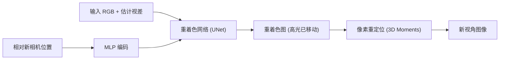

## 一句话总结

针对单图新视角合成中高光"粘在表面"的问题，本文把视图合成拆成"像素重着色（reshading）"和"像素重定位（relocation）"两个独立任务，用神经网络先按新相机调整输入图的着色、再交给已有的视图合成方法搬移像素，从而生成带有真实移动高光的新视角图像。

## 研究背景

- 领域现状：得益于 3D 场景表示与图像修复技术的进步，单图新视角合成（"3D 照片"）近年进展显著，能生成几何一致的新视角，适合 VR 与光场设备上的沉浸式体验。
- 核心痛点：现有方法几乎都只关注几何一致性而忽略视角相关效应。模块化方法（先估深度分层再 warp）把高光当纹理一起搬走，导致高光像被"粘"在表面上，看起来不真实；端到端方法理论上能学到视角相关效应，但高光通常集中在很小的区域，其着色误差对训练损失贡献极小，因而实际上也学不好移动高光。
- 本文 idea：作者的关键观察是——一个 3D 表面点在输入图与新视角图中，既发生了**位置变化**，也发生了**着色变化**（出射方向不同）。据此把视图合成显式拆成两个独立任务：先做重着色（在输入相机坐标系下按新相机方向重算着色），再做重定位（用已有方法搬移像素）。重着色用一个神经网络直接学习，避免了从单图反解光照、材质、法线等病态问题。

## 方法

整体框架：给定单张 RGB 图像与相对的新相机位置，先用重着色网络输出一张"重着色图"（物体位置不变，但高光已按新视角移动），再把这张重着色图喂给已有的模块化视图合成方法（Wang 等的 3D Moments）完成像素搬移，得到最终新视角图像。

关键设计：

1. **重着色 vs 重定位的分解**。基于渲染方程分析，表面点 $$\boldsymbol{x}$$ 在输入图与新视角图中的外观由出射辐亮度 $$L_o(\boldsymbol{x}, \omega_o^{\boldsymbol{x}c})$$ 与 $$L_o(\boldsymbol{x}, \omega_o^{\boldsymbol{x}c'})$$ 决定，二者仅出射方向不同（入射辐亮度、法线、BRDF 均相同）。因此着色变化可以在输入相机坐标系内单独完成，与像素搬移解耦。这样把"占损失比重很小"的着色任务从端到端训练里独立出来，专门优化。

2. **合成数据集构造**。真实场景无法拍到"重着色图"（需要光线射向另一相机却从原相机成像），作者改造 Tungsten 路径追踪器：先从输入相机投射主光线找到首个交点，再计算从**新相机**到该交点的光线（novel primary ray），用这条光线做着色和后续次级光线的生成。基于 9 个场景各渲染 200 对图像（1280×720 HDR、每像素 8K 采样），随机化纹理/材质、随机加彩色光球增强鲁棒性。对法线与新主光线夹角大于 90° 的错误着色区域，用 validity mask 在损失中屏蔽。

3. **网络输入与结构**。输入为 RGB 图 + 频率编码的视差图（视差由单图深度估计得到，转成视差后按 1/4 缩放并 clamp 到 1，再做 5 频率的频率编码共 11 通道）+ 相对新相机位置。采用 5 层下/上采样的 UNet 编码器-解码器；3 维相机位置经 MLP 升到 125 维特征，与原始 3 维向量拼接后复制并接到瓶颈特征图上；解码器输出**残差图**加回输入得到重着色图。视差、频率编码、MLP 三个设计经消融验证都必要。

4. **训练损失**。因问题高度病态，采用 L1 + 感知损失组合：
$$\mathcal{L} = \lambda_1 \mathcal{L}_1 + \lambda_{vgg} \mathcal{L}_{VGG} + \lambda_{style} \mathcal{L}_{style}$$
其中 $$\mathcal{L}_{VGG}$$ 用 VGG-19 的 conv4\_4 特征，$$\mathcal{L}_{style}$$ 用其 Gram 矩阵。权重分别设为 1e-1、1e-2、1。所有损失项前先乘以 validity mask。

## 实验结果

在三个合成场景上，将本文重着色接入两种重定位方法（3D Photo 与 3D Moments），与端到端的 SVMPI 对比新视角图像与真值的 PSNR/SSIM/LPIPS。可见把重着色接到任一重定位方法上都能带来提升（尤其 PSNR），验证了该模块的即插即用性：

| 场景 | 方法 | PSNR↑ | SSIM↑ | LPIPS↓ |
|------|------|-------|-------|--------|
| Veach Ajar | SVMPI | 22.72 | 0.877 | 0.0428 |
| Veach Ajar | 3D Moments | 29.78 | 0.962 | 0.0149 |
| Veach Ajar | 3D Moments + Ours | 30.41 | 0.962 | 0.0147 |
| Bathroom | SVMPI | 20.27 | 0.602 | 0.1255 |
| Bathroom | 3D Moments | 32.03 | 0.951 | 0.0284 |
| Bathroom | 3D Moments + Ours | 33.12 | 0.953 | 0.0281 |
| Modern Hall | SVMPI | 22.73 | 0.763 | 0.0759 |
| Modern Hall | 3D Moments | 30.98 | 0.951 | 0.0197 |
| Modern Hall | 3D Moments + Ours | 31.21 | 0.953 | 0.0196 |

作者指出 SSIM/LPIPS 对纹理敏感、对平滑高光不敏感，因此数值提升未能完全反映质量改善。单独评估重着色网络时，其输出比原始输入图更接近真值（例如 Veach Ajar 的 PSNR 从 35.45 提升到 40.10）。定性上，3D Moments 两视角着色几乎不变，SVMPI 移动高光时会扰动底层纹理且偏模糊，而本文能在保持纹理的同时正确移动高光。

## 亮点与局限

- 亮点：
  - 用"重着色 + 重定位"的解耦视角切中了端到端方法"高光损失占比过小学不动"的痛点，思路清晰且可解释。
  - 重着色网络与具体重定位方法解耦，可作为即插即用模块接到任意基于像素搬移的视图合成方法上。
  - 用改造路径追踪器合成"输入-重着色"配对数据，巧妙绕开了真实场景无法采集此类数据的难题，并用 validity mask 处理遮挡边界的错误着色。
- 局限：
  - 无法处理镜面等高度镜像表面，镜中内容在不同视角的重着色图间无法正确移动。
  - 当光源非常靠近漫反射表面形成强饱和区域时，网络会误判为高光并错误地移动它们。
  - 训练与数值评估依赖合成数据；相机移动范围限定在以输入相机为中心、半径 0.1~0.3 的球内，属于较近的视角变化。

## 延伸思考

- 该方法本质上是把"视角相关着色"从几何搬移中剥离出来单独学习，这一分解思想或可迁移到多图/视频视角合成，或与 3D Gaussian Splatting、NeRF 等表示结合，专门补齐这些表示在任意表面上高光质量不足的短板。
- 重着色依赖单图深度估计与合成数据训练，真实复杂场景（尤其含镜面、透明、强饱和光源）下的泛化仍是开放问题；引入更强的材质/光照先验或扩散模型式生成先验可能有助于处理镜面与饱和区误判。
- 由于重着色在输入相机坐标系内逐视角独立进行，长序列漫游时的时序一致性值得进一步定量验证，尽管作者在补充视频中观察到结果是连贯的。
