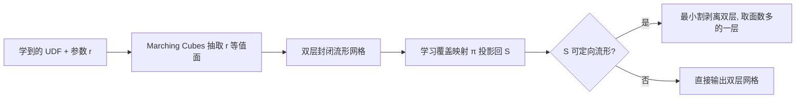

## 一句话总结

提出 DoubleCoverUDF：不直接抽取无符号距离场（UDF）的零等值面，而是先用标准 Marching Cubes 抽取一个厚度为 $$r$$ 的等值面（它是 UDF 目标曲面的"双层覆盖"，天然是封闭可定向流形），再把这层双覆盖投影回目标曲面，从而稳健地重建开放与封闭曲面。

## 研究背景

- 领域现状：Marching Cubes 能从有符号距离场（SDF）稳健抽取水密网格，但 SDF 无法表达开放、非流形或不可定向曲面。UDF 能表达任意拓扑，近年在从点云或多视图学习几何上很受欢迎，成为 SDF 的重要补充。
- 核心痛点：零不是 UDF 距离值的正则值，立方体顶点也不再有"符号相反"的信号，标准 Marching Cubes 无法直接用。已有做法要么抽取一个小正等值面（导致曲面被膨胀、结果失真），要么用 UDF 的梯度方向代替符号来判定交点（MeshUDF、MeshCAP）。后者对 UDF 精度极其敏感——距离值的微小误差就会翻转梯度方向，产生大量非流形顶点、多余边界与手柄。
- 本文 idea：与其和"零不是正则值"死磕，不如退一步抽取一个正等值面 $$r$$。关键洞察是：目标曲面 $$S$$ 的 $$r$$-偏移体的边界 $$\partial(S \oplus r)$$，无论 $$S$$ 的拓扑如何，都必然是一张封闭、可定向的二维流形，因此标准 Marching Cubes 可以稳健地抽取它。随后再学一个覆盖映射把这层"膨胀双覆盖"投影回 $$S$$。

## 方法

整体框架分三步：给定学到的 UDF 和用户指定的厚度参数 $$r$$，先用标准 Marching Cubes 抽取 $$r$$ 等值面（即 $$\partial(S \oplus r)$$，一张双层封闭流形网格）；再学一个覆盖映射 $$\pi: \partial(S \oplus r) \to S$$ 把双覆盖投影回目标曲面；若目标曲面是可定向流形，再用最小割后处理把双层剥离成单层，否则直接输出双层网格。

关键设计：

- **$$r$$-偏移体与双覆盖**：$$r$$-偏移体定义为 $$S \oplus r = \lbrace p \mid \exists q \in S, \lVert p - q \rVert \le r \rbrace$$，相当于给曲面赋予厚度得到一个实体。其边界 $$\partial(S \oplus r)$$ 恒为封闭可定向二维流形，这正是能重新用回标准 Marching Cubes 的理论基础。对开放曲面，$$r$$ 需小于最小缝隙尺寸的一半，以免把缝隙填死。

- **学习覆盖映射 $$\pi$$**：把投影表述为对投影点最小化 UDF 值的优化问题，用 vector Adam 求解。若像已有工作那样独立移动每个顶点，网格会被撕裂；因此本文把所有顶点联合优化，并额外把每个三角形的**质心**作为约束一起考虑，以避免折叠与自交。采用由粗到细两步：粗映射 $$\pi_1$$ 带一个**自适应权重的拉普拉斯项**（权重 $$w(p_i) = \sqrt{A_{\max}/A(p_i)}$$，面积越小约束越强），防止三角形翻转并让三角形大小均匀；细映射 $$\pi_2$$ 再沿法向微调、惩罚切向位移以补回几何细节。质心虽出现在目标函数里但不是自由变量（由三顶点平均得到），其作用是给已落在零等值面上的顶点提供额外"力"，进一步降低目标函数。

- **双层剥离（开放可定向流形）**：投影后的双层网格两层几乎重合，剪切曲线由二面角接近 $$0^\circ$$ 的边构成。直接按角度阈值切不稳健，因此构建网格的对偶图，给二面角 $$\alpha_{ij}$$ 的边赋权 $$\exp(200(\alpha_{ij} - \alpha_{\min}))$$，选一组大二面角节点作源、其"孪生"节点作汇，求最小 $$s$$-$$t$$ 割。若两块面数差在总面数 15% 以内则接受，取面数多者；否则换源汇重试（多数不超过 3 次）。封闭模型的双覆盖本就是内外两个不连通分量，无需割，直接取面数多的分量。

## 实验结果

在 Deep Fashion3D 的 598 件服装（开放曲面、含噪点云、UDF 由 Simple MLP 学得，Marching Cubes 分辨率 $$256^3$$）上与两种主流方法对比。本文方法在几何精度接近 MeshCAP、优于 MeshUDF 的同时，输出网格完全没有非流形顶点/边，且拓扑特征（亏格、边界数）远比对手贴近合理预期。

| 方法 | CD 均值 (10⁻³)↓ | 非流形顶点数↓ | 非流形边数↓ | 平均亏格↓ | 平均边界数↓ |
|------|------|------|------|------|------|
| MeshCAP | 1.770 | 18548.6 | 0.168 | 69.85 | 18428.3 |
| MeshUDF | 2.046 | 1.459 | 0.157 | 93.36 | 104.73 |
| Ours (DCUDF) | 1.825 | 0 | 0 | 3.334 | 15.90 |

其余实验的关键结论：在 ShapeNet-Car 上验证了越小的 $$r$$（在合法区间内）几何精度越好、且始终零非流形顶点；在由真值网格转出的精确 UDF 上（Dragon 等）与 UNDC、MeshUDF、MeshCAP、标准 MC 对比，DCUDF 在保持零非流形结构的同时拓扑最干净；对含复杂内部结构的车模型与场景数据也能保持结构完整、连通分量数远少于对手。

## 亮点与局限

- 亮点：
  - 把"UDF 零等值面抽取"这个病态问题，通过 $$r$$-偏移体的边界必为可定向流形这一拓扑事实，转化为标准 Marching Cubes 能处理的良性问题，思路优雅且稳健。
  - 输出网格可保证无非流形顶点/边，拓扑（亏格、边界）显著更接近真实，视觉质量高。
  - 通用性强：兼容任意连续可微、能提供梯度的 UDF 表示（NDF、CAPUDF、Simple MLP 均可作输入），是一个即插即用的零等值面抽取工具。
- 局限：
  - 依赖厚度参数 $$r$$：$$r$$ 需大于零等值面上点的最大 UDF 值、大于半个立方体边长，又要小于最小缝隙的一半；而最小缝隙尺寸和 $$d_{\max}$$ 在真实含噪数据上往往未知，形成"鸡生蛋"困境，需靠经验或试错设定。
  - 对非流形/不可定向目标曲面只能输出双层网格，其拓扑与目标曲面不同，无法真正剥离还原。
  - 覆盖映射需逐模型优化（粗步 300 轮、细步 100 轮），比纯 Marching Cubes 变体多一步优化开销。

## 延伸思考

- $$r$$ 的自适应/局部化设定是自然的后续方向：能否从 UDF 自身估计局部缝隙尺寸与噪声水平，做空间变化的厚度，缓解"全局单一 $$r$$"在薄结构与噪声区之间的矛盾。
- "先膨胀成流形、再投影回退"的范式对其他病态隐式表示（如三极 SDF、混合符号距离函数）可能同样适用，值得作为通用后处理框架探索。
- 后续该组的 Neural Medial Axis 工作正是复用了改进版双覆盖策略来提取中轴，说明这套双覆盖机制在几何处理里有超出零等值面抽取本身的延展价值。
