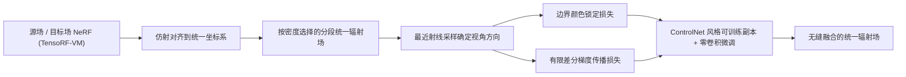

## 一句话总结

SeamlessNeRF 把二维图像的"泊松融合"思想搬到神经辐射场上，通过在拼接边界锁定颜色、并在目标场内部保持原有辐射梯度，实现多个 NeRF 部件之间无缝、自然的外观融合。

## 研究背景

- 领域现状：NeRF 已成为强有力的三维表达，围绕它的编辑能力（放置、组合、风格化、文本引导编辑等）研究蓬勃展开。
- 核心痛点：把一个三维物体的局部无缝移植到另一个物体上（类似二维图像里的无缝融合）是一项基础但被忽视的操作。NeRF 的外观信息编码在黑盒网络参数里，源场与目标场之间的纹理信息如何传播缺乏有效手段，直接拼接会在接缝处产生明显的颜色/纹理不连续。
- 本文 idea：借鉴基于梯度域的图像融合（泊松方程）——在源与目标的相交边界处强制辐射颜色一致，同时约束目标场内部保持自身原有的辐射梯度。这样源的颜色风格可以顺着梯度场从边界一路"扩散"到整个目标部件，得到平滑过渡。据作者所述，这是首个把梯度引导的外观编辑引入辐射场的工作。

## 方法

整体框架：先把源场与多个目标场通过用户给定的仿射变换对齐到统一的全局坐标系，再依据密度构造一个分段的统一辐射场；随后冻结原始网络作为"原始梯度评估器"，用一个 ControlNet 风格的可训练副本对目标场做外观微调，优化目标由"边界颜色锁定损失"和"梯度传播损失"共同驱动。

关键设计：

1. **分段统一辐射场（基于密度的选择器）**：合并后需要一个统一的坐标到辐射映射。作者定义一个基于密度的场选择器，在每个空间点选取密度最高（可用权重 $$\beta_i$$ 调节优先级）的子场来主导该处的密度与颜色：

   $$S(\boldsymbol{x}) = \arg\max_{i=1..N} \beta_i \sigma_i(\boldsymbol{M}_i \boldsymbol{x})$$

   这样源场的空缺区域能自然地让目标部件占据，再用标准体渲染得到合并结果。坐标与方向都用齐次坐标表示，便于施加仿射变换。

2. **最近射线采样确定视角（Closest Ray Sampling）**：辐射场是视角相关的，但在整个三维空间优化时点的视角方向是未知的。作者对每个点 $$\boldsymbol{x}$$ 取训练集中"离它最近的那条相机射线"的方向作为其视角方向，使视角分布与真实采集一致。这样能保留原物体的高光等视角相关效应，随机采样则会把高光抹平。

3. **边界检测与颜色锁定（Boundary Radiance Pinning）**：把"源场与目标场密度同时占优"的接触区定义为边界 $$\partial B_i$$。在边界处强制目标颜色向源颜色对齐，保证接缝处外观连续：

   $$L_{color} = \sum_{\boldsymbol{x}\in\partial B_i} \lVert c_i^M(\boldsymbol{x}, \boldsymbol{d}) - c_1(\boldsymbol{x}, \boldsymbol{d}) \rVert_2^2$$

4. **辐射梯度传播（Gradient Propagation）**：只锁边界颜色会破坏目标本身的纹理细节，因为纹理往往蕴含在辐射的梯度里而非单一颜色值。于是再加一项损失，让融合场在目标区域的辐射梯度对齐目标原始梯度。由于解析二阶导难解、且特征网格上的梯度不连续，作者改用有限差分的离散形式：

   $$L_{grad} = \sum_{\boldsymbol{x}, S(\boldsymbol{x})>1} \sum_{k=1}^{3} \lVert c_S^M(\boldsymbol{x}, \boldsymbol{d}) - c_S^M(\boldsymbol{x}+\Delta_k, \boldsymbol{d}) - V_{\boldsymbol{x}}^k \rVert_2^2$$

   其中 $$V_{\boldsymbol{x}}^k$$ 是目标原始场沿第 $$k$$ 维（XYZ）的颜色有限差分。总损失为 $$L = L_{color} + \lambda L_{grad}$$，实验中 $$\lambda = 0.1$$。微调采用 ControlNet 风格结构：复制目标网络参数作为可训练副本，用"零卷积"接回原始（冻结）网络，从零起步逐步叠加外观修改。

## 实验结果

实验在 Objaverse 数据集的多个三维模型上进行，主干为 TensoRF-VM，并验证了在 Naïve NeRF、Instant-NGP、DirectVoxGO 等不同主干上的通用性。由于该任务此前无专门方法，作者构造两个基线做定性对比：StyleRF（三维风格迁移）与 SDEdit + NeRF（扩散模型文本引导的图到图生成）。核心结论是：两个基线都无法从普通源物体提取并无缝迁移色彩方案，会残留不协调痕迹，而本文方法能得到平滑一致的接缝。

以下汇总关键消融（均为定性观察）：

| 配置 | 边界颜色 | 目标纹理细节 | 结论 |
|------|----------|--------------|------|
| 直接合并（无融合） | 接缝不连续 | 保留 | 存在明显视觉不一致 |
| 去掉 $$L_{grad}$$ | 一致 | 明显退化、出现伪影 | 梯度损失是保留纹理的关键 |
| 去掉 $$L_{color}$$ | 不一致 | 被源梯度污染 | 边界锁定不可缺 |
| 完整模型 | 一致 | 保留 | 融合效果最佳 |

此外，梯度权重 $$\lambda$$ 起平衡作用：$$\lambda=10$$ 时过强，源物体影响被削弱；$$\lambda=0.01$$ 时源外观过度主导、破坏原始梯度。可训练副本的消融显示：只优化着色 MLP、冻结 VM 分量会明显降低融合质量，可训练的 VM 副本对高质量融合是必要的。

## 亮点与局限

- 亮点：
  - 首次把梯度域（泊松）融合的经典思想成功迁移到 NeRF，填补了辐射场无缝拼接这一空白。
  - 方法直接作用于辐射场的输出，不依赖具体的辐射场建模，可在多种 NeRF 主干上通用。
  - 用有限差分绕开二阶导难题、用最近射线采样解决视角未知问题、用 ControlNet 式零卷积实现稳定微调，工程设计成体系。
  - 展示了雕塑修复、游戏资产拼接、卡通角色定制、色彩方案克隆等多样应用。

- 局限：
  - 未显式建模光照，当源与目标的光照/材质不匹配时融合会力不从心。
  - 需要用户手动给定仿射变换来对齐部件、保证有合理重叠区，非全自动。
  - 评估以定性展示与消融为主，缺乏定量指标衡量融合质量。

## 延伸思考

作者提出的未来方向——把梯度传播作用于反照率（albedo）而非最终辐射，配合可分解光照与材质的 NeRF 主干——是解耦光照影响的自然路径，值得追问在 Ref-NeRF / NVDiffRec 这类可分解主干上梯度传播是否依然稳定。另一方面，本文基于 TensoRF 的网格表示，而后续 3D Gaussian Splatting 因其离散、不规则特性无法直接套用梯度传播（已有工作指出这一点并改用基于采样的克隆方法），说明"如何把泊松式融合推广到显式点基表达"仍是开放问题。此外，把手动对齐替换为基于几何/语义的自动配准，将显著提升该方法在真实创作流程中的可用性。
