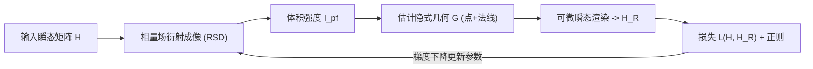

## 一句话总结

提出一个端到端全可微的非视距（NLOS）逆向渲染流水线，只用中继墙上测到的瞬态光照作为输入，通过梯度下降自动标定成像参数，从而稳健地重建隐藏场景的表面点、法线与反照率。

## 研究背景

- 领域现状：时间分辨的 NLOS 成像通过分析中继墙上间接光照的飞行时间来重建视线之外的隐藏场景。主流做法是把捕获的三次反弹光照反投影（backprojection）到体素空间；近年出现的相量场（phasor field）框架把中继墙上的测量点变成一个虚拟孔径，将 NLOS 重建转化为虚拟视线内成像问题，效率高、可达交互甚至实时速率。
- 核心痛点：反投影得到的体素缺乏表面朝向与自遮挡信息；捕获数据含高阶间接光与高频噪声，通常要靠**人工设计并挑选滤波函数和参数**来抑制伪影，而这些参数对场景复杂度、环境和硬件极为敏感，标定过程繁琐。基于可微渲染的路径空间方法虽有潜力，但受限于对时间分辨辐射量求导的巨大内存开销，可优化参数极少，往往只能追踪单个已知形状物体的运动。
- 本文 idea：把频域的相量场衍射成像与时域的可微三次反弹瞬态渲染耦合成一条端到端可微管线。用相量场成像的体积输出估计隐藏场景的几何，再用可微瞬态渲染模拟中继墙上的时间分辨光照，通过最小化模拟光照与实测光照之间的误差，用梯度下降**自标定**全部成像参数，无需任何隐藏场景先验。

## 方法

整体框架分四步串成一个前向-反向可微闭环：给定瞬态测量矩阵 $$\boldsymbol{H}$$，先做相量场衍射成像得到体积强度 $$I_{\text{pf}}$$；再从 $$I_{\text{pf}}$$ 估计隐式几何 $$G$$（表面点与法线）；接着对 $$G$$ 做可微瞬态渲染得到中继墙上重建的时间分辨光照 $$\boldsymbol{H}_R$$；最后最小化 $$\boldsymbol{H}$$ 与 $$\boldsymbol{H}_R$$ 的误差来更新成像参数。几何 $$G$$ 在前向传播中计算，而相量核参数 $$\Theta_{\text{pf}}$$、激光-传感器参数 $$\Theta_{\text{ls}}$$、逐体素反照率 $$\Theta_G$$ 在反向传播中更新。

关键设计：

- **可微相量核滤波（频域）**：把噪声较大的测量矩阵在频域用一个虚拟照明函数 $$P(\Theta_{\text{pf}})$$ 滤波。作者用零均值高斯包络加中心频率来参数化相量核 $$P(\Theta_{\text{pf}}) = e^{i\Omega_{\text{pf}} t} e^{-t^2 / (2\sigma_{\text{pf}}^2)}$$，其中中心频率 $$\Omega_{\text{pf}}$$ 与标准差 $$\sigma_{\text{pf}}$$ 都可微、可优化。滤波后经 Rayleigh-Sommerfeld 衍射（RSD）算子在 $$t=0$$ 处求值即得体积强度 $$I_{\text{pf}}$$。选择频域是因为时域算子在可微管线里内存开销不可承受，而频域能在 GPU 显存内实现复值相量核卷积。
- **隐式表面几何估计**：全程不生成显式网格。对每个传感点 $$\boldsymbol{x}_s$$，用同心半球映射均匀采样光线，沿光线做 ray marching 并用三线性插值取邻近体素强度。用可微的 softargmax 估计到隐藏表面的连续距离 $$d_{gs} = \frac{\sum_i \omega_i d_i}{\sum_i \omega_i}$$（权重 $$\omega_i = e^{\beta I_{\text{pf},i}}$$，即把表面定在强度最大处），若强度低于阈值则判定无表面。法线则由同心映射中东南西北邻近采样点距离构成两个三角形、叉乘取平均得到。这样得到"表面点+法线"的隐式表示，比以往显式代理几何能保留更多细节且能处理部分遮挡。
- **可微三次反弹瞬态渲染**：基于瞬态路径积分把单条三次反弹路径 $$\boldsymbol{x}_l \to \boldsymbol{x}_g \to \boldsymbol{x}_s$$ 的辐射贡献写成闭式 $$K$$，路径通量含可见性、余弦项与距离平方衰减。为规避难以可微的二值可见性项，作者假设体积强度本身就是激光/传感器视角下可见几何的良好估计，从而跳过可见性计算。再把连续时间的贡献用可微高斯分布离散到相邻时间 bin，累加得到渲染瞬态 $$\boldsymbol{H}_r$$，最后卷上一个联合激光-传感器修正函数 $$\Psi = \Phi * \Lambda$$（两个高斯卷积仍是高斯，联合参数 $$\sigma_{ls} = \sqrt{\sigma_l^2 + \sigma_s^2}$$）并加环境/暗计数偏置 $$\eta_s$$ 得到 $$\boldsymbol{H}_R$$。
- **系统参数联合优化**：目标是求 $$\Theta = \lbrace \Theta_{\text{pf}}, \Theta_{\text{ls}}, \Theta_G \rbrace$$ 最小化损失 $$\mathcal{L}(\boldsymbol{H}, \boldsymbol{H}_R) = E_H + E_{I_{\text{pf}}} + E_\rho$$。数据项 $$E_H$$ 是实测与渲染瞬态的 $$l_2$$ 范数；$$E_{I_{\text{pf}}}$$ 是对体积强度的稀疏正则（追求干净图像）；$$E_\rho$$ 是对反照率的平滑正则（抑制反射率噪声）。作者发现反向自动微分虽然理论上比前向 AD 更耗内存，但实测快约 20 倍、更适合优化逐体素反照率这类大量参数，故采用反向 AD。

## 实验结果

主实验为各组件消融（Bunny 合成场景，两种反照率，$$256 \times 256 \times 201$$ 体素），以瞬态 MSE 衡量。三大可优化组件——相量核、反照率、激光-传感器模型——逐一加入都带来提升，三者齐备时最优；其中优化反照率的收益最显著。

| 相量核 | 反照率 | 激光-传感器模型 | 瞬态 MSE ↓ |
|--------|--------|------------------|------------|
| ✔ | — | — | 6.817e-3 |
| ✔ | — | ✔ | 6.627e-3 |
| — | ✔ | — | 2.239e-3 |
| — | ✔ | ✔ | 2.217e-3 |
| ✔ | ✔ | — | 2.124e-3 |
| ✔ | ✔ | ✔ | **1.971e-3** |

其余实验以文字概述：在真实共焦场景（Bike、Resolution 等）上，方法在最低 10 分钟曝光时间下仍能给出比 O'Toole、Lindell、Liu 等体积法更锐利、更少噪声的结果；对合成 Bunny 施加递增的泊松噪声，即使体积输出含明显噪声，表面重建仍能在很宽的 SNR 范围内稳定保留几何细节；在几何精度上（Dragon、Erato、Indonesian，用 Hausdorff/RMSE 对比 D-LCT、NeTF、Plack et al.），在 Erato 与 Dragon 上全面领先，尤其在自遮挡区域和细节还原上，隐式表面表示相比显式代理几何能处理部分遮挡并复现字母窄段、数字深度变化等细节。

## 亮点与局限

- 亮点：
  - 端到端全可微，把频域相量场成像与时域可微瞬态渲染耦合，**自动标定**以往需人工挑选的滤波/成像参数，摆脱繁琐调参。
  - 用 softargmax + ray marching 从体积强度直接得到隐式表面点与法线，避免显式网格，既能保留细节又能处理部分遮挡。
  - 对噪声稳健：即便体积输出较脏，优化后的成像参数仍能支撑可靠的表面重建；不依赖预训练网络，避免了学习类方法在真实场景上的过拟合与退化。
  - 巧妙用"体积强度即可见几何的良好估计"这一假设绕开难以可微的可见性项。
- 局限：
  - 仅建模到三次反弹，合成数据也只含至三次反弹，未显式处理更高阶间接光。
  - 出于内存考虑只在频域做成像；时域算子被认为在可微管线中不实用，作者也把探索其他核参数化/其他可微 NLOS 成像方案列为未来工作。
  - 每个表面点用单一反照率近似所有传感点观测到的平均反射率，未处理更复杂的角度相关反射；跳过可见性的假设在强自遮挡下可能失效。
  - 几何精度对比中 RMSE 只在成功重建区域计算，某些对比（如 Indonesian）不能完全代表整体重建质量。

## 延伸思考

- 该工作把"可微渲染 + 自标定"的思路引入 NLOS，与近年主流可微/逆向渲染（如 path-space 可微渲染、神经隐式表面）一脉相承，但强调在瞬态与频域约束下把物理成像参数本身当作优化对象，这一"标定即优化"的视角可迁移到其他计算成像模态。
- 隐式几何用 softargmax 取强度峰值定表面，与 NeRF/SDF 类体渲染取权重期望有相似之处，未来或可把更强的神经隐式表示接入前向几何估计，同时保留物理瞬态观测作为监督以避免纯学习法的过拟合。
- 频域相量核的可优化参数化是否能推广到非高斯、多峰核，或与硬件端的激光/传感器实际响应联合标定，值得进一步追问；此外把方法扩展到动态隐藏场景或含更高阶反弹的真实场景，是自然的下一步。
