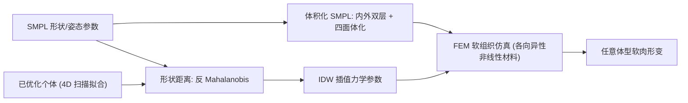

## 一句话总结

在 SMPL 参数化人体上叠加一层 FEM 软组织，并提出用"形状相似度"来插值软组织的力学参数，从而把只能针对少数被 4D 扫描优化过的个体的软肉仿真，推广到任意体型的虚拟角色。

## 研究背景

- 领域现状：软组织角色动画长期存在两条路线。物理仿真（求解弹性方程）稳定、可处理任意交互，但需要精心建模材料并正确参数化；数据驱动方法从骨骼运动学习皮肤形变，效果自然但只对训练过的情形有效、难以泛化且训练代价高。近年出现的混合方法在 SMPL 上加软组织层，兼顾两者。
- 核心痛点：混合模型（本文所依托的 Romero 等人的工作）虽然能得到高质量皮肤形变，但其材料的力学参数是通过数值优化、拟合特定真人 4D 扫描数据得到的。这意味着只有被扫描优化过的那几个个体能被准确仿真；要模拟任何新的人，就得再去做一次 4D 扫描，很多场景下并不现实。
- 本文 idea：既然 SMPL 用一组量化的形状参数 $$\boldsymbol{\beta}$$ 描述体型，那么"体型相近的人，软组织力学参数也应相近"。于是把少数已优化个体当作真值，用形状空间中的距离作为权重去插值出任意体型的力学参数，绕开对新个体做 4D 扫描的需求。

## 方法

整体框架：先在 SMPL 表面模型外生成一层带可变厚度的四面体软组织，用体积化的 SMPL 运动学驱动内层顶点、外层自由形变，并配一套各向异性非线性皮肤材料，通过 FEM 仿真；然后核心贡献在于——对任意新体型，不再优化材料，而是依据其与已优化个体的形状距离，用反距离加权把力学参数插值出来。

关键设计：

1. **体积化 SMPL 与解耦形变**。SMPL 只是 6890 顶点的表面模型；把外表面顶点沿最近骨骼方向投影得到内表面，二者之间用 Tetgen 生成四面体体网格，并把 SMPL 的蒙皮权重与 blend shape 用 Laplacian 插值延拓到体内顶点。仿真时把姿态相关的整体形变通过逆蒙皮变换 $$\boldsymbol{u} = P^{-1}(\theta)\, \boldsymbol{x}$$ 去掉，形变梯度定义在"去姿态"的参考空间 $$F = \nabla_{\bar{\boldsymbol{x}}}(P^{-1}\boldsymbol{x})$$，从而只保留真正的高频弹性响应（思想类似 co-rotational，但旋转仅由运动学姿态决定，不依赖当前变形）。内边界顶点被约束到 SMPL 的蒙皮位形，其余自由，动力学写成 $$M\ddot{\boldsymbol{x}} - \boldsymbol{f} - \boldsymbol{f}_e = 0$$。

2. **各向异性非线性皮肤材料**。采用正交各向异性 StVK 材料，叠加 Fung 型指数饱和以增强非线性，应变能密度为 $$\Psi(F) = \frac{\mu\,(\exp(\alpha\,\sigma) - 1)}{\alpha} + \frac{\lambda}{2}(J-1)^2$$，其中 $$\sigma = \sum_i \sum_j \tau_{ij} E_{ij}^2$$，$$J = \det(F)$$。各向异性通过给各方向应变分量加权 $$\tau_{ij}$$ 实现，参数最终归结为法向/切向弹性模量 $$Y_N, Y_T$$、泊松比 $$\nu$$、饱和系数 $$\alpha$$，以及软组织厚度 $$h$$。这些力学参数定义在体表 42 个控制点上，再用双调和 + Laplacian 插值铺到整个体网格（假设沿身体纵轴对称，只需半身）。

3. **反 Mahalanobis 形状距离**。这是本文的关键。SMPL 的形状参数 $$\boldsymbol{\beta}$$ 已经被各自方差归一化过，直接用欧氏距离会抹掉各维度真实影响力，因此作者反其道而行，定义反 Mahalanobis 距离把方差乘回去：$$d_{InvM}(\boldsymbol{\beta}, \boldsymbol{\beta}^A) = \sqrt{\sum_{i=0}^{n} (\beta_i - \beta_i^A)^2\, \sigma_i}$$。而每个形状维度的标准差可直接从 SMPL 的形状 blend shape 求得——因为 blend shape 正交，两个体型顶点差的范数展开后恰好等于 $$\sqrt{\sum_i (\beta_i^A - \beta_i^B)^2 \lVert S_{s,i}\rVert^2}$$，即 $$\sigma_i = \lVert S_{s,i}\rVert^2$$。这让"形状距离"有了明确的几何意义（近似顶点位移差）。

4. **反距离加权插值 + 空间采样**。用上面的距离做 IDW：$$w_j = \dfrac{1}{d_{InvM}(\boldsymbol{\beta}, \boldsymbol{\beta}_j)}$$，插值出的每个力学参数为 $$u = \dfrac{\sum_j w_j u_j}{\sum_j w_j}$$。为提升精度，作者还提出一个形状空间采样算法：随机按标准正态分布生成候选体型，贪心地挑选彼此距离尽量大的个体（低于阈值 1.5 的被剔除），从而用尽量少、分布均匀的样本扩充插值数据集，改善落在原有个体凸包之外时的插值质量。整套系统以 C++ 实现并封装成 Blender 插件，支持手动编辑控制点参数、用一个小立方体做实时预览（整只 avatar 仿真约需半小时，无法实时）。

## 实验结果

主实验是"力学参数测试"：取一个形状介于三个已优化个体 $$S_A, S_B, S_C$$ 之间的任意体型 $$S_{dist}$$，分别把三个个体各自的力学参数直接套用上去，再与用反 Mahalanobis 插值得到的参数做对比，用"运动方差 colormap"（去姿态后每个表面点相对其平均位置的累积位移）衡量软组织动态。

| 施加于 $$S_{dist}$$ 的力学参数 | 来源 | 运动方差 colormap 表现 |
|------|------|------|
| $$S_A$$ 的参数 | 直接套用个体 A | 与 $$S_A$$ 本体几乎一致 |
| $$S_B$$ 的参数 | 直接套用个体 B | 与 $$S_B$$ 本体几乎一致 |
| $$S_C$$ 的参数 | 直接套用个体 C | 与 $$S_C$$ 本体几乎一致 |
| 插值参数 | 反 Mahalanobis + IDW | 呈现三者基于形状的加权混合，形变自然过渡 |

这说明两点：软组织动态由力学参数决定、几乎不受体型本身影响（同一参数换个体型 colormap 不变）；而本文插值出的参数确实是三个个体参数按形状远近的合理混合。进一步对比显示，反 Mahalanobis 距离给出的插值权重比欧氏距离更合理；引入采样扩充的数据集后，对落在原始个体分布之外的体型，插值形变也更接近应有行为。其余为定性对比（多动画测试、扩充数据测试等），故不逐一列表。

## 亮点与局限

- 亮点：
  - 用一个简洁而有物理直觉的形状距离（反 Mahalanobis，且方差可直接从 SMPL blend shape 解析得到）把"少数被扫描个体"的软组织参数泛化到任意体型，免去对每个新个体做 4D 扫描。
  - 混合建模解耦了姿态整体运动与局部弹性响应，材料兼顾皮肤的各向异性与非线性。
  - 落地为 Blender 插件，提供控制点手动编辑与立方体实时预览，具备实用性。

- 局限：
  - 整只 avatar 的体积 FEM 仿真约需半小时，无法实时；预览只能退化成一个小立方体，且明确声明立方体行为不能可靠代表真实 avatar 的后续表现。
  - 插值精度依赖已优化个体（真值）的数量与分布，本质是对稀疏真值的加权平均，对分布外体型仍靠采样补数据来缓解，而非真正学习。
  - 真值来源仅有少数个体，力学参数插值缺乏对新体型的定量误差评估，验证以视觉 colormap 为主。
  - 需要预设饱和值下限与 Young 模量 clamping 来避免面片翻转等数值伪影。

## 延伸思考

- 这条思路本质是"在参数化人体的形状流形上做力学参数的场插值"。若把 IDW 换成基于神经场/高斯过程的回归，并用更多个体作监督，或许能得到既连续又带不确定度估计的参数预测。
- 形变仿真半小时的瓶颈是实用化的最大障碍，结合近年 GPU 上的投影动力学、Vertex Block Descent 或神经代理模型，有望把整只 avatar 推向实时，让预览不必退化成立方体。
- "去姿态参考空间 + 蒙皮驱动内层"的解耦，与后续大量高斯/神经 avatar 中"canonical 空间 + 形变场"的范式相通，二者在如何分离刚性运动与局部动态上可以互相借鉴。
- 值得追问的是形状距离与力学参数之间是否真的近似线性——体型差异很大时，脂肪/肌肉比例的非线性变化可能让简单 IDW 失真，这也是采样扩充只能部分缓解的根源。
