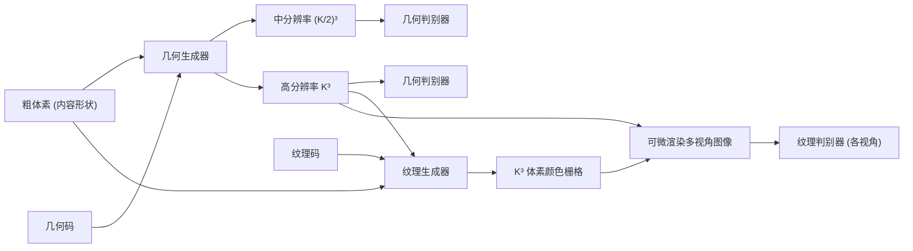

## 一句话总结

ShaDDR 是一个基于少量样例（exemplar）的生成网络，给定一个粗糙体素形状和一个带纹理的样例形状，它能在 1 秒内通过多分辨率几何细化和可微渲染纹理生成，输出一个高分辨率（可达 $$512^3$$）、带纹理、并保留输入整体结构的 3D 模型。

## 研究背景

- 领域现状：近年 3D 生成模型进展很快，尤其是基于扩散模型和大语言模型的文本驱动生成，但这类方法普遍缺乏细粒度控制、速度慢（如文本驱动的 Magic3D 生成一个结果约需 40 分钟），且生成几何分辨率低、缺乏细节。
- 核心痛点：DECOR-GAN 用更传统的"几何细化"思路——把粗体素上采样成高分辨率细节几何，保留了艺术家对整体结构的控制且推理很快，但它只做单分辨率上采样，无法迁移更精细尺度的几何细节；更关键的是它只管几何、完全忽略了同样重要的纹理。
- 本文 idea：提出一个两阶段的样例式生成网络。几何阶段利用体素上采样的层级特性做多分辨率细化以提升细节质量；纹理阶段用可微渲染把体素表面颜色投影到 2D 图像，再用 2D 图像域 GAN 学习纹理合成，从而生成"几何 + 纹理"齐备的高分辨率 3D 形状。

## 方法

整体框架分为两个独立训练的阶段：先训练几何生成器把粗体素上采样成多分辨率的细节几何，再固定几何权重、训练纹理生成器为最高分辨率几何合成体素级颜色，并通过可微渲染在图像空间用 GAN 监督。两个阶段都以样例形状提供的几何"风格码"和纹理"风格码"作为条件，从而可通过隐编码操控输出风格。

关键设计：

- 多分辨率几何细化：直接把 DECOR-GAN 的上采样倍率拉到很高（每个维度上采样 8 倍）会导致薄结构断裂、细节丢失，因为大倍率体素上采样本身模糊且困难。ShaDDR 让几何生成器同时输出一个中间分辨率 $$(K/2)^3$$ 和最终 $$K^3$$ 两级几何，并对两级都施加对抗训练。中间分辨率提供的额外监督使得全局结构和局部细节在中间层就已优于基线，最终层再精修出锐利边缘和光滑表面。
- 可微渲染的纹理生成：纹理本质是 2D 的表面属性，只有表面体素才有明确定义的颜色，直接用 3D 判别器监督整块颜色栅格会浪费判别器容量去拟合空间中"病态"的体素颜色。ShaDDR 让纹理生成器输出一个 $$K^3$$ 的 RGB 颜色栅格，对每个像素从相机发射光线、取上采样几何中第一个被击中的占据体素、用其坐标查询颜色栅格得到像素颜色，从而把颜色可微地渲染成 2D 图像，再用多视角的 2D 图像 GAN（PatchGAN 式局部判别器）对齐样例纹理图像。
- 条件式对抗损失与重建损失：判别器以样例风格为条件，使输出风格可由 $$z^{geo}_s$$、$$z^{tex}_s$$ 控制；同时用二值 mask 把网络容量聚焦在靠近表面的体素/非空图像区域。此外加入重建损失——当输入粗形状与风格码来自同一个样例时，期望几何生成器在两级分辨率上都还原真值几何、渲染图像也还原真值多视角图像。纹理源不限于预定义 3D 模型，也可来自 NeRF 采样或真实照片。

## 实验结果

主实验对比不同纹理生成方案在四个类别上的质量（FID 与 LPIPS 越低越好）。"3D texture (full)"用 3D 判别器监督整块颜色栅格，"3D texture (surface)"只监督表面附近体素，"Rendering-based"即本文的可微渲染 + 2D GAN 方案。可微渲染方案在几乎所有指标上都优于两个 3D 监督基线（仅椅子类别的 FID-all 例外）。

| 纹理方案 | FID-all↓ (Car) | FID-style↓ (Car) | LPIPS-style↓ (Car) | FID-all↓ (Airplane) |
|----------|------|------|------|------|
| 3D texture (full) | 51.094 | 104.384 | 0.121 | 19.438 |
| 3D texture (surface) | 51.519 | 105.278 | 0.115 | 23.438 |
| Rendering-based (本文) | 41.573 | 88.325 | 0.104 | 13.726 |

几何方面，在椅子类别上与 DECOR-GAN 及把上采样倍率拉高的 DECOR-GAN-up 相比，本文多分辨率方案在 Loose-IOU、LP-IOU、LP-F-score、Div-IoU、Cls-score 等多数指标上取得最优，定性上也能生成更完整的全局结构与更锐利的局部细节。

## 亮点与局限

- 亮点：
  - 首个能把粗体素模型上采样成"几何细化 + 完整纹理"的深度生成模型，输出分辨率高达 $$512^3$$，推理不到 1 秒，支持交互式建模。
  - 只需 8~16 个带纹理的细节样例即可训练，样例还可来自真实照片经 NeuS 重建得到，实用性强。
  - 多分辨率监督显著改善大倍率上采样下的几何质量；可微渲染 + 2D GAN 的纹理方案比 3D 体素颜色监督更干净锐利。
  - 保留了 DECOR-GAN 的细粒度结构控制、交互式生成与数字资产复用等优点。
- 局限：
  - 纹理与几何都只强调局部 patch 的合理性，缺乏全局结构感知，例如细化后的车可能丢失样例上的蓝色字母、椅背可能出现不一致的边缘。
  - 没有显式机制保证纹理与几何对齐，可能出现几何-纹理错位（尽管实验中较罕见）。
  - 需按类别分别训练模型，几何与纹理分两阶段训练，且训练耗时较长（单类别几何 12~24 小时、纹理 18~36 小时）。

## 延伸思考

- 方法本质是"内容-风格解耦 + 局部 patch 对抗"，与图像域的样例式纹理合成（image quilting、SinGAN）一脉相承，把这套思路搬到了 3D 体素 + 可微渲染上，思路清晰且工程可落地。
- 作者提出的未来方向很值得关注：完全无 3D 监督地学习几何细化与纹理生成（借助可微体渲染），以及引入局部控制让用户指定任意区域细化成不同风格——后者对交互式建模的实用价值很大。
- 局部合理但全局不一致是这类 patch-based 生成的通病，如何在保持交互速度的同时注入全局结构约束（例如结合更大感受野或结构先验）是一个开放问题；在扩散模型主导 3D 生成的当下，这种"秒级、可控、样例驱动"的路线仍有其独特的应用场景。
