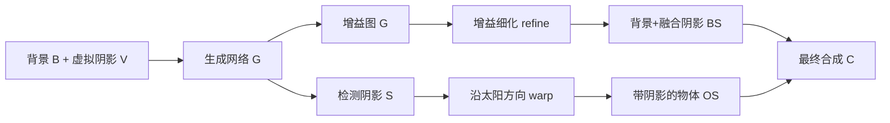

## 一句话总结

针对户外单张图像的虚拟物体合成，提出一套基于 GAN 的阴影协调方法，同时解决"虚拟物体投影与背景已有阴影重叠导致的双重阴影"和"背景遮挡物应把阴影投到虚拟物体上"这两类被以往方法忽视的阴影交互问题。

## 研究背景

- 领域现状：把虚拟物体合成进真实照片时，需要匹配相机参数、几何、纹理和光照。近年来学习方法已能从单张图像估计出光照、地面几何等属性，实现较鲁棒的自动合成。
- 核心痛点：现有方法几乎都假设"背景无阴影"。于是当虚拟物体投影落在背景已有阴影上时会叠加出非物理的"双重阴影"（过暗）；而当虚拟物体被放进阴影区域时，方法又忽略了背景遮挡物本应投在物体上的阴影，导致物体显得过亮、不真实。此外在缺乏空间变化的真实光照做差分渲染时，阴影颜色也常常不准。
- 本文 idea：用一个图像空间的生成网络，去修正传统差分渲染得到的"粗合成"。网络同时学两件事——预测一张增益图（gain map）来把合成阴影与周围真实阴影融合，以及检测背景中的软阴影并沿太阳方向反投到虚拟物体上，从而把两类阴影交互统一处理。

## 方法

整体流程：先用现成算法估计场景光照（sun/sky 两光源模型）和相机/地平面参数，用基于 Debevec 差分渲染的 IBL 得到一张粗合成；再由生成网络 $$\mathcal{G}$$ 输入背景图 $$\boldsymbol{B}$$ 与虚拟阴影指示图 $$\boldsymbol{V}$$，输出线性 RGB 增益图 $$\boldsymbol{G}$$ 和检测到的软阴影图 $$\boldsymbol{S}$$，二者分别驱动"融合投影阴影"与"给物体上阴影"两条支路，最后合成。

关键设计：

1. **改进的合成方程**：把 Debevec 原式里用户手调的阴影强度标量 $$c$$ 换成网络生成的空间变化图。最终合成为
$$C = M \cdot O_S + (1 - M) \cdot (B_S \cdot B_{\text{sky}})$$
其中 $$M$$ 是物体掩码，$$B_{\text{sky}}$$ 是仅天空光照下的地面渲染，用来补上物体附近的环境遮挡（AO）暗化效果。

2. **投影阴影融合 + 增益细化**：理想上 $$B_S = B \cdot \boldsymbol{G}$$ 即可，但单次前向常导致整体阴影强度失配（人眼对像素级偏差极敏感）。于是用一个全局尺度因子 $$f$$ 在虚拟与真实阴影重叠区做强度对齐：
$$G_{\text{refine}} = (1 - S) \cdot f\boldsymbol{G} + S \cdot \boldsymbol{G}$$
$$f = \frac{\mu(S \cdot V \cdot B)}{\mu((1 - S) \cdot \boldsymbol{G} \cdot V \cdot B) + \epsilon}$$
其中 $$\mu(\cdot)$$ 是 HSV 明度通道上非零像素的均值。相比直接乘常数，增益图能保留砖块纹理等高频细节。

3. **把真实阴影投到物体上**：直接采集"被遮挡物体"的数据几乎不可能，作者转而复用阴影去除数据集，在"仅地面"的形式下训练网络检测阴影 $$\boldsymbol{S}$$；再按太阳方向和地平面方程用 warp 算子 $$\varphi$$ 把地面阴影反投到 3D 物体上：
$$O_S = O_{\text{sun}} \cdot (1 - \varphi(S)) + O_{\text{sky}}$$
$$O_{\text{sun}}$$、$$O_{\text{sky}}$$ 分别是仅太阳、仅天空光照下的物体渲染。

4. **训练与数据**：生成器用带 fixup 初始化的 UNet，配 patch 判别器，在 $$128\times128$$ patch 上训练，损失为阴影检测 $$\ell_s$$、matting $$\ell_c$$ 与 GAN 损失之和，且都用 $$\boldsymbol{V}$$ 掩码（只需在虚拟阴影覆盖区做准）。数据上把阴影去除数据集（ISTD、DESOBA、SRD）通过随机椭圆掩码在线增广成"部分阴影"样本，并加入 SBU/UCF 检测数据，另用 Blender SceneCity + Laval Outdoor HDR 生成 3000 张带软阴影/遮挡交互标注的合成数据。推理时用"patch 局部平均"滑窗（带 stride 16）支持全高清以上分辨率。

## 实验结果

主实验为阴影合成的定量对比，在 ISTD 与 DESOBA 测试集上报告 SSIM、PSNR、L1，联合学习检测与 matting（"ours"）对比 MTMT 检测器基线、直接生成 RGB 的 "comp. net"、以及仅估增益的 "gain net"。下表取各方法最佳配置的两数据集平均：

| 方法 | SSIM↑ | PSNR↑ | L1↓ |
|------|-------|-------|-----|
| MTMT (+rgb scale) | 0.953 | 32.261 | 3.048 |
| comp. net (+rgb scale) | 0.955 | 32.767 | 3.122 |
| gain net (+rgb scale) | 0.953 | 32.124 | 3.117 |
| ours (+rgb scale) | **0.956** | **33.020** | **2.985** |

结论：细化步骤对所有方法都有益，联合学习检测与 matting 是最优路径；在大图 DESOBA 上局部平均配置优势明显。阴影检测作为副产物在真实阴影区（S）精度和 BER 上大幅超过 MTMT（BER 平均 3.26 对 7.51），代价是非阴影区略多误检。

## 亮点与局限

- 亮点：
  - 首个统一处理"物体→场景"和"场景→物体"两个方向阴影交互的单图户外合成方法，直击双重阴影这一破坏真实感的核心问题。
  - 用增益图而非直接生成像素，减轻网络负担、保留高频纹理；巧妙复用阴影去除/检测数据集规避了稀缺训练数据。
  - patch 局部平均让方法能直接在全高清以上分辨率运行，副产的软阴影检测比 SOTA 更细粒度。
- 局限：
  - 假设地面近似漫反射且平面；复杂几何、镜面材质、玻璃与焦散会失败。
  - 反投阴影若超出背景图边缘会被生硬截断（需 inpainting 扩展）；增益细化依赖阴影交集区可靠，地面纹理突变时可能失效。
  - 结果质量受输入的相机/光照估计精度制约；仅处理单图，无时序一致性。

## 延伸思考

- 方法本质是"传统物理渲染打底 + 神经网络修正残差"的混合范式，在缺乏 GT 空间变化光照时用图像空间线索补足反照率/间接光的未知量，这种思路可迁移到反射、颜色协调等其它合成子问题。
- 作者展望的视频推理与时序一致性、非平面地面与复杂光效（焦散、室内）是自然延伸；结合近年扩散模型或 3D Gaussian Splatting 的物体插入方法，或可把这套阴影交互建模嵌入到更强的生成/重建管线中。
- "通过 matting 做阴影检测"和"复用稀缺真实数据做增广"的策略，对阴影检测/去除本身的研究也有借鉴价值。
