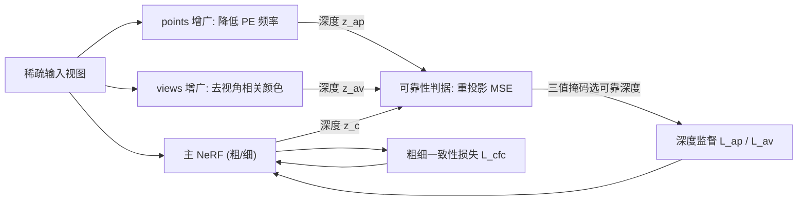

## 一句话总结

在稀疏输入（少至 2 张图）的少样本 NeRF 训练中，本文通过训练两个"能力被削弱"的增广模型（简化位置编码、去掉视角相关颜色），用它们更可靠的深度估计反过来监督主 NeRF，并加入粗细网络一致性约束，在多个数据集上取得少样本视图合成的最优表现。

## 研究背景

- 领域现状：NeRF 在稠密视角下能出色地合成新视角，但需要几十到上百张图；视角稀疏时几何严重退化。稀疏输入 NeRF 分两条路线——依赖大数据集预训练的泛化模型（存在域偏移/泛化问题），以及为场景单独训练并施加正则的方法。深度监督是后者的主流手段。
- 核心痛点：现有深度监督要么来自经典方法（如 SfM，只提供稀疏关键点的深度），要么来自在大数据集上预训练的深度网络（同样受泛化问题困扰）。稀疏视角下，NeRF 因约束不足加上模型容量过高，容易过拟合观测图像，产生三类典型畸变：漂浮物（floaters）、形状-辐射歧义（shape-radiance ambiguity）、以及粗细网络深度不一致导致的模糊。
- 本文 idea：遵循奥卡姆剃刀原则，不做任何预训练，而是在训练主 NeRF 的同时"就地"训练容量更低、倾向于简单解的增广模型。位置编码和视角相关辐射是为稠密视角设计的高容量组件，稀疏视角下反而致祸；把它们削弱后得到的简单模型在大部分平滑/朗伯区域能给出更好的深度，用来监督主模型即可。

## 方法

整体框架：以 DS-NeRF 为基线，额外并行训练两个增广的粗网络——points 增广（削弱位置编码）与 views 增广（去除视角相关颜色）。这两个简单模型在合适区域给出更可靠的深度，通过一个逐像素可靠性判据决定"谁监督谁"，把可靠深度传给主 NeRF。推理时只用主模型。

关键设计：

1. **points 增广——抑制错误深度不连续**。位置编码把 3D 中相邻的点映射到高维编码空间中相距很远的位置，使 NeRF 能以平滑函数学出尖锐的深度断裂。稀疏视角下这被滥用，在本应平滑的区域也学出断裂，形成漂浮物。做法是给增广模型的密度分支只喂较低频率的位置编码 $$\gamma(\boldsymbol{p}_i, 0, l_p^{\text{ap}})$$（$$l_p^{\text{ap}} < l_p$$），使其偏好平滑深度；同时把剩余的高频分量补到颜色分支 $$F_2$$ 上，因为纹理等颜色的不连续通常比深度更多。

2. **views 增广——缓解形状-辐射歧义**。视角相关辐射本用于表达高光/非朗伯表面，但稀疏视角下 NeRF 会随便学个几何、再让 3D 点的颜色随视角变化来"糊弄"观测图像。做法是在第二个增广模型里关闭视角依赖，让颜色只由位置 $$\boldsymbol{p}_i$$ 决定，从而强迫模型用简单的朗伯表面解释图像，得到更合理的几何。

3. **可靠性判据——只用可信深度做监督**。增广模型并非处处更好（去视角依赖的模型在高光区会失效）。对每个像素，用主模型深度 $$z_c$$ 和增广模型深度 $$z_a$$ 分别把 $$k \times k$$ 邻域重投影到最近的训练视角，比较与真实图像块的强度 MSE：谁的重投影误差小且低于阈值 $$e_\tau$$，谁的深度更可靠。据此得到三值掩码 $$m_a \in \lbrace 1, -1, 0 \rbrace$$——$$1$$ 表示增广监督主模型、$$-1$$ 表示主模型反过来监督增广模型（让增广模型持续变好）、$$0$$ 表示两者都不可信不做监督。深度损失形如 $$L_a = \mathbb{1}_{\lbrace m_a=1 \rbrace} \odot \lVert z_c - \tau(z_a) \rVert^2 + \mathbb{1}_{\lbrace m_a=-1 \rbrace} \odot \lVert \tau(z_c) - z_a \rVert^2$$，其中 $$\tau$$ 是 stop-gradient。这让整个框架形似半监督：SfM 稀疏深度是有限标签，其余像素是无标签数据。

4. **粗细一致性——恢复层次采样的有效性**。少样本下粗、细两个 MLP 可能收敛到不同深度，导致细网络的密集采样没落在真正的物体表面附近，等效于欠采样，渲染变模糊。为此在粗网络深度 $$z_c$$ 与细网络深度 $$z_f$$ 之间加一致性 MSE 损失 $$L_{\text{cfc}}$$，同样用重投影可靠性判据决定监督方向。

## 实验结果

在 LLFF 前向数据集上，对 2/3/4 视角设置与主流少样本/深度监督基线比较（主实验）。SimpleNeRF 在几乎所有设置下 LPIPS、SSIM、PSNR 三项指标领先，尤其感知质量（LPIPS）和结构相似度（SSIM）优势明显。

| 方法 (LLFF) | 2 视角 LPIPS↓ / SSIM↑ / PSNR↑ | 3 视角 LPIPS↓ / SSIM↑ / PSNR↑ | 4 视角 LPIPS↓ / SSIM↑ / PSNR↑ |
|------|------|------|------|
| RegNeRF | 0.306 / 0.571 / 18.52 | 0.291 / 0.633 / 20.22 | 0.279 / 0.665 / 21.32 |
| FreeNeRF | 0.264 / 0.632 / 19.52 | 0.275 / 0.658 / 20.93 | 0.285 / 0.676 / 21.91 |
| DS-NeRF (基线) | 0.311 / 0.586 / 18.24 | 0.303 / 0.632 / 20.20 | 0.298 / 0.658 / 21.23 |
| DDP-NeRF | 0.285 / 0.622 / 18.73 | 0.325 / 0.615 / 18.73 | 0.304 / 0.656 / 20.17 |
| ViP-NeRF | 0.277 / 0.623 / 18.61 | 0.280 / 0.655 / 20.54 | 0.285 / 0.668 / 20.75 |
| **SimpleNeRF** | **0.269 / 0.650 / 19.57** | **0.256 / 0.694 / 21.37** | **0.263 / 0.702 / 21.99** |

在 RealEstate-10K 数据集上也做了同样设置的评测，SimpleNeRF 相对 DS-NeRF 有一致提升。此外作者展示学到的几何（深度图）质量明显优于此前工作，漂浮物、鬼影和模糊都得到缓解。

## 亮点与局限

- 亮点：
  - 无需任何大数据集预训练，用"就地"训练的简单增广模型自产深度监督，规避了预训练方法的域偏移问题。
  - 用奥卡姆剃刀的视角统一解释三类畸变（漂浮物、形状-辐射歧义、粗细不一致），针对性地各给一个正则，思路清晰。
  - 可靠性判据用重投影误差双向选择监督方向，既避免用错误深度做监督，也能让增广模型被主模型反哺持续改进。
  - 作为可加装在 DS-NeRF 上的正则模块，具有一定通用性（其后续期刊版 Simple-RF 将思路推广到 TensoRF、ZipNeRF 等多种辐射场）。

- 局限：
  - 训练时需并行维护两个额外的增广 NeRF，训练开销增加（推理时仅用主模型，无额外推理成本）。
  - 可靠性判据基于强度重投影匹配，在高光/非朗伯区域会把掩码置零、退化为不监督，这些区域仍主要依赖主模型自身。
  - 主要面向前向和有限的 $$360^\circ$$ 场景，极端稀疏（2 视角）下 PSNR 绝对值仍不高，几何仍受欠约束限制。

## 延伸思考

- "削弱模型容量得到更可信监督、再回灌高容量主模型"的思路，本质是在同一场景内构造互补的归纳偏置，与半监督里的双学生一致性、以及频率退火（FreeNeRF）等正则有内在联系，但这里是显式让两个能力不同的模型互相纠偏。
- 可靠性判据依赖 stop-gradient 的双向监督，工程上简单有效；能否用更鲁棒的匹配（如特征级、光流级一致性）替代逐像素强度 MSE，从而覆盖弱纹理/高光区域，值得探索。
- 这类"简单解正则"与近年 3D Gaussian Splatting 的稀疏视角变体是否兼容，是一个自然的迁移方向——高斯泼溅同样在少视角下有漂浮物与几何退化问题，类似的深度可靠性筛选思路或可移植。
