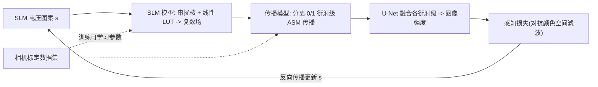

## 一句话总结

用**单张 SLM 图案 + RGB 同时照明**在紧凑光路上生成全彩全息图，通过端到端优化、色彩感知损失和相机标定的可微前向模型，把彩色全息的帧率相比时序彩色提升 3 倍并消除彩色边纹。

## 研究背景

- 领域现状：全息显示被视为 AR/VR 近眼显示的理想技术，能提供自然的离焦深度线索、缓解视觉辐辏调节冲突，还能在软件里矫正像差。近年图像质量与计算速度都有明显进步，但**彩色**全息一直是未解问题。
- 核心痛点：主流做法是**时序彩色**（field sequential color）——为红绿蓝各算一张图案、分时切换照明。这会把帧率砍到 1/3，在头动时产生明显的抖动（judder）和彩色边纹（color fringing），且 LCoS 这类主流 SLM 因液晶响应慢更难满足高刷需求。已有的**同时彩色**方案（空间复用、频率复用）要么用多块 SLM、要么需要 Fourier 面滤波和笨重的 $$4f$$ 系统，体积与近眼显示不兼容。
- 本文 idea：只用**一张 SLM 图案**，让整块 SLM 被同轴 RGB 光源同时照明，直接端到端优化出能同时形成 RGB 三通道的图案；不用物理滤波器、不用合束光路，从而在保持完整帧率与紧凑体积的同时做出全彩全息。

## 方法

整体思路是把"从目标 RGB 图像求单张 SLM 图案"写成一个可微优化问题：给定波长相关的相位映射与光传播模型算出各波长下的图像强度，用梯度下降最小化与目标图的损失。围绕这个主干，作者做了三块关键设计——扩展相位范围、色彩感知损失、相机标定前向模型。

优化目标的基本形式为在 SLM 图案 $$s$$ 上最小化各深度、各波长的重建强度与目标的损失：

$$\arg\min_{s} \sum_{z} \big[ \mathcal{L}(\hat I_{z,\lambda_r}, I_{z,\lambda_r}) + \mathcal{L}(\hat I_{z,\lambda_g}, I_{z,\lambda_g}) + \mathcal{L}(\hat I_{z,\lambda_b}, I_{z,\lambda_b}) \big]$$

其中 $$I_{z,\lambda} = \lvert f_{\text{prop}}(g_\lambda, z, \lambda)\rvert^2$$，$$g_\lambda = e^{i\phi_\lambda(s)}$$ 是 SLM 出射的复数场。

**关键设计一：用扩展相位范围抑制"深度复制"。** Fresnel 传播核里 $$\lambda$$ 与 $$z$$ 成对出现，导致波长与传播距离存在天然歧义：为红光在 $$z_0$$ 处形成的像，在绿/蓝照明下会在 $$z_0\lambda_g/\lambda_r$$、$$z_0\lambda_b/\lambda_r$$ 处出现"复制品"（depth replicas）。这既是深度复用法的原理基础，也是做真正 3D 全息的障碍（本该离焦处出现清晰内容）。作者指出：如果相位 $$\phi_\lambda$$ 对波长有足够依赖（大的 $$\Delta n$$ 与色散），复制平面的强度就会被打散。因此选用**扩展相位范围**的 LCoS SLM（Holoeye Pluto-2.1，红 2.4$$\pi$$、绿 5.9$$\pi$$、蓝 7.4$$\pi$$），在仿真中显著削弱深度复制；权衡是相位范围越大量化误差越明显，实验表明每 $$2\pi$$ 至少需 6 bit 精度，约 8$$\pi$$ 范围对 8-bit SLM 是较优折中。

**关键设计二：基于人眼色觉的感知损失。** 单张图案生成 RGB 是欠定问题（输出像素是自由度的 3 倍），硬凑 RGB 会掉色、去饱和。作者利用人眼把图像分解为一个亮度通道和两个色度通道、且对色度的高频不敏感这一特性，把目标图与重建图都变换到对抗颜色空间：

$$O_1 = 0.299\, I_{\lambda_r} + 0.587\, I_{\lambda_g} + 0.114\, I_{\lambda_b}$$

$$O_2 = I_{\lambda_r} - I_{\lambda_g}, \quad O_3 = I_{\lambda_b} - I_{\lambda_r} - I_{\lambda_g}$$

然后在 Fourier 域对亮度通道 $$O_1$$ 用较宽（75% 带宽）低通、对色度通道 $$O_2, O_3$$ 用较窄（45% 带宽）低通，让不可感知的高频误差被"释放"，把有限自由度集中到可感知的低频颜色上。

**关键设计三：相机标定的可微前向模型。** 为让仿真结果在真实系统重现，模型包含若干可学习参数并用"SLM 图案-相机采集"数据集拟合：①线性 LUT 把数字输入映射为各波长相位；②$$5\times 5$$ 串扰卷积核 $$k_{\text{xt}}$$ 建模 LCoS 的场向串扰，$$\phi_\lambda(s) = k_{\text{xt}} * (a_1 s + a_2)$$；③沿用并改造 Gopakumar 等的高阶角谱模型（HOASM），把零级与一级衍射分别 ASM 传播后用逐通道 U-Net 融合成图像强度，从而在**无 $$4f$$ 系统、不加滤波孔径**的情况下补偿高衍射级和未建模因素。

## 实验结果

系统用 SLED（低相干、抑散斑）RGB 源、无 $$4f$$ 的紧凑光路，直接在裸相机传感器成像，验证了 2D 与 3D（4 平面焦栈）全息。主实验为**感知损失 vs 普通 RGB 损失**的仿真对比：在经感知滤波后的指标上，感知损失重建更干净、色彩更保真；跨 294 张测试图的平均提升为 PSNR +6.4 dB、SSIM +0.266。

| 优化损失 | PSNR ↑ | SSIM ↑ | 说明 |
|------|--------|--------|------|
| RGB 损失 | 22.34 | 0.654 | 代表性样例（滤波后指标） |
| 感知损失（本文） | 39.93 | 0.983 | 同一样例，噪声更低、颜色更准 |
| 感知损失相对 RGB 的平均增益 | +6.4 dB | +0.266 | 294 张测试集平均 |

此外，与同类单 SLM 方案（深度复用、比特复用）的仿真对比中，本文方法噪声更低、色彩保真更好——深度复用因复制平面漏光而颜色最差；传播模型对比中，带 U-Net 的学习式传播比纯 ASM、HOASM 更能压制高衍射级伪影。

## 亮点与局限

- 亮点：
  - 单张 SLM 图案 + 同轴 RGB 同时照明，帧率相对时序彩色提升 3 倍、彻底消除彩色边纹，且光路紧凑、无 $$4f$$、无合束光学，契合近眼显示。
  - 首次把"亮度/色度分频"的人眼色觉先验引入全息优化，用感知损失把误差挤到不可感知频段。
  - 系统性分析并利用扩展相位范围抑制"深度复制"，前向模型经相机标定可微、支持端到端优化。
- 局限：
  - 对图像内容敏感——纹理丰富的自然图效果好，大片纯色区域易出伪影。
  - 实验结果与仿真仍有色偏（模型失配），说明标定管线有提升空间。
  - 单张 2D 图案优化在 A6000 上需约 2 分钟，无法实时；扩展相位范围的 SLM 刷新更慢；3D 生成不如 2D 适定。

## 延伸思考

- 论文自己指出的最自然的下一步是用神经网络实时生成 SLM 图案（类似 Tensor Holography、HoloNet 的思路），把这套同时彩色框架从"分钟级离线"推向实时显示。
- 感知损失把"人眼不敏感的高频"当作可牺牲自由度，这一思想可与注视点渲染、调节响应等其他感知先验叠加，进一步压榨欠定问题的自由度。
- 实验与仿真的色偏主要来自模型失配，后续若把 SLED 的部分相干性、偏振、SLM 曲率等更精细地纳入可微模型或标定，实拍质量有望逼近仿真上限。
- 深度复制与色-深歧义的分析也提示：未来可主动"设计"相位色散来同时服务多平面 3D 内容，而不仅是抑制复制。
