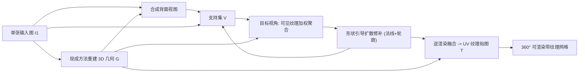

## 一句话总结

从一张人物正面照出发，借助为通用图像合成预训练的 2D 扩散模型作为衣着外观先验，用法线与轮廓双重形状引导逐视角修补，再经逆渲染融合，生成 360° 一致、高分辨率、逼真的带纹理 3D 人体网格，全程无需 3D 扫描数据监督。

## 研究背景

- 领域现状：从单张图像重建带衣人体是长期问题。几何保真度这几年提升很快，但外观（尤其被遮挡的背面）仍不够逼真；基于 NeRF 的方法通常需要多视角图像或视频，3D GAN 虽能做到视角一致，却难泛化到复杂衣着纹理。
- 核心痛点：现有外观合成方法大多依赖 3D 真值扫描做监督，而高质量带纹理 3D 人体扫描稀缺，无法覆盖衣着外观的巨大多样性；2D 重构人体方法在大旋转下又缺乏 3D 一致性。作者认为根源在训练数据多样性受限。
- 本文 idea：不去扩充稀缺的 3D/2D 人体专用数据集，而是直接把在海量通用图像上训练的高容量 2D 潜空间扩散模型当作人体外观先验，通过形状引导的修补，把它的生成能力"约束"到重建出的 3D 几何上，从而获得既逼真又 3D 一致的纹理。

## 方法

整体 pipeline 分三步：先用现成方法重建人物的 3D 几何并合成一张背面视图作为初始化；然后以 45° 为间隔、按自回归顺序逐个生成新视角——每个新视角先由已有支持集视图加权混合出可见部分，再用形状引导的扩散修补补全缺失区域；最后把这组略有错位的多视角图像通过可微逆渲染融合成一张共享的 UV 纹理贴图。

关键设计：

1. **背面视图初始化**：正背面语义强相关（T 恤背面大概率还是相似纹理的 T 恤），且轮廓提供结构约束。作者先把几何 $$G$$ 从背面渲出法线与深度图，用 ControlNet 配文字提示生成逼真背面，再跑 dense pose 喂给人体重定位方法 Pose-with-Style 得到语义更一致的背面。有了初始背面，后续远离输入视角的视图都能更好保留人物外观。

2. **多视角可见纹理聚合**：直接平均各视图会因轻微错位而模糊。作者对每个已有视图 $$V_v$$ 计算三种置信度做加权融合——可见性掩码 $$M_v$$、当前视角与该视图法线的角度差 $$\phi_v$$、以及到缺失区域边界的距离变换 $$d_v$$。混合权重为 $$w_v = \dfrac{M_v B_v e^{-\alpha \phi_v} d_v^{\beta}}{\sum_{i \in V} M_i B_i e^{-\alpha \phi_i} d_i^{\beta} + \epsilon}$$，其中 $$\alpha, \beta$$ 均取 3。角度差保证正对视角权重更高，距离项则压低靠近缺失区的像素，避免边界伪影。

3. **形状引导扩散修补**：聚合后的混合视图仍有未见区域，用预训练的 2D 修补扩散模型补全。作者发现无引导时补出的内容不尊重几何；只用法线图能保住网格结构细节（如手指）却守不住人体轮廓；只用轮廓图能守住轮廓却丢结构细节。于是同时用法线图与轮廓图作为 ControlNet 的控制信号，兼顾轮廓与结构。

4. **多视角融合**：潜空间扩散在低分辨率隐空间修补，导致各视角几何上并不严格一致。作者用 xatlas 做 UV 参数化，固定几何 $$G$$，通过可微渲染优化 UV 纹理 $$T$$，损失为对错位鲁棒的 LPIPS 加 L1：$$L(T) = \sum_{i \in V} L_{\text{lpips}}(\text{Render}(T; G, i), \hat{I}_i) + \lambda L_1(\text{Render}(T; G, i), \hat{I}_i)$$，$$\lambda = 10$$。优化后即可从任意视角渲染。整套流程在单张 RTX A6000 上约 7 分钟。

## 实验结果

在 THuman2.0 数据集上与多种单图人体生成基线做定量对比（30 个受试者，男女各半，正面图为输入）。作者也指出现有指标在评估 3D 带纹理人体时并不一致——PSNR 偏爱 PIFu 那样的模糊结果，FID 在稀疏视角分布下也不准。综合来看本文在感知类指标 LPIPS 上最好，CLIP-score 也居前列。

| 方法 | PSNR↑ | SSIM↑ | FID↓ | LPIPS↓ | CLIP-score↑ |
|------|-------|-------|------|--------|-------------|
| PwS baseline | 17.80 | 0.8888 | 132.45 | 0.1320 | 0.7733 |
| PIFu | 18.09 | 0.9117 | 150.66 | 0.1372 | 0.7721 |
| Impersonator++ | 16.48 | 0.9012 | 106.58 | 0.1468 | 0.8168 |
| TEXTure | 16.79 | 0.8740 | 215.71 | 0.1435 | 0.7272 |
| Magic123 | 14.50 | 0.8768 | 137.11 | 0.1880 | 0.7996 |
| S3F | 14.12 | 0.8840 | 165.98 | 0.1868 | 0.7475 |
| 本文 | 17.37 | 0.8946 | 115.99 | **0.1300** | 0.7992 |

此外在 DeepFashion 子集上与 ELICIT 比 CLIP-score，本文 0.7732 高于其 0.7236。消融实验表明：背面初始化、法线引导、轮廓引导三者叠加（全开配置）在 FID、LPIPS、CLIP-score 上综合最优，验证了双重形状引导与背面初始化的必要性。

## 亮点与局限

- 亮点：
  - 首次证明为通用图像合成训练的 2D 扩散模型可直接用于单图 3D 带纹理人体重建，摆脱了对稀缺 3D 扫描/精选 2D 人体数据集的依赖。
  - 法线 + 轮廓双重形状引导巧妙互补，兼顾人体轮廓与网格结构细节。
  - 基于可见性/角度/距离的加权聚合 + 鲁棒逆渲染融合，把彼此略有错位的多视角图像统一进一张 UV 纹理，得到 360° 一致的高分辨率外观。
- 局限：
  - 强依赖现成的几何重建与背面合成方法，会继承它们的缺陷（如异常脚型、裙长不齐）。
  - 缺乏视角依赖性，皮肤高光被"烘焙"进纹理，理想情况下应是视角相关的。
  - 不支持人体重定位（换姿势），且需逐人做 UV 纹理优化。

## 延伸思考

- 该工作是"用大规模通用 2D 先验解决 3D 专用数据稀缺"思路的典型代表，与后来一系列用视频扩散、3D Gaussian、SDS 蒸馏做单图人体的工作一脉相承；把这里的逐视角修补融合与更晚出现的 3D 高斯表示结合，或许能省去逐人 UV 优化。
- 视角依赖外观是明显可扩展方向：把烘焙纹理换成可学习的视角相关辐射（如带方向编码的外观场），能解决皮肤高光被固化的问题。
- 方法对几何与背面初始化的强依赖提示了"端到端化"的空间——若能用通用 2D 扩散先验同时驱动几何重建与背面生成，就能摆脱对 3D 真值训练的现成模块的依赖。
