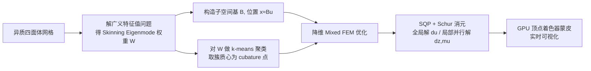

## 一句话总结

把混合有限元法（Mixed FEM）搬进由 Skinning Eigenmode 构造的降维子空间，并配上一套"材料感知"的 cubature 采样，让含大范围材料/几何异质性的弹性体能在低迭代次数下实时仿真而不丢失旋转与弹性细节。

## 研究背景

- 领域现状：实时弹性仿真求解器通常靠"提前终止时间步求解"来换取高帧率，这在均质材料上工作良好。子空间方法（如线性模态分析）自 1989 年起就用于加速这类优化问题。
- 核心痛点：现实中的弹性体都是异质的（软硬材料混合、厚薄几何混合）。一旦引入强异质性，标准求解器收敛变慢；被迫截断求解就会出现明显的阻尼伪影和旋转误差。而传统线性子空间又天生难以表达大幅旋转运动，异质性会让这一缺陷更严重。全空间 Mixed FEM（Trusty 等 2022）能保住能量运动，但复杂度随网格分辨率增长——文中的猛犸例子每次迭代要 263 秒，完全达不到实时。
- 本文 idea：把 Mixed FEM 与能张成旋转、且材料感知的 Skinning Eigenmode 子空间结合起来，再加一套按材料异质性分布的 cubature 近似，做出一个复杂度与网格分辨率完全解耦、在低迭代下仍收敛并保留丰富旋转的实时求解器。

## 方法

整体思路是三件事的组合：Mixed FEM 的"位置自由度 + 拉伸自由度 + 一致性约束"表述，把位置自由度压进 Skinning Eigenmode 线性子空间，再用 cubature 把非线性弹性能和约束项的积分近似成少数代表性四面体上的加权和。最终整个优化问题只在降维坐标上求解，与全空间网格规模无关。

- **Mixed FEM 表述**：在标准位置自由度 $$\boldsymbol{x}$$ 之外，引入拉伸自由度 $$\boldsymbol{s}$$，对应变形梯度极分解 $$F = RS$$ 中的对称拉伸分量 $$S$$。两组自由度通过显式一致性约束 $$\boldsymbol{c}(\boldsymbol{x},\boldsymbol{s}) = \boldsymbol{D}(\bar{\boldsymbol{s}}(\boldsymbol{x}) - \boldsymbol{s})$$ 用拉格朗日乘子耦合。把旋转从位置里单独拎出来交给拉伸自由度处理，正是它在低迭代下也能保住旋转运动、避免阻尼伪影的关键。
- **Skinning Eigenmode 子空间**：位置自由度用线性蒙皮子空间 $$\boldsymbol{x} \approx \boldsymbol{B}\boldsymbol{u}$$ 表达。蒙皮权重 $$\boldsymbol{W}$$ 来自弹性能拉普拉斯算子的广义特征分解 $$\boldsymbol{H}_w \boldsymbol{W} = \boldsymbol{M}_w \boldsymbol{W} \boldsymbol{\Gamma}$$。用弹性能拉普拉斯（而非普通拉普拉斯）是它"材料感知"的来源：高频模式自动集中到软区域（更可能大变形），刚硬区域只分到近似刚体的低频模式。蒙皮子空间天然能张成旋转，省去了对多个刚性坐标系的显式追踪。
- **材料感知的 cubature**：非线性拉伸能与约束项无法在子空间里解析求和，用 cubature 只在少量代表性四面体上加权近似。不同于需要离线训练集 + NNLS 拟合的经典方案，本文直接对蒙皮权重（按逆平方特征值 $$\boldsymbol{\Gamma}^{-2}$$ 加权，偏向低能变形）做 $$k$$-means 聚类，取每簇质心最近的四面体作 cubature 点、簇质量作权重，无需训练。结果是软/薄区域采样密、刚/厚区域采样稀，正好贴合应变异质性分布。
- **求解与加速**：用序列二次规划（SQP）解 KKT 系统，通过 Schur 补把系统凝聚为一个只关于 $$\boldsymbol{d}\boldsymbol{u}$$ 的稠密小系统（全局解），$$\boldsymbol{d}\boldsymbol{z}$$ 和乘子 $$\boldsymbol{\mu}$$ 的更新是局部的、可并行，代价可忽略。可视化时的全空间投影 $$\boldsymbol{x} = \boldsymbol{B}\boldsymbol{u}$$ 直接放到 GPU 顶点着色器里做蒙皮，避免成为瓶颈。经验规则是 cubature 点数取蒙皮模式数的约 20 倍，以避开欠采样导致的零能量伪振荡。

## 实验结果

主实验是不同复杂度网格上，子空间 MFEM、子空间 FEM 与全空间 MFEM 的单次迭代耗时对比（对应论文 Table 1）。子空间 MFEM 相比全空间 MFEM 平均加速三个数量级以上，且与同子空间的 FEM 迭代耗时几乎持平——但 MFEM 在低迭代下能量表现更好，等效帧率下 FEM 需要更多迭代才能追上，往往就够不到实时了。

| 网格 | 顶点数 | 单元数 | 模式 m | cubature |C| | 子空间 MFEM (ms) | 子空间 FEM (ms) | 全空间 MFEM (ms) |
|------|--------|--------|--------|--------------|------------------|-----------------|------------------|
| Octobot | 32,591 | 132,124 | 5 | 227 | 1.19 | 1.10 | 3,099.1 |
| Gatorman | 54,235 | 227,035 | 10 | 192 | 2.01 | 2.04 | 11,442.7 |
| Mammoth | 98,175 | 531,565 | 16 | 581 | 7.37 | 7.56 | 263,545 |
| Crab | 57,529 | 223,565 | 16 | 342 | 5.87 | 5.51 | 7,483.75 |

其余实验用文字补充：螃蟹（硬壳 + 软关节）只用 2 次迭代，MFEM 就能表现正确的旋转和弹性行为，而 FEM 用 4 次迭代（帧率减半）仍有明显阻尼；剑客甩剑的例子里 MFEM 几乎完美复现了剑在前 25 步的角运动，FEM 则持续低估；猛犸例子在 120 FPS 下仿真了骨/关节/肌肉三种差异极大的材料。收敛性实验（Octobot 在不同杨氏模量下）显示材料异质性越强，FEM 收敛越慢，而 MFEM 受影响很小。

## 亮点与局限

- 亮点：
  - 复杂度与网格分辨率彻底解耦，把全空间 Mixed FEM 的三个数量级开销砍到实时可用，同时继承其对材料异质性鲁棒的收敛优势。
  - 材料感知贯穿始终——子空间权重和 cubature 采样都自动反映软硬/厚薄分布，无需离线训练集或用户预设变形先验。
  - 相比同子空间的 FEM 几乎不增加计算量（仅多 $$O(k)$$ 的局部解），却在低迭代下显著减少阻尼伪影。

- 局限：
  - MFEM 在极低迭代（尤其局部强外力）下可能"过度活跃"，出现角运动初期高估导致的抖动伪影；不过多做一次迭代即可消除。
  - Skinning Eigenmode 是全局支撑的子空间，局部激励会引发全局伪影（如掰猛犸后腿会带动象鼻抖动）；增大子空间可缓解，但引出全局稠密子空间与局部稀疏子空间之间的成本/质量权衡。
  - 降维空间下的接触仿真仍是未解难题，本文未处理。

## 延伸思考

- 全局 vs 局部子空间的取舍是留下的核心开放问题：理解这一权衡不仅能治好局部激励的全局伪影，还可能打通降维空间的鲁棒接触仿真——这正是当前 reduced-space 方法最难啃的骨头之一。
- 方法把"旋转"交给拉伸自由度、把"低维运动"交给蒙皮子空间的分工思路，与显式追踪刚性坐标系的老办法形成对比，后者在多个独立刚性组件的异质材料上会随异质性增长而失控；这种"用混合表述替代坐标系追踪"的视角值得迁移到其它降维仿真问题。
- 作者提到可扩展到工程与生物力学中的物理反向设计，那里异质性本就是常态；结合无训练 cubature 的即插即用特性，或许适合做交互式材料探索工具。
