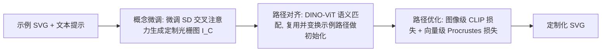

## 一句话总结

给定一张示例 SVG 和一句文本提示，本文提出一套流水线，在保留示例 SVG 视觉标识、路径属性和图层关系的前提下，生成符合文本语义的定制化矢量图。

## 研究背景

- 领域现状：矢量图（SVG）因其可缩放、图层可编辑的拓扑特性被设计师广泛使用，但创作和编辑需要专业技能、耗时。随着文本到图像（T2I）生成的成功，业界开始探索文本到矢量（T2V）的自动化路线。
- 核心痛点：现有 T2V 路线各有缺陷。一类是"先文生图再图像矢量化"，但矢量化方法常产生不规则形状、过度复杂的路径和混乱的图层关系；另一类是直接用 CLIP / 扩散模型优化路径（如 CLIPDraw、VectorFusion），难以约束生成主体的外观，也难保证路径规整。
- 本文 idea：提出一个新任务——文本引导的矢量图定制。目标不是从零生成，而是让一个已有的示例 SVG（如一只小鸟）在保持视觉标识的同时适配新语境（小鸟看书、拿蛋糕），核心思路是模仿设计师"复用关键语义元素、再逐步调整路径"的工作流程。

## 方法

整体框架：给定示例 SVG 与文本提示，流水线分三个阶段——概念微调（生成定制光栅图）、路径对齐（复用示例路径做初始化）、路径优化（拟合光栅图同时保持路径规整）。示例 SVG 先由可微光栅化器渲染成示例图像，作为整条流程的锚点。

关键设计：

1. 概念微调（Concept Fine-tuning）。为避免训练需要大规模矢量数据集，直接借用预训练 Stable Diffusion 的视觉语义先验。用示例图像 $$I_E$$ 在提示 "A clipart of $$V^*$$" 下微调模型，其中 $$V^*$$ 是一个稀有 token 嵌入，与微调同时优化。为防止过拟合、保留编辑多样性，只微调文本-图像交叉注意力块中的投影矩阵 $$W_k$$ 和 $$W_v$$（图像潜特征作 query，文本作 key/value）。推理时把 $$V^*$$ 拼进提示并加后缀引导生成扁平矢量风格，生成 $$K$$ 张候选取 CLIP 相似度最高者，再用 U2-Net 去背景。

2. 双向语义匹配（Dual Semantic Matching）。矢量化质量高度依赖初始化，随机初始化会产生冗余形状。本文的方案是复用示例 SVG 中合适的路径作初始化，为此需在示例 SVG 的路径与定制图像 $$I_C$$ 的连通分量之间建立对应。由于定制可能改变外观，用预训练 DINO-ViT 的 key 特征（而非颜色/形状等低层特征）表示路径与分量，计算路径特征 $$\lbrace F_{Path_i} \rbrace$$ 与分量特征 $$\lbrace F_{Comp_j} \rbrace$$ 的余弦相似度矩阵，再做行列双 softmax 得到更鲁棒的对应：

$$Sim2 = \mathrm{softmax}(Sim, dim=row) \odot \mathrm{softmax}(Sim, dim=col)$$

只有当匹配得分超过阈值 $$\tau_{th}=0.0625$$ 才视为有效匹配。

3. 路径预对齐（Path Pre-align）。对已匹配的图像分量计算凸包，用相干点漂移（CPD）算法估计凸包与路径边界点之间的仿射变换，据此变换、缩放示例路径到对应位置；对未匹配的分量则用曲线拟合生成新的分段三次贝塞尔路径。二者合并成初始化路径集 $$SVG^0_C$$。

4. 路径优化（Path Optimization）。可微光栅化器把路径参数与光栅图连接起来，用图像级和向量级两类损失联合优化控制点位置与填充色。图像级采用 CLIP 特征损失（取 ResNet101 的第 3、4 层激活）促使渲染结果忠于定制图像：

$$L_{CLIP} = \sum_l \lVert CLIP_l(I_C) - CLIP_l(R(SVG^i_C)) \rVert_2^2$$

向量级引入局部 Procrustes 损失：对每个控制点取一个局部窗口（实验中为 4 个邻近控制点），度量其与初始位置在刚性变换对齐后的距离，惩罚曲线交叉和曲率突变，从而保持路径局部刚性、避免混乱：

$$L_{Procrustes} = \sum_j^m \sum_k^{d_j} ProDist(W(p^0_{j,k}), W(p^i_{j,k}))$$

总损失 $$L = L_{CLIP} + \lambda L_{Procrustes}$$，其中 $$\lambda$$ 在 200 次迭代中从 0.01 线性增至 0.04——早期偏重拟合定制图像，后期加强路径形状正则。

## 实验结果

作者从 freepik 和 iconfont 收集 100 个矢量图（45 角色、35 动物、20 场景），每个随机配 5 个提示生成 500 对样本，定制 SVG 平均 28 条路径。评价从向量级（形状相似度 $$Sim_s$$、平滑度）、图像级（定制图相似度 $$Sim_{cus}$$、示例图相似度 $$Sim_{exp}$$）、文本级（$$Sim_{CLIP}$$）三个视角展开。与两类基线对比如下：

| 方法 | $$Sim_s$$↑ | Smooth↑ | $$Sim_{cus}$$↑ | $$Sim_{exp}$$↑ | $$Sim_{CLIP}$$↑ |
|------|-----------|---------|---------------|---------------|----------------|
| Potrace | - | 0.7919 | 0.9937 | 0.9076 | 0.3218 |
| LIVE | - | 0.5929 | 0.9906 | 0.8576 | 0.2859 |
| CLIPDraw | 0.1380 | 0.4613 | - | 0.7862 | 0.3175 |
| VectorFusion | 0.1434 | 0.4895 | - | 0.7214 | 0.2718 |
| 本文 | 0.8121 | 0.7931 | 0.9944 | 0.9111 | 0.3227 |

本文在形状相似度上大幅领先（0.8121 vs. 直接优化方法的约 0.14），同时在图像/文本级指标上均取得最优或持平。"文生图+矢量化"方法（Potrace/LIVE）丢失图层关系、路径破碎；直接优化方法（CLIPDraw/VectorFusion）虽继承原图层但缺乏正则，路径混乱、形状相似度低。用户研究中，本文在 SVG 质量、文本对齐、视觉标识相似度三项分别获得 82.5%、83.7%、89.1% 的偏好，全面领先。消融实验证明：去掉路径对齐（w/o PA）会因初始化偏差导致优化后严重变形（$$Sim_s$$ 降至 0.228）；去掉 CLIP 损失则路径无法贴合定制图（$$Sim_{cus}$$ 仅 0.72）；去掉 Procrustes 损失则出现路径交叉、平滑度骤降。

## 亮点与局限

- 亮点：
  - 提出并定义了"文本引导矢量图定制"这一新任务，是首个在保留示例 SVG 视觉标识的前提下做文本定制的流水线。
  - 用 DINO-ViT 语义特征 + 双向匹配复用示例路径，有效保住了图层关系和路径规整性，避开了矢量化的冗余/破碎问题。
  - 局部 Procrustes 损失在"允许必要形变"与"保持路径刚性"之间取得了可调平衡，是路径质量的关键。
  - 无需矢量数据集训练，完全借力预训练 T2I 先验。

- 局限：
  - 高度依赖扩散模型的生成能力，示例 SVG 与文本提示搭配不当（如让"汽车"去"举奖杯"）会产生无意义结果。
  - 当定制图像与示例差异过大（如侧视奔跑的松鼠 vs. 正面微笑的松鼠），语义匹配会找不到正确对应而失败。

## 延伸思考

- 方法本质是"扩散生成 + 语义引导的路径迁移"的解耦流水线，视觉标识的保留其实主要来自路径复用而非扩散模型本身，这与直接端到端优化路径的思路（VectorFusion 等）形成鲜明对比，也解释了它形状相似度大幅领先的原因。
- 依赖 CPD 刚性对齐和局部窗口 Procrustes 约束，本质上假设"定制前后语义部件近似刚性可对齐"，这也正是失败案例（大视角/姿态偏移）的根源；引入非刚性/关节化的对应或许能扩展适用范围。
- 后续工作提到的 human-in-the-loop 编辑值得关注：矢量图的图层结构天然适合交互式局部编辑，把文本定制与逐路径手工微调结合可能更契合真实设计流程。
