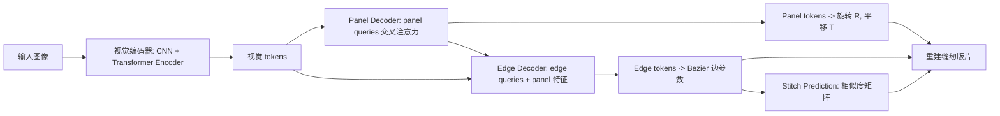

## 一句话总结

提出两级 Transformer 网络 Sewformer 与百万级合成数据集 SewFactory，从单张 RGB 图像重建服装缝纫版片（sewing pattern），实现对日常照片中服装的重建与可编辑。

## 研究背景

缝纫版片是一组可缝合成服装的二维多边形（panel），表示服装脱离外力、碰撞、面料特性等外在因素后的内在静止形状。它是参数化的，可对服装设计做直接、可解释的控制，是虚拟试穿、时尚设计、数字人等应用的核心。

已有的版片重建方法大多依赖高质量 3D 扫描或点云作为输入，普通用户难以获取，限制了实际应用。少数从图像出发的工作则存在明显缺陷：基于优化的方法推理慢、依赖手工规则与超参调节、对真实图像鲁棒性差；已有基于学习的方法未考虑服装类型、人体姿态和纹理的多样性，难以泛化到真实照片。

构建数据驱动框架面临两大挑战。其一是缺乏合适的训练数据：现有服装数据集要么没有版片标注，要么在服装外观与人体姿态上不够多样和真实。其二是缝纫版片的数据结构高度不规则且样本间差异大：不同服装的 panel 数目不同，不同 panel 的边数不同，还需估计边与边之间的缝合关系。

## 方法

方法由数据合成与版片重建两部分组成。

数据合成管线 SewFactory 分两步。先做服装模拟：采样版片模板参数（袖长、下摆宽等）、纹理与面料，用物理模拟器把上下装配对后披挂到由 SMPL 参数化的三维人体上，人体姿态从 AMASS 采样并插值以获得高姿态多样性，随后从环绕人体的多个相机视角渲染。再做人体纹理合成：由于渲染人体缺乏真实感纹理，作者设计了一个神经网络，将真实人像的纹理迁移到目标姿态，包含神经纹理提取、人体合成（掩膜融合服装）与基于扩散模型的后处理精修三阶段。最终得到约百万张带版片标注的图像，并附带深度、法向、分割、DensePose、服装网格等丰富标签。

一张缝纫版片由 $$N_P$$ 个 panel $$\{P_i\}_{i=1}^{N_P}$$ 及其缝合信息 $$S$$ 组成。每个 panel 是由若干条边围成的闭合二维多边形，每条边是一段 Bezier 曲线，用四个标量 $$x, y, c_x, c_y$$ 表示，其中 $$(x, y)$$ 是边的起点到终点向量，$$(c_x, c_y)$$ 是局部坐标系下的控制点。每个 panel 还关联一个三维旋转 $$R_i \in \mathrm{SO}(3)$$ 与平移 $$T_i \in \mathbb{R}^3$$，用于模拟披挂过程。

版片重建网络 Sewformer 包含三部分。

视觉编码器用 ResNet-50 提取低分辨率特征图并展平成序列，经 Transformer 编码器得到视觉 tokens。两级 Transformer 解码器是核心设计：第一级 panel 解码器用随机初始化的 panel queries 与视觉 tokens 做交叉注意力，得到 panel tokens 并用 MLP 预测每个 panel 的旋转与平移；第二级 edge 解码器把 edge queries 与对应 panel 特征逐元素相加后经 MLP 得到最终 edge queries，同属一个 panel 的边共享该 panel 特征以生成一致的边，再与视觉 tokens 交叉注意力得到 edge tokens 并预测 Bezier 边参数。这种从 panel 到 edge 的粗到细过程缓解了直接学习大量边导致的训练困难。缝合预测模块借助 edge tokens 构建边对相似度矩阵，迭代取最大值确定缝合关系。

$$\mathcal{L}_{\text{panel}} = \mathcal{L}_{\text{shape}} + \mathcal{L}_{\text{loop}} + \mathcal{L}_{\text{RT}}$$

Panel 预测损失中，作者提出新的形状损失 $$\mathcal{L}_{\text{shape}}$$。逐边 L2 损失只提供一维（线段）比较，对二维形状监督稀疏且隐式，两个不同的预测可能得到相同的逐边损失值。理想做法是把边转成二维掩膜再比较，但栅格化不可微。为此作者在 panel 上采样顶点（边的端点与中点），连接顶点对得到支撑向量，形状损失定义为预测与真值支撑向量之间的 L2 误差，是逐边损失的稠密化版本。以两条边向量为例：

$$\lVert v_1 - \hat{v}_1 \rVert + \lVert v_2 - \hat{v}_2 \rVert + \lVert (v_1 + v_2) - (\hat{v}_1 + \hat{v}_2) \rVert = (1 + \cos\alpha_1)\lVert \Delta v_1 \rVert + (1 + \cos\alpha_2)\lVert \Delta v_2 \rVert$$

其中 $$\Delta v = v - \hat{v}$$。误差更大的边被更重地惩罚，因此该损失鼓励各边误差更均匀分布。

总损失还包括缝合预测损失与基于 SMPL 的正则项：

$$\mathcal{L}_{\text{total}} = \lambda_1 \mathcal{L}_{\text{panel}} + \lambda_2 \mathcal{L}_{\text{stitch}} + \lambda_3 \mathcal{L}_{\text{SMPL}}$$

SMPL 正则项在 panel queries 之外增加一组姿态 query，输出预测的三维人体姿态 $$\theta$$，与真值做均方误差。人体姿态特征经注意力机制自适应融入 panel tokens，从而借助人体姿态信息辅助（尤其是被遮挡区域的）panel 重建。作者未监督人体形状 $$\beta$$，因经验上无收益。

与 NeuralTailor 相比，Sewformer 用简洁的两级 Transformer 替代了 EdgeCNN、attention-MLP 与 LSTM 的混合结构，引入两个新损失，并能在单次运行中预测整套上下装的所有 panel（借助缝合关系分组），且支持非受限姿态的日常照片。

## 实验结果

在 SewFactory 数据集上与 NeuralTailor 对比（ResNet-50 适配版）。Sewformer† 为单级解码器变体，NeuralTailor* 为用本文损失重训的 NeuralTailor。

| Model | Panel L2 ↓ | Rot L2 ↓ | Trans L2 ↓ | #Panel ↑ | #Edges ↑ | Precision ↑ | Recall ↑ | F1 ↑ |
|---|---|---|---|---|---|---|---|---|
| Sewformer | 3.57 | 0.0205 | 0.693 | 88.7% | 97.5% | 96.1% | 95.4% | 95.7% |
| Sewformer† | 3.91 | 0.0322 | 0.979 | 87.5% | 95.6% | 82.8% | 98.9% | 90.1% |
| NeuralTailor* | 4.15 | 0.0347 | 0.995 | 83.8% | 97.5% | 76.8% | 99.6% | 86.7% |
| NeuralTailor | 4.41 | 0.0300 | 1.050 | 83.6% | 97.8% | 81.5% | 87.8% | 84.5% |

相较 NeuralTailor，Sewformer 在 Panel L2 上相对降低 19%，Rot L2 相对降低 32%，Trans L2 相对降低 34%，#Panel 精度绝对提升 5.1%，F1 绝对提升 11.2%。#Edges 略低，因为它恢复了更多含高难度边的 panel。消融显示两级设计（对比 Sewformer†）与两个新损失均有贡献：去掉 $$\mathcal{L}_{\text{shape}}$$ 后 Panel L2 从 3.57 升至 3.71，去掉 $$\mathcal{L}_{\text{SMPL}}$$ 后 #Panel 从 88.7% 降至 86.1%。

## 亮点与局限

亮点：提出从单张图像重建缝纫版片这一挑战性任务的早期数据驱动方案；两级 Transformer 契合版片的层级数据结构，比混合架构更简洁且更准；新提出的形状损失稠密化二维监督、SMPL 正则借人体姿态辅助遮挡区域重建；构建了首个兼具高姿态多样性、真实服装与人体纹理的百万级版片数据集 SewFactory，并配套人体纹理合成网络；提供了"先重建版片、再用模拟引擎生成网格"的新范式，在遮挡区域也能得到物理合理结果，且便于纹理、体型、姿态编辑。

局限：数据来自合成管线，服装版片仍受模板参数空间约束；对极端遮挡、复杂多层服装等情形的处理未充分展开；依赖现成物理模拟引擎生成最终网格，重建到网格是分阶段而非端到端。

## 延伸思考

将服装重建从"直接回归网格"转向"重建参数化版片再模拟"，把物理构造过程纳入表征，这一思路对可编辑、可动画的数字资产生产很有价值。两级 query 解码处理不规则层级结构的做法，可能迁移到其他"集合中含可变长子结构"的重建问题（如结构化图、家具部件）。合成数据加纹理迁移以缩小域间差距的策略，也为缺乏真实标注的图形任务提供了可复用的数据构造范式。
