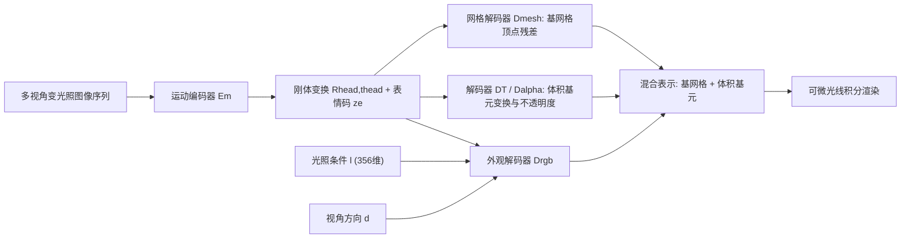

## 一句话总结

本文提出 TRAvatar，一种免跟踪（tracking-free）的可重光照体积化头部化身框架：在 Light Stage 里用变光照的动态图像序列端到端训练，通过一个显式满足"光照线性"的网络结构，实现单次前向即可在任意环境光下实时重光照与视频驱动动画。

## 研究背景

- 领域现状：高保真化身的重建长期依赖 Light Stage 等工业级采集装置。传统图形学流水线走"几何重建 + 基于物理的反射率采集"，近年的深度学习方法（如基于 VAE 的外观模型、Mixture of Volumetric Primitives, MVP）则用神经网络近似几何与外观，画质与效率都有提升。
- 核心痛点：一是多数学习方法难以有效支持重光照，且预处理/训练开销大、难以实时部署；二是这些方法普遍依赖一个独立的显式表面跟踪步骤（把动态几何跟踪成可形变基网格），该步骤计算昂贵、涉及逐帧 MVS 重建与稠密光流优化，并且在光照不断变化时鲁棒性很差。
- 本文 idea：把"光照的线性本质"作为先验直接写进网络结构，让外观解码器对光照严格线性；同时把可重光照外观与隐式几何从零开始联合优化，让跟踪被隐式学习，从而彻底去掉显式跟踪环节。

## 方法

整体框架建立在 MVP 的"基网格 + 体积基元"混合表示之上，用一个变分自编码器（VAE）架构学习解耦表示：每帧由运动编码器 $$\mathcal{E}_m$$ 预测解耦的全局刚体变换 $$\{R_{head}, t_{head}\}$$ 与表情码 $$z_e$$；再以表情码、光照条件 $$l$$ 和视角方向 $$\boldsymbol{d}$$ 为输入，用一组解码器预测基网格与挂载其上的体积基元，最后经可微光线积分渲染成图像。

关键设计：

1. **光照的线性表示与线性网络分支**。光照条件被建模成 $$l \in \mathbb{R}^{+356}$$ 向量，对应 Light Stage 上 356 个采样方向的入射光场。外观解码器 $$\mathcal{D}_{rgb}$$ 被刻意设计为对光照严格线性，即满足 $$\mathcal{D}_{rgb}(z_e, k_1 l_1 + k_2 l_2, \boldsymbol{d}) = k_1 \mathcal{D}_{rgb}(z_e, l_1, \boldsymbol{d}) + k_2 \mathcal{D}_{rgb}(z_e, l_2, \boldsymbol{d})$$。这样任意环境光都可看作基础光照的线性组合，一次前向即可重光照，无需像传统方法那样把上百张 OLAT 图叠加。

2. **双分支外观解码器**。表情码 $$z_e$$ 和视角方向 $$\boldsymbol{d}$$ 走普通非线性分支；光照 $$l$$ 单独走一个线性分支——其中去掉了激活函数以及全连接层、转置卷积层里的偏置。两分支在每个阶段做逐点相乘：$$F^{i+1}_{lin} = \text{ConvT}\big(F^i_{lin} \odot (F^i_{nlin} + 1)\big)$$，其中"加一"起残差作用以稳定训练。如此 $$\mathcal{D}_{rgb}$$ 对 $$l$$ 严格线性，同时对表情与视角保持非线性、不损失表达力。

3. **免跟踪的联合优化**。不同于"先跟踪出基网格、再建化身"的两阶段范式，本文从多视角序列直接联合优化可重光照外观与隐式几何：网格解码器只预测相对模板网格的顶点残差 $$\delta \boldsymbol{v}$$，基网格顶点由 $$\boldsymbol{v} = R_{head}(\hat{\boldsymbol{v}} + \delta \boldsymbol{v}) + t_{head}$$ 给出，动态形变被隐式学到。这带来了跨帧、跨光照建立时序对应的鲁棒性。

4. **面向隐式跟踪的采集策略**。沿用 group light 模式（每帧随机点亮 7 个相邻灯到最大亮度），但发现纯 group light 下大片人脸偏暗会让隐式跟踪不稳定，于是把未选中的灯设为已知的低亮度提供基础照明；借助光照线性与网络结构，仍能从这类混合光照中学到完全解耦的可重光照外观。训练用 $$\mathcal{L}_{total} = \mathcal{L}_{img} + \mathcal{L}_{reg}$$，其中数据项含 L1、VGG 感知损失与对抗损失，正则项含表情感知的 Laplacian 平滑、基元变换正则、体积最小化先验与 KL 散度。

## 实验结果

主实验是在公开的 Multiface 数据集上与 MVP 的新视角合成对比（MVP+ 是作者用与本文相同数据项重训的增强版）。结果显示：即便没有计算昂贵的显式跟踪，本文方法在两个受试者、三项指标上均略优于 MVP 与 MVP+，作者归因于避免了显式表面跟踪中的信息损失。

| 方法 | 受试者A MAE↓ | 受试者A SSIM↑ | 受试者A LPIPS↓ | 受试者B MAE↓ | 受试者B SSIM↑ | 受试者B LPIPS↓ |
|------|------|------|------|------|------|------|
| MVP | 2.08 | 0.910 | 0.273 | 2.21 | 0.923 | 0.232 |
| MVP+ | 1.76 | 0.930 | 0.193 | 2.11 | 0.928 | 0.211 |
| 本文 | 1.73 | 0.932 | 0.186 | 2.01 | 0.934 | 0.208 |

其余实验以文字补充：消融研究验证了物理启发外观解码器的价值——去掉线性光照分支的纯非线性变体（NL）以及加环境光模拟、加光照一致性损失、改两阶段训练等替代方案，在重光照泛化上都明显逊于本文的线性分支设计。与单视角人像重光照方法 DPR 的对比显示，DPR 难以产生与身份几何/皮肤材质一致的高光与阴影、重光照后身份漂移，而本文结果更忠实。每个受试者训练约需单张 NVIDIA V100 两天，$$1280 \times 960$$ 分辨率下解码加渲染约 22ms/帧，支持实时重光照与动画。

## 亮点与局限

- 亮点：
  - 把"光照线性"这一物理先验硬编码进网络结构（而非靠损失软约束或两阶段合成数据），显著提升了对任意环境光的重光照泛化能力，且单次前向即可实时重光照。
  - 免跟踪的联合优化去掉了昂贵且对光照敏感的显式表面跟踪步骤，在变光照下更鲁棒，训练也更高效。
  - 混合的基网格 + 体积基元表示结构一致，天然支持视频驱动动画等显式控制。

- 局限：
  - 仍强依赖 356 灯 24 相机的定制 Light Stage 与每受试者约万帧采集，谈"实用"更多是相对以往工业方案而言，普通用户难以复现采集端。
  - 每个受试者需单卡两天训练，且是逐身份建模，不具备跨身份泛化能力。
  - Light Stage 硬件（如单灯最大亮度）限制了可模拟的光照，部分光照条件无法作为定量评估的真值覆盖。
  - 视频驱动动画依赖现成表情回归器提取 blendshape 权重，表情迁移的表现力受限于该中间表示。

## 延伸思考

- 与后续的 Relightable Gaussian Codec Avatars、URAvatar 等工作对照，可看到从体积基元向 3D Gaussian 表示迁移、以及从"逐身份 Light Stage 采集"向"手机扫描 + 通用先验"演进的趋势；本文强调的"光照线性网络"这一思想是否能移植到基于高斯的可重光照表示上值得追问。
- "把物理先验作为硬约束写进网络结构"是一个通用范式，除线性光照外，能量守恒、互易性等反射率约束是否也能类似地结构化嵌入，从而在更少数据下获得更强泛化。
- 免跟踪的隐式几何联合优化降低了对精确跟踪的依赖，但也牺牲了显式语义对应；在需要精细肌肉/表情语义控制的场景下，如何在免跟踪与可控性之间取得平衡是一个开放问题。
