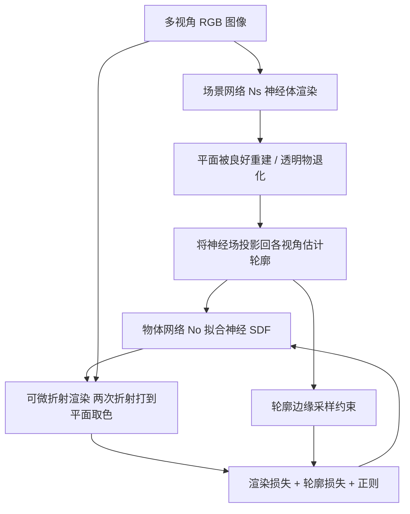

## 一句话总结

只用手持相机拍摄的多视角 RGB 图像，就能在未知的自然场景里高精度重建透明物体几何，无需暗室、标定图案、预拍环境贴图或人工标注轮廓。

## 研究背景

- 领域现状：透明物体因折射、反射带来复杂的多段光路，破坏了常规重建方法赖以工作的对应关系匹配。已有方法要么把环境建模成已知环境光喂给预训练网络，要么在暗室里用显示器打 Gray code 等特制图案来推断相机光线与背景的对应关系。
- 核心痛点：这些方法都需要繁琐的设置——预先拍摄环境图、部署显示图案的屏幕、或在暗室中逐视角人工标注物体轮廓，普通用户难以使用。同时，多段折射光路优化本身是严重病态问题，高度依赖轮廓约束；而基于颜色（而非显式光线-背景对应）来优化折射光线虽有前景，却会加剧歧义，在显式网格甚至混合表示上引发自交、折叠和高频伪影。
- 本文 idea：在无控制的自然场景中，仅凭多视角 RGB 图像自动重建透明物体。用两项关键技术解决上述两个难点——先靠体渲染的神经场投影估计出准确的多视角轮廓，再用神经 SDF 场的可微折射渲染以"颜色一致"为目标优化物体形状与折射光路。

## 方法

整体分两阶段：先忽略折射把整个场景（透明物+承载平面）当不透明物体用神经体渲染重建，借此估计出精确的多视角轮廓；再用一个独立的物体网络拟合透明物的神经 SDF 场，通过可微折射渲染让重建形状"折射出与输入图像一致的颜色"来优化真实形状。

关键设计：

- **从退化的神经场中"抠"出准确轮廓**：直接用体渲染重建透明物，其形状会因"自身外观随视角快速变化、不满足光滑 BRDF 假设"而严重退化，产生形状-辐射歧义。但作者分析了光线的权重分布：打在平面上的光线权重集中在平面交点处，而打在透明物上的光线由于折射，颜色必须由平面前方某点拟合，即在平面之前就已积累权重。据此定义一个轮廓函数 $$f_M(o,v)=\int_0^{+\infty} w'(t)\,dt$$，其中把平面及其之下的点权重手动置零。打在平面的光线 $$f_M=0$$，打在物体的光线 $$f_M=1$$，用阈值（取 0.4）即可判定像素是否命中物体，得到跨视角一致的高精度轮廓。
- **神经 SDF 上的可微折射渲染**：用物体网络 $$N_o$$ 表示 SDF 场（只输出 SDF 值），避免显式网格的离散化伪影。沿光线采样后用线性插值定位与表面的交点 $$\hat{x}$$，法向取 SDF 梯度 $$n(\hat{x})=\nabla N_o(\hat{x})/\lVert \nabla N_o(\hat{x}) \rVert_2$$；按 Snell 定律和物体折射率（IoR 手动初始化并随网络一同优化）做两次折射，直到光线打到平面。平面外观由场景网络从顶视图体渲染成一张视角无关的显式纹理，可做高斯模糊实现由粗到细的优化。最终颜色按两次折射的 Fresnel 项加权背景色 $$c=(1-F_1)(1-F_2)c_b$$。只考虑两次折射、忽略反射（大部分反射光打不到平面）。
- **轮廓边缘的稀疏光线采样**：对全部光线算轮廓损失效率低，且神经 SDF 权重只能沿光线优化。作者用形态学梯度 $$G_i = M_i \oplus b - M_i \ominus b$$（膨胀减腐蚀，$$b$$ 为 5×5 结构元）提取轮廓边缘附近的光线来算轮廓损失，大幅减少参与计算的光线数。
- **损失设计**：总损失 $$L=\lambda_{ren}L_{render}+\lambda_{sil}L_{silhouette}+\lambda_{reg}L_{regularize}$$（权重 1.0 / 1.0 / 1.5）。渲染损失在有效光线（能打到平面、无全反射）上取渲染色与真值的 L1 差；轮廓损失沿用体渲染的轮廓约束；正则含 Eikonal 项及对 IoR 偏离初值的 L2 约束。

## 实验结果

在真实数据上与面向自然场景的透明重建 SOTA（Li et al. 2020）对比——注意对方还需要预拍环境图并逐视角人工标注轮廓，而本方法只需多视角 RGB。形状误差用 Chamfer 距离（按包围盒对角线归一化）衡量，越低越好。

| 物体 | 轮廓误差 (×10⁻³) | 形状误差 本文 (×10⁻⁴)↓ | 形状误差 Li et al. (×10⁻⁴)↓ |
|------|------------------|------------------------|------------------------------|
| Cow | 6.00 | 0.25 | 1.85 |
| Tiger | 6.14 | 0.16 | 1.04 |
| Dragon | 12.46 | 0.37 | 5.11 |

本方法在更简便的采集条件下反而取得比 SOTA 更低的形状误差，能保留虎腹褶皱、牛尾牛角、龙尾龙须等细节与薄结构，而对比方法结果过度平滑、缺乏细节（作者归因于其依赖数据先验、合成训练数据与真实数据存在分布差距）。合成数据上（Mitsuba 渲染，45~108 张图，IoR 真值 1.5 而优化初值设 1.6 以验证处理未知 IoR 的能力）消融显示：去掉轮廓损失后形状误差急剧增大（如 Cloud 从 3.25 升到 14.07 ×10⁻⁵），去掉渲染损失则凹陷区域（如 Cloud 的凹面）无法恢复、结果趋于扁平。整套流程在单张 RTX 4090 上约 11 小时（形状优化约 4 小时）。

## 亮点与局限

- 亮点：
  - 据作者所述是首个无需输入物体轮廓、在无控制自然场景下重建透明物体的方法，采集简化到"绕物拍 40~50 张 RGB + COLMAP 求相机位姿"，几分钟即可完成，大幅降低使用门槛。
  - 巧妙利用体渲染中"透明物退化、不透明平面良好收敛"这一现象，通过权重分布分析反向得到高精度轮廓，把重建失败的副产物转化为强约束。
  - 神经 SDF + 可微折射渲染以颜色一致为目标优化，规避了显式网格的自交/折叠伪影；IoR 可随优化联合估计。
- 局限：
  - 透明物与承载平面的接触区域（如物体的脚）难以恢复，因为这些贴近平面的部位折射畸变很弱，在场景重建阶段难以区分。
  - 打到平面的折射光线数量不足加上颜色监督本身的歧义，会干扰优化，导致部分细节（如猴子眼睛、牛下巴的条纹）难以恢复。
  - 仅建模两次折射、忽略反射与全内反射后的光路；依赖"富纹理平面 + 明显折射畸变"的假设。

## 延伸思考

- 把折射光路的建模从"两次折射"扩展到多次折射与内部反射，或引入全内反射的显式处理，或许能覆盖更复杂的中空/多材质透明物。
- "用体渲染副产物反推轮廓"的思路可迁移到镜面、半透明等其他非朗伯物体的分割与重建。
- 作者团队后续的 RCTrans（SIGGRAPH Asia 2025）通过折射对应估计进一步在自然场景中重建透明物，可与本文对照看这条技术线的演进——从依赖颜色一致的隐式优化到更显式的折射对应建模。
- 11 小时的逐物体优化是实际落地的瓶颈，能否结合前馈网络或高斯泼溅类显式表示做加速，是值得追问的方向。
