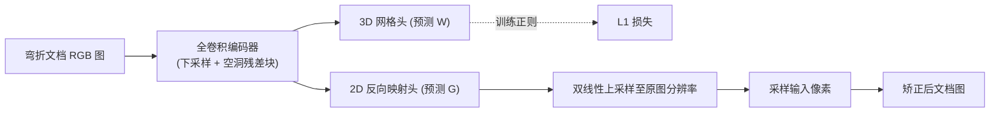

## 一句话总结

本文提出一个小巧的双头全卷积网络，从单张 RGB 照片同时预测文档的 3D 网格与 2D 反向映射网格来矫正弯折文档，并配套发布了一个兼具"照片级真实感外观"与"完整几何标注"的 UVDoc 数据集，在 DocUNet 基准上以远小的模型达到 SOTA。

## 研究背景

- 领域现状：用手机随手拍文档已取代平板扫描仪成为主流数字化方式，但拍出来的图因视角、光照和纸张形变（折叠、卷曲、褶皱）与平板扫描差异巨大，会拖累 OCR 等后处理。文档矫正（unwarping）因此成为关键一环。方法分两类：基于模型的几何优化法（慢、依赖辅助设备、能力有限），以及数据驱动的深度学习法（推理快，但极度依赖大量高质量训练数据）。
- 核心痛点：训练数据两难。合成数据（如 Doc3D）几何来自带噪的深度扫描且被过度平滑，渲染外观不够真实，导致模型迁移到真实照片时性能下降；而真实拍摄的"野外"文档数据集虽外观真实，却几乎拿不到关键的真值反向映射，逼得研究者设计各种特殊损失来绕开缺标注的问题。
- 本文 idea：用"图像合成"而非"渲染"来兼得真实感与完整标注——在纸上印肉眼不可见、UV 光下才显形的规则点阵，拍下形变纸张后既能恢复 2D 网格与 3D 形状真值，又能把文档纹理叠加到真实拍摄的带光照白纸上，得到伪真实图像。再用一个专为该数据设计的小网络做双任务预测。

## 方法

整体框架：输入一张 488×712 的弯折文档 RGB 图，送入一个 encoder 式全卷积网络，两个并行的预测头分别输出 45×31 的 3D 形状网格 $$W$$ 和 45×31 的 2D 反向映射网格 $$G$$。$$G$$ 是一个粗糙的"从哪采样"查找表：其网格点 $$G_{i,j}$$ 存的是输入图中某像素坐标（归一化到 $$[-1,1]$$），表示该像素应被搬到输出图的 $$(i,j)$$ 位置。将 $$G$$ 双线性上采样到原图分辨率后，即得到全分辨率稠密反向映射，用它采样输入图像就得到矫正后的文档。

关键设计：

1. **双任务耦合（预测 3D + 2D 两个网格）**：网络不只预测用于矫正的 2D 网格 $$G$$，还额外预测 3D 形状网格 $$W$$。$$W$$ 本身不参与矫正，仅在训练时以 $$L_1$$ 损失作为正则项。为什么这么做：3D 纸张形状与其 2D 成像之间存在物理耦合，让网络同时学两者能迫使它输出物理上合理的形状与映射，从而提升矫正质量（消融显示去掉 $$W$$ 上的损失会明显恶化几乎所有非 OCR 指标）。

2. **预测粗网格而非稠密位移场**：只预测 45×31 的粗反向映射，靠双线性插值补全，而不像多数 SOTA 那样直接回归稠密位移流。这样网络参数量骤降到约 8M（对比 DewarpNet 的 86.9M、DocGeoNet 的 24.8M），却仍保持竞争力，且单阶段处理、无需前景分割等预处理。

3. **UVDoc 数据集的构建**：在 A4 纸上用 UV 墨水打印 89×61 点阵，UV 灯下拍出点阵、普通光下拍出白纸外观、深度相机（Intel RealSense SR305）同步记录深度。由点阵像素坐标恢复 2D 网格，结合深度与相机内参重建 3D 网格，再基于二者构造 $$uv$$ 参数化。最后把从网络采样或文生图模型生成的文档纹理，通过相乘方式叠加到带真实光照的白纸图上，并替换背景、做色调/亮度匹配，得到 2 万张伪真实图像（1008 个几何经翻转增广到 4032）。这样每个样本都自带 2D 反向映射、$$uv$$ 参数化和 3D 网格三重真值。

4. **训练损失**：组合了 2D 网格、3D 网格上的 $$L_1$$ 损失与图像重建损失 $$L_r$$：

$$L = \alpha\lVert G-\hat{G}\rVert_1 + \beta\lVert W-\hat{W}\rVert_1 + \gamma L_r$$

其中对 Doc3D 样本 $$L_r$$ 直接在含光照的输入图矫正结果上算，对 UVDoc 样本则用无光照版本与真值纹理算，让网络聚焦文档内容而非阴影伪影。

## 实验结果

在 DocUNet 基准上与主流方法比较（↑越大越好，↓越小越好，Para. 为参数量）。本文方法以 8M 参数拿下 MS-SSIM、LD、AD、ED 的最佳与 CER 的第二：

| 方法 | MS-SSIM ↑ | LD ↓ | AD ↓ | CER ↓ | ED ↓ | 参数量 |
|------|-----------|------|------|-------|------|--------|
| DewarpNet | 0.472 | 8.38 | 0.396 | 0.217 | 834 | 86.9M |
| DocTr | 0.509 | 7.78 | 0.366 | 0.181 | 712 | 26.9M |
| FDRNet | 0.543 | 8.08 | 0.396 | 0.214 | 878 | - |
| PaperEdge | 0.472 | 7.98 | 0.367 | 0.193 | 763 | 36.6M |
| DocGeoNet | 0.504 | 7.70 | 0.378 | 0.190 | 736 | 24.8M |
| 本文 | 0.544 | 6.83 | 0.315 | 0.172 | 707 | 8M |

在自建的 UVDoc 基准上，本文在视觉指标（MS-SSIM 0.784、AD 0.122）以及新提出的水平/垂直线直线度指标（H-line 1.82、V-line 2.48）上均领先，OCR 指标接近 SOTA。消融实验表明：加入 UVDoc 数据训练可使 DocUNet 上 MS-SSIM 提升 8.9%、LD 提升 12.9%、AD 提升 9.7%；双任务的 3D 网格损失与重建损失也各自带来稳定增益。此外把 UVDoc 数据加进 DewarpNet 微调，也能显著改善其大部分指标，说明数据集本身具有普适价值。

## 亮点与局限

- 亮点：
  - 用 UV 墨水点阵 + 图像合成的巧思，同时拿到"真实外观"和"完整几何真值"，绕开了合成数据不真实、真实数据缺标注的老大难；采集设备平价、方法易复现。
  - 双任务耦合 + 粗网格反向映射，让 8M 的小模型达到 SOTA，无需分割预处理，实用性强。
  - 提出带成对"有光照/无光照"图像的 UVDoc 基准与直线度指标，能在剥离阴影干扰的情况下更公允地评估矫正几何质量。
- 局限：
  - 假设输入照片中文档 3D 形状可表示为高度场（整张可见、无遮挡、无折叠翻面），对严重卷曲、遮挡的场景不适用。
  - 矫正结果中 shape-from-shading（阴影带来的立体错觉）依然较强，会让人眼觉得文档比几何上更扭曲，光照矫正仍是未解问题。
  - 数据集为 A4 纵向纸张、89×61 固定点阵，尺寸/纸型的泛化性未充分探讨；OCR 指标方差大，细微差异需谨慎解读。

## 延伸思考

- 论文自己指出的最直接方向：利用数据集能解耦形变与光照的特性，去攻"文档去阴影/光照矫正"这一独立问题——矫正几何之后再矫正外观，可能是提升 OCR 的下一块拼图。
- "印不可见标记 + 合成而非渲染"这一数据构造范式很有借鉴意义，可迁移到其他需要稠密几何真值又要真实外观的任务（如织物、皮肤、可形变表面的重建与参数化）。
- 粗网格 + 双线性插值的轻量反向映射思路，与图形学里常用的低分辨率控制网格/cage 变形一脉相承；能否引入更强的形变先验（如可展曲面约束）来进一步压小模型或提升极端形变下的鲁棒性，值得追问。
- 与近期直接学习稠密位移场或用 Transformer 的方法相比，本文在"小模型 + 强数据"路线上给出了有力反例，提示数据质量对该任务的边际收益可能高于架构复杂度。
