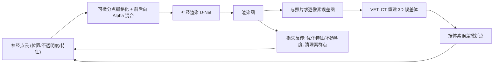

## 一句话总结

本文提出一套基于神经点渲染的管线，用可微分带混合的点渲染器清理离群点，并用"视觉误差断层扫描（VET）"把 2D 渲染误差反投影到 3D 空间以定位缺失几何、按误差密度补点，从而完成点云、显著提升新视角合成质量并保持实时渲染。

## 研究背景

- 领域现状：新视角合成（NVS）近年在神经渲染推动下进展很快。显式表示（三角网格、点云）因易用、易接入现有工作流而常被采用；点云尤其灵活，可任意增删几何而无需处理拓扑，且如今能实时渲染数十亿点并借神经网络消除点渲染伪影。
- 核心痛点：这类方法依赖 SfM/多视立体或主动扫描得到的代理几何。小瑕疵可被神经渲染修补，但较大的空洞、缺失的细结构（如树枝树叶）、以及反光/透明区域的缺口会造成明显伪影和时间上的抖动。已有的"点生长（point growing）"策略只在已有点附近插点，难以填补大洞与薄结构，且往往产生大量冗余点、需要成千上万次迭代、还容易在离相机太近处过拟合。
- 本文 idea：把问题拆成"清理 + 补点"两步。用可微分点渲染器优化每个点的不透明度，低不透明度的点视为离群点自动删除；再用 VET 将多视角的 2D 误差图通过计算机断层扫描重建为 3D 误差体，在高误差体素里按误差大小随机撒点。撒得多、撒得糙都没关系，稳健的离群点清理会把无用点再删掉。

## 方法

整体框架：管线以"照片 + 位姿 + 初始点云"为输入，每个点带一个四维特征向量和一个不透明度 $$\alpha$$。可微分点栅格化器把点云渲染成多分辨率特征图，再经神经渲染 U-Net 输出最终图像；渲染损失通过反向传播更新点特征、不透明度（必要时还有点位置与相机位姿），低不透明度点被自动清除。初步收敛后，用 VET 从误差图预测缺失点并补点，然后继续优化直到再次收敛，整个"补点—清理"循环按场景复杂度重复 1~3 次。

关键设计：

1. **带混合的可微分点栅格化器**：在 Rückert 等人的可微分点渲染基础上，用前到后的 alpha 混合替代模糊深度测试。先把点渲染到逐像素链表，按深度排序，再按各点 alpha 从前往后混合颜色，最终颜色为

   $$C_{u,v} = \sum_{m=1}^{\lvert \lambda \rvert} T_m \cdot \alpha_m \cdot c_m$$

   其中透射率 $$T_m = \prod_{i=1}^{m-1}(1-\alpha_i)$$ 保证靠后的点贡献很小。alpha 以 $$(-\infty, \infty)$$ 存储、混合时经 sigmoid 映射到 $$[0,1]$$ 以便优化。整套用自定义 CUDA 计数收集 + GPU bitonic 排序高效实现。

2. **点清理与不透明度偏置**：优化会让离群点获得很低的不透明度，于是对 alpha 设阈值 0.3、每 50 个 epoch 删一次低于阈值的点即可去掉大部分离群点。此外在每个点的不透明度梯度上加一个很小的偏置 $$\epsilon = 10^{-7}$$，把用不上的点（环境球点、远处离群点、结构内部点）推向低不透明度，在不损画质的前提下大幅压缩点数。

3. **视觉误差断层扫描（VET）**：对每张输入图算逐像素渲染损失得到误差图，先做平滑 $$I'(x,y) = \mathrm{clamp}(I(x,y)\cdot(1+l)-l,\,0,\,1)$$（取 $$l=0.3$$）以聚焦高误差、抑制噪声；再用 Neural Adaptive Tomography（NeAT）做 CT 重建。选 NeAT 是因为它能建模射线积分的非线性强度响应——视觉误差图本身并不遵守 Beer–Lambert 衰减定律，而它的神经正则又偏好锐利高密度区域，能给出干净锐利的误差体。CT 输出小意味着多数视角在该点投影处误差小，反之则说明该处几何缺失或描述子陷入局部极小。

4. **误差体撒点**：VET 输出 $$512^3$$ 的误差体素网格，归一化到 $$[0,1]$$ 后，每个体素撒 $$n(x,y,z) = \lfloor e_i(x,y,z)\cdot p_{\max}\rfloor$$ 个点（取 $$p_{\max}=10$$，单次通常新增约 1 万~200 万点），点在体素内随机分布。因为有稳健的清理机制，撒多或撒偏都无妨。同样思路还用在四层嵌套球面环境贴图上（球面 Fibonacci 采样 0.5M 点），在同一管线内高质量重建周围环境。此外可通过让 sigmoid 逐步变陡 $$\alpha = \mathrm{sigmoid}((10+f\cdot t)\cdot \alpha_{\text{raw}})$$（推荐 $$f=0.01$$）平滑过渡到二值不透明度的不透明深度测试渲染，实现上亿点的实时渲染。

## 实验结果

在 Tanks&Temples 数据集上与多类代表方法对比（4 个场景取 LPIPS/PSNR/SSIM），本文方法在几乎所有指标上领先，尤其在细节重建、离群点去除和整体锐度上表现突出：

| 方法 | Playground LPIPS↓ | Playground PSNR↑ | Playground SSIM↑ | Lighthouse LPIPS↓ | Lighthouse PSNR↑ | Lighthouse SSIM↑ |
|------|------|------|------|------|------|------|
| NeRF++ | 0.441 | 22.25 | 0.613 | 0.386 | 20.08 | 0.662 |
| SVS (half res.) | 0.291 | 22.12 | 0.704 | 0.264 | 17.14 | 0.722 |
| InstantNGP | 0.418 | 18.69 | 0.518 | 0.285 | 22.98 | 0.728 |
| Mip-NeRF 360 | 0.271 | 24.86 | 0.736 | 0.235 | 21.35 | 0.750 |
| ADOP | 0.126 | 24.85 | 0.719 | 0.119 | 22.27 | 0.755 |
| Ours | **0.124** | **25.49** | **0.768** | **0.094** | **24.19** | **0.808** |

在渲染速度上（Garden/Playground 场景，RTX4090 推理），本文的不透明版本约 13~29 ms/帧，与 ADOP 相当，远快于 Mip-NeRF 360（数万毫秒）和 InstantNGP（约 1 秒）。消融显示：VET 误差度量用 SSIM 效果最好（更多点被引导到薄结构处）；CT 的 TV 正则值影响小（多撒的点会被清理掉）；在 Mip-NeRF 360 上其 PSNR 略低于 Mip-NeRF 360，作者归因于标定误差与 CNN 色偏对该指标的放大，而不影响主观质量。

## 亮点与局限

- 亮点：
  - 用断层扫描的思想把 2D 误差"提升"到 3D 定位缺失几何，是一个新颖且通用的补点信号，能填大洞、补薄结构，明显优于局部点生长。
  - "撒点从粗、清理兜底"的设计对补点位置的精度不敏感，鲁棒性强；不透明度偏置让点云保持精简。
  - 补点与清理后点数与初始重建相近，几乎不增内存与渲染开销，且可切换到不透明模式实现上亿点实时渲染，同时时间稳定性显著改善。
  - 环境用嵌套球面点图在同一管线内重建，统一优雅。
- 局限：
  - VET 依赖 NeAT 的 CT 重建，单次约 15 分钟并计入训练时间，训练总时长约 16 小时，属重训练流程。
  - 误差体固定为 $$512^3$$ 网格，需限制包围盒范围以控内存，大范围场景需要权衡分辨率。
  - PSNR 指标在部分数据集上不占优，说明该管线对标定误差与颜色一致性较敏感。
  - 处理强视角依赖效应并非其显式目标，只是补点带来的多层表示"顺带"缓解。

## 延伸思考

VET 的核心是把可微渲染的误差当作一种"投影信号"用 CT 反演回 3D，这个思路可迁移到其他显式表示的自适应致密化上——例如 3D Gaussian Splatting 的克隆/分裂准则通常基于屏幕空间梯度，若换成多视角误差的断层反演，或许能更可靠地判断"哪里真的缺几何"而非"哪里梯度大"，缓解 splatting 在薄结构与欠采样区域的补点困难。另一个值得追问的点是误差度量的选择：本文发现 SSIM 优于逐像素误差，说明结构性/感知性误差更能指示几何缺失，后续可探索把感知损失或不确定性估计接入误差体重建。最后，将 VET 与更快的 CT 重建或前馈式误差预测结合，有望把 15 分钟的重建开销压下来，使这类"误差驱动的几何补全"更适合交互式重建场景。
