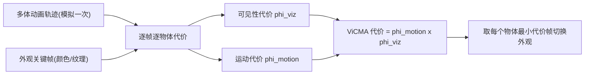

## 一句话总结

与其费力优化上千个碰撞物体的运动轨迹去满足关键帧约束，不如反过来：固定运动、只在人眼注意不到的时刻悄悄切换物体的外观（颜色/纹理），用一次前向模拟的代价制造出"轨迹被控制"的错觉。

## 研究背景

- 领域现状：大规模、富接触的多体动画（成百上千个刚体/可变形体相互碰撞）的运动控制一直是难题。主流做法有两类——基于优化的时空控制（把物体端点位置当约束，求尽量物理的中间轨迹）和基于采样浏览的方法（并行跑大量模拟，让用户交互式检索满意的一条）。
- 核心痛点：优化方法计算代价极高，且接触带来的非穿透约束常使目标在物理上不可达，物体一多就难以收敛；采样浏览则要付出巨大的预计算与存储成本，还不保证想要的结果会被采到。历史上让 30 个球拼出 "ACM" 花了 7 天优化，让 8 个字母在弹珠机里拼出 "SIGGRAPH" 也要一个多小时的并行模拟加人工浏览。
- 本文 idea：核心洞察是——与其为固定外观的物体估计合理运动，不如为固定运动的物体估计合理外观。多体动画在视觉上往往是混乱的，人类注意力系统难以逐帧追踪每个物体的确切状态。于是定义一个基于可见性和运动的启发式代价函数，找出"改变某物体外观也不会被察觉"的时刻，在代价最小的帧执行外观切换。

## 方法

整体框架：输入是一段已生成好的多体动画轨迹，外加对（部分或全部）物体规定的外观关键帧（如起始/结束的颜色、纹理）。算法为每个物体、每一帧计算一个落在 $$[0,1]$$ 的切换代价，代价只依赖该物体当前的瞬时状态和少量空间邻居（局部计算，因此在大规模场景上也很快），然后在各物体自身的最小代价帧执行外观切换。整个过程无需优化或采样，轨迹只需生成一次。

关键设计：

1. **可见性代价**：能藏就藏在看不见的时候切。用光栅化的物体 ID 图统计每个物体的投影像素占比作为可见性度量：
$$\phi^{viz}_i = \frac{1}{N_{pixels}} \sum_{j,k} (\text{ID}_i == \text{ID}(j,k))$$
物体被遮挡或投影面积很小时切换外观最不易察觉。

2. **运动代价**：当物体始终可见（如弹珠机里的彩球）时，只能靠混乱的运动来掩盖切换。这里组合了三个子项。速度项 $$\phi^{vel}_i$$ 惩罚静止物体的切换，同时要求周围邻居在"不一致地"运动——用邻域速度标准差 $$\sigma_i$$（其中 $$\sigma_i^2 = \frac{1}{\lvert \mathcal{N}_i \rvert}\sum_{j\in\mathcal{N}_i}\lVert \bar{\boldsymbol{v}}_i - \boldsymbol{v}_j \rVert^2$$）与自身速度取 min，保证只有"自己在动且邻居运动杂乱"时代价才低。转移项 $$\phi^{mov}_i$$ 显式统计足够快且方向不同的运动邻居数，用三次 smoothstep 鼓励存在多于 3 个"移动干扰物"（利用人只能同时追踪约 4–5 个物体的认知上限），避免一个孤零零的快物体撞停后突兀变色。

3. **混合代价（等待混合）**：早期冲击波会让速度项虚假地变低，导致紧密排列的球群还没怎么动就集体变色。为此作者设计了"方向重叠系数"，比较物体在参考帧（起始 0 或结束 F）与当前帧 $$t$$ 的邻域相似度——不只数交集成员，而是累加起止两帧归一化位移向量的点积（截断到正值）：
$$D^{0t}_i = \frac{1}{\lvert \mathcal{N}^0_i \rvert}\sum_{j\in \mathcal{N}^0_i \cap \mathcal{N}^t_i}\left(\hat{\boldsymbol{d}}^0_{ji}\cdot \hat{\boldsymbol{d}}^t_{ji}\right)_+$$
混合代价取起、止两端的最大值 $$\phi^{mix}_i = \max(D^{0t}_i, D^{Ft}_i)$$，在起止帧恒为 1，只有邻域充分重排后才降下来，从而把切换推迟到运动足够"混乱"之时。

4. **合成与打分**：运动代价用 $$\phi^{motion}_i = \max\!\left(\phi^{mix}_i, \tfrac{1}{2}(\phi^{vel}_i + \phi^{mov}_i)\right)$$（邻域没混合好时由 mix 主导），再乘可见性得到最终代价 $$\phi^{vicma}_i = \phi^{motion}_i\,\phi^{viz}_i$$。取时间上的最小值即切换时刻，一次算好并缓存。作者还定义 **ViCMA Score** 为全场最大的单体最小切换代价（越低越好），供动画师快速挑选最适合该方法的一段动画。

## 实验结果

方法在多个大规模、富接触的例子上验证。计算 ViCMA 代价并找最小切换帧在 i9 工作站上耗时不到 5 秒，主要开销其实是生成那一次底层物理模拟。下表列出代表性场景（切换数越大表示越多物体被悄悄改了外观而不被察觉）：

| 场景 | 类型 | 物体数 | 外观切换数 | 备注 |
|------|------|--------|-----------|------|
| Facial Expressions | 刚体·颜色 | 2500 | 591 | 短动画、单次主冲击 |
| Pachinko | 刚体·颜色 | 623 | 406 | 始终可见，首尾都是彩虹 |
| Padrinko | 刚体·颜色 | 621 | 543 | 快速混乱运动，ViCMA Score 最低 0.0372 |
| Bunchinko | 可变形·颜色 | 621 | 445 | 可变形软兔，ViCMA Score 0.570 |
| SIGGRAPH Card Trick | 刚体·纹理 | 5376 | 2045 | "ACM SIGGRAPH"落地变"2023" |
| Faulty Card Towers | 刚体·仅可见性 | 16190 | 8076 | 仅用可见性代价 |

此外，视频里对弹珠机例子做了消融：只用单体速度代价 $$\phi^v$$ 时切换发生在物体最快时刻、效果不可信；加入多体速度代价 $$\tfrac{1}{2}(\phi^{vel}+\phi^{mov})$$ 后会在邻居运动更混乱时切换，但在未混合的早/晚期仍有突兀切换；引入混合代价 $$\phi^{mix}$$ 的完整模型才能把切换稳定地推到最令人困惑的运动阶段。B#ggle Dice 例子还展示了用动态纹理"伪造"姿态控制——把 25 颗骰子中 23 颗从全四点切成全六点，模拟一次约 $$3\times 10^{19}$$ 分之一概率的骰子结果。

## 亮点与局限

- 亮点：
  - 把"利用人类注意力/变化盲视"引入动画控制，思路新颖且反直觉——控外观而非控轨迹。
  - 极其实用高效：只需一次前向模拟，代价计算秒级完成，可处理上万个碰撞物体，规模与性能较以往运动控制方法有数量级提升。
  - 与模拟器无关，刚体、可变形体、颜色、纹理都适用；代价图可复用来换配色；同时支持起始与结束两端约束。
- 局限：
  - 代价函数忽略旋转运动，而旋转对感知纹理（如旋转骰子）很重要。
  - 可见性代价视角相关，换视角或经由材质反射观看时错觉可能穿帮，也不保证注意力集中的观众看不出来。
  - 对少量/孤立物体或运动连贯的场景不适用；起止关键帧的颜色分布必须相近，否则找不到隐蔽的切换。
  - 本质上无法修改轨迹，某些必须改运动才能实现的效果它做不到；也未处理不同物理尺寸/纹理物体的泛化。

## 延伸思考

- 这条思路和 Many-Worlds Browsing、时空优化是互补而非替代关系——作者也明确把"与时空优化/采样浏览协同"列为未来方向。一个自然的问题是：能否用 ViCMA 快速筛出"外观可控"的候选动画，再对少数难点物体做局部轨迹优化？
- 代价"逐帧独立、逐物体并行"是它高效与可复用的根源，但也放弃了跨物体、跨时间的耦合优化机会（比如考虑邻居颜色、避免孤立色突兀）。耦合式外观优化是值得探索的一步。
- 方法把认知科学的多目标追踪（MOT）结论直接编码进代价项，这种"感知先验驱动的启发式设计"或许能迁移到其他大规模视觉内容（如群体动画、粒子特效）的低成本可控编辑上。
