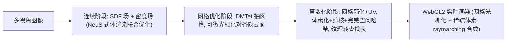

## 一句话总结

VMesh 用"三角网格 + 稀疏体素"的混合表示重建物体，从多视角图像出发经过隐式场优化再离散化，既保留网格渲染快、存储省、可编辑的优点，又用少量体素补上网格难以刻画的细小结构，能在消费级设备上以 2K 60FPS 实时渲染。

## 研究背景

- 领域现状：NeRF 类体积表示把新视角合成的质量推到了新高度，但渲染慢、存储大；虽有很多实时化工作（PlenOctrees、SNeRG、MobileNeRF 等），却往往要靠几百 MB 的体数据换速度，且缺少显式表面，难以接入图形管线做编辑、仿真、阴影、碰撞。传统网格资产渲染高效、存储紧凑、易编辑，但从随手拍的图像重建高质量网格与纹理仍是难题。
- 核心痛点：纯体积表示"表达强但重"，纯网格表示"轻但几何/外观还原弱"，两者都无法同时满足"实时高分辨率渲染 + 低存储 + 可建模细结构与视角相关效果 + 可编辑"这一整套目标。
- 本文 idea：不去给体积表示强加它本没有的能力，而是以网格为主体，只在网格难以表达的"硬骨头"区域（如细枝、薄绳）用极稀疏的体素补充。关键做法是从一个隐式的"有符号距离-密度"联合场出发优化，再经过一系列保质量的离散化，把 SDF 转成网格、把密度场转成稀疏体素。

## 方法

整体框架是一条三阶段流水线：从一个隐式神经场（表面用 SDF、体积用密度场）起步，借鉴 NeuS 把 SDF 转成体积不透明度，用体渲染把两部分联合优化；然后固定 SDF 抽取三角网格，与神经密度场联合渲染继续优化；最后丢掉所有神经网络，把几何与纹理离散化成可实时渲染、可紧凑存储的资产。

关键设计：

1. **表面与体积的联合表示与渲染**。把 SDF 通过 NeuS 的无偏映射转成不透明度 $$\alpha_{\text{surf}}$$，与体积密度给出的 $$\alpha_{\text{vol}}$$ 叠加：$$\alpha_{\text{hyb}} = 1 - (1-\alpha_{\text{surf}})(1-\alpha_{\text{vol}})$$。训练时同时对"混合渲染色"和"仅表面渲染色"施加光度损失，并对体积密度加稀疏惩罚，从而"能用表面就用表面、体积只在必要处出现"，使体积占比通常低于 0.1%。

2. **RefBasis 纹理表示**。为在实时约束下建模视角相关效果，颜色依赖反射方向 $$\boldsymbol{\omega}_r = 2(\boldsymbol{\omega}_o \cdot \boldsymbol{n})\boldsymbol{n} - \boldsymbol{\omega}_o$$（借鉴 Ref-NeRF）。最终颜色写成漫反射色加高光项：$$\boldsymbol{c} = \gamma(\boldsymbol{c}_d + \boldsymbol{s} \odot A(\theta, m)\, \boldsymbol{c}_s(\hat{\boldsymbol{\omega}}_r))$$，其中高光色由 $$N$$ 个可学习基色按每点权重加权得到 $$\boldsymbol{c}_s = \sum_{i=1}^{N} w_i \boldsymbol{c}_s^i$$，并用一个由入射角 $$\theta$$ 与"金属度" $$m$$ 决定的衰减因子 $$A$$ 解释 Fresnel 效应。相比存大量球谐/基函数系数或用 tiny MLP，它在存储与高频视角效果上取得更好平衡（论文取 $$N=4$$）。

3. **网格优化与对齐**。直接用 Marching Cubes 抽出的网格因分辨率有限与隐式几何对不齐，会逼迫体积去补洞、徒增存储。VMesh 固定连续阶段的 $$f_{\text{sdf}}$$，用 Deep Marching Tetrahedra 在可学习顶点的稠密网格上抽面，再用可微光栅化渲出轮廓与深度，与隐式场渲出的不透明度、深度对齐（$$\mathcal{L}_{\text{mesh}}$$），使网格几何紧贴隐式表面。

4. **离散化与保质量微调**。网格用二次误差边坍缩简化并做 UV 展开；密度场在 $$512^3$$ 网格上体素化、按训练像素贡献剪枝，再用完美空间哈希（PSH）组织，实现 $$O(1)$$ 索引与紧凑存储；高光 MLP 转成基环境立方图、衰减因子转成 2D 查找表。最后对显式资产做可微量化微调（前向给量化值、反向保留梯度），并用 VGG 感知损失抑制 UV 接缝与体素化走样，保证离线优化与实时渲染结果一致。

## 实验结果

在 NeRF-Synthetic 数据集（8 个含薄结构、强反射、复杂纹理的场景）上，与实时新视角合成方法比较质量、速度（MacBook Pro 2020 M1 上测 FPS）与存储。VMesh 在保持相当画质的同时，渲染速度与存储显著占优——比 MobileNeRF 快约 2 倍、比 SNeRG 快约 5 倍，存储约为 MobileNeRF 的 1/10、SNeRG 的 1/5。

| 方法 | PSNR↑ | SSIM↑ | LPIPS↓ | FPS↑ | 存储(MB)↓ |
|------|-------|-------|--------|------|-----------|
| VMesh | 30.70 | 0.947 | 0.060 | 206 | 13.6 |
| MobileNeRF | 30.90 | 0.947 | 0.062 | 98 | 125.8 |
| SNeRG | 30.38 | 0.950 | 0.050 | 43 | 86.8 |
| PlenOctrees-Web | 30.71 | 0.951 | 0.065 | 68 | 77.4 |
| nvdiffrec | 29.05 | 0.939 | 0.081 | 616 | 41.9 |

其余实验：跨设备测试中 VMesh 在 iPhone13、iPad8 与 M1 笔记本上都能实时渲染，且分辨率升到 4K 时帧率下降远小于逐像素做 raymarching/MLP 的 SNeRG 与 MobileNeRF；几何质量上 VMesh 优于 MobileNeRF（离散三角面片、无连接）与 nvdiffrec（严格 PBR 假设导致空洞），且网格可大幅简化（4x 简化到约 9.6 万顶点）而画质基本不降。消融实验验证了体积部分对还原细结构的必要性。

## 亮点与局限

- 亮点：
  - 用"网格为主、稀疏体素补细节"的思路，同时拿到实时高分辨率渲染、低存储、可建模细结构与视角相关效果、可编辑这一整套目标，体积占比极低（<0.1%）。
  - RefBasis 纹理在实时约束下兼顾高频视角效果与紧凑存储，且可离散成查找表。
  - 三阶段从隐式场到显式资产的转化设计（DMTet 对齐、PSH 存储、可微量化微调）系统地保住了离散化过程中的质量。
  - 显式网格表面天然支持形变、纹理编辑等下游处理，易接入现有图形管线。

- 局限：
  - 主要在合成的 NeRF-Synthetic 单物体数据上验证，面向大规模真实场景的可扩展性仍需更多检验。
  - 依赖多视角图像与已知相机，重建每个场景需约 2 小时（单张 RTX 3090），并非即时。
  - RefBasis 不是严格的物理渲染模型，虽利于视图合成，但材质与光照的物理可解释性有限。

## 延伸思考

VMesh 代表了"显式网格 + 轻量补充表示"这条路线，与后续 3D Gaussian Splatting 追求的实时高质量渲染是不同的技术取舍：VMesh 更看重可编辑、可入管线与低存储，而高斯泼溅在纯质量与训练速度上更激进。一个值得追问的方向是，把"稀疏体素补细节"的思想迁移到高斯或其他基元表示上，或把 PSH 式紧凑存储用于更大规模场景；另外 RefBasis 与真正 PBR 材质的差距，是否可以通过引入更强的光照分解来弥合，从而让重建资产直接用于重打光与合成场景。
