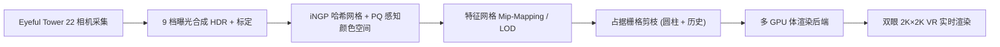

## 一句话总结

VR-NeRF 是一套从采集、重建到实时渲染的端到端系统，用神经辐射场在虚拟现实中以 36 Hz 双眼 2K×2K 分辨率自由漫游高保真的真实空间。

## 研究背景

- 领域现状：消费级 VR 头显催生了高沉浸的视觉媒体，NeRF 也已成为高质量新视角合成的事实标准。但现有方案要么只支持直径小于 1 m 的小"头盒"高保真视图合成，要么支持场景级自由视点但质量或帧率较低。
- 核心痛点：可漫游空间需要数千张输入视图才能提供足够的空间覆盖，而现有采集大多是手持拍摄的几百张照片或沿 1D 轨迹的视频帧，位姿采样严重不足；同时它们无法复现真实世界的高动态范围；此外，NeRF 在这种超大规模、超高分辨率、大动态范围的数据上既缺乏细节层次（LOD）抗锯齿，也难以做到 VR 级实时渲染。
- 本文 idea：设计定制多相机采集装置密集拍摄可漫游空间，在 Instant-NGP 基础上引入感知均匀的 HDR 颜色空间与高效的特征网格 mip-mapping（LOD），并配合精确占据栅格与多 GPU 渲染，把全流程质量与速度的取舍逐一优化到位。

## 方法

整体框架分三段：用 "Eyeful Tower" 相机塔密集采集 HDR 多视图；在 Instant-NGP 之上训练一个带感知 HDR 颜色空间与 LOD mip-mapping 的辐射场，并用带剪枝的占据栅格加速；最后由多 GPU 渲染后端把体渲染分发到多卡上，实现 VR 分辨率与帧率的实时渲染。

关键设计：

1. **Eyeful Tower 采集装置**：铝型材塔身在 1.8 m 立柱上按 7 层每层 3 台外加顶部 1 台共 22 台 Sony α1 相机，拍摄 5000 万像素、14 档动态范围的 raw 图。以约 30 cm 间距"铺满"地面完成前后向拍摄，配合尺标与色卡实现米制标定和白平衡。采集得到的数据集覆盖 6–120 m² 空间、数千张图，多个场景像素量超 1000 亿，比现有数据集高两个数量级。

2. **感知式 HDR 建模（PQ 颜色空间）**：9 档曝光括拍把动态范围扩到 22 档（最亮像素可达最暗非零像素的约 419 万倍）。直接在线性空间上用 $$L_1$$ / $$L_2$$ 损失会被亮区误差主导。作者借用 Dolby 的感知量化器 PQ 把亮度映射到感知均匀的单位区间：

   $$\mathrm{PQ}(Y)=\left(\frac{c_1+c_2\cdot Y^{m_1}}{1+c_3\cdot Y^{m_1}}\right)^{m_2}$$

   将线性色值 1 映射到 100 cd/m²，在 PQ 空间里用简单 $$L_1$$ 损失即可按人眼感知惩罚误差，无需自定义损失或色调映射模块，且单位区间天然契合 sigmoid 激活。

3. **特征网格 Mip-Mapping 做 LOD**：把光线视作圆锥，用其在采样点的截面足迹 $$\hat r = t\cdot r$$ 与各层网格特征尺寸比较，按 Nyquist 采样定理抑制尺寸小于两倍足迹的过细特征。设基础分辨率为 $$s$$、层间缩放为 $$f$$，最优 LOD 层为 $$L^{*}=-\log_f(2s\hat r)$$，并对各层施加分段线性权重。远处样本只查询低层特征，跳过最精细哈希层那种访存极不连贯的采样，从而大幅提速；LOD bias 还统一了由粗到细的渐进训练；距离相关特征能吸收相机塔投影阴影等不一致因素。

4. **占据栅格剪枝与多 GPU 渲染**：用显式二值占据栅格跳过自由空间，减少需要查询哈希特征和评估 MLP 的采样点。两项新扩展——把相机塔几何近似为圆柱、将完全落入圆柱内的体素标为空的"圆柱剪枝"，以及结合训练历史最大密度与稠密网格采样的"联合历史—网格剪枝"——让剪枝更准、几何更干净。渲染后端在多张 A40 GPU 上做动态负载分配，每卡保存一份场景（约 700 MB 显存），动态分配带来约 49% 帧率提升。

## 实验结果

在 Eyeful Tower 测试集上（1K 分辨率、110K 迭代、每光线 1024 采样），逐步加入 PQ 颜色空间与 LOD 两项设计，在 sRGB 与 PQ 两套颜色空间下的 PSNR/SSIM/LPIPS 均一致提升，其中 PQ 版指标对极亮极暗区更敏感：

| 配置 | PSNR↑ | SSIM↑ | LPIPS↓ | PQ-PSNR↑ | PQ-SSIM↑ | PQ-LPIPS↓ |
|------|-------|-------|--------|----------|----------|-----------|
| iNGP（本文实现） | 31.93 | 0.918 | 0.183 | 37.39 | 0.957 | 0.133 |
| + PQ 颜色空间 | 32.47 | 0.926 | 0.170 | 38.15 | 0.962 | 0.122 |
| + PQ 颜色空间 + LOD | 33.30 | 0.930 | 0.146 | 38.95 | 0.964 | 0.108 |

性能方面，作者以"p99"（99 百分位帧率）作为 VR 体验质量代理：只要 99% 以上时间高于 36 FPS，异步空间扭曲（ASW）就能提供平滑体验。一台现成 3 卡工作站即可让约半数场景以 36 FPS 稳定跑半分辨率 VR；在定制 20 卡 A40 工作站上，除一个场景外所有场景半分辨率 p99 都达 72 FPS，全分辨率下 6 个展示场景里有 4 个超过 36 FPS 的 ASW 阈值。作者也注意到分辨率减半只带来约两倍帧率提升（而非四倍），暗示存在可观的每帧固定开销。

## 亮点与局限

- 亮点：
  - 首个覆盖采集—重建—渲染全链路、面向 VR 高保真可漫游空间的整体系统；定制相机塔产出前所未有的密度与动态范围数据集。
  - PQ 感知颜色空间让简单 $$L_1$$ 损失就能训练 22 档 HDR，无需自定义损失或色调映射。
  - 面向 iNGP 哈希网格的实时 mip-mapping LOD，兼顾抗锯齿与实时性，而 Zip-NeRF 的方案在 8×V100 上仅 1.1 FPS。
- 局限：
  - 激进剪枝在反射面、透明物体或无界场景上会失效，VR 里表现为盒状伪影。
  - 距离相关特征虽能吸收拍摄不一致，却削弱了对未见视点/视距的外推能力（密度可能随距离变化），只能靠尽量剪除自由空间来缓解。
  - 最高保真需要 20 卡 A40 这类定制硬件，落地门槛高；系统只针对静态场景。

## 延伸思考

- 系统绑定在 NeRF/iNGP 体渲染上，而 3D Gaussian Splatting 之后在实时性上更有优势，把这里的 PQ 感知 HDR 颜色空间与连续 LOD mip-mapping 思路迁移到高斯泼溅表示，或许能在更低硬件成本下达到同等 VR 体验。
- PQ 感知颜色空间本质是给损失换了个感知均匀的度量，这一思路对任何需要在大动态范围上做回归/插值的神经渲染任务都值得借鉴。
- "p99 帧率而非均值"作为 VR 舒适度代理，提示实时渲染研究在报告性能时应更关注最坏情形的一致性，而非平均吞吐。
