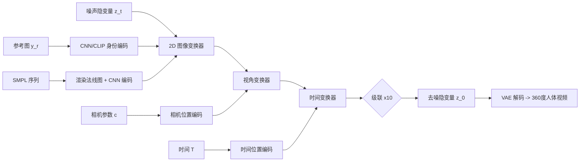

## 一句话总结

Human4DiT 提出一种层次化 4D 扩散变换器，把 4D（视角、时间、高、宽）自注意力分解为图像、视角、时间三类级联的变换器块，并结合 CNN 精确注入控制条件，从单张参考图生成 360 度、时空一致的高质量人体视频。

## 研究背景

从单张图像生成人体视频在虚拟现实、动画、游戏、影视等领域有广泛应用。当前主流范式分为两类：

- GAN 方法通过对抗网络与扭曲（warping）函数迁移运动，但在参考图与源运动之间存在较大身份或场景差异时，容易产生不真实的伪影和时序抖动。
- 扩散方法（如 Animate Anyone、Champ 等）通常基于 Stable Diffusion 的 UNet 架构，用骨架图或 SMPL 派生表征（UV 图、深度、法线、DensePose）作为控制条件，以像素对齐方式注入网络。

现有扩散方法主要有两个局限：一是 UNet 依赖局部卷积，偏重局部生成，在长序列、复杂人体运动时全局一致性较差；二是它们只关注人体本身，忽略了相机视角信息，难以处理 360 度这类大视角变化的场景，也很少探索视角可控性。作者受 SORA 用扩散变换器实现更强时空一致性的启发，将扩散变换器引入人体视频生成，以同时解决复杂运动、视角变化与泛化问题。

## 方法

### 整体框架

给定参考图像 $$y_r$$、动态 SMPL 序列 $$\{P_i = (\theta, \beta)\}_{i=1}^{T}$$ 以及相机参数 $$\{c_i\}_{i=1}^{V}$$，方法从噪声隐变量 $$z_t$$ 出发，将三类控制信号注入 4D 扩散变换器，迭代去噪得到隐视频 $$z_0$$，再由 VAE 解码为 360 度人体视频 $$x_0$$。整体框架结合了扩散变换器（捕捉跨视角、跨时间的全局关联）与 CNN（实现像素对齐的条件注入）的优势。

### 关键设计 1：层次化 4D 变换器分解

直接在 4D 空间（视角、时间、高、宽）上做完整自注意力计算量过大。作者把输入视为 5D token 张量 $$z_t \in \mathbb{R}^{V \times T \times H \times W \times C}$$，将 4D 注意力级联分解为三种块：

- 2D 图像变换器，在每帧内部做空间自注意力：

$$z^{s}_{t} = \mathrm{rearrange}(z_t, (V\times T,\, H\times W,\, C)),\quad \hat{z}^{s}_{t} = \mathrm{softmax}\!\left(\frac{Q_s K_s^{T}}{\sqrt{d_k}}\right) V_s$$

- 视角变换器，在视角与 2D 空间维度上联合做注意力，建模跨视角全局关联（正、侧、背视差异大，是显存与算力最重的模块，从而限制了视角窗口大小）：

$$z^{v}_{t} = \mathrm{rearrange}(\hat{z}^{s}_{t}, (T,\, V\times H\times W,\, C)),\quad \hat{z}^{v}_{t} = \mathrm{softmax}\!\left(\frac{Q_v K_v^{T}}{\sqrt{d_k}}\right) V_v$$

- 时间变换器，跨时间步捕捉时序关联：

$$z^{m}_{t} = \mathrm{rearrange}(\hat{z}^{v}_{t}, (V\times H\times W,\, T,\, C)),\quad \hat{z}^{m}_{t} = \mathrm{softmax}\!\left(\frac{Q_m K_m^{T}}{\sqrt{d_k}}\right) V_m$$

三种块互连构成一个 4D 变换器块，整体级联 10 个 4D 块（共 30 层），在大幅降低计算开销的同时保证时空一致性。

### 关键设计 2：多种控制条件注入

- 相机控制：以第一台相机为世界坐标，取相对旋转矩阵做位置编码 $$y_c = (\sin(2^0\pi r_1), \cos(2^0\pi r_1), \dots, \sin(2^{L-1}\pi r_1), \cos(2^{L-1}\pi r_1))$$，经 MLP 映射后以加法注入视角变换器：$$z^{v'}_{t} = z^{v}_{t} + f_c(y_c)$$。
- 时间嵌入：对帧号 $$T_m$$ 做位置编码后经 MLP 加到时间变换器特征上：$$z^{m'}_{t} = z^{m}_{t} + f_m(y_m)$$。
- SMPL 控制：由形状与姿态参数得到网格顶点 $$p_i = LBS(\theta_i, \beta_i)$$，渲染为法线图 $$M_n(i,v)$$，并乘以相机旋转的逆 $$r_v^{-1}$$ 与相机信息解耦，再由 CNN 编码器像素对齐注入。
- 身份参考：用 CNN 编码器提取身份特征加到输入，同时用 CLIP 提取图像嵌入 $$y_e$$，在每个块内经交叉注意力注入：$$\tilde{z}_t = \mathrm{softmax}\!\left(\frac{Q K^{T}}{\sqrt{d_k}}\right) V$$，兼顾全局身份一致与局部细节。

### 关键设计 3：多维数据集与训练策略

作者构建多维数据集（图像、视频、多视角视频、3D/4D 扫描），包括 5k 高质量 3D 人体扫描、10k 网络单目视频、100 个可驱动人体模型。针对不同模态采用差异化训练：图像只训 2D 变换器；单目视频训 2D + 时间变换器；多视角与 4D 数据训练全部变换器；3D 数据训 2D + 视角变换器。

### 关键设计 4：高效时空一致采样

由于显存限制，单次输入帧数受时间窗与视角窗乘积约束，无法直接生成视角与时间同时变化的 360 度长视频。作者提出两阶段采样：第一阶段把 360 度视频视为单目长视频，最大化时间窗 $$M^1_T$$ 保证长时序一致；第二阶段视为多视角短片集合，用更大视角窗 $$M^2_V$$ 与更小时间窗保证视角一致。两者噪声预测按权重合并：

$$\mu_\theta \leftarrow \frac{1}{\sqrt{\alpha_t}}\left(x_t - \frac{\beta_t}{\sqrt{1-\bar{\alpha}_t}}(\lambda_1 \epsilon_1 + \lambda_2 \epsilon_2)\right)$$

## 实验结果

在多视角（MV）、3D 静态（3D）与 360 度（4D）视频生成上，与 Disco、MagicAnimate、AnimateAnyone、Champ（带 * 为在本文数据集微调）对比，本文方法在各指标上均领先。

| 方法 | PSNR↑ (MV/3D/4D) | SSIM↑ (MV/3D/4D) | LPIPS↓ (MV/3D/4D) | FVD↓ (MV/3D/4D) |
| --- | --- | --- | --- | --- |
| Disco | 18.86 / 17.13 / 19.98 | 0.796 / 0.882 / 0.872 | 0.293 / 0.209 / 0.169 | 646.2 / 451.6 / 559.7 |
| MagicAnimate | 19.30 / 19.28 / 21.74 | 0.845 / 0.906 / 0.920 | 0.232 / 0.159 / 0.135 | 517.3 / 356.4 / 418.4 |
| AnimateAnyone | 19.87 / 20.53 / 22.01 | 0.858 / 0.922 / 0.912 | 0.216 / 0.111 / 0.131 | 472.8 / 285.4 / 410.3 |
| Champ | 20.15 / 21.11 / 23.35 | 0.886 / 0.927 / 0.922 | 0.203 / 0.106 / 0.110 | 442.4 / 204.3 / 347.6 |
| Champ* | 20.90 / 22.18 / 24.34 | 0.905 / 0.940 / 0.935 | 0.185 / 0.060 / 0.083 | 397.3 / 186.3 / 286.1 |
| Ours (image+temporal) | 21.16 / 22.58 / 24.74 | 0.907 / 0.941 / 0.936 | 0.190 / 0.058 / 0.085 | 374.2 / 165.2 / 274.1 |
| Ours | 22.40 / 23.37 / 25.02 | 0.920 / 0.962 / 0.947 | 0.159 / 0.045 / 0.062 | 296.53 / 110.0 / 234.8 |

在单目视频测试（从 Human4DiT-Video 随机选 200 段）上，完整模型也取得最佳成绩（PSNR 26.12、SSIM 0.888、LPIPS 0.116、FVD 237.4），优于 Champ*（PSNR 24.93）等。消融显示：去掉视角变换器的 Ours (image+temporal) 以及仅有图像块的 Ours (image) 指标均明显下降，验证了视角与时间变换器的作用。训练使用 24 张 A100，历时 14 天。

## 亮点与局限

亮点：

- 首次将扩散变换器引入人体视频生成，并设计层次化 4D 分解，把不可行的 4D 全注意力拆成图像、视角、时间三类级联块，兼顾效率与时空一致性。
- 用 3D SMPL 渲染法线图替代 2D 骨架，天然携带视角与多视角对应关系，配合 CNN 实现像素对齐条件注入。
- 两阶段时空一致采样在有限窗口下生成 360 度长视频，兼顾长时序与跨视角一致。
- 构建并利用多维数据集与差异化训练策略，充分挖掘不同模态数据。

局限：

- 视角变换器是显存与算力瓶颈，直接限制了可用视角窗口大小，只能借助分阶段采样绕过。
- 依赖 SMPL 拟合与相机估计的质量，姿态或相机估计误差会传播到生成结果。
- 4D 训练数据仅约 100 组，规模有限，可能影响对更复杂着装、场景的泛化。
- 训练成本高昂（24×A100、14 天），复现门槛较大。

## 延伸思考

- 层次化因子分解思路可推广到更高维生成任务（如加入光照、材质维度），是否存在更优的维度拆分与级联顺序值得探索。
- 视角一致性目前依赖相机相对旋转的位置编码，若引入更几何化的表示（如 Plücker 射线），能否进一步提升大视角外推能力。
- 两阶段采样通过窗口规划权衡时序与视角一致，是否可用更端到端的稀疏注意力或滑窗机制统一处理，减少人工阶段划分。
- 4D 真值数据稀缺是共性瓶颈，如何用更多单目/多视角弱标注数据自监督地补足 4D 监督，是扩展该类方法的关键。
