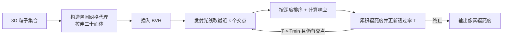

## 一句话总结

本文提出一套面向 3D 高斯等粒子表示的高性能可微光线追踪算法：为每个粒子构建紧致的包围网格并插入 BVH，用 $$k$$-buffer 分批按深度顺序收集并着色交点，在几乎不牺牲质量、仍保持实时帧率的前提下，解锁了反射、折射、阴影、景深、畸变相机与随机采样光线等光栅化难以实现的能力。

## 研究背景

以 3D Gaussian Splatting（3DGS）为代表的粒子辐射场表示在三维重建与新视角合成上取得巨大成功，但主流方法都通过**光栅化**渲染：把粒子投影到屏幕空间的 tile 中按序处理。光栅化继承了其固有权衡：

- 难以处理机器人与仿真中常见的强畸变相机、卷帘快门（rolling shutter）效应；
- 无法高效模拟反射、折射、阴影等次级光线效应；
- 无法对光线做随机采样，而随机采样是计算机视觉训练中的常见做法。

另一方面，专用 GPU 光线追踪硬件（如 NVIDIA RTX / OptiX）已把光追推向实时。然而直接把光追用于高斯场景并非易事：已有的半透明粒子光追算法（如 slab-tracing、multi-layer alpha tracing）依赖粒子各向同性或分布均匀的假设，或对排序做近似，在海量、非均匀、密集重叠的重建粒子上要么低效、要么产生伪影且不可微。

作者的目标不是解决全局光照或逆向光照等开放问题，而是提供一个关键的算法基础组件：一个**快速、可微的粒子光线追踪器**。

## 方法

整体框架：给定一组 3D 粒子，先为每个粒子构造包围网格代理并建立 BVH；渲染时对每条光线反复向 BVH 发射查询，每轮取回最近的 $$k$$ 个交点并按深度排序，按体渲染公式累积辐亮度，直到所有相交粒子处理完毕或透过率低于阈值 $$T_{min}$$。

粒子沿光线的体渲染采用离散化的前向 alpha 合成：

$$
\boldsymbol{L}(\boldsymbol{o}, \boldsymbol{d}) = \sum_{i=1}^{N} \boldsymbol{c}_i(\boldsymbol{d})\, \alpha_i \prod_{j=1}^{i-1} (1 - \alpha_j)
$$

其中 $$\alpha_i = \sigma_i \rho_i(\boldsymbol{x}_i)$$，$$\sigma_i$$ 为不透明度，$$\rho_i$$ 为粒子核函数响应。

### 关键设计 1：自适应包围代理（拉伸二十面体）

作者对比了 AABB、球、八面体、二十面体等多种 BVH 代理后，选择用**拉伸的正二十面体网格**包裹每个粒子：它能紧致贴合各向异性高斯并复用硬件优化的光线-三角形求交，避免了 AABB 在斜向拉伸时产生大量几乎零贡献的假阳性交点。代理顶点由下式变换得到，并把不透明度纳入缩放（自适应裁剪），使近乎透明的大粒子拥有更小的包围体：

$$
\boldsymbol{v} \leftarrow \sqrt{2 \log(\sigma / \alpha_{min})}\, \boldsymbol{S}\boldsymbol{R}^{T}\boldsymbol{v} + \boldsymbol{\mu}
$$

### 关键设计 2：$$k$$-buffer 分批有序追踪

ray-gen 程序发射光线收集下一批 $$k$$ 个粒子，any-hit 程序用插入排序维护按深度排序的命中缓冲（此阶段只记命中、不评估响应，超出 $$k$$ 的更远命中调用 IgnoreHit 以免遍历过早停止）；随后按序取出粒子评估响应并合成，再从最后一个命中处重新发射光线收集下一批。相比前人方法，该方案保证处理每一个相交粒子、命中顺序一致，从而既不遗漏也不近似透过率，且**可微**。作者强调最终算法经大量基准调优，比最初的朴素实现快近 25 倍。

### 关键设计 3：最大响应采样点与可微反向传播

对每个粒子取单点采样，采样位置选为沿光线响应最大处 $$\tau_{max} = \arg\max_\tau \rho(\boldsymbol{o} + \tau\boldsymbol{d})$$（对各向异性粒子比正交投影中心更准确）：

$$
\tau_{max} = \frac{(\boldsymbol{\mu} - \boldsymbol{o})^{T} \boldsymbol{\Sigma}^{-1} \boldsymbol{d}}{\boldsymbol{d}^{T} \boldsymbol{\Sigma}^{-1} \boldsymbol{d}}
$$

反向传播时重新发射相同光线、按相同顺序采样相同粒子，用原子 scatter-add 累积梯度。优化沿用 3DGS 的裁剪/克隆/分裂策略，但因缺少屏幕空间梯度，改用**三维世界空间梯度**作为克隆分裂准则；粒子更新后需定期重建 BVH。

### 关键设计 4：广义粒子核函数

框架不限定高斯核，作者额外探索了三种变体：$$n=2$$ 的广义高斯（GG2）、法线良好定义的核化表面粒子（SGG2，可用两三角形包围）、以及余弦波调制粒子（CSGG2）。其中广义高斯核衰减更快、粒子更"密实"，减少沿光线的命中数，渲染性能相比标准高斯提升约 2 倍。此外光追天然支持用随机采样光线训练（但此时无法使用 SSIM 等基于窗口的图像损失）。

## 实验结果

在 MipNeRF360、Tanks & Temples、Deep Blending 三个标准新视角合成基准上，方法质量与 3DGS 及主流方法相当或略优。`Ours (reference)` 复现 3DGS 配置追求高质量，`Ours` 使用 GG2 粒子、更大密度学习率与随机光线训练以换取更快速度。

| 方法 | MipNeRF360 PSNR↑ | MipNeRF360 SSIM↑ | T&T PSNR↑ | Deep Blending PSNR↑ | Deep Blending SSIM↑ |
| --- | --- | --- | --- | --- | --- |
| 3DGS (checkpoint) | 28.83 | 0.867 | 23.35 | 29.43 | 0.898 |
| Ours (reference) | 28.69 | 0.871 | 23.03 | 29.89 | 0.908 |
| Ours | 28.71 | 0.854 | 23.20 | 29.23 | 0.900 |

渲染速度（单张 NVIDIA RTX 6000 Ada，FPS）：在 MipNeRF360 上 3DGS 光栅化为 238 FPS，`Ours` 为 78 FPS（约慢 3 倍），但仍保持交互式实时，远快于 MipNeRF360 / Zip-NeRF 等光线步进方法（< 1 FPS）；在 Tanks & Temples 上 `Ours` 达 190 FPS（约慢 1.7 倍）。在 Zip-NeRF 鱼眼畸变数据集上，方法可直接在原始畸变图像上训练并取得最高质量，而 3DGS 无法从原始鱼眼视图渲染。

## 亮点与局限

亮点：
- 首次为海量、密集重叠的半透明粒子设计出**一致有序、可微、且实时**的 GPU 光追算法，前向反向均以光追为唯一渲染器。
- 光追天然带来反射、折射、硬阴影、景深、强畸变/卷帘快门相机、随机采样光线、物体插入与实例化等一系列光栅化难以实现的能力，且额外代价很小。
- 广义高斯核等改进显著减少命中数、提升渲染效率。

局限：
- 相比高度优化的 3DGS 光栅化仍慢 1.5～3 倍，且训练需定期重建 BVH。
- 用随机（非相干）光线训练存在不稳定性（如 Deep Blending 的 Playroom 场景质量下降），且无法使用 SSIM 等窗口型损失。
- 本文定位为"算法基础组件"，并未直接解决全局光照、逆向光照等开放问题。

## 延伸思考

将光追作为粒子辐射场的统一渲染后端，为把物理正确的次级光线效应（真实反射/折射/软阴影乃至逆向渲染与重打光）引入高斯场景铺平了道路；结合广义核与随机光线训练，值得探索如何在保持质量的同时进一步逼近光栅化速度，以及如何稳定随机光线训练。包围代理的选择与 $$k$$-buffer 批量大小等超参对速度与质量影响巨大，也提示这类"硬件感知"的算法设计在粒子渲染中仍有很大调优与推广空间。
