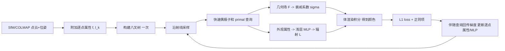

## 一句话总结

提出"偶极子和(dipole sum)"这一基于点云的场表示，把缠绕数(winding number)推广为可插值任意逐点属性的形式，从而用它同时表达几何隐式场与辐射场；配合 Barnes-Hut 快速求和实现对数复杂度的正向与反向查询，使得直接以运动恢复结构(SfM)点云为初始化、用光线追踪做逆向渲染的高保真三维重建在与光栅化方法相当的速度下完成。

## 研究背景

多视图三维重建的主流两阶段流程是：先用 SfM(如 COLMAP)估计相机位姿并产出稀疏点云，再用可微渲染优化某种场景表示以复现输入图像。这里表示方式决定了效率与质量的折中：

- 神经场(NeRF/NeuS 类)表达力强，但逆向渲染计算开销大，且难以直接、有效地利用 SfM 输出的点云(往往只能当作正则项)。
- 网格/哈希编码(如 NeuS2、Neuralangelo)提升了效率，但仍不能直接使用 SfM 的三维信息。
- 基于 3D 高斯的点表示(如 Gaussian Surfels)可直接利用 SfM 点云，并借助光栅化实现实时优化；但光栅化牺牲了通用性——无法支持阴影射线等直接光照渲染技术。

作者据此提出问题：能否有一种基于点的表示，既能像光栅化那样高效、又保留光线追踪的通用性、还能直接优化 SfM 点云？本文以点云缠绕数为基础给出答案。缠绕数是对物体指示函数的近似，可写成以各点为中心的泊松核之和，具有调和性等几何正则性(与泊松表面重建 PSR 极限一致)、对噪声鲁棒、可用快速求和加速、且能直接由 SfM 点云初始化等优点。

## 方法

### 整体框架

在 SfM 输出的定向点云 $$\mathcal{P}=\{\mathbf{p}_m,\mathbf{n}_m,A_m\}$$ 上附加逐点属性：一个几何属性 $$f_m$$ 与若干外观属性 $$\ell_{km}$$。正向渲染时，在每条视线的采样点用一次快速偶极子和查询插值出几何与外观属性；外观属性经一个浅层 MLP 得到颜色，几何属性用于计算衰减系数；沿射线做体渲染积分得到像素颜色，最小化与真实图像的 $$L_1$$ 损失。反向传播则通过快速伴随(adjoint)查询把梯度回传到逐点属性。

### 关键设计 1：正则化偶极子和

点云缠绕数由奇异的泊松核 $$P(x,y)=\frac{1}{4\pi}\frac{n(y)\cdot\widehat{xy}}{\|x-y\|^2}$$ 求和得到，奇异性会在点附近造成数值不稳定，且对含噪点云做精确插值并不理想。作者借用"正则化基本解"方法，用高斯型将 delta 分布软化，得到非奇异的正则化泊松核：

$$P_\varepsilon(x,y)\equiv P(x,y)\cdot S\!\left(\frac{\|x-y\|}{\varepsilon}\right),\quad S(t)=\mathrm{erf}(t)-\frac{2}{\sqrt{\pi}}\,t\,\exp(-t^2)$$

进一步把定义缠绕数的边值问题中的 Dirichlet 跳变条件推广为任意数据函数 $$b$$，其解为双层势，离散化后得到偶极子和：

$$u^{b}_{\mathrm{pc},\varepsilon}(x)\equiv\sum_{m=1}^{M} A_m\,P_\varepsilon(x,\mathbf{p}_m)\cdot b_m$$

缠绕数与其正则化形式都是该式的特例($$b\equiv 1$$)。这一推广既缓解了噪声/离群点问题，又赋予了表达辐射场的额外自由度。

### 关键设计 2：几何场与辐射场的点表示

几何场取偶极子和形式，并转换为占用与衰减系数：

$$F(x)\equiv \tfrac{1}{2}-u^{f}_{\mathrm{pc},\varepsilon}(x),\quad v(x)\equiv\Psi(s\cdot F(x)),\quad \sigma(x,\omega)\equiv\frac{|\omega\cdot\nabla v(x)|}{v(x)}$$

几何属性 $$f_m$$ 全部初始化为 1(即退化为正则化缠绕数),优化中允许非单位值：既能自动削弱离群点影响(降低其 $$f$$),又能在不移动点位置的前提下修正几何(填补空洞、抑制噪声)。保持点位置不变是加速的关键前提。辐射场则先插值外观属性 $$\ell_k(x)=u^{\ell_k}_{\mathrm{pc},\varepsilon}(x)$$，再经浅层 MLP 结合位置、方向与隐式法向输出颜色：

$$L(x,\omega)\equiv \mathrm{MLP}\big(x,\omega,n_{\mathrm{imp}}(x),\ell_1(x),\dots,\ell_K(x)\big)$$

该表示与三维均值坐标插值密切相关(省去归一化以更好还原高光)。总损失包含渲染 $$L_1$$ 损失、逐射线熵损失、以及在点云位置上的法向一致性与插值一致性正则项。

### 关键设计 3：Barnes-Hut 快速正向与伴随查询

朴素查询对点数 $$M$$ 为线性复杂度 $$O(M)$$，对 SfM 大点云而言开销高。作者基于八叉树的 Barnes-Hut 快速求和把正向查询降到 $$O(\log M)$$：当查询点距离某节点质心足够远($$\|x-\mathbf{p}_t\|>\beta\, r_t$$)时，用该簇的聚合属性一次近似其全部叶子的贡献。反向传播若直接自动微分仍会退化为 $$O(M)$$，因此采用两阶段方案：优化中每个伴随查询只把梯度累积到正向查询实际访问过的节点(与叶子解耦)；迭代结束再做一次全树遍历把节点梯度传回叶子。单次迭代总复杂度为 $$O(Q\log M + M\log M)$$。由于点位置不更新，八叉树只需构建一次，每步仅需两次更新节点数据属性。

## 实验结果

在 DTU 与 BlendedMVS 数据集上对比 COLMAP 初始化、Gaussian Surfels(光栅化点表示)、NeuS2(哈希网格+神经)、Neuralangelo(高保真但慢)。均在无 mask 监督下训练，用官方脚本评估 Chamfer 距离。下表为 DTU 数据集的平均 Chamfer 距离(mean 为全部扫描均值，mean★忽略真值不准的 63/83/105):

| 方法 (时长) | DTU mean | DTU mean★ |
|---|---|---|
| NeuS2 (5 min) | 0.71 | 0.65 |
| Surfels (5 min) | 0.85 | 0.84 |
| Ours (5 min) | 0.69 | 0.65 |
| NeuS2 (10 min) | 0.70 | 0.64 |
| Surfels (10 min) | 0.86 | 0.85 |
| Ours (10 min) | 0.61 | 0.58 |
| Neuralangelo (18 h) | 0.61 | 0.52 |
| Ours (1 h) | 0.56 | 0.51 |

主要发现：本方法在两个数据集所有运行时长下都稳定优于 Surfels；相比 NeuS2 仅在 BlendedMVS 的 5 分钟点略逊，其余均更好；本方法 1 小时训练的结果甚至优于 Neuralangelo 训练 18 小时的结果。而且本方法随训练时间持续改善，NeuS2 与 Surfels 则会停滞甚至退化。BlendedMVS 平均 Chamfer 距离方面，本方法在 1 小时达到 1.65，明显优于 NeuS2(1.96)与 Surfels(2.74)。

此外，作者在合成 Lego 场景(朗伯材质、两点光源)上验证了光线追踪的通用性：加入阴影射线优化后，提取的网格伪影更少、细节更丰富，新光照下渲染的阴影也更准确——这是光栅化方法无法做到的。

## 亮点与局限

亮点：
- 把缠绕数优雅地推广为可插值任意属性的偶极子和，统一表达几何与辐射场，理论上与泊松表面重建同极限，继承了调和性、鲁棒性等正则性。
- 直接以 SfM 点云为初始化、只优化逐点属性与浅层 MLP、点位置固定，配合一次性构建的八叉树，兼得效率与直接利用几何先验的优势。
- 两阶段反向传播保证伴随查询也是对数复杂度，使光线追踪逆向渲染达到与光栅化相当的速度。
- 保留光线追踪通用性，可支持阴影射线等直接光照技术。

局限：
- 强镜面高光区域的表面重建仍有困难，需借助浅层 MLP 处理插值特征，引入额外开销。
- 仅在受限方式下(阴影射线做直接光照)展示了光线追踪的通用性，尚未涉及路径追踪等全局光照算法。
- 只在体渲染框架下评估，表面渲染与可见性不连续问题未展开。
- 评估局限于三维重建这一狭窄场景。

## 延伸思考

- 偶极子和本质是"点云属性 + 插值核 + 快速求和查询"的组合，具备与多分辨率哈希网格类似的通用潜力，或可迁移到更广的图形与视觉任务，并结合数据驱动优化插值核。
- 对高光的处理可借鉴神经表示中"粗糙度""各向异性"等特征思路，把它们作为逐点属性而非网络输出，可能在保持效率的同时提升镜面区域质量。
- "固定点位置、只优化属性"是本方法效率的核心权衡；若引入可微的点生长/点位移，需要重建八叉树，如何在保持对数复杂度下支持自适应几何是值得探索的方向。
- 打包(packet)查询以同时处理多个采样点，是作者点明的进一步加速方向。
