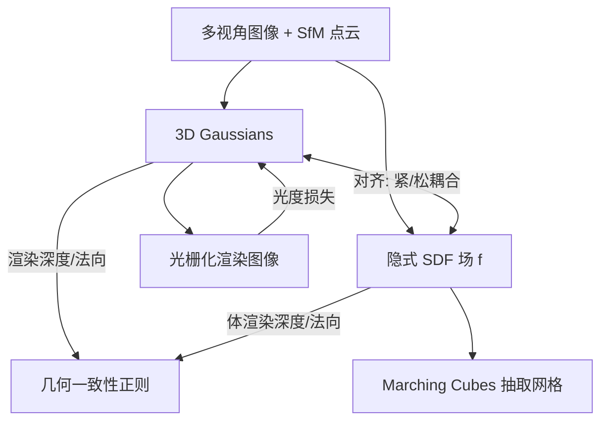

## 一句话总结

在 3D Gaussian Splatting 内部嵌入一个轻量隐式 SDF 场，通过"对齐 + 联合优化"让 SDF 与高斯相互监督，从而在保持 3DGS 高效率与高渲染质量的同时，重建出细节丰富的高精度表面。

## 研究背景

3DGS 以一组高斯点表示场景，凭借光栅化管线实现实时、高质量的新视角合成。但它天然不擅长表面重建：

- 高斯点是非结构化的点云表示（仅高斯中心），难以通过后处理（如 Poisson 重建）稳定地抽取表面；
- 高斯的椭球形状在缺乏约束时不会自然贴合表面；
- 优化过程只关注拟合训练视角，未考虑点之间由底层几何（表面）施加的约束，导致点云噪声大、不完整。

已有工作（如 SuGaR、2DGS、Gaussian surfels）通过正则化或改用 2D 面元来改善几何，再借助深度融合或 Poisson 重建得到表面。这类做法有两个共同问题：一是往往牺牲细节、产生过度平滑的表面；二是本质上把"表面重建"与"高斯学习"解耦，表面无法反过来约束高斯学习，且带来对齐问题和误差累积。本文希望让二者端到端地统一优化、相互增强。

## 方法

### 整体框架

给定带位姿的多视角图像与 SfM 点云，3DGSR 在 3D 高斯中集成一个隐式 SDF 场 $$f: \mathbb{R}^3 \rightarrow \mathbb{R}^1$$，将每个 3D 位置映射到其到表面的有符号距离，表面即其零水平集：

$$S = \{x \in \mathbb{R}^3 \mid f(x) = 0\}.$$

SDF 用多分辨率哈希网格加单层 MLP 实现。整个方法围绕两个关键设计：表面与高斯的对齐（联合优化），以及体渲染正则化（为 SDF 提供稠密监督）。

### 关键设计 1：紧耦合策略（Tight Coupling）

直觉是靠近表面的高斯应具有高不透明度。作者引入一个可微的"SDF 到不透明度"变换函数，用 SDF 值直接控制高斯不透明度：

$$\Phi_\beta(f(x)) = \frac{e^{-\beta \cdot f(x)}}{(1 + e^{-\beta \cdot f(x)})^2},$$

其中 $$\beta$$ 是可学习参数。通过这个可微函数，光度损失（L1 与 D-SSIM 组合）在优化高斯时会反向更新 SDF，促使对渲染贡献大的位置 $$f(x)$$ 趋近 0，从而靠近表面。但作者发现紧耦合在高频纹理区域会干扰低频平坦表面，产生噪声重建与伪影（并发工作 GOF 也有类似问题）。

### 关键设计 2：松耦合策略（Loose Coupling，默认）

不直接用 SDF 控制不透明度，而是用 SDF 导出的表面来约束高斯的分布与朝向，把外观建模的自由度留给高斯。包含两项约束：

方向对齐——让高斯最短轴方向 $$n_g$$ 与 SDF 法向 $$\nabla f(x_g)$$ 对齐：

$$L_a = \|1 - n_g \nabla f(x_g)\|.$$

距离正则——把高斯拉近表面，用 SDF 梯度估计其最近表面点后再用 L1 拉近：

$$x_{nearest} = x_g + f(x_g) \cdot \nabla f(x_g).$$

松耦合既能得到细节准确的表面，又能减少远离表面的冗余高斯（实验中可减少约 20% 高斯而不损害甚至提升渲染质量）。

### 关键设计 3：体渲染正则化

耦合策略只在高斯占据的位置（主要在表面附近）提供监督，对连续 SDF 而言过于稀疏，会在无高斯覆盖的自由空间产生漂浮伪影。为此引入体渲染：沿光线采样、由 SDF 直接导出深度与法向，并与 3DGS 得到的深度/法向做一致性对齐。累积公式为：

$$\tilde{D}(r) = \sum_{i=1}^{M} T_i^r \alpha_i t_i^r, \quad \tilde{N}(r) = \sum_{i=1}^{M} T_i^r \alpha_i \tilde{n}_i^r,$$

其中 $$\tilde{n}$$ 由 SDF 梯度算得，透射率与 alpha 依 NeuS 式的 SDF 转换（$$\phi_s$$ 为 Sigmoid）计算。深度与法向监督损失为：

$$L_{vd} = \sum_{r \in R} \|D(r) - \tilde{D}(r)\|_2,$$

$$L_{vn} = \sum_{r \in R} \|N(r) - \tilde{N}(r)\|_1 + \|1 - N(r)\tilde{N}(r)\|_1.$$

注意这里只用少量光线（每步采样 $$N=1024$$ 条）、单层 MLP，从 3DGS 提供的几何线索直接学习 SDF，避免了额外颜色分支和昂贵体渲染损失，训练速度比传统神经隐式方法快 20 倍以上。

### 训练目标

总损失整合光度损失、体渲染深度/法向损失、方向对齐损失与 Eikonal 正则：

$$L = L_c + \alpha_1 L_{vd} + \alpha_2 L_{vn} + \alpha_3 L_a + \alpha_4 L_{eik},$$

$$L_{eik} = \mathbb{E}_x[(\|\nabla f\| - 1)^2].$$

实验取 $$\alpha_1=1.0, \alpha_2=0.1, \alpha_3=0.0001, \alpha_4=0.1$$；用 CUDA 与 tinycudann 实现，训练 30000 次迭代，单张 RTX 3090。对真实场景还用 SfM 稀疏点的投影深度 $$D_{sfm}$$ 做 L2 一致性监督。

## 实验结果

在 NeRF 合成数据集上同时评估重建精度（Chamfer-L1）与新视角合成（PSNR），松耦合版本在两项上均取得最佳：

| 方法 | Avg PSNR ↑ | Avg C-L1 ↓ |
|------|-----------|-----------|
| NeuS | 30.20 | 2.33 |
| BakedSDF | 29.66 | 1.66 |
| NeRF2Mesh | 30.88 | 1.55 |
| RelightableGaussian | — | 2.31 |
| 2DGS | 33.07 | — |
| 3D-GS | 33.32 | — |
| Ours (Tight Coupling) | 33.23 | 1.50 |
| Ours (Loose Coupling) | **33.86** | **1.37** |

在 DTU 真实数据集上，平均 Chamfer-L1 为 0.70，优于 2DGS（0.80）并与并发工作 GOF（0.74）持平或更优；相比 Neuralangelo（>30 小时训练）等神经隐式方法，本方法训练仅约 30 分钟、渲染达 175 FPS，速度与渲染质量均有明显优势。消融显示：去掉体渲染深度/法向约束后 Chamfer-L1 从 1.37 恶化到 3.63，说明稠密几何监督对连续 SDF 学习至关重要；松耦合整体优于紧耦合；稀疏深度监督 $$D_{sfm}$$ 对本方法有益（0.81→0.70），却会损害依赖深度融合的 2DGS（0.80→0.85）。

## 亮点与局限

亮点：

- 将隐式 SDF"嵌入"到 3DGS 内部，实现表面与外观的端到端统一优化，摆脱了深度融合/Poisson 等后处理及其误差累积；
- 紧/松两种耦合策略的对比分析清晰，揭示了"几何低频、外观高频"的层次差异，松耦合在保真与灵活性间取得良好平衡；
- 用 3DGS 的几何线索（深度、法向）而非颜色来监督 SDF，训练比传统神经隐式方法快 20 倍以上，同时保留 175 FPS 的实时渲染。

局限：

- 依赖哈希网格与隐式 SDF，处理无界大场景能力有限；
- 在位姿估计噪声较大的真实数据上效果会变差；
- 难以重建透明物体。

## 延伸思考

这篇工作的核心思路是"让显式表示与隐式表示互为监督"：显式高斯擅长高效渲染和捕捉外观细节，隐式 SDF 擅长表达连续、光滑的几何，二者对齐后各取所长。值得思考的是耦合的"松紧度"——直接绑定不透明度（紧耦合）会把外观的高频噪声传导到几何，而只约束分布与朝向（松耦合）则解耦了两种频率信号，这对其他"表示融合"任务（如动态场景、可重光照）可能有借鉴意义。此外，用几何线索而非颜色监督隐式场以换取训练加速，是一个在质量与效率间务实取舍的范例；而对无界场景与噪声位姿的局限，也指向了后续把这套对齐框架扩展到更鲁棒的真实采集设置的方向。
