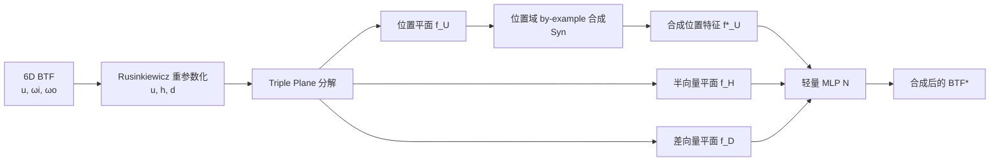

## 一句话总结

把 6D 的双向纹理函数（BTF）分解成三张彼此独立的 2D 神经特征平面，只在位置平面上做 by-example 纹理合成，再用轻量 MLP 重建反射率，从而实现无需预生成、可即时查询的无限大、非重复 BTF 动态合成。

## 研究背景

测量得到的 BTF 能够忠实还原真实材质外观，但它本质是 2D 空间加 4D 角度的 6D 函数，采集与存储代价高昂，通常只能测得很小的一块样本（如 $$400 \times 400$$）。直接把小样本平铺到大表面上会产生明显的重复图案。

过去数十年的 BTF 合成方法主要分两类：基于拼接（quilting）的方法和基于 Wang Tiling 的方法。它们虽然能得到结构较好的结果，但普遍依赖 PCA、球谐（SH）等高压缩表示，会显著损失角度域的高频信息；更关键的是，这些方法都不是"动态"的——必须先把大 BTF 完整合成并存储下来才能用于渲染。

作者指出，"动态"这一性质在过去被长期忽视。设想在渲染时每个着色线程都可能查询任意坐标（哪怕是极大的坐标），若采用拼接或逐像素生长的方式，就必须从小样本一路计算到目标位置，因此不得不预先生成并存储整张 BTF。对高维的 BTF 而言，这种预生成即使配合重度压缩也不现实。本文要解决的正是：只给一小块测量 BTF，如何动态合成无限大且不重复的 BTF。

## 方法

整体思路是把"6D BTF 合成"这一难题降维成"2D 纹理合成"这一已有成熟工具的问题。核心分三步：忠实的维度分解、位置域上的 by-example 合成、以及用 MLP 重建 6D BTF。

**Triple Plane 维度分解。** 将 6D BTF 表示成三张独立 2D 函数的"外积"：

$$
\text{BTF}(\mathbf{u}, \mathbf{h}, \mathbf{d}) = f^{(U)}(\mathbf{u}) \circ f^{(H)}(\mathbf{h}) \circ f^{(D)}(\mathbf{d})
$$

由于纯数学解难以求得，作者用数据驱动方式，以一个神经算子 $$\mathcal{N}(\cdot)$$ 来实现这个"外积"：

$$
\text{BTF}(\mathbf{u}, \mathbf{h}, \mathbf{d}) = \mathcal{N}\left(f^{(U)}(\mathbf{u}),\, f^{(H)}(\mathbf{h}),\, f^{(D)}(\mathbf{d})\right)
$$

这一设计在 Biplane 基础上改进：Biplane 只分出位置平面和半向量平面，且把差向量作为条件输入，方向信息仍隐式混在位置特征里；本文则彻底把位置维度和方向维度分开，三张平面各自独立。查询时先把 $$(\mathbf{u}, \boldsymbol{\omega}_i, \boldsymbol{\omega}_o)$$ 转到 Rusinkiewicz 坐标 $$(\mathbf{u}, \mathbf{h}, \mathbf{d})$$，再作为纹理坐标从各平面双线性采样。

**位置域上的 by-example 合成。** 关键观察是：分解出的位置特征平面 $$f^{(U)}$$ 呈现出与原始 BTF 高度相似的语义结构，因此可以把它当成一张普通 2D 纹理来合成。给定目标查询位置 $$\mathbf{u}^*$$，合成写成：

$$
f^{*(U)}(\mathbf{u}^*) = \text{Syn}(f^{(U)}, \mathbf{u}^*)
$$

注意 $$\text{Syn}(\cdot)$$ 只依赖样本纹理和目标坐标，不依赖已合成区域的邻域，因此无需"投票"，天然支持动态查询。作者主选保直方图混合（histogram-preserving blending），并发现即使特征平面处于潜空间，保留其直方图仍有收益。该方案对合成方法即插即用，也能接入 Hex-Tiling 或非动态的纹理拼接。

**BTF 重建。** 用一个 4 层、每层 32 隐藏节点的轻量 MLP 重建反射率：

$$
\text{BTF}^*(\mathbf{u}^*, \mathbf{h}, \mathbf{d}) = \mathcal{N}\left(f^{*(U)}(\mathbf{u}^*),\, f^{(H)}(\mathbf{h}),\, f^{(D)}(\mathbf{d})\right)
$$

特征平面与 MLP 用简单的 $$\ell_1$$ 损失联合训练：

$$
\mathcal{L} = \ell_1\!\left(\mathcal{N}\left(f^{(U)}(\mathbf{u}), f^{(H)}(\mathbf{h}), f^{(D)}(\mathbf{d})\right),\, \text{BTF}(\mathbf{u}, \mathbf{h}, \mathbf{d})\right)
$$

训练阶段并不做合成，一个 MLP 加对应特征平面只负责一种特定 BTF。

## 实验结果

在 UBO2014 数据集上验证。下表为与经典 BTF 压缩方法（PCA、SH）在 Leather11 上的对比，误差指标为 FLIP（越低越好），各方法采用相近数量的系数以保证相对公平：

| 方法 | FLIP 误差 ↓ |
| --- | --- |
| SH | 0.25802 |
| PCA | 0.08467 |
| Ours (Triple Plane) | 0.07515 |

结果显示 SH 即便只表示 2D 角度分布也丢失了大部分高频信号，PCA 无法保留锐利高光，而本文方法忠实还原了外观与结构。在与 NeuMIP（重复平铺、不做合成）的对比中，本文 Triple Plane 在 Wood06、Leather08 上的 FLIP 误差也更低（如 Wood06：0.04365 对 NeuMIP 的 0.05951），高光与拉伸纹理更清晰。

性能方面，在 RTX 4090 上以朴素的着色器内矩阵乘法（fp32、无专门优化）完成 $$1920 \times 1080$$（约 207 万次）查询仅需 2.0 ms，成本随查询数线性增长，已达到交互级性能。在 45× UV 缩放的超大尺度下仍能保持外观准确，验证了无限大、非重复合成的能力。

## 亮点与局限

亮点：
- 首个在 BTF 上实现动态 by-example 合成的方案，无需任何预生成即可即时查询任意位置。
- Triple Plane 完全解耦位置与方向维度，相比 Biplane/NeuMIP 高频细节更好。
- 方案通用、即插即用：表示端可换 NeuMIP，合成端可接保直方图混合、Hex-Tiling 甚至非动态拼接。

局限：
- 表示能力有限，对外观复杂的 BTF 会产生略微模糊的结果。
- 动态 by-example 合成难以处理高度结构化的 BTF，因为所用纹理合成方法本身无法保结构；离线拼接虽然视觉更好但需预生成并占用 GB 级存储、且一旦生成不可再改。
- 尚缺乏专门的重要性采样策略。

## 延伸思考

这项工作最巧妙之处在于"降维复用"：不是硬造 6D 合成算法，而是把问题投影到位置域，让成熟的 2D 动态纹理合成方法直接发力。这提示我们，很多高维难题也许可以先寻找一个"语义近似原信号"的低维子空间再借力已有工具。

后续值得关注的方向包括：结合归一化流或直方图设计针对性的重要性采样；探索能在结构化图案上做混合的合成策略（如动态 Wang Tiling）以突破保结构瓶颈；以及通过批量推理、量化、张量核加速把运行时性能进一步压榨。另一个开放问题是——由于不存在 6D BTF 的直接 by-example 合成"真值"，如何科学地评估这类合成质量本身也是值得研究的课题。
