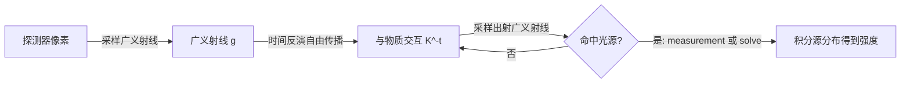

## 一句话总结

本文提出"广义射线"（generalized ray）——经典射线在波动光学下的推广，它同时保持**弱局部性**与**线性性**，从而首次实现了后向（传感器到光源）的波动光学光传输，让路径追踪的各种成熟采样技术可以直接迁移到波动光学渲染，并把复杂场景的渲染性能相比现有方法提升了数个数量级。

## 研究背景

经典射线光学建立在三条基本原则之上：局部性（射线是空间中某一点的"点查询"）、辐射量意义上的线性性（$$I = I_1 + I_2$$）、以及完备性（有限条射线可任意精度地重建任何射线光学现象）。局部性支撑了空间加速结构，线性性支撑了线性渲染方程与重要性采样，这两点是现代路径追踪能够扩展到海量几何的关键。

但射线光学忽略了光的波动效应：金属划痕的彩色辉光、昆虫/蛇鳞的结构色、薄膜干涉、双折射，乃至更长波长下 RADAR 绕射、无线信号覆盖仿真等。这些效应无法只在材质层面（如"衍射 BRDF"）复现，而是整个场景上波动光传输的累积结果。

核心矛盾在于：单点、既局部又线性的光的表示与电磁理论不相容。计算电磁学中的完美局部方法（如 SBR、UTD 射线追踪）不得不放弃线性性，叠加时出现双线性干涉项：

$$I = I_1 + I_2 + \Im_{12}$$

线性性的丧失使得无法构造线性渲染方程、也难以对散射分布做重要性采样。此前的物理光传输（PLT，Steinberg 等）通过牺牲部分局部性、利用光的部分相干性把光束设为互不相干，从而重获线性性——但它只能**前向**传输：因为光束的空间尺度取决于相干性，而相干性依赖光源并沿传播演化，后向追踪时未知，无法定位光束。本文将这一"后向不可采样"的困境称为**采样问题（sampling problem）**，并以解决它为主要动机。

## 方法

### 整体框架

本文的关键洞察在于：不去演化任意的、行为糟糕的光场分布，而是演化**探测态（detection state）**。传感器（视网膜、CMOS 像素、RADAR 天线）都是光电探测器，它们通过吸收光子测量光。作者证明光电探测器实际测量的不是 Wigner 分布函数（WDF），而是 WDF 与一个最小不确定性高斯的卷积——即 **Husimi Q 分布**，它非负、带宽受限、性质优良。

在相空间中，光的基本描述是 WDF：

$$\mathcal{W}(\vec{r},\vec{k}) \triangleq \frac{1}{(2\pi)^3}\int d\vec{r}'\,\psi^\star\!\left(\vec{r}-\tfrac{1}{2}\vec{r}'\right)\psi\!\left(\vec{r}+\tfrac{1}{2}\vec{r}'\right)e^{-i\vec{r}'\cdot\vec{k}}$$

WDF 是双线性且可取负值的，直接用作"广义辐亮度"会在与物质交互时失去局部性（衍射核需对整个场景积分）或失去线性性。

光电探测器的可测态是相干态，其相空间表示为不相关的最小不确定性高斯 $$\hat{g}_\beta$$。测量公式为：

$$I = \int d\vec{r}'\,d\vec{k}'\,\mathcal{W}(\vec{r}',\vec{k}')\,\mathcal{W}_d(\vec{r}',\vec{k}')$$

利用测量公式的对称性——既可看作探测器作用于光，也可看作光作用于探测态——作者提出后向模型：把探测器分布在**时间反演动力学**下向后演化，再与光源分布做重叠积分。前后向给出完全相同的答案，但探测态是简单高斯，远比任意源 WDF 好处理。

### 关键设计一：广义射线

对相空间高斯做逆 WDF 变换，得到广义射线的波函数：

$$\psi_{\beta,\rho}(\vec{r};\vec{r}_0,\vec{k}_0) \triangleq \left(\frac{1}{\pi\beta^2}\right)^{3/4} e^{\,i\vec{k}_0\cdot(\vec{r}-\vec{r}_0)}\,e^{-\frac{1}{2\beta^2}(1-i\rho)|\vec{r}-\vec{r}_0|^2}$$

其中 $$\beta$$ 是初始空间方差、$$\rho\ge 0$$ 与传播距离相关（$$\rho=0$$ 时即探测器处的相干态，是波动光学允许的最紧凑构造）。广义射线本质是一束高斯光束：它有明确定义的波函数（可 Wigner 表示），在自由空间、缓变折射率介质、光滑界面反/折射下与经典射线动力学完全一致，是"经典射线在波动光学下的类比"。

### 关键设计二：弱局部性、线性性与完备性

- **线性性**：广义射线永远携带正强度、互不干涉，采样/渲染方程/测量都是线性运算。
- **弱局部性**：广义射线是尖峰高斯，取半径约 $$\varrho=2.5\beta$$ 即可包含 99.8% 权重，从而把交互核的积分限制在有限空间范围而不损精度。作者用杨氏双缝实验给出物理直觉：只有能在探测元件空间尺度上被无混叠分辨的干涉相位才对可观测干涉有贡献（Shannon 采样关系 $$l_r(k\theta_s)\le 1/2$$），是**对观测者空间尺度的积分诱导了退相干**，使广义射线在任意光照（含完全相干）下都能重获线性性。
- **完备性**：高斯构成过完备基，任意 Husimi Q 分布可用有限个高斯任意精度表示，故该形式化能复现光电探测器可观测的任意波动现象。

渲染方程写成 Fredholm 积分方程形式，作用对象是函数（所有入射广义射线）而非标量：

$$\mathcal{Q}_o(\vec{r}_0) = \int d\vec{k}_0\,d\beta\,d\rho\; \mathcal{K}^{-t}_r\{g_{\beta,\rho}(\vec{r}',\vec{k}';\vec{r}_0,\vec{k}_0)\}$$

### 关键设计三：sample-solve 双向算法与交互式渲染

作者建立了后向形式化与光学相干的联系：扩散度 $$\Omega$$ 与 PLT 的形状矩阵 $$\Theta$$ 满足

$$\Theta = \lambda^2\,\Omega^{-1}$$

据此提出 **sample-solve** 两阶段算法：先用广义射线做后向路径采样（sample），一旦连到光源就用 PLT 做一次前向部分相干求解（solve），后者作为方差缩减手段。

为实现交互式渲染，作者做了一个应用相关的简化假设（与 PLT 相同）：广义射线的空间尺度小于等于场景最小几何细节，从而传播退化为普通射线追踪、交互不必考虑多材质复合。改造经典单向后向路径追踪器只需：(i) 转为光谱化、偏振感知；(ii) 自由传播时按解析公式变换广义射线参数；(iii) 用广义射线重写各 BSDF。还可无缝使用 NEE、俄罗斯轮盘、流形采样（manifold sampling）等高级技巧。衍射交互（如正弦光栅、Harvey-Shack 粗糙面散射）可解析导出并做重要性采样。

## 实验结果

在 NVIDIA GeForce RTX 3090 上，方法可在 1 spp 下交互式渲染复杂波动光学场景。各主场景的分辨率、采样数与交互帧时间：

| 场景 | 分辨率 / 采样数 | 交互帧时间 (1 spp) |
|------|----------------|-------------------|
| 蛇箱 Snake enclosure | 1440p / 64k spp | 116 ms |
| 流形采样 MS playground | 1440p / 16k spp | 180 ms |
| 自行车 Bike | 1440p / 4k spp | 240 ms |
| 光盘 CD | 1080p / 2M spp | 42 ms |

关键性能对比（CD 场景，衍射材质区域）：

- 在渲染器内部模拟"部分相干采样"（复现现有方法的采样问题）对比广义射线采样：达到同等质量所需**采样数减少约 4000 倍**。
- 与 PLT 双向路径追踪器（BDPT，CPU 18 核，56000 采样、约 315 小时）直接对比：衍射区域收敛速度快约 **1000～10000 倍**（含 GPU 加速带来的约 100 倍基线增益）；等采样收敛提升约 1～8 倍，且本文为单向、每样本仅 1～4 个光谱样本，而对方为双向、每样本 64 个均匀光谱样本。
- 双缝数值验证中，本文方法相比显式 Rayleigh-Sommerfeld 衍射积分快约一个数量级（8.9 s vs. 246 s），且与真值的差异可忽略。

## 亮点与局限

亮点：
- 首个同时具备弱局部性、线性性、完备性的波动光学光传输形式化，且是**后向**的——这是前向模型原理上做不到的。
- 广义射线是经典射线的自然波动光学类比，使得几十年积累的路径追踪采样技术（NEE、流形采样等）几乎无改动地迁移到波动光学。
- 从光电探测的第一性原理出发严格推导，几乎不做近似；对任意波长、任意光谱、任意相干态与偏振都成立。
- 工程上把经典后向路径追踪器改造为波动光学渲染器所需改动很小，且天然适配 GPU、支持交互。

局限：
- 交互式实现依赖"广义射线空间尺度小于场景几何细节"的假设，因而**忽略了自由空间衍射（光绕过几何弯曲）与跨材质干涉**；对长波长（如 RADAR，广义射线尺度大得多）该假设不成立。
- 高效的**光束追踪**、以及广义射线与复合交互算子（如穿过狭缝的自由空间衍射）的采样，均留作未来工作。
- 采用近似的 Harvey-Shack 面散射模型只建模平均散射，故辉光、光斑（speckle）等表面瑕疵不会出现（作者强调这是实现选择而非形式化本身的限制）。
- 衍射光栅色散光瓣类似色散焦散，单向路径追踪仍较难采样，需要较多光谱样本与流形采样辅助。

## 延伸思考

- 该形式化的价值不止渲染：它把"可观测干涉的空间范围"显式量化，因而理论上可用于加速 speckle 统计积分、部分相干 speckle 渲染，以及计算生成全息（CGH）的后向波动追踪。
- sample-solve 思想本质是"用廉价而狭窄的后向采样找路径、再用更宽的前向物理量做方差缩减"，这一模式或许可推广到其他"前向易算、后向难采样"的物理仿真问题。
- 对自动驾驶 RADAR、城市无线覆盖等长波长应用，若能补上高效光束追踪与复合交互采样，本文框架有望取代当前依赖 SBR/UTD 的非线性方法——这可能是比可见光渲染更大的落地空间。
- "探测态比源分布更好演化"是一个颇具启发性的视角：把仿真锚定在测量端而非发射端，天然解耦了对未知源相干性的依赖，值得在其他逆问题/可微渲染中借鉴。
