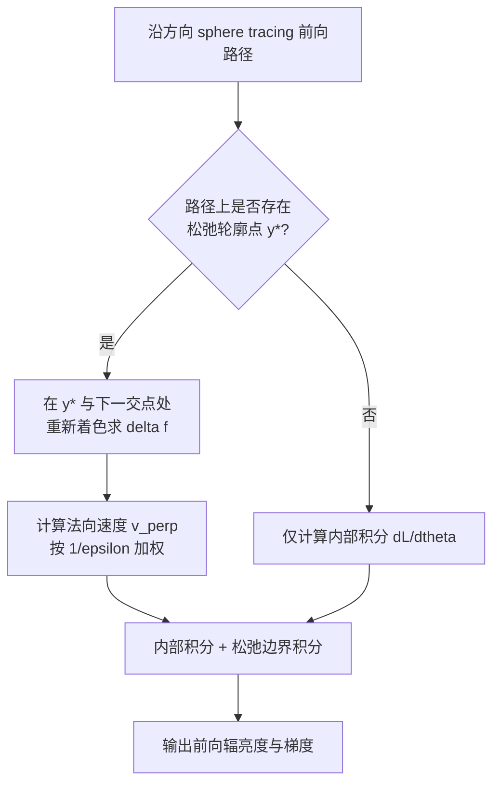

## 一句话总结

针对可微渲染中可见性不连续导致的梯度偏差问题，本文把难以采样的低维轮廓边界"松弛"成一条易采样的薄带，从而用前向渲染的采样直接近似边界积分，得到一个简单、鲁棒、高效且精度有竞争力的 SDF 可微渲染器。

## 研究背景

基于物理的渲染在优化管线中的核心障碍是可见性不连续（如轮廓、自遮挡）：几何参数会移动被积函数的不连续位置，使"积分的导数等于导数的积分"这一自动微分前提失效，直接微分得到的梯度带有严重偏差而无法使用。

现有方法大致分两类：

- **边界采样法**（如 Li et al. 2018、PSDR）显式计算低维边界积分以消除偏差，但通常需要复杂的引导数据结构来采样轮廓。
- **面积采样法**（如重参数化、warped-area sampling）借助重参数化或散度定理把边界转成有限区域，往往以显著增大梯度方差为代价。

本文的立场是：接受一个非零但可控的偏差，换取低方差与架构简洁性，融合两类方法的优点。

## 方法

整体框架：保留 SDF 表面表示用于前向渲染，仅在需要采样不连续时把表面"部分松弛"成一层薄体。核心是把可见性边界 $$B$$ 上的边界积分扩展到一条薄带状的松弛边界 $$A$$ 上，从而复用前向渲染的采样来估计边界积分。

**关键设计 1：松弛可见性条件。** 真实轮廓点 $$x^*$$ 满足 $$\mathrm{SDF}(x^*)=0$$ 且方向导数 $$\mathrm{SDF}'(x^*)=0$$（射线与表面相切）。直接采样这条低维曲线很难。作者比较了两种松弛：松弛 $$\mathrm{SDF}'$$ 条件会得到近乎相切的交点，仍难采样且对曲率敏感；松弛 $$\mathrm{SDF}$$ 条件得到"擦过而不相交"的射线。本文选择后者，定义松弛条件

$$0 < \mathrm{SDF}(y^*) < \varepsilon \quad \text{且} \quad \mathrm{SDF}'(y^*)=0$$

其中 $$\varepsilon$$ 称为 SDF 阈值，$$y^*$$ 称为松弛轮廓点，对应的方向集合构成薄带 $$A$$。实验显示松弛 SDF 条件得到的轮廓采样更均匀。

**关键设计 2：把松弛点视为 $$\lambda$$-等值面的轮廓点。** 对 $$\gamma\in A$$ 的松弛轮廓点 $$y^*$$，可把它看成 $$\lambda$$-等值面（$$\lambda=\mathrm{SDF}(y^*)$$）上的真实轮廓点，从而沿用球面法向速度关系。利用轮廓点在单位球上的法向运动与距离成反比的关系 $$v^\perp(x^*)=\lVert x^*-x\rVert\, v^\perp(\omega)$$，并将轮廓点沿法向延展得到薄带宽度 $$l(\omega)=\varepsilon/r$$，其中 $$r=\lVert x^*-x\rVert$$。

**关键设计 3：松弛边界积分。** 将带宽权重代入后，边界积分被扩展回整个单位球：

$$I_A = \frac{1}{\varepsilon}\int_{S^2} v^\perp(y^*)\,\Delta f(\omega)\,\mathbf{1}_A(\omega)\,d\sigma(\omega)$$

这带来两点收益：一是积分域从低维曲线回到单位球，可直接复用前向渲染样本，无需额外投影、引导或加速结构，前向的重要性采样策略也能惠及 $$\Delta f$$ 的估计；二是所需机器很少，只需判断某方向是否落在松弛边界内，即在沿射线追踪时找 SDF 的极小值点。

**实现要点：** 在 sphere tracing 中若上一步方向导数为负、这一步转正，即为经过局部极小的信号；在所有候选步中取 SDF 最小者作为初值，再用 12 次二分法定位松弛轮廓点。内部积分用自动微分，射线求交的导数在 sphere tracing 后按前人方法解析计算。实际实现使用多重重要性采样（MIS），阴影射线的发光体采样因一侧恒被遮挡而无需在松弛轮廓点重新着色。渲染器基于 Mitsuba3 实现，运行于 CUDA/LLVM 后端。

## 实验结果

在 NeRF Synthetic 数据集的 Chair、Lego、Hotdog、Ficus、Drum 上做端到端逆向渲染（5000 次迭代、优化 50 个视角、每次 5 视角批次、$$512\times512$$、64 spp），与 SDF Convolution、SDF Reparameterization 对比。二维评估含新视角渲染与高/低对比度环境图重光照，三维评估用 Chamfer L1 距离。

| 方法 | 新视角 PSNR↑ | 新视角 LPIPS↓ | 重光照(高) PSNR↑ | 重光照(低) PSNR↑ | Chamfer L1↓ | 每步耗时 |
|---|---|---|---|---|---|---|
| SDF Conv. | 29.583 | 0.0856 | 21.119 | 26.759 | 0.0080 | 10.85s |
| SDF Reparam. | 33.141 | 0.0586 | 26.092 | 29.039 | 0.0073 | 7.08s |
| SDF Reparam. (hqq) | 29.621 | 0.0943 | 22.262 | 30.385 | 0.0122 | 5.00s |
| Ours (trilinear) | 37.550 | 0.0216 | 31.340 | 31.618 | 0.0052 | 2.23s |
| Ours (tricubic) | 37.466 | 0.0234 | 31.744 | 32.189 | 0.0047 | 4.03s |

本文方法在各项指标上普遍达到或超过前人，同时每步耗时最低。作者将优势归因于对轮廓的有效采样，使得能重建 Ficus 的茎、Lego 的履带等细结构，并降低梯度方差得到更平滑的表面。另通过前向导数验证（与有限差分对比 PSNR）、镜面前金属兔的高阶光传输验证、以及仅靠投影阴影重建 Logo 的物理性验证。

敏感性分析表明 $$\varepsilon$$ 存在偏差-方差权衡：$$\varepsilon$$ 越大轮廓越模糊、偏差越大但方差越小；单位立方体内取 $$\varepsilon=10^{-4}$$ 最佳，且在 $$10^{-6}$$ 到 $$10^{-2}$$ 的宽范围内都能重建整体几何（过大产生 floaters，过小收敛慢）。

## 亮点与局限

亮点：

- 思路简洁——把低维轮廓松弛成薄带，直接复用前向样本估计边界积分，无需复杂引导结构或平滑 warp 场。
- 用可控偏差换取低方差与架构简洁，逆向渲染中偏差不影响收敛，且速度与精度均有竞争力。
- 低方差带来鲁棒性：避免了 SDF Convolution 中极端梯度导致的优化步过大、局部崩坏。

局限：

- 方法本质是有偏的（松弛点近似轮廓点），尽管作者论证偏差可控。
- $$\varepsilon$$ 的最优取值依赖物体到相机的距离，大场景中可能需按数量级调参。
- 依赖对任意点到表面距离的高效查询，因此选用 SDF；虽原则上可推广到其他表示，但需满足该查询。

## 延伸思考

论文把"体表示（如辐射场、Gaussian Splatting）松弛整个表面以获得可微性"与"本文只在采样不连续时局部松弛表面"放在同一视角下比较，这提示体渲染与表面渲染之间存在连续谱系，松弛的粒度是一个可设计维度。此外，作者指出松弛边界积分中的 $$1/\varepsilon$$ 相当于对所有松弛轮廓点做了均匀加权，探索更优的加权方案以进一步降低偏差，是一个自然的后续方向；把该框架推广到 SDF 之外、只要能高效做距离查询的表示，也值得尝试。
