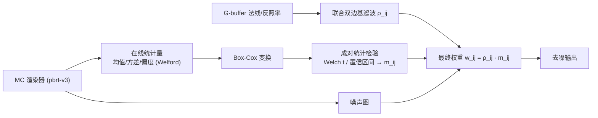

## 一句话总结

不训练神经网络，纯用统计学做蒙特卡洛去噪：把每个像素看作随机变量，用基于在线统计量的成对统计检验（Welch t 检验 + Box-Cox 变换）判断邻近像素能否合并进滤波核，在不做任何预训练的前提下达到与 SOTA 神经去噪相当的质量。

## 研究背景

- 领域现状：蒙特卡洛渲染天生带方差（噪声），去噪是关键后处理。近年 SOTA 几乎被数据驱动的神经网络方法占据（NVIDIA OptiX、Intel OIDN 等），它们把噪声图 + G-buffer（法线/反照率等低噪辅助信息）映射到低误差结果。
- 核心痛点：神经去噪依赖大量"输入-参考"图像对预训练，训练成本高；对**不在 G-buffer 里的高频光照效果**（阴影、焦散）容易误判为噪声而过度模糊；且收敛性缺乏理论保证。经典图像滤波方法虽无需训练，但在特征边缘处易引入偏差（模糊、色溢），难以拿捏偏差-方差权衡。
- 本文 idea：抛开预训练，建立一个**通用统计框架**——把像素当估计量，用成对统计检验决定"哪些邻近像素分布足够接近、可以合并"，从而在噪声与偏差间取近最优权衡，且天然对任意待估量（不止辐射）适用。

## 方法

整体思路：去噪就是把噪声估计量做凸组合 $$\tilde\theta_j=\sum_i w_{ij}\hat\theta_i$$（权重非负且归一）。本文把权重拆成两部分——一个先验基滤波器（联合双边滤波）$$\rho_{ij}$$ 乘一个**成对隶属函数** $$m_{ij}$$，后者由统计检验决定该邻居是否"够格"参与合并。

关键设计：

1. **统计框架与 MSE-检验的理论联系（核心贡献）**。合并后估计量的 MSE 分解为方差 + 偏差平方。作者证明：在**对称权重 + 样本正态分布**假设下，判断两像素能否合并的最优判据（MSE 意义下）等价于经典的 **Welch t 检验**。这把"去噪滤波"和"假设检验"严格挂上钩。

2. **放松正态假设：Box-Cox + 高阶矩**。MC 辐射样本非负、少数路径贡献极大，分布通常**右偏**，正态假设不成立。作者用 **Box-Cox 变换**把样本拉向正态，并用更新的置信区间形式（结合三阶中心矩即偏度做均值校正）扩展到非正态情形，放松了常规置信区间隐含的正态要求。

3. **全程在线统计量**。均值、方差、偏度等中心矩都用 Welford/Meng 的在线算法逐样本更新，**无需存储全部样本**，与渲染同步进行。隶属函数只依赖成对像素的统计量、且要求对称（$$m_{ij}=m_{ji}$$，保证滤波能量守恒）。这让整条流水线在 GPU 上高效并行。

4. **图像空间实现与泛化**。统计量采集嵌进渲染器（pbrt-v3），滤波部分用 CUDA 实现；基滤波取联合双边。因为方法对"任意待估量"通用，作者还把它用到 **俄罗斯轮盘赌路径终止**（去噪每次弹射的入射辐射）和 **多重重要性采样**（去噪各采样策略的"胜率"）——这些量很难为神经方法准备训练数据。

## 实验结果

与 Moon et al. [2013]（置信区间法，"Moon CI"）、NVIDIA OptiX、Intel OIDN、渐进式去噪 ProDen [Firmino et al. 2022] 对比。下表为 Staircase 场景、256 spp 下的 RMSE 与去噪耗时（原文 Fig.1）：

| 方法 | RMSE↓ | 去噪耗时 | 是否需预训练 |
|------|-------|----------|--------------|
| 输入(噪声图) | 0.0251 | — | — |
| Moon CI [2013] | 0.0178 | 35.3 ms | 否 |
| OptiX | 0.0294 | 85.5 ms | 是 |
| OIDN | 0.0281 | 19.5 ms | 是 |
| ProDen [2022] | 0.0197 | 1834.9 ms | 是 |
| **本文** | **0.0168** | 28.0 ms | **否** |

在该场景下本文取得最低 RMSE，耗时约 28 ms（整体约 30 ms @ 1280×720，商用硬件）。值得注意：此场景含 G-buffer 里没有的光照效果，OptiX/OIDN 反而把这些误当噪声、RMSE 甚至高于输入——正是本文强调的神经方法软肋，而统计法能保住这些合法特征。方法对样本数完全无关、只需毫秒级计算，并给出滤波一致性的理论保证。

## 亮点与局限

- 亮点：
  - **无需任何预训练**即可匹敌 SOTA 神经去噪，省掉数据集与训练成本，并有收敛/一致性的理论保证。
  - 把去噪严格建立在假设检验之上（Welch t 检验的 MSE 最优性 + Box-Cox 处理偏态），理论干净。
  - 全在线统计量、成对对称、单遍滤波，GPU 上约 30ms，易集成进任意常规 MC 渲染器。
  - 通用性强：同一框架可去噪 RR、MIS 等任意待估量，这是神经方法难以覆盖的。
- 局限：
  - 为演示收敛性，所有滤波参数随 spp 固定不变；自动调参（像神经去噪那样）或接入 meta-denoiser 可能进一步提质，属未来工作。
  - 依赖联合双边基滤波与 G-buffer 先验，基滤波本身的局限仍在。
  - 实验以经典基线为主，随 spp 变化的完整曲线在正文/补充材料中，单场景表格只反映一个切面。

## 延伸思考

- 这篇是"回归统计第一性原理"的代表作：在神经去噪几乎垄断的当下，用 Welch t 检验 + Box-Cox 这套经典统计工具打平 SOTA，且带理论保证和无训练成本，对追求可解释、可预测收敛的渲染管线很有吸引力。
- "把任意待估量都能去噪"这一点被低估——RR 和 MIS 的去噪示范提示：统计框架可作为渲染器内部诸多随机决策的通用降噪层，而不仅是最后的图像后处理。
- 与 meta-denoiser 结合是自然的下一步：本文单遍、无导数计算的特性使它很适合作为其他去噪器的额外基输入。
