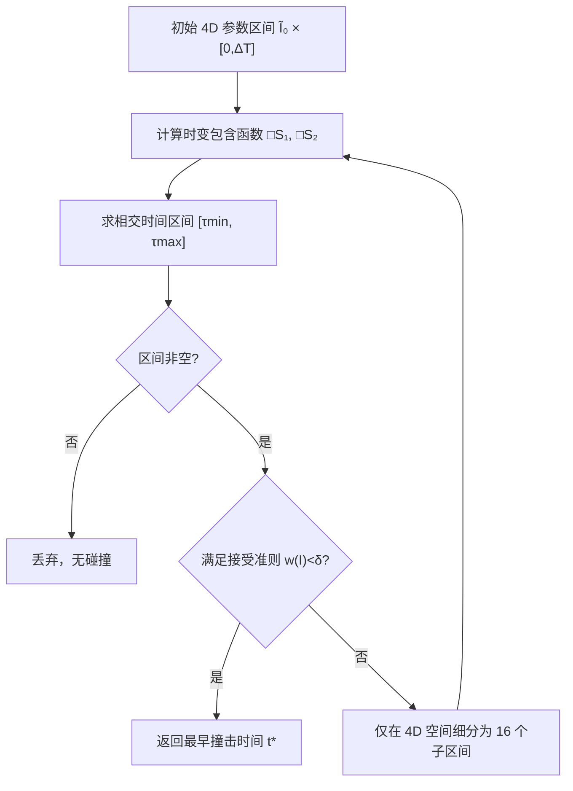

## 一句话总结

把时间维度从 5 维搜索空间中"解析地"剥离出来，用随时间连续变化的包围盒（时变包含函数）直接算出两片参数曲面可能碰撞的时间区间，从而只在 4 维参数空间做细分，相比传统包含法在高精度下加速 36~138 倍。

## 研究背景

参数曲面（如 Bézier、NURBS）之间的连续碰撞检测（CCD）通常被写成一个五变量约束优化问题：在时间区间内寻找最早撞击时刻（ToI）。

$$
\min_{t,u_1,v_1,u_2,v_2} t,\quad \text{s.t. } S_1(u_1,v_1,t)=S_2(u_2,v_2,t),\; 0\le u_1,v_1,u_2,v_2\le 1,\; 0\le t\le \Delta T.
$$

CAD 与图形学中常用两类近似策略，但都存在明显缺陷：

- 线性化（把曲面转成三角网格）与采样（把问题降为点-面检测）：只是原曲面的粗略近似，容易产生大量假阳性（FP）或假阴性（FN），要达到高精度就得极大提高分辨率，效率骤降。
- 直接处理曲面-曲面的方法：包含法（inclusion-based / 区间分析）依赖 5D 区间细分，随精度提高计算量爆炸；平方和规划（SOSP）缺乏对精度的显式控制且更慢（一对双三次三角片需约 2 秒）。

核心矛盾在于：五维搜索空间中对时间维度的细分，是导致包含法在高精度要求下变慢的关键因素。

## 方法

### 整体框架

传统包含法用"整段时间内曲面扫掠体的包围盒"作为包含函数，并在时间和空间上同时做二分细分。本文的关键洞察是：把约束重写为关于时间 $$t$$ 的函数，从约束里"解出"时间区间，而不是通过对 $$t$$ 二分来逼近。

于是问题只需在 4 维参数区间上定义：

$$
\tilde{I}=I_{u_1}\times I_{v_1}\times I_{u_2}\times I_{v_2},\quad \tilde{I}_0=[0,1]^4.
$$

每片曲面的包含函数变成一个随时间连续变化的时变函数 $$\tilde{\square}S(\tilde{I},t)$$。判定两片是否可能碰撞，就是求解它们相交所对应的时间集合：

$$
\tilde{\square}_t=\{\,t\mid \tilde{\square}S_1(\tilde{I},t)\cap \tilde{\square}S_2(\tilde{I},t)\neq\varnothing\,\}.
$$

与传统法相比有两点本质区别：（1）时变包含函数在每个时刻紧贴曲面，而非用整段扫掠体的松散包围盒；（2）细分只发生在空间维度，时间区间由代数计算直接给出。单次迭代计算量更高，但迭代总数大幅下降。

### 关键设计一：时变包含函数

以 $$n\times m$$ 阶 Bézier 片为例，控制点在一个时间步内做匀速直线运动：

$$
S(u,v,t)=\sum_{i=0}^{n}\sum_{j=0}^{m}B_i^n(u)B_j^m(v)\,(p_{ij}+t\dot{p}_{ij}).
$$

利用凸包性质，用控制点在各坐标轴上的投影极值构造 AABB 型时变包含函数：

$$
\tilde{\square}S(\tilde{I},t)=\{\,x\mid \min_{ij}(p_{ij}+t\dot{p}_{ij})\le x\le \max_{ij}(p_{ij}+t\dot{p}_{ij})\,\}.
$$

两个 AABB 在时刻 $$t$$ 相交的充要条件是各轴投影都重叠：

$$
\min_{ij}[(p_{ij}^{(2)}+t\dot{p}_{ij}^{(2)})\cdot e_k]\le \max_{ij}[(p_{ij}^{(1)}+t\dot{p}_{ij}^{(1)})\cdot e_k]
$$

且

$$
\min_{ij}[(p_{ij}^{(1)}+t\dot{p}_{ij}^{(1)})\cdot e_k]\le \max_{ij}[(p_{ij}^{(2)}+t\dot{p}_{ij}^{(2)})\cdot e_k].
$$

关键在于：每个控制点投影 $$(p_{ij}+t\dot{p}_{ij})\cdot e_k$$ 都是关于 $$t$$ 的线性函数。方法也支持更紧的 OBB，只需按分离轴定理换成 15 条轴 $$\{\hat{l}_i^{(1)},\hat{l}_j^{(2)},\hat{l}_i^{(1)}\times\hat{l}_j^{(2)}\}$$，且用参数坐标映射方向直接指定 OBB 轴，避免昂贵的 SVD。

### 关键设计二：相交时间区间的解析求解

对某一分离轴 $$e_k$$，所有控制点投影构成一族关于 $$t$$ 的线性函数。取 min 得到下边界（凹函数），取 max 得到上边界（凸函数）。判断不等式何时成立，等价于判断一片的下边界何时低于另一片的上边界。由于 min 凹、max 凸，"低于"关系只会在一个连通区间内被破坏，越界时刻可用 2D 线段相交检测直接算出。

遍历所有分离轴，得到所有"至少一个不等式不成立"的时间区间集合 $$\Gamma$$，其补集即两包含函数可能相交的时段，用一个紧包裹区间 $$[\tau_{\min},\tau_{\max}]$$ 表示。算法时间复杂度为

$$
O(N_1\log N_1 + N_2\log N_2),
$$

其中 $$N_1,N_2$$ 为两片的控制点数。

### 关键设计三：鲁棒性与适用范围

为对抗浮点误差，作者把候选时间区间外扩一个小量（如 $$10^{-6}$$），并把 max 边界略微抬高、min 边界略微压低。方法适用于任何满足（1）凸包性质、（2）控制点匀速直线运动的几何基元；NURBS 可通过节点插入无损拆成有限个同阶有理 Bézier 片处理（要求权重非负）。EE/VF 测试则是三变量的退化情形。

## 实验结果

在 16 核 4.5GHz AMD Ryzen 9 7950X 单线程环境下，对 1000 组随机用例测试三角片（T.）与四边形片（Q.）在不同精度容差下的平均耗时（OBB 包含函数，单位 ms）：

| 基元 | 阶 | Trad. OBB $$10^{-4}$$ | Trad. OBB $$10^{-6}$$ | Ours OBB $$10^{-4}$$ | Ours OBB $$10^{-6}$$ | SOSP |
|------|----|------|------|------|------|------|
| T. | 1 | 3.45 | 6.85 | 4.26 | 6.68 | 175.02 |
| T. | 2 | 61.20 | 3264.07 | 22.40 | 90.87 | 251.00 |
| T. | 3 | 203.21 | 9974.95 | 35.98 | 131.30 | 8755.73 |
| Q. | 1 | 12.70 | 619.46 | 5.00 | 22.13 | 309.35 |
| Q. | 2 | 133.04 | 6858.91 | 19.30 | 62.12 | 784.52 |
| Q. | 3 | 205.46 | 10962.40 | 27.17 | 79.40 | 56056.00 |

要点：

- 在三阶四边形片、$$\delta=10^{-6}$$ 下，本方法相对传统法加速约 36~138 倍；OBB 全面优于 AABB。
- 分布统计上，本方法 1000 例中有 996 例在 1 秒内完成，最大耗时 2.6 秒；传统法个别用例高达 654 秒；SOSP 所有用例均超过 30 秒。
- 精度上，本方法在相同容差下比传统法给出的约束残差更小、更接近真解；误差随容差至少线性下降。
- EE/VF 大规模基准（Wang et al. 2021）上，本方法在所有用例中零假阴性、假阳性数量低；在手工构造数据集的 EE 测试中显著优于传统法（如 OBB 下平均耗时从 1097.42 µs 降至 3.85 µs），是首个在该数据集上与数值求根法竞争的包含法。
- 仿真管线中集成到双三次 Hermite 片弹性动力学模拟器：茶壶披布、对角固定拖动等场景在 2 ms 步长下稳定运行、无可见穿透；在高相对速度/大时间步下相对传统法优势更明显。

## 亮点与局限

亮点：

- 思路优雅：把时间从细分维度中"解析剥离"，5D 降为 4D，避免了对时间的二分逼近。
- 统一框架：对线性三角片、各阶 Bézier/有理 Bézier 片、EE/VF 退化情形统一处理，无需针对边界、角点、曲面内部碰撞做分类特判（这是 Snyder 等前作的痛点）。
- 保守且收敛：包含相交是碰撞的必要条件，理论上无假阴性；实验中假阴性为零。

局限：

- 对浮点误差的理论安全性尚未证明，目前靠工程手段（区间外扩、边界微调）规避。
- 仅支持控制点匀速直线轨迹，无法处理刚体旋转等曲线轨迹（会涉及非线性 2D 边界求交）。
- 无法处理带负权重的有理 Bézier 片（凸包性质失效）。
- 对单个高阶片内部及相邻片之间的自碰撞仍有困难；当一段参数坐标映射到世界空间中极小区域时（如退化片），极高精度（$$\delta\le 10^{-8}$$）下包围盒收缩不充分，耗时会达数十秒。

## 延伸思考

- 将精确几何计算（EGC）范式或前向误差分析引入，有望把"实验零假阴性"升级为理论安全保证，这也是三角网格 CCD 已走过的路。
- 曲线轨迹的处理可借鉴 additive CCD（ACCD）思路，对轨迹自适应线性化并增量逼近真解，从而把方法推广到刚体旋转等更真实的运动。
- 时变包含函数"从约束解出时间区间"的思想有一定普适性，或可迁移到其他需要在时空联合空间搜索的几何查询问题（如连续可见性、连续距离查询）。
