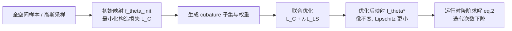

## 一句话总结

本文提出对神经子空间映射施加"二阶 Lipschitz 优化"的通用方法：在不改变子空间所覆盖流形（即仿真质量）的前提下，重塑子空间内目标函数的能量景观，使牛顿/拟牛顿求解器的迭代次数大幅下降，从而将可变形体降阶仿真的求解速度提升最高 6.83 倍。

## 研究背景

高自由度可变形体仿真中，直接在全空间 $$\mathbb{R}^n$$ 用隐式欧拉 + 牛顿/L-BFGS 求解非线性能量非常耗时。降阶方法通过把系统状态约束到低维配置流形 $$\mathcal{M}\subseteq\mathbb{R}^n$$ 上加速，其核心是找到子空间映射 $$\boldsymbol{f}_\theta:\mathbb{R}^r\to\mathbb{R}^n\ (r\ll n)$$。

- 线性映射（模态分析、PCA、线性混合蒙皮）计算高效，但要捕捉复杂非线性变形往往需要较大的子空间维度。
- 神经非线性子空间能用更紧凑的维度表达丰富变形，但存在一个被忽视的缺陷：如果映射选取不当，子空间内目标函数的 Hessian 无法很好刻画局部信息，导致牛顿类迭代求解器收敛缓慢。

已有工作专注于"找到简洁子空间"与"高效映射"，但几乎没有研究子空间内**目标函数景观**本身对收敛速度的影响。本文正是聚焦于此。

## 方法

整体框架：先用现有方法（监督设定用自编码器重构，无监督设定用能量优先构造）训练出初始映射 $$\boldsymbol{f}_{\theta_{\text{init}}}$$ 确定流形的像；然后在保持该像不变的约束下，追加一个自监督的 Lipschitz 损失，联合优化网络参数，使目标 Hessian 的 Lipschitz 常数变小，从而改善能量景观、加速收敛。运行时不需要任何额外网络结构或新计算流程。

关键设计一：收敛速度与二阶 Lipschitz 常数挂钩。降阶问题写作

$$
\boldsymbol{z}^{k+1}=\arg\min_{\boldsymbol{z}} E(\boldsymbol{z})=\arg\min_{\boldsymbol{z}}\left(\frac{1}{2\Delta t^2}\lVert \boldsymbol{f}(\boldsymbol{z})-\boldsymbol{q}^{k+1}\rVert_{\boldsymbol{M}}^2+P(\boldsymbol{f}(\boldsymbol{z}))\right)
$$

牛顿法二次收敛率满足

$$
\lVert \boldsymbol{z}^{k+1}-\boldsymbol{z}^*\rVert\le \operatorname{Lip}[\nabla_{\boldsymbol{z}}^2 E]\,\lVert \nabla_{\boldsymbol{z}}^2 E(\boldsymbol{z}^*)^{-1}\rVert\,\lVert \boldsymbol{z}^{k}-\boldsymbol{z}^*\rVert^2
$$

即达到给定误差所需迭代次数随 Hessian 的 Lipschitz 常数 $$\operatorname{Lip}[\nabla_{\boldsymbol{z}}^2 E]$$ 缩放。核心观察是：在保持映射像 $$\operatorname{Im}(\boldsymbol{f}_\theta)$$ 不变的前提下，可以通过改变流形的坐标参数化（换一个参数 $$\theta^*$$）来减小该 Lipschitz 常数。

关键设计二：可优化的 Lipschitz 损失。精确计算式 (6) 的 Lipschitz 常数需遍历所有点对，不可行；将 max 软化为 $$p$$-范数并取 $$p=2$$，得到梯度空间稠密、可小批量估计的损失：

$$
\mathcal{L}_{LS}=\mathbb{E}_{\boldsymbol{z}_1,\boldsymbol{z}_2\overset{iid}{\sim}\Pi_\theta(\boldsymbol{z})}\left(\frac{\lVert \nabla_{\boldsymbol{z}}^2 E(\boldsymbol{z}_1)-\nabla_{\boldsymbol{z}}^2 E(\boldsymbol{z}_2)\rVert^2}{\lVert \boldsymbol{z}_1-\boldsymbol{z}_2\rVert^2}\right)
$$

关键设计三：保像联合训练。为保持优化后映射的像与初始像相近（即不损失仿真质量），把构造损失 $$\mathcal{L}_C$$ 一并保留在目标中：

$$
\min_\theta\left[\mathcal{L}_C(\theta)+\lambda_{LS}\,\mathcal{L}_{LS}(\boldsymbol{f}_\theta)\right]
$$

其中 $$\lambda_{LS}$$ 权衡仿真质量与收敛速度。由于惯性项采样会引入很大方差且非线性主要来自弹性项，Lipschitz 优化只作用在弹性势能 $$P$$ 上。

关键设计四：cubature 近似降本。计算 Hessian $$\nabla_{\boldsymbol{z}}^2 P$$ 需要两遍额外反向传播，显存开销从 $$\boldsymbol{O}(B(r+N+n))$$ 暴涨到 $$\boldsymbol{O}(2rB(r+N+n+pE))$$，在高分辨率网格上很快触及 24GB 上限。借用 cubature 方法，用元素子集 $$\mathcal{S}$$（取 $$S\sim r\ll E$$）近似势能 $$\tilde{P}=\sum_{e\in\mathcal{S}}w_e P_e$$ 并以 $$\nabla_{\boldsymbol{z}}^2\tilde{P}$$ 估计 Hessian，把 Lipschitz 损失的存储代价降到约 $$\boldsymbol{O}(Bpr S)$$，同时加速训练。

## 实验结果

实现基于 JAX，Hessian 用自动微分计算，求解器用带线搜索的 L-BFGS，全部在 RTX 3090 上完成。测试涵盖两个无监督设定（bistable bar、cloth）与四个监督设定（Twist Bar、Dinosaur、Elephant、Bunny），对照组为仅最小化 $$\mathcal{L}_C$$ 的 "Vanilla" 神经子空间。主结果如下（时间越小越快，括号内为相对倍率）：

| 示例 | 设定 | $$n$$ | $$r$$ | 本文步时(ms) | Vanilla步时(ms) | 全空间步时(ms) | 相对Vanilla加速 |
|---|---|---|---|---|---|---|---|
| Bistable | 无监督/动态 | 1.6K | 8 | 2.1 | 3.9 | 82.5 | 1.87× |
| Cloth | 无监督/动态 | 7K | 8 | 16.3 | 23.1 | 73.1 | 1.42× |
| Twist Bar | 监督/准静态 | 4.7K | 10 | 4.4 | 12.3 | 115.6 | 2.78× |
| Dinosaur | 监督/动态 | 23K | 40 | 9.1 | 62.6 | 1182.4 | 6.83× |
| Elephant | 监督/动态 | 38K | 65 | 14.1 | 38.9 | 464.2 | 2.76× |
| Bunny | 监督/动态 | 44K | 40 | 4.5 | 21.0 | 687.2 | 4.72× |

同时子空间 Hessian 的 Lipschitz 常数 $$\operatorname{Lip}[\nabla_{\boldsymbol{z}}^2 P]$$ 相较 Vanilla 大幅下降（如 Dinosaur 从 215.8 降到 0.3）。投影误差实验表明本文映射与 Vanilla 映射的像高度重合（误差集中在约 1‰，即 1mm），说明加速的同时仿真质量与传统神经方法相当。cubature 数量实验显示约 400 个 cubature 即可在估计精度（Lipschitz 损失估计误差约 20%）与生成/训练耗时间取得平衡。

## 亮点与局限

亮点：
- 提出了对降阶仿真而言全新的视角——不追求更小子空间，而是优化子空间内**目标函数景观**，将收敛速度与二阶 Lipschitz 常数直接联系起来。
- 方法通用，可作为"插件"叠加在已有监督/无监督神经子空间构造之上；运行时零额外开销，加速最高达 6.83×，且能处理大扭转、弯曲、旋转变形与碰撞。
- 用 cubature 近似解决了二阶 Lipschitz 能量训练的显存与时间瓶颈。

局限：
- Lipschitz 优化只作用于弹性势能项，惯性项中同样含非线性映射，可能拖慢动力学仿真的收敛（作者指出惯性项为二次形式，可通过约束网络输入-输出 Jacobian 的 Lipschitz 常数改进，留作未来工作）。
- 即便有 cubature 加速，训练时间仍比传统方法增加约 5 倍。
- 无监督设定加速不如监督设定明显，因其子空间维度很小、可优化空间有限；提高维度时又难以找到稳定训练的超参数。

## 延伸思考

- 该工作把"数值优化收敛理论（Hessian Lipschitz 与二次收敛率）"引入到神经子空间构造中，提示我们：神经降阶模型的价值不仅在于表达能力，还在于其诱导出的**优化问题好不好解**。这一思路可能推广到其他基于隐式求解的神经物理模型。
- 保像联合训练（保留 $$\mathcal{L}_C$$）本质上是在同一流形的不同参数化之间做选择，与微分几何中"度量的坐标表示"呼应；是否存在解析或半解析方式直接构造低 Lipschitz 参数化，或许能省去昂贵的额外训练。
- 对惯性项施加一阶（Jacobian）Lipschitz 约束以进一步加速动力学仿真，是一个自然且值得验证的后续方向。
