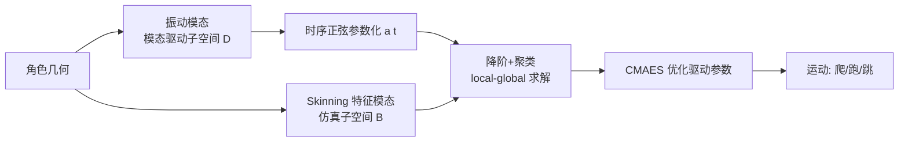

## 一句话总结

利用角色几何自身的自然振动模态构造一个"无需数据"的时空驱动子空间，再耦合一个降阶软体仿真，从而为任意可变形几何的软体角色高效生成爬行、奔跑、跳跃等运动。

## 研究背景

传统角色动画几乎都建立在一个狭窄的假设上：角色具有刚性铰接骨架，且为双足或四足形态。这套假设简化了物理运动（尤其是 locomotion）的设计，但也把大量任意可变形几何的角色排除在外。例如章鱼的触手无法用刚性分段准确建模，会产生生硬的、分段刚体式的形变。

为任意软体角色生成运动控制器面临三个困难：

- 相比双足/四足角色，任意几何形态几乎没有可用的运动数据，缺乏数据会导致抖动、不自然的运动。
- 可变形角色依赖复杂的肌肉—骨骼组织协同工作，为每个角色手工设计这套肌肉结构既繁琐又不直观。
- 高分辨率可变形角色的仿真代价高昂，复杂度随几何分辨率增长。

本文提出一个简单、可扩展的流水线，仅依赖角色几何本身来定义驱动方式，从而绕开对运动数据和手工肌肉设计的依赖，并通过降阶仿真解耦网格分辨率与计算开销。

## 方法

整体框架把问题写成一个控制器优化：求解随时间变化的驱动信号 $$\boldsymbol{d}(t)$$，使任务目标 $$J(\boldsymbol{x}(t))$$ 最小，同时约束每一时刻的顶点位置 $$\boldsymbol{x}\vert _t$$ 是系统总能量的极小值：

$$\min_{\boldsymbol{d}(t)} J(\boldsymbol{x}(t)), \quad \text{s.t.}\ \boldsymbol{x}\vert _t = \arg\min_{\boldsymbol{x}} E(\boldsymbol{x}, \boldsymbol{d}\vert _t).$$

其中总能量分为被动项与主动（驱动）项：

$$E(\boldsymbol{x}, \boldsymbol{d}) = E_p(\boldsymbol{x}) + E_a(\boldsymbol{x}, \boldsymbol{d}).$$

被动项 $$E_p$$ 描述惯性、外力与弹性力；主动项 $$E_a$$ 鼓励弹性体去贴合驱动信号 $$\boldsymbol{d}$$ 所指定的目标形状。该问题在高分辨率角色上因高非线性 + 高维度而极难求解，本文用两个互相独立的子空间来降维。

关键设计一：模态驱动子空间。在缺乏运动数据时，本文以"能量效率"和"周期性"作为先验。驱动子空间从弹性能量 Hessian 的广义特征值问题的振动模态出发：

$$\boldsymbol{H}\boldsymbol{D} = \boldsymbol{M}\boldsymbol{D}\boldsymbol{\Lambda}.$$

特征向量 $$\boldsymbol{D}$$ 构成 $$m$$ 维空间驱动模态基。目标形状 $$\boldsymbol{d}$$ 用一个低维随时间变化的驱动向量 $$\boldsymbol{a}(t)$$ 紧凑表示：

$$\boldsymbol{d} = \bar{\boldsymbol{D}}\,\bar{\boldsymbol{a}}(t).$$

再对时间维施加周期性，用 $$k$$ 个正弦之和参数化每个驱动模态：

$$\boldsymbol{a}_i(t) = \sum_{j}^{k} \boldsymbol{A}_{ij}\sin\!\left(2\pi\left(\frac{t}{\boldsymbol{T}_{ij}}\right) + \boldsymbol{\theta}_{ij}\right).$$

其中振幅 $$\boldsymbol{A}$$、周期 $$\boldsymbol{T}$$、相位 $$\boldsymbol{\theta}$$ 既可由优化学习，也可由用户设定。

关键设计二：塑性式驱动能量 + 旋转过滤。驱动能量鼓励仿真形状 $$\boldsymbol{x}$$ 去贴合目标形状 $$\boldsymbol{d}$$，并对每个元素引入局部最佳拟合旋转 $$\boldsymbol{\Omega}_e \in SO(3)$$：

$$E_a(\boldsymbol{x}, \boldsymbol{d}) = \sum_{e}^{\vert \mathcal{T}\vert } \min_{\boldsymbol{\Omega}_e} \gamma_e V_e \left\| \boldsymbol{F}_e(\boldsymbol{x}) - \boldsymbol{\Omega}_e \boldsymbol{Y}_e(\boldsymbol{d}) \right\|_F^2.$$

这个旋转过滤保证驱动信号与形状朝向无关，并且守恒角动量——角色无法凭空产生外部力矩，从而避免了基于力的驱动（如 Liang et al.）导致的超自然旋转运动。

关键设计三：聚类实现网格无关性。直接评估驱动能量需要对每个四面体计算最佳拟合旋转，代价随网格规模增长。本文让多个元素共享同一旋转矩阵 $$\boldsymbol{\Omega}_{c(e)}$$，并证明最优聚类旋转可由协方差矩阵的极分解得到：

$$\boldsymbol{\Omega}_c = \mathrm{polar}\!\left(\sum_{e}^{\vert \mathcal{T}(c)\vert } \gamma_e V_e \boldsymbol{F}_e \boldsymbol{Y}_e^T\right).$$

进一步注意到该求和是关于降维量 $$\boldsymbol{z}$$ 与 $$\bar{\boldsymbol{a}}$$ 的双线性形式，通过预计算张量 $$\mathcal{H}$$ 就能在运行时仅以聚类数、降维位置维度和驱动维度的复杂度评估：

$$\boldsymbol{H}_c = \sum_{u}^{r}\sum_{v}^{m+1} \mathcal{H}_{cuv}\, z_u\, \bar{a}_v.$$

聚类数越少，旋转不变性越全局化，仿真对驱动信号响应越快；聚类数越多则越局部、响应越慢。仿真侧位置用 Skinning 特征模态子空间 $$\boldsymbol{x} = \boldsymbol{B}\boldsymbol{z}$$ 降维，最终用 local-global 求解器（局部步解旋转、全局步解 $$\boldsymbol{z}$$，系统矩阵恒定可一次分解复用）求解，接触力以投影方式处理并仅在网格顶点子集上做碰撞检测。整个控制优化用现成的无导数遗传算法 CMAES 迭代采样驱动参数。

## 实验结果

以简单的运动目标（沿目标方向位移 $$J_{disp}$$ 乘以前向对齐 $$J_{align}$$）优化开环控制器，在多种高分辨率角色上生成运动。下表为部分角色的优化统计（均为 200 次 CMAES 迭代、种群大小 16、单个驱动聚类）：

| 网格 | 顶点数 | 四面体数 | m | k | r | 仿真步数 | 优化时间(s) |
|------|--------|----------|---|---|---|----------|-------------|
| Couch | 13,920 | 64,154 | 10 | 2 | 5 | 300 | 9.84e2 |
| Creepy Tree | 42,015 | 200,487 | 6 | 2 | 5 | 300 | 3.3e3 |
| Bat | 9,266 | 34,720 | 3 | 2 | 5 | 300 | 9.00e2 |
| Bearded Dragon | 45,041 | 180,406 | 6 | 2 | 7 | 200 | 1.27e3 |
| Octopus | 13,893 | 48,514 | 16 | 2 | 6 | 300 | 3.59e3 |
| Treefrog | 13,771 | 54,154 | 5 | 3 | 5 | 200 | 1.28e3 |

其中最慢的章鱼也只需不到一小时。作者用最新全空间仿真器在更小的 gecko 网格上做同参数估算，预计至少需 17 小时，即本文方法相对全空间仿真至少快约 17 倍。在 Arc de Triomphe 网格上，粗网格（约 2,103 顶点）与细 10 倍网格（约 22,892 顶点）的优化时间几乎相同（1093.6s vs 1130.4s，仅约 1.03 倍差异），且运动风格相似，验证了对网格分辨率的独立性。与基于粗包围笼的驱动（Coros et al.）相比，本文用仅 3 个驱动自由度就让蝙蝠做出扇动翅膀这类语义直观的运动，而低分辨率笼会导致过度扭曲、高分辨率笼会导致小碎步拖曳。

## 亮点与局限

亮点：

- 无需运动数据、无需手工设计肌肉/骨架，仅凭几何的振动模态即可驱动任意可变形角色。
- 驱动与仿真两套子空间解耦，使整个控制优化在降维空间中完成，与网格分辨率无关，可在数分钟到一小时内处理高分辨率角色。
- 塑性式驱动能量守恒角动量，避免了基于力的驱动产生的虚假旋转。
- 提供直观的运动风格控制：选择不同振动模态可得到同步/异步步态，指定时序周期可得到快/慢不同节奏，还能局部绑定模态（如章鱼每条触手独立）。

局限：

- 生成的运动"几何上合理"但不一定符合真实生物解剖，驱动结构本质上是一种虚构的虚拟肌肉。
- local-global 求解器对极硬材料收敛慢，若要模拟钢铁、骨骼等高刚度角色需换用其他降阶求解器，代价是放弃恒定系统分解带来的加速。
- 仅验证了开环控制器，非线性优化对驱动参数存在局部极小（如蝙蝠查询 3 个模态反而收敛到比 2 个更差的解）。

## 延伸思考

本文最有价值的观念在于：当缺乏运动数据时，几何自身的物理结构（弹性能量的振动模态）本身就是一个强先验，把"能量效率 + 周期性"编码进驱动子空间，就能替代数据驱动的运动先验。这与用 PCA/自编码器从运动捕捉数据构造运动流形的思路形成互补——一个来自数据，一个来自物理。

作者指出的未来方向也颇具想象空间：把预期接触点与接触力信息加入驱动子空间可能得到更强的先验；而将这套降阶框架与深度强化学习闭环控制器结合，有望让软体角色在动画领域取代刚性铰接角色成为默认选择。这也提示一个更一般的问题：模态子空间是否能作为通用的低维动作表示，被注入到现代基于学习的控制架构中，以缓解高维软体控制的样本效率难题。
