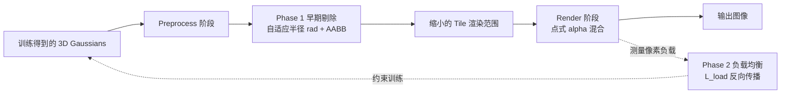

## 一句话总结

AdR-Gaussian 通过在预处理阶段用自适应半径与轴对齐包围盒提前剔除低泼溅不透明度的 Gaussian-Tile 对，并配合像素线程负载均衡，在保持甚至提升渲染质量的前提下将 3D Gaussian Splatting 的渲染速度平均提升到 310%。

## 研究背景

3D Gaussian Splatting（3DGS）用一组 3D 高斯椭球显式表示场景，实现了复杂场景的高质量实时渲染，但其光栅化流水线仍存在两类瓶颈，主要集中在像素并行的 Render 阶段：

- **串行剔除的冗余开销**：泼溅不透明度极低的 Gaussian-Pixel 对是在 Render 阶段被逐个串行剔除的，而这部分剔除本可提前并行完成，串行方式给基于高斯序列的 alpha 混合带来显著性能损失。
- **像素线程负载不均**：Render 阶段并行计算每个像素颜色，但每个像素需要串行渲染的高斯数量差异很大，导致线程等待时间长、渲染效率低。

已有的加速方法（LightGaussian、C3DGS、EAGLES、GES 等）主要靠减少高斯总数来提速，往往牺牲渲染质量，且没有针对光栅化流水线本身做优化。作者据此提出 AdR-Gaussian，直接优化光栅化流水线，把串行剔除搬到更早的并行阶段，并均衡像素负载。

## 方法

整体框架分为两个阶段：**Phase 1 早期剔除**（自适应半径 + 轴对齐包围盒），把原本在 Render 阶段串行进行的剔除提前到 Gaussian 并行的 Preprocess 阶段；**Phase 2 负载均衡**，在训练阶段通过损失函数缩小像素间待渲染高斯数量的方差。

### 关键设计一：基于自适应半径的早期剔除

3DGS 中每个 Gaussian-Pixel 对的泼溅不透明度为

$$\alpha = \sigma\, e^{-\frac{1}{2} \mathbf{x}^{T} \Sigma'^{-1} \mathbf{x}}$$

其中 $$\sigma$$ 为不透明度，$$\mathbf{x}$$ 为高斯中心到像素的 2D 距离，$$\Sigma'$$ 为投影协方差。原始方法基于 99% 置信区间（$$3\sigma$$）确定渲染范围。作者注意到 3DGS 设有最小泼溅不透明度常数 $$\alpha_{low}$$（取 $$\frac{1}{255}$$），满足 $$\alpha_i \ge \alpha_{low}$$。代入上式得到一个椭圆约束：

$$\mathbf{x}^{T} \Sigma'^{-1} \mathbf{x} \le 2 \ln\!\left(\frac{\sigma_i}{\alpha_{low}}\right)$$

把该椭圆的外接圆半径定义为自适应半径，推导得

$$r_{ad} = \sqrt{2 \lambda'_{max} \ln\!\left(\frac{\sigma_i}{\alpha_{low}}\right)}$$

其中 $$\lambda'_{max}$$ 是投影协方差的较大特征值（已在计算 99% 置信区间时算得）。为避免半径反而超过原始半径 $$r_o$$，取最终半径为

$$r = \min(r_{ad}, r_o)$$

由此在 Preprocess 阶段以并行方式完成部分剔除，缩小每个高斯覆盖的 tile 范围。

### 关键设计二：轴对齐包围盒（AABB）

自适应半径由长轴决定，无法有效剔除短轴方向的低不透明度区域。作者进一步用椭圆的轴对齐包围盒剔除。定义椭圆函数 $$F = A x^2 + B y^2 + C xy + D$$，令其对某一坐标方向的偏导为零可得另一方向的极值，解得两方向的半宽半高：

$$x_{max} = \sqrt{2 \Sigma'_{X} \ln\!\left(\frac{\sigma_i}{\alpha_{low}}\right)}, \quad y_{max} = \sqrt{2 \Sigma'_{Y} \ln\!\left(\frac{\sigma_i}{\alpha_{low}}\right)}$$

同样以原始半径为上限：

$$r_x = \min(x_{max}, r_o), \quad r_y = \min(y_{max}, r_o)$$

这样可在水平和垂直方向获得不同程度的剔除，比外接圆更精确地贴合高斯的有效渲染范围。

### 关键设计三：像素线程负载均衡

Render 阶段是像素并行、高斯串行的架构，tile 之间与 tile 内部的负载都不均衡，整体效率受重载线程拖累。作者统计每个像素待渲染的高斯数量作为负载：

$$\ell_i = \sum_{j \in N} \mathbb{1}(G_j, p_i)$$

以负载的标准差作为负载均衡损失，鼓励减少重载像素、增加轻载像素的高斯数量：

$$\mathcal{L}_{load} = \operatorname{std}_{i \in HW}(\ell_i)$$

并入总损失：

$$\mathcal{L} = \lambda_{L1} \mathcal{L}_{1} + \lambda_{ssim} \mathcal{L}_{ssim} + \lambda_{load} \mathcal{L}_{load}$$

其中权重满足 $$\lambda_{L1} + \lambda_{ssim} + \lambda_{load} = 1$$，实验中 $$\lambda_{load}=0.45$$。缩小负载方差可减少线程等待、提升渲染效率，同时用增强轻载像素来对冲质量损失。

## 实验结果

在 Mip-NeRF360、Tanks&Temples、Deep Blending 三个数据集上，与 3DGS 及多个加速方法对比（单张 NVIDIA RTX 3090）。Ours-AABB 为仅用轴对齐包围盒的版本，Ours-Full 为完整方法（含负载均衡）。

| 方法 | Mip-NeRF360 FPS↑ | Mip-NeRF360 PSNR↑ | T&T FPS↑ | T&T PSNR↑ | DeepBlending FPS↑ | DeepBlending PSNR↑ |
|------|------|------|------|------|------|------|
| 3DGS | 185.85 | 27.49 | 253.39 | 23.64 | 213.00 | 29.50 |
| LightGaussian | 212.32 | 27.03 | 341.30 | 23.41 | 259.15 | 29.12 |
| C3DGS | 205.22 | 26.99 | 301.95 | 23.42 | 310.19 | 29.84 |
| EAGLES | 177.87 | 27.14 | 300.68 | 23.34 | 195.64 | 29.95 |
| GES | 241.67 | 26.95 | 339.22 | 23.36 | 279.93 | 29.60 |
| Ours-AABB | 336.15 | 27.51 | 419.07 | 23.76 | 449.21 | 29.50 |
| Ours-Full | 589.61 | 26.90 | 718.42 | 23.53 | 716.46 | 29.65 |

- Ours-AABB 为**无损加速**：在三个数据集上都取得比所有对比方法更高的 FPS（平均约 401 FPS，达基线 185%），且 PSNR/SSIM/LPIPS 与 3DGS 相当甚至更优。
- Ours-Full 平均加速到 310%，Mip-NeRF360 上达约 590 FPS；配合负载均衡后训练时间与显存也明显下降（如 Mip-NeRF360 训练从 29m15s 降到 17m44s，显存从 780.7MB 降到 274.3MB），质量指标基本持平。

## 亮点与局限

亮点：
- 从光栅化流水线本身入手，把串行剔除搬到并行的 Preprocess 阶段，属于**无损加速**，不靠削减高斯数量换速度。
- 自适应半径复用了已算出的较大特征值 $$\lambda'_{max}$$，仅需替换系数，几乎零额外开销，工程实现代价小。
- AABB 在两个坐标方向分别剔除，比外接圆更贴合椭圆形状，剔除更彻底。

局限：
- 完整方法（含负载均衡）在部分数据集上 PSNR/SSIM 略有下降（如 Mip-NeRF360 PSNR 从 27.49 降到 26.90），是速度与质量的折中。
- 负载均衡依赖训练阶段的损失约束，无法直接用于已训练好的现成模型做推理加速。
- 提速效果与场景频率分布、高斯不透明度分布相关，收益在不同数据集上并不一致。

## 延伸思考

- 早期剔除的核心思想（用已知下界 $$\alpha_{low}$$ 反推更紧的渲染范围）是否可推广到各类 3DGS 变体（如各向异性泼溅、2D Gaussian、动态场景 GS）的光栅化优化中。
- 负载均衡当前以待渲染高斯数量的标准差为代理指标，若能直接建模 GPU 线程实际等待时间，或结合 tile 内排序与调度策略，可能获得更贴近硬件的收益。
- Ours-AABB 的无损特性使其可与"减少高斯数量"类方法（剪枝、压缩）正交叠加，两条加速路径的组合上限值得探索。
