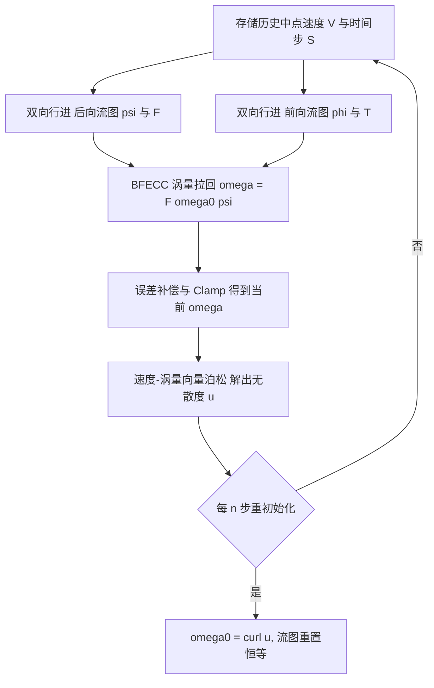

## 一句话总结

本文提出一种基于流图（flow map）理论的欧拉涡量方法：把涡量当作"线元"沿长程双向流图几何式输运，再配合一个直接求解速度-涡量耦合的向量泊松方案处理固体边界，从而在纯笛卡尔网格上实现低耗散、数值稳定的复杂涡结构与湍流仿真。

## 研究背景

- 领域现状：涡量方法把不可压 Navier-Stokes 方程改写为涡量形式 $$\boldsymbol{\omega}=\nabla\times\boldsymbol{u}$$，天然保持环量、能凸显涡结构，长期是湍流与复杂涡旋仿真的重要工具；近年来把长程流图与脉冲（impulse / covector）规范变量结合的做法（如 Covector Fluids、Neural Flow Maps）在图形学中取得了 state-of-the-art 的低耗散效果。
- 核心痛点：一方面，纯欧拉的涡量方法非常稀少——直接用半拉格朗日、BFECC 等现成平流格式在笛卡尔网格上演化涡量，难以稳健处理涡量拉伸项、也难以保持涡量的结构与总量，相对速度型方法并无优势；另一方面，脉冲作为"面元"在涡旋场中量级会持续快速增大，对投影求解器精度要求极高、易累积数值误差而失稳。
- 本文 idea：观察到涡量本质上是"线元"、脉冲是"面元"，二者可用同一套双向流图输运（只差雅可比是否转置）。既然线元涡量比面元脉冲更数值稳定、物理意义更直接，就选择在笛卡尔网格上的长程流图上演化涡量；同时用一套速度-涡量（velocity-vorticity）泊松格式绕开流函数与势场，直接在求解器层面强加固体边界条件。

## 方法

### 整体框架

方法的主干是一个"流图 → 涡量输运 → 速度重构"的时间步循环。每步先用历史存下的中点速度场双向行进出前向/后向流图 $$\boldsymbol{\phi},\boldsymbol{\psi}$$ 及其雅可比 $$F,T$$；再用这套高精度流图对涡量做带误差补偿（BFECC）的几何拉回，得到当前涡量；最后解一个向量泊松方程 $$\nabla\cdot\nabla\boldsymbol{u}=-\nabla\times\boldsymbol{\omega}$$ 从涡量重构出无散度速度。每隔 $$n$$ 步把涡量重置为当前速度的旋度、流图重置为恒等，以避免流图畸变累积。

### 关键设计一：涡量作为线元在流图上输运

若向量场 $$\boldsymbol{l}$$ 满足 $$\dfrac{D\boldsymbol{l}}{Dt}=(\nabla\boldsymbol{u})\boldsymbol{l}$$ 则称其为线元，可由双向流图几何式输运：$$\boldsymbol{\omega}(\boldsymbol{x},t)=F\,\boldsymbol{\omega}(\boldsymbol{\psi}(\boldsymbol{x}),0)$$ 与 $$\boldsymbol{\omega}(\boldsymbol{X},0)=T\,\boldsymbol{\omega}(\boldsymbol{\phi}(\boldsymbol{X}),t)$$。对照脉冲这一面元（$$\dfrac{D\boldsymbol{s}}{Dt}=-(\nabla\boldsymbol{u})^{T}\boldsymbol{s}$$，输运时雅可比取转置），可见线元与面元共用同一套流图，仅差一个转置。涡量形式的欧拉方程 $$\dfrac{D\boldsymbol{\omega}}{Dt}=(\nabla\boldsymbol{u})\boldsymbol{\omega}$$ 恰好把涡量拉伸项吸收进流图雅可比 $$F$$ 的演化里，从而"免于"显式离散这个棘手的拉伸项。

### 关键设计二：选涡量而非脉冲

作者用 2D/3D 蛙跳（leapfrog）实验佐证选择：在不做重初始化的情况下，100 步内脉冲最大模的增大因子在 3D 为 20.35、在 2D 高达 3124.27，而涡量的增大因子仅 1.22（3D）和 1.01（2D）。原因有二——其一，面元脉冲的强度会随涡旋场持续显著增大，导致从脉冲重构速度的投影对数值精度愈发敏感、误差累积严重；其二，涡量直接绑定流体的旋转结构，物理可解释性强。因此在同样的笛卡尔网格流图上，线元涡量是更优的追踪对象。

### 关键设计三：速度-涡量耦合泊松与固体边界

标准做法用涡量-流函数格式，需要额外求解速度势来满足固体边界。本文改用速度-涡量格式：让速度本身作为泊松系统的未知量，并让固体边界附近的涡量成为由相容性条件 $$\boldsymbol{\omega}=\nabla\times\boldsymbol{u}$$ 决定的未知量。这样只需把壁面速度作为 Dirichlet 条件、并隐式强加边界处速度-涡量相容性，就能在求解器层面直接施加正确边界条件，绕开流函数与势场。代价是修正后的方程会跨空间维度耦合（$$u_x$$ 会依赖相邻的 $$u_y$$），无法逐维用标量泊松求解器。为此作者实现了一个基于 Taichi 的、无矩阵的 GPU 几何多重网格预条件共轭梯度（MGPCG）求解器，在粗层上用粗化固体强加边界条件，把耦合系统沿 x 轴堆叠一次性并行求解。

### 关键设计四：双向行进与误差补偿

时间积分采用中点法，流图用 RK4 联合演化 $$\boldsymbol{\psi}$$ 与 $$F$$（时间反向），沿用双向行进思想；涡量平流用 BFECC：先用后向流图把初始涡量拉到当前时刻，再用前向流图拉回初始时刻，比较误差做补偿并 Clamp。双向行进对保证"涡量散度理论为零"至关重要——在正面对撞算例第 50 帧，不用双向行进时涡量散度最高达 45538.9922，用了之后降到 559.9824，约降低 80 倍。外力与粘性则借助累积缓冲，在无变形位置用前向流图把每步涡量变化加回。

## 实验结果

主实验选取 3D 蛙跳涡环（leapfrog）这一经典基准，用于对比不同平流/重构方案对涡结构长期保持能力（是否在多次"蛙跳"后仍维持两环分离）。下表按"方法 × 涡环分离表现"组织（现象忠于原文描述）：

| 方法 | 是否维持两环分离 | 说明 |
| --- | --- | --- |
| 本文（欧拉涡量+流图） | 第 4 次蛙跳后仍分离 | 双向流图上线元涡量输运 |
| 本文的流函数版本 | 第 4 次蛙跳后仍分离 | 速度重构改用流函数求解器 |
| NFM（Neural Flow Maps） | 第 4 次蛙跳后仍分离 | 神经流图脉冲法 |
| Covector Fluids (CF) | 第 3 次蛙跳前即合并 | 脉冲/协向量法 |
| CF + BiMocq | 第 3 次蛙跳前即合并 | 双向映射增强 |
| BFECC | 第 3 次蛙跳前即合并 | 误差补偿平流 |

补充关键结果（文字简述）：2D 蛙跳算例中本方法维持涡分离与结构超过 2000 帧，而其他方法不足 400 帧。性能上，本文的耦合泊松求解相比逐维分离求解在斜撞与三叶结算例上取得约 10–20× 加速（如 Oblique 在 3GB 显存下耦合求解 0.15 秒/次、分离求解 2.40 秒/次），收敛迭代数从最多 114 降到约 10；蛙跳算例二者相近。整机时间方面（RTX 4080 Laptop），2D 蛙跳约 1.69 秒/帧、3D 蛙跳约 2.59 秒/帧、3D 三叶结约 1.07 秒/帧、3D 斜撞约 0.95 秒/帧。2D von Kármán 涡街、盖驱动方腔流（Re=5000 生成三个角涡）、涡对穿双盘等算例与物理实验及既有结论一致，速度散度维持在 $$10^{-5}$$ 量级近零。

## 亮点与局限

亮点：

- 首次把长程双向流图与纯欧拉涡量方法结合，利用"涡量是线元"这一洞见让流图雅可比自动承担涡量拉伸，兼得低耗散与数值稳定。
- 用统一的线元/面元流图视角清晰解释了"为何涡量比脉冲更适合流图"，并用增大因子实验给出定量支撑。
- 提出速度-涡量耦合泊松格式，在求解器层面直接、正确地处理固体边界，绕开流函数与势场，并用无矩阵 GPU MGPCG 高效求解。

局限：

- 不支持可压缩流，也暂不支持自由表面（需要非平凡的自由表面边界处理）。
- 只支持体素化固体边界，不支持切割单元（cut cell）几何，更精细的固-流耦合仍是未来方向。
- 修正后的泊松系统对称但缺乏正定性证明；虽然所有实验都收敛（无固体 8–12 次迭代、复杂固体边界下低于 50 次），但无法从经验上断言恒为正定。
- 谐波分量仅隐式建模、未完全解决，与显式建模的 Fluid Cohomology 结果仍有差异；且流图畸变仍迫使周期性重初始化，限制了流图可延展的长度。

## 延伸思考

- 线元/面元的统一流图输运框架很有启发：既然二者只差一个雅可比转置，是否可以在同一求解器里按需混合追踪多种规范变量，以在不同物理场景中取长补短。
- 速度-涡量耦合泊松把边界相容性下沉到求解器层面，思路上与"把约束交给线性系统而非后处理"的一类方法相通；其对称但未证正定的性质，若能给出结构化的预条件或正定化改造，将提升在复杂固体边界下的鲁棒性。
- 作者展望的自由表面、切割单元与更长流图，指向把该欧拉涡量框架推向更真实固-流-界面耦合场景的核心路径；结合脉冲两相流等近期工作，"流图 + 规范变量"正在成为一条统一的低耗散仿真主线。
