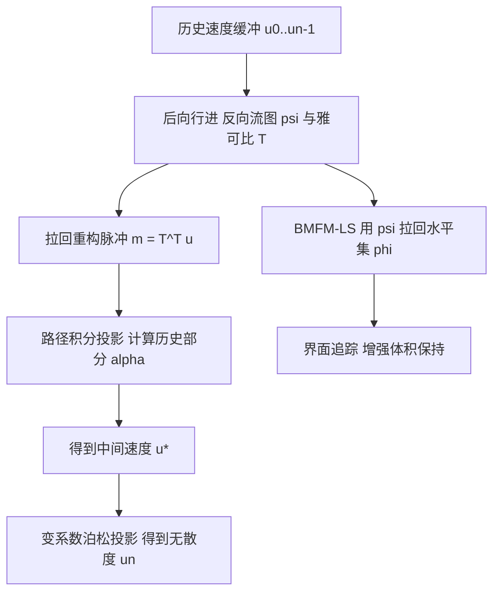

## 一句话总结

本文提出脉冲鬼流体方法（IGFM），首次将脉冲（协向量）与流图相结合的思想拓展到两相流仿真，通过"路径积分投影"处理界面上随历史演化的规范变量跳变，并用双向行进流图水平集增强体积保持，从而在单一欧拉网格流图下同时获得高精度的涡量输运与界面追踪。

## 研究背景

流图（flow map）与脉冲/规范（gauge）方法的结合近年来显著提升了涡结构的保持能力：借助跨越一段时间区间建立的长程流图，脉冲可以随映射及其雅可比矩阵几何式地输运，从而以极低的数值耗散再现复杂涡旋。然而，现有的脉冲类方法几乎都集中于无自由表面的不可压流（图形学中的烟雾仿真），没有方法能处理多相流体。

将脉冲用于两相系统的核心难点在于界面上的跳变条件。由于规范变量具有时空（历史累积）性质，原本仅依赖局部几何的跳变条件（如由界面局部几何决定的表面张力）变成了依赖历史的量：它需要沿每个界面虚拟粒子在整段流图时间区间内的轨迹做路径积分。对于水平集这类隐式界面表示，直接对每个网格样本计算该积分并不现实；而且由于问题的动态特性，积分沿路径的每个求积点都需按当前时刻界面位置做内外判定，累积的数值误差会损害整个求解器的精度与鲁棒性。

本文在流图视角下构建了一个新的欧拉框架来求解两相流，主要贡献为：

- 一个用于两相流体仿真的脉冲鬼流体方法（IGFM）；
- 一个在欧拉网格上处理规范变量历史依赖跳变的路径积分投影（Path Integral Projection）方案；
- 一个增强体积保持的双向行进流图水平集（BMFM-LS）方法；
- 一个能够捕捉复杂跨界面涡流现象的两相流求解器。

## 方法

### 整体框架

本文采用尖锐界面模型：流体密度在液气界面处存在间断跳变，用符号距离场 $$\varphi$$ 表示液相区域（$$\varphi<0$$，密度 $$\rho_L$$）与气相区域（$$\varphi>0$$，密度 $$\rho_A$$），$$\varphi=0$$ 为界面 $$\partial\Omega$$。流动由无粘不可压欧拉方程控制，界面处压强满足由表面张力决定的跳变：

$$
\frac{D\boldsymbol{u}}{Dt}=-\frac{1}{\rho}\nabla p+\boldsymbol{g},\quad \nabla\cdot\boldsymbol{u}=0,\quad [p]=\sigma\kappa \ \text{on}\ \partial\Omega .
$$

通过规范变换定义脉冲场 $$\boldsymbol{m}=\boldsymbol{u}+\frac{1}{\rho}\nabla\alpha$$，其中规范变量 $$\alpha$$ 选取为使 $$\boldsymbol{m}$$ 初始等于 $$\boldsymbol{u}$$、且满足纯几何演化 $$\frac{D\boldsymbol{m}}{Dt}=-(\nabla\boldsymbol{u})^{T}\boldsymbol{m}$$。本文推导出

$$
\alpha(\boldsymbol{x},t)=\Big(\mathcal{L}_0^{t}\big(p-\tfrac{1}{2}\rho\vert \boldsymbol{u}\vert ^2+\rho G\big)\Big)(\boldsymbol{x},t),
$$

其中 $$\mathcal{L}_a^b$$ 是沿材料点轨迹的路径积分算子，$$G$$ 为重力势（$$\boldsymbol{g}=-\nabla G$$）。由此得到界面上 $$\alpha$$ 的历史依赖跳变：

$$
[\alpha]=\mathcal{L}_0^{t}(\sigma\kappa)+(\rho_A-\rho_L)\cdot\Big(\mathcal{L}_0^{t}G-\tfrac{1}{2}\mathcal{L}_0^{t}\vert \boldsymbol{u}\vert ^2\Big)\ \text{on}\ \partial\Omega .
$$

整体求解沿"脉冲更新 → 投影为无散度速度"的流程进行，投影同样归结为求解泊松方程，并周期性地将脉冲重置为速度（脉冲重初始化）以避免数值失稳。

### 关键设计一：拉回与后向行进

脉冲的一大优点是纯几何演化，可由初始条件与流图重构：$$\boldsymbol{m}(\boldsymbol{x},t)=T^{T}\boldsymbol{u}(\boldsymbol{\psi}(\boldsymbol{x},t),0)$$。本文沿用 Deng 等人的做法，维护一个速度缓冲，用 Joint-RK4 方案后向行进反向流图 $$\boldsymbol{\psi}$$ 及其雅可比 $$T$$：将位于网格点的材料点视作时间反演，依次在 $$\boldsymbol{u}_{n-1},\dots,\boldsymbol{u}_0$$ 中按 RK4 行进回到时刻 0，从而以较高精度获得 $$\boldsymbol{\psi}$$ 与 $$T$$。

### 关键设计二：路径积分投影（Path Integral Projection）

直接对 $$[\alpha]$$ 做路径积分并不可行——数值误差会使 $$\boldsymbol{\psi}$$ 偏离界面，而曲率随偏离迅速变化，导致表面张力累积项精度很低。为此本文将 $$\alpha$$ 分成两部分：

$$
\alpha^{n}=\mathcal{L}_{t_{n-1}}^{t_n}p+\Big(\mathcal{L}_0^{t_{n-1}}p-\tfrac{1}{2}\rho\,\mathcal{L}_0^{t_n}\vert \boldsymbol{u}\vert ^2+\rho\,\mathcal{L}_0^{t_n}G\Big).
$$

第一项 $$\mathcal{L}_{t_{n-1}}^{t_n}p$$ 离散为 $$p^{n}\Delta t$$，恰对应传统速度求解器在第 $$n$$ 步投影出的量；第二项（历史部分）通过维护压强缓冲并用路径积分方案（配合后向行进反向流图）从历史信息中获得。于是先计算中间速度

$$
\boldsymbol{u}^{*}=\boldsymbol{m}^{n}-\frac{1}{\rho}\nabla\Big(\mathcal{L}_0^{t_{n-1}}p-\tfrac{1}{2}\rho\,\mathcal{L}_0^{t_n}\vert \boldsymbol{u}\vert ^2+\rho\,\mathcal{L}_0^{t_n}G\Big),
$$

再对 $$\boldsymbol{u}^{*}$$ 做一次标准速度投影得到 $$\boldsymbol{u}^{n}$$。这一步的巧妙之处在于把历史依赖跳变转化回仅依赖当前几何的跳变项 $$\sigma\kappa$$，投影泊松方程在液气界面附近沿用 GFM 的离散思想（用界面位置比例 $$\theta$$ 定义有效密度 $$\hat{\rho}=\theta\rho_L+(1-\theta)\rho_A$$）。此外，在距界面小于 $$\epsilon$$ 的窄带面上改用对 $$\boldsymbol{u}^{n-1}$$ 的输运来求 $$\boldsymbol{u}^{*}$$，以避免界面附近大速度梯度引发失稳、以及压强插值跨越间断带来的无效结果。

### 关键设计三：双向行进流图水平集（BMFM-LS）

符号距离场的材料导数为 0，故可用反向流图拉回：$$\varphi(\boldsymbol{x},t)=\varphi(\boldsymbol{\psi}(\boldsymbol{x},t),0)$$。与以往每步平流 $$\boldsymbol{\psi}$$ 的做法不同，本文借助速度缓冲后向行进 $$\boldsymbol{\psi}$$，从而复用脉冲投影中已建立的流图来精确追踪界面，显著减少水平集在平流与重初始化中产生的体积损失。为应对大密度比带来的病态条件数，求解采用带 Galerkin 粗化与多色 Gauss-Seidel 光滑的 AMGPCG 求解器，以无矩阵方式高效收敛。

## 实验结果

本文通过一系列跨界面涡-界面相互作用的三维算例验证方法，重点在于捕捉此前难以复现的跨界面涡结构。下表汇总主要演示实验及其考察点（数字忠于原文所报告内容）：

| 实验场景 | 考察内容 | 关键现象 |
| --- | --- | --- |
| 一对涡管穿越液气界面 | 与标准速度型 GFM、BiMocq2、MC+R 对比 | 本方法更好保持穿界面涡结构 |
| 上升气泡环撞击界面 | 涡量与界面演化 | 环上升增大主半径、破碎成小气泡，撞击产生环状涟漪与凹凸 |
| 对撞气泡环 | 相反涡量诱导流动 | 两环接近碰撞破裂，表面张力形成小球状气泡 |
| 蛙跳气泡环 | 同向涡量诱导流动 | 两环反复相互穿越 |
| 涡环斜入界面 | 反射行为 | 界面隆起后涡环反射回去 |
| 摆动鱼尾 / 起伏板 | 固体边界产生涡丝、表面波 | 尾缘涡脱落；起伏板生成表面波 |
| 涡场中上升气泡 | 内存开销 | 该算例总内存约 11.22 GB |
| 起伏板（消融） | 重初始化间隔影响 | 间隔越长耗散越小、涡结构保持越好 |

## 亮点与局限

亮点：

- 首次把"脉冲 + 流图"框架推广到尖锐界面两相流，能在单一欧拉网格流图下同时高精度输运涡量与界面。
- 路径积分投影巧妙地把界面上历史依赖的规范跳变转化为仅依赖当前几何的表面张力跳变，回避了对隐式界面逐样本积分与反复内外判定的困难。
- 双向行进流图水平集复用已有流图，明显改善体积保持；配合 AMGPCG 求解器缓解大密度比下的病态收敛问题。

局限：

- 当前框架未纳入粘性——粘性会给脉冲演化引入额外项，破坏由流图与初始条件重构脉冲的能力，并使界面跳变条件更复杂。
- 固体边界处理较为简单，需引入如高阶切割单元法等更精细方案。
- 实现不够节省内存（需存储正/反向流图及其梯度、速度历史缓冲），可考虑用神经表示压缩，但会增加训练开销。

## 延伸思考

- 路径积分投影的思想本质是把"时空累积的跳变"分解为"当前步 + 历史缓冲"，这种分解范式是否可迁移到其他历史依赖的界面条件（例如带相变、可溶物输运或电磁耦合的界面）值得探索。
- 方法依赖长程流图与历史缓冲，精度与内存/计算之间存在明显权衡；如何在时空上更经济地维护缓冲（分块、自适应或神经压缩）是关键工程问题。
- 作者展望的固体-涡-界面耦合（如鱼类跨界面游动）需要把简单固体边界升级为高阶耦合，并解决粘性下的规范跳变，这是把该框架推向更真实场景的核心方向。
