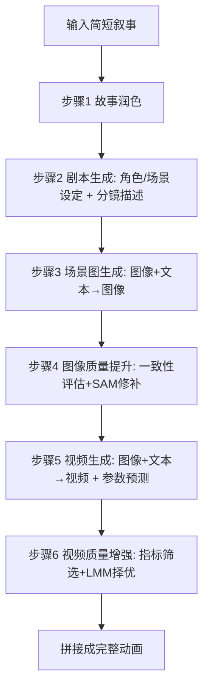

## 一句话总结

用 GPT-4 这样的大型多模态模型（LMM）充当"导演"，编排剧本生成、场景配图与视频合成的全流程，通过与 Midjourney、Pika 等生成工具的深度交互与自我反思式筛选，把一句简短叙事自动扩写成上下文连贯的长动画视频，且全程免训练。

## 研究背景

传统的 AI 动画生成大多沿用"故事可视化"范式：把文本切分成五六句简单提示，配合人工绘制的角色立绘，再用 GAN、VAE 或扩散模型逐帧生成图像序列。这类方法有两个共性痛点。

其一，需要在人工标注的动画数据上训练多个专用模型（如 TaleCrafter 要训练 Text-to-Layout 与 Controllable Layout-to-Image 两个模型，Make-A-Story 依赖带视觉记忆模块的自回归扩散框架），流水线复杂、人力与训练成本高，且在新故事上泛化能力差。

其二，由于提示句简短、视觉表达受限，产出的动画往往篇幅短、信息稀薄、上下文不连贯，角色与背景难以跨镜头保持一致。

作者观察到，GPT-4V、Gemini 等 LMM 具备强大的多模态理解与链式推理能力，已被用于构建能调用外部工具的自主智能体。于是本文提出把 LMM 当作自主导演，统筹整个动画制作过程，摆脱对特定训练数据的依赖。

## 方法

整体框架是让 GPT-4 作为核心处理器，分六个步骤完成一部动画视频，并在每一步与生成工具做深度交互。关键设计是把可控性建立在"图像 + 文本 → 图像/视频"的联合条件之上，再辅以自我反思的候选筛选。

关键设计一：结构化的故事润色与剧本生成。给定一句话叙事（如"一只猫和一只狗在花园里玩耍"），GPT-4 先按指令把它扩写成约 150 词、含对话与情节细节且保留角色名的丰富故事；再分三步生成剧本——抽取角色与场景设定并统一格式、按镜头生成上下文连贯的场景描述、最后自查场景描述与角色/设定是否一致并修正。这一层为后续图像和视频提供了蓝图。

关键设计二："先验图像 + 文本 → 场景图"的可控生成与自反思提升。先用 Midjourney 通过文生图产出角色与场景设定的先验图像，作为跨镜头的视觉基准；再以"图像 + 文本 → 图像"方式为每个场景生成图。为对抗生成随机性，引入自我反思验证：工具先产出多张候选，GPT-4 依据与场景描述的一致性与布局合理性从四张中择优；随后借助 SAM 分割图像区域、并用 Midjourney 的区域替换能力校正角色外观，直到通过一致性检查。

关键设计三：视频生成时的参数预测与多指标+LMM 联合择优。采用"文本 + 图像 → 视频"而非仅图或仅文作为条件，让场景图与提示文本共同约束视频内容。GPT-4 除了生成描述动作与情绪的提示句，还按 JSON 模板预测运动强度、guidance scale、负向提示以及镜头运镜（zoom/pan/tilt/rotate）等超参。质量增强阶段先生成十个候选视频，用模糊检测、主体与背景一致性等指标筛出前三，再由 GPT-4 依据动作与描述的对齐度选出最佳，最后拼接所有场景视频。

## 实验结果

数据集为从 TinyStories 采集的 100 个简短叙事，覆盖动物间、人类间与人与动物的多样互动。图像侧评估上下文连贯性、图-图相似度与文-图相似度；视频侧采用 VBench 风格的失真检测、主体/背景一致性与文-视频对齐分。

视频质量对比（分数越高越好，Avg.#Len 为平均时长/秒）：

| 方法 | V-Q 失真 | 主体一致 | 背景一致 | T-V 对齐 | 平均时长 |
|---|---|---|---|---|---|
| VideoCrafter2 | 0.70 | 0.81 | 0.88 | 0.17 | 17.4 |
| DynamiCrafter | 0.72 | 0.82 | 0.88 | 0.18 | 21.7 |
| Gen-2 | 0.70 | 0.82 | 0.88 | 0.18 | 42.3 |
| Pika-v2 | 0.66 | 0.82 | 0.90 | 0.18 | 32.5 |
| Anim-Director（本文） | **0.74** | **0.86** | **0.93** | **0.19** | 35.0 |
| 本文 w/o 视频增强 | 0.67 | 0.84 | 0.91 | 0.18 | 35.0 |

在图像侧，Anim-Director 的上下文连贯性达 0.87（相对提升 11%）、图-图相似度 0.85（相对提升 16%），文-图相似度 0.29 与各基线持平；去掉图像提升模块后连贯性降至 0.82、图-图相似度降至 0.82，验证了自反思提升的有效性。视频侧本文在失真、主体/背景一致性与文-视频对齐上均领先，同时能产出更长的视频（每条提示约 3 秒，而 VideoCrafter2 约 1 秒），去掉视频增强模块后各项指标一致下降。

## 亮点与局限

亮点在于首次把 LMM 作为自主智能体引入动画视频生成，全程免训练即可从简短叙事生成情节丰富的长视频，像电影导演一样统筹流程；并通过"先验图像 + 文本"的联合条件与 LMM 对生成内容的精修、评估、择优，显著提升了跨镜头的一致性与整体质量。

局限在于系统高度依赖 GPT-4、Midjourney、Pika 等外部工具，其生成过程本身不完全可控，场景转场可能生硬，仍可能产出视觉不佳或上下文不一致的内容，尤其在超长序列上更难保证一致性。

## 延伸思考

这项工作把"可控性"从模型内部转移到了智能体的编排与筛选层面：不改动底层生成器，而是靠 LMM 反复评估、替换、择优来逼近目标质量。这种"生成-验证-重生成"的反思回路是一种通用范式，但其上限受制于工具本身的能力与评估指标的可靠性——当指标无法捕捉更细粒度的时序或语义错误时，LMM 的择优也会失准。未来若能把生成器的可控接口（如运动场、布局、身份约束）与智能体规划更紧密耦合，或引入更贴近人类判断的评估器，长视频的连贯性与转场自然度有望进一步突破。
