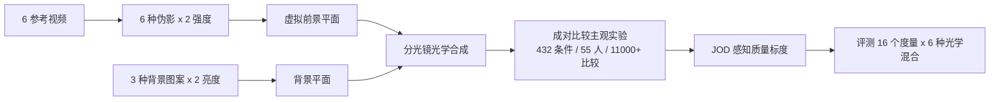

## 一句话总结

面向光学透视增强现实（OST-AR）显示器构建的首个大规模主观视频质量数据集，揭示环境背景光对显示伪影的遮蔽作用远弱于光学混合模型的预期，现有质量度量在 AR 内容上性能显著下降。

## 研究背景

OST-AR 显示器把虚拟图像以"加光"的方式叠加到真实环境光之上，形成一种和自然透明（调制透射光）本质不同的加性图像。这带来两个后果：

- 观察者会部分"折扣"（discount）来自环境或显示的光，把场景在感知上分解为不同"层"，这一现象与遮蔽亮度（veiling luminance）、透明性感知等经典问题相关。
- 由于前景与背景处于不同焦深、且通常不完全对齐，视觉系统可以借助视差、调焦与运动视差等线索，进一步分离两个光源。

因此不能假设 AR 显示上的内容会与传统显示一样被感知，为传统显示设计的图像/视频质量度量在 AR 场景下未必可靠。此前没有任何针对 OST-AR 伪影感知的视频质量数据集，本文旨在填补这一空白。

## 方法

整体框架分为两部分：先用定制光学台采集主观数据（AR-DAVID），再用一套"光学混合"预处理管线把现有度量适配到多焦 AR 内容并评测。

关键设计：

1. **定制 OST-AR 测试台（haploscope）**：用两台 Eizo CG3146 参考显示器经分光镜（反射 80%）产生虚拟前景平面（有效距离 83 cm，1.21 D，46°×26° 视场，44.2 ppd），一台 76" 背景显示器经透射（20%）提供背景平面（210 cm，0.48 D），两平面分离 0.73 D 提供清晰的深度分离。所有显示经光谱辐射计穿过分光镜标定，前景峰值亮度 300 nits、背景 1125 nits，统一 D65 白点。

2. **实验条件设计（432 条件）**：6 段参考视频（自然与渲染场景，含文本、UI、动画）× 6 种伪影（模糊、色边、对比度损失、抖动 dither、光源不均匀 LSNU、波导不均匀 WGNU）× 2 强度，叠加 3 种背景图案（平坦、粉红噪声、dead-leaves）× 2 亮度（10 与 100 cd/m²）。背景图案分别模拟简单墙面、自然场景的尺度不变分形、以及带硬边遮挡的场景。

3. **两阶段成对比较协议**：采用带参考的 2IFC 成对比较，配合 ASAP 主动采样减少比较次数。第一部分在相同背景内比较（精度最高），第二部分跨背景比较以校正一致性。结果用 pwcmp 软件标度为统一跨伪影感知尺度 JOD（参考质量定为 10）。

4. **光学混合模型适配度量**：把前景 FG 与背景 BG 在 CIE XYZ 线性色彩空间中合成为有效图像 $$C_{\text{eff}}$$，设计 6 种混合策略。核心加性模型为

$$C_{\text{eff}} = C_{FG} + C_{BG}$$

考虑观察者聚焦前景导致背景离焦时，用点扩散函数 $$h$$ 卷积背景：

$$C_{\text{eff}} = C_{FG} + C_{BG} * h$$

其余变体包括仅用背景平均亮度的 average-lum、考虑双像（diplopic）的 pinhole-diplopic 与 defocus-diplopic 等。

## 实验结果

在 AR-DAVID 上评测 16 个度量、每个配 6 种光学混合，报告 Spearman 秩相关系数（SROCC，取各度量最佳表现）。主要发现如下：

| 度量 | 是否光度输入 | 最佳 SROCC |
| --- | --- | --- |
| FovVideoVDP 1.2 | 是 | 0.69 |
| MDSI | 否 | 0.667 |
| ColorVideoVDP (v0.4.2) | 是 | 0.64 |
| HaarPSI | 否 | 0.544 |
| VMAF (v0.6.3) | 否 | 0.495 |
| GMSD | 否 | 0.466 |
| DSS | 否 | 0.432 |
| PSNR-RGB | 否 | 0.033 |

关键观察：

- **背景遮蔽效应远弱于预期**：双因素方差分析显示背景亮度（$$F(1,431)=0.68, p=0.43$$）与背景图案（$$F(2,431)=0.63, p=0.51$$）均未对质量产生显著差异，这与"高亮度、高频背景应强烈遮蔽前景伪影"的假设相悖。
- **与传统显示 XR-DAVID 对比**：在三段共同视频上，仅对比度（Contrast）与抖动（Dither）在 AR 中获得一致更高的质量分——因为这两种伪影主要出现在暗部，正是最受背景光影响的区域。
- **光学混合能提升但无法完全解释**：引入任意混合（相对 none）都显著提升相关性，但最简单的 average-lum 反而相关性最高，物理上更精确的 defocus-diplopic 并未更好；ColorVideoVDP 在 100 cd/m² 亮背景下系统性高估质量，说明它预测的背景遮蔽强于实测。以约 0.2 的权重"折扣"背景可消除该偏差。

## 亮点与局限

亮点：

- 首个在定制 OST-AR 测试台上完成的大规模主观视频质量数据集（432 条件、55 名参与者、逾 11000 次成对比较），标度良好。
- 提出并对比 6 种光学混合适配策略，系统评测 16 个 SOTA 度量，为 AR 质量度量研究提供起点与基准。
- 得出反直觉但重要的结论：视觉系统能部分"折扣"背景，OST-AR 上的叠加感知无法简单建模为光的光学混合。

局限：

- 用两台参考显示器 + 分光镜的 haploscope 模拟 AR，而非真实波导器件，亮度、焦深、视场为近似匹配。
- 不考虑立体（双目）伪影，仅在前景/背景间引入视差；PSF 未建模人眼像差与衍射。
- 背景为静态图案、室内亮度范围（10 与 100 cd/m²），未覆盖动态背景与户外高亮环境；IPD 简化为固定 63 mm。
- 现有度量即便在最佳混合下相关性仍偏低（多数需以 SROCC 报告，逻辑函数拟合不稳定），尚无能显式建模 OST-AR 的度量。

## 延伸思考

- "背景折扣"提示 AR 质量度量应显式建模视差/调焦/运动视差等分层线索，而非把前后景当成单张混合图像；数据集为这类感知模型提供了标定目标。
- average-lum 优于物理更精确模型，暗示大多数观察者在判断质量时并未利用 dead-leaves 背景中的"暗孔"细节，感知策略与像素级物理混合存在系统性偏离。
- 结论对 AR 显示设计有直接意义：不能指望环境光自然遮蔽波导/色边等伪影，硬件与渲染侧仍需主动抑制，尤其是暗部相关的对比度与抖动伪影在 AR 中反而更"可原谅"。
