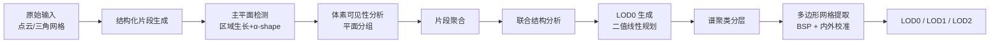

## 一句话总结

Co-LOD 通过对一组建筑模型做"协同分析"（co-analysis），把噪声点云/网格分解为可复用的结构化片段（structural segments），并借助跨模型的相似度约束，逐层、语义一致地生成多级细节（LOD）的水密多边形网格。

## 研究背景

在城市规划、自动驾驶、虚拟现实等应用中，建筑模型需要以多种细节层次（Level-of-Detail, LOD）来表达。CityGML 规范提出用逐级递增的结构来描述数字建筑，由此带来两大挑战：

- 建筑几何结构复杂多样，难以稳健地控制 LOD 的生成；
- 在同一 LOD 层级上，不同建筑模型之间难以保持语义一致性。

已有方法要么依赖预定义规则来保证一致性（但在复杂结构和非标准输入上容易失效），要么依赖视觉误差和几何约束来引导生成（更通用但一致性难保证）。两类方法都严重依赖输入质量，缺少一种能同时兼顾鲁棒性与语义一致性的 LOD 控制机制。

Co-LOD 的核心假设是：建筑模型在不同层级上存在语义有意义的细节，这些细节可以通过"重复性"和"自相关性"的模式被识别。因此，对多栋建筑的重复、相关结构做协同分析，就能更精确地控制不同的 LOD 层。

## 方法

### 整体框架

Co-LOD 接收一组建筑模型作为输入，生成满足以下条件的 LOD 表示：i) 每栋建筑在每一层都有对应实体；ii) 同层建筑保持基于 LOD 的语义一致性；iii) LOD 越高结构越丰富；iv) 各层均为水密多边形网格。整体流程包含两大模块、三个核心步骤。

### 关键设计一：结构化片段生成

先用区域生长检测主平面，并用 α-shape 界定每个平面的区域。随后做基于体素的可见性分析：在包围盒内均匀划分 $$n_s \times n_s \times n_s$$ 个体素，从每个体素中心发射 $$n_r$$ 条射线，记录被击中平面并存入命中向量 $$Hitlist_v$$；有效命中数不足半数的体素被判为建筑外部而剔除。共享非零命中的平面组成"平面组"（plane-group）。

对于建筑常见的两类结构——凹龛（alcove）与封闭（closed）结构，算法先反转面积小于 $$A_\epsilon$$ 的平面把凹龛转成封闭结构提取，再用剩余平面提取封闭结构。平面组随后按命中重叠度聚合成结构化片段，合并的前置条件为：

$$hSum(g,V) = \sum_{v \in V} \sum_{p \in g} Hitlist_v[p]$$

$$hSum(g_a \cap g_b, V_a) > 0.5 \times hSum(g_a, V_a) \ \text{且}\ hSum(g_a \cap g_b, V_b) > 0.5 \times hSum(g_b, V_b)$$

### 关键设计二：LOD0 的联合优化

LOD0 需同时满足"贴合整体形状、尽量简洁、语义一致"三点要求，被建模为一个二值线性规划问题：

$$E_0 = \sum_{i=0}^{n} \left( f_r(M_i) + \beta f_s(M_i) + \lambda f_{co}(M_i) \right), \quad \text{s.t.}\ f_r(M_i) > 0.8$$

其中形状保真项 $$f_r$$ 用体素质心的 IoU 衡量，简洁项 $$f_s = -area(M)/area(I)$$ 约束平面总面积，语义一致项 $$f_{co}$$ 鼓励与其他模型高度匹配的重复结构从 LOD0 中移除。

### 关键设计三：跨模型相似度与谱聚类分层

片段间距离同时考虑形状与尺度差异：

$$dis(s,s') = \eta \| d_2(norm(s)) - d_2(norm(s')) \|_2 + scale_d(s,s')$$

$$scale_d = \| v_e(s) - v_e(s') \| / (\| v_e(s) \| + \| v_e(s') \|)$$

其中 $$d_2$$ 为 D2 描述子，$$v_e$$ 为协方差矩阵主特征值向量。跨模型相似度定义为：

$$Sim_{co}(s,S) = e^{-Dis_{set}(s,S)}, \quad Dis_{set}(s,S) = \min_{s' \in S} dis(s,s')$$

以此构造相似度矩阵并计算归一化拉普拉斯矩阵 $$L_{norm} = M_D^{-1/2}(M_D - M_s)M_D^{-1/2}$$，取最小的若干特征向量做 k-means，把 LOD0 之外的片段聚为 $$l_n - 1$$ 类对应不同 LOD 层（细扫模型常设 $$l_n = 3$$，粗扫设 $$l_n = 2$$）。最后对各层平面做二叉空间划分（BSP）并按射线可见性做凸包内外校准 $$In(C)$$，取最大连通内部体作为水密网格。

## 实验结果

在 421 个后 2020 年公开建筑数据样本（Toronto-3D、SensatUrban、SUM、STPLS3D、InstanceBuilding、UrbanBIS）上组织成 7 个场景评测，与 QEM、RobustLowPoly、LowPoly、NeuralLOD、PolyFit、KSR 等方法对比。主要指标为 Hausdorff 距离（HD）、Light Field 距离（LFD）、成功率 $$r_s$$，以及个体/场景两级用户研究（108 名参与者）。

下表摘取各 LOD 层的核心对比（数字忠于原文，↓ 越低越好，↑ 越高越好）：

| LOD 层 | 方法 | #F | $$r_s$$ | LFD (mean) ↓ | HD (mean) ↓ | I-LOD ↑ | S-LOD ↑ |
|--------|------|-----|---------|--------------|-------------|---------|---------|
| LOD0 | KSR | 427 | 47.8% | 5963.1 | 0.048 | 10.9% | 8.7% |
| LOD0 | QEM | 125 | 100% | 5388.7 | 0.037 | 3.2% | 4.7% |
| LOD0 | RobustLowPoly | 254 | 100% | 7146.5 | 0.097 | 11.7% | 5.3% |
| LOD0 | **Ours** | 125 | 100% | **4507** | **0.025** | **77.3%** | **81.3%** |
| LOD1 | KSR | 1932 | 98.8% | 3793.2 | 0.010 | — | — |
| LOD1 | LowPoly | 1046 | 100% | 3899.5 | 0.012 | — | — |
| LOD1 | QEM | 3753 | 100% | 3889.2 | 0.005 | — | — |
| LOD1 | **Ours** | 3755 | 100% | **3626.5** | **0.005** | — | — |
| LOD2 | RobustLowPoly | 31535 | 100% | **1975.4** | 0.001 | — | — |
| LOD2 | **Ours** | 31535 | 100% | 2237.2 | 0.001 | — | — |

要点：在 LOD0 上 Co-LOD 以更少多边形取得最低的 HD/LFD，用户研究以 77.3%（个体）和 81.3%（场景）的压倒性偏好胜出；LOD1 精度与一致性最好；LOD2 精度与最强基线接近。效率上，Co-LOD 平均处理一个输入约 151.6s（片段生成 78.7s、协同分析 51.8s、网格提取 21.1s），在效率、LOD 控制、语义一致性之间取得平衡。

消融显示：一致性项 $$f_{co}$$ 是保证 LOD0 简洁一致的关键，仅靠调节 $$f_r$$ 与 $$f_s$$ 的权重比无法替代协同分析；默认参数 $$n_s = 150$$、$$n_r = 100$$、$$A_\epsilon = 80m^2$$、$$\beta = 0.3$$、$$\lambda = 0.4$$、$$\eta = 4.0$$。

## 亮点与局限

亮点：

- 首次将"建筑集合的跨模型协同分析"引入 LOD 生成任务，用重复性与相关性驱动语义一致性；
- 结构化片段生成流程稳健、对参数依赖低，能处理噪声与不完整的真实航拍输入；
- 将 LOD0 生成建模为可解的二值线性规划，并用谱聚类实现逐层递进的 LOD 分层；
- 输出为简洁清晰的水密多边形网格，兼顾鲁棒性与一致性。

局限：

- 依赖分段平面近似，曲面区域误差偏大，只能通过调低区域生长角度阈值缓解（代价是时间与面数上升）；
- 基于空间离散化的可见性分析会忽略过细结构，导致 LOD 层出现不一致；
- 协同分析在大规模场景下随片段数呈非线性增长，主要瓶颈在于求解优化式 $$E_0$$。

## 延伸思考

- 论文提出的"单建筑 + 预训练数据库"模式很有价值：把昂贵的协同分析离线到大规模数据库上完成，就能对每栋建筑独立控制 LOD，这为规模化城市重建提供了工程化路径，但会带来数据库外结构被错误下放的问题，如何权衡召回与简洁度值得进一步研究。
- 作者展望引入生成式框架增强补全能力，以及为不同 LOD 层做多分辨率纹理映射——前者可缓解航拍输入的缺失问题，后者能提升渲染真实感。
- 把"协同分析"从建筑推广到更一般的重复性人造场景（如工业设施、家具集合）是一个自然方向，核心是设计合适的片段相似度描述子来跨类别刻画重复结构。
