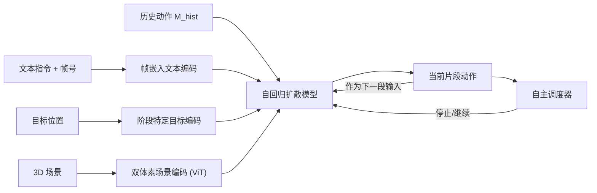

## 一句话总结

本文提出一个统一的生成框架，仅凭一句文本指令和一个目标位置，就能自主合成在 3D 场景中融合行走、伸手抓取与人-物交互的多阶段连贯人体动作，并配套发布了 16 小时的 VR 辅助 MoCap 数据集 LINGO。

## 研究背景

在 3D 环境中合成人体动作面临三个长期难题。其一，行走、伸手、人-物交互（HOI）等不同阶段往往由各自独立的专用系统建模，拼接后缺乏连贯性，难以维持长时序、语义一致的交互序列。其二，现有方法通常依赖大量额外输入，例如物体运动轨迹、人体关键点或动作相位标签，这些依赖限制了灵活性与实际部署。其三，缺少带精细文本标注的场景级数据集，已有数据集难以同时覆盖抓取、语境丰富的 HOI 与复杂场景约束。

本文的目标是把用户输入压缩到最小——只需"去某处（目标位置）"和"做某事（文本指令）"两个信号，就自主生成贯穿多阶段的场景感知动作，并把行走、伸手、HOI 的割裂流程整合进一条统一管线。

## 方法

整体框架以自回归扩散模型为核心，逐段生成固定长度 $$W$$ 的动作片段，每段都基于前两帧历史动作 $$M_{hist}$$ 递归延展，从而支持任意长度序列。条件项由三部分组成：双体素场景编码、帧嵌入文本编码、阶段特定目标编码；另有一个自主调度器决定何时结束当前阶段进入下一阶段。

**自回归运动扩散模块。** 采用 DDPM，在正向过程中对规范化（以当前片段首帧盆骨坐标表示关节位置）的动作数据逐步加噪，反向过程学习去噪。网络 $$\epsilon_\theta$$ 预测所加噪声，训练目标为

$$L = \mathbb{E}_{\tilde{X}_t \sim q(\tilde{X}_t \mid C),\, t \sim U(1,T)} \, \|\epsilon - \epsilon_\theta(\tilde{X}_t, t, C)\|_2^2$$

其中条件 $$C = \{S_{emb}, V_{emb}, G_{emb}\}$$。人体用 SMPL-X 表示，先生成 $$J=28$$ 个关节的 3D 位置再拟合姿态参数。

**双体素场景编码器。** 为让角色既感知当前局部环境又能预判即将进入的场景，构建两个 $$32\times32\times32$$、边长 1.2 米的占据体素网格：当前体素以片段首帧盆骨为中心并对齐朝向；预测体素在行走时沿目标方向前置 0.8 米，在与特定物体交互时直接对齐物体位置。体素的高度维当作通道维，用 ViT 提取特征。

**帧嵌入文本编码器。** 由于自回归逐段生成没有预设时序，为把多段正确串成语义完整的动作（如"读书"包含先翻页再阅读），把当前片段首帧相对于原始语义动作片段起点的帧号，用正弦位置编码转成 512 维向量，与 CLIP 文本嵌入 $$V_{emb}$$ 相加作为条件 token，使模型学到语义动作的时间模式。

**阶段特定目标与自主调度器。** 目标 $$G \in \mathbb{R}^3$$ 在不同阶段含义不同：行走时是当前片段方向乘用户速度的二维向量；手部抓取时是食指目标位置（并在最后十步扩散施加引导以避免手-物穿透）；场景级交互时是盆骨落座位置；小物体交互时目标嵌入置零。目标不强制到达，给生成模型自主决定路径的空间。自主调度器结构类似扩散模块，基于最新动作片段、当前帧号和文本指令，输出 0 到 1 的值判断当前阶段是否结束。

**LINGO 数据集。** 通过 VR 头显向 MoCap 演员投射合成场景视觉，并用真实同高家具和人工助手标记抓/放帧来引入静/动态物体。使用 VICON 系统以 30 FPS 采集，覆盖 120 个室内场景、40 类动作、20 类日常物体，共 16 小时序列，按场景 4:1 划分训练/评测集。

## 实验结果

方法在 LINGO-eval 上分交互动作、行走、伸手三种设定评测。交互动作合成结果（数字忠于原文，FID 越低越好，Diversity/Multi-modality 越接近真实越好，Precision/Recall/F1 越高越好）：

| 方法 | FID↓ | Diversity→ | Multi-modality→ | Precision↑ | Recall↑ | F1↑ |
|---|---|---|---|---|---|---|
| Real motions | - | 6.379 | 1.119 | 0.888 | 0.907 | 0.907 |
| TRUMANS | 2.438 | 6.182 | 3.353 | 0.628 | 0.557 | 0.552 |
| Ours | **2.048** | 6.220 | 2.919 | **0.695** | **0.629** | **0.622** |
| w/o frame embedding | 2.368 | 6.300 | 3.600 | 0.615 | 0.553 | 0.540 |

除 Diversity 外全部指标领先；去掉帧嵌入后 Diversity 反而升高，是因为动作变得杂乱、重复且缺乏整体连贯性。在行走设定中，本方法相较 TRUMANS 大幅降低场景穿透（Pene$$_{mean}$$ 0.402 对 1.011，Pene$$_{max}$$ 0.948 对 7.441）并减少脚滑；把双体素替换为压平的可行走图后穿透与脚滑均上升。在伸手设定中，本方法达到最低到达误差（0.061）、最低穿透与最短耗时（3.073 秒），优于 GOAL 基线，消融也验证了双体素编码与帧嵌入的作用。

## 亮点与局限

亮点：把行走、伸手、HOI 三类割裂任务统一进单一自回归扩散管线，将用户输入压缩到"文本指令 + 目标位置"；双体素表示同时兼顾当前与前瞻场景，显著改善避障与交互自然度；帧嵌入文本编码巧妙解决了自回归无预设时序下的语义时序对齐问题；VR 辅助 MoCap 使大规模含动态物体的场景级数据采集成为可能。

局限：作者指出方法聚焦身体级动作，忽略了精细的手部操作与面部表情；虽然场景感知优于现有方法，但不保证生成动作的完全物理合理性；未研究对未见交互类型的泛化能力。

## 延伸思考

把复杂长指令交给基础模型分解为可执行阶段，再由自主调度器逐段决定停转，这种"高层规划 + 低层自回归生成"的分层思路，与机器人任务规划、具身智能中的技能编排高度契合，值得迁移借鉴。双体素中"预测体素"提供的前瞻感知，本质是给生成模型注入了对未来环境的显式预期，这一思想或可推广到导航、轨迹预测等需要前瞻的任务。此外，VR 投射合成场景 + 真实代理家具 + 人工绑定动态物体的采集范式，为低成本扩展场景多样性提供了可复制的工程模板。
