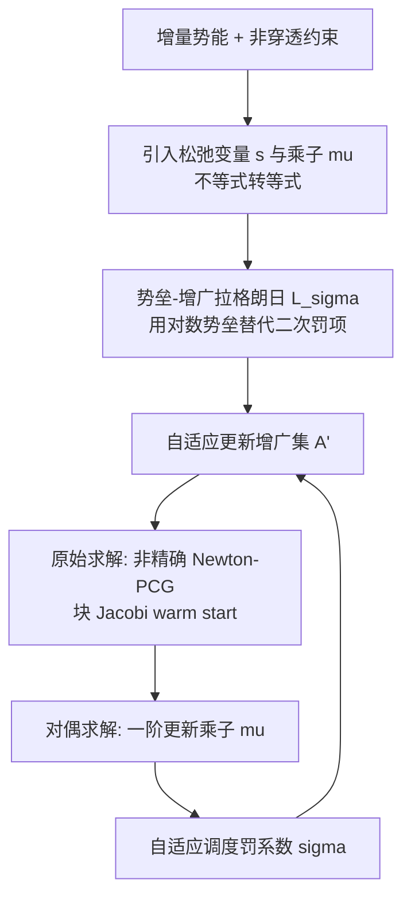

## 一句话总结

本文提出一种基于 GPU 的**势垒-增广拉格朗日（barrier-augmented Lagrangian）**迭代方法，把 IPC 的对数势垒接触模型改写为条件数更好、可用非精确 Newton-PCG 无因子分解求解的形式，在 8GB 显存上完成过去 128GB 内存都难以承受的大规模弹性接触仿真，相比 IPC 最高提速约 80 倍。

## 研究背景

在计算机图形学中，稳健、精确的弹性体动力学通常写成隐式时间积分的优化问题，每个时间步最小化"增量势能（Incremental Potential）"。IPC（Incremental Potential Contact）用对数势垒函数处理非穿透约束，从可行域内部逼近解，在边界处目标值趋于无穷大，从而保证无穿透、无翻转的轨迹。

但对数势垒带来两大痛点：

- **病态系统**：势垒的强非线性与尖锐性使 Hessian 条件数在大变形或高速冲击时常常超过 $$10^{10}$$。这迫使每个 Newton 迭代用直接分解（如 Cholesky）求解线性系统，而分解会产生大量填充元（fill-in），存储与计算开销随规模急剧膨胀，难以扩展到大规模问题。
- **约束集频繁变动**：每次迭代活跃约束集都在变，破坏了迭代线性求解器（CG/GMRES）的收敛性，使其发散或需要极多迭代。

本文的核心洞察来自外点法（exterior-point / impact-zone）的性能优势：**在子问题收敛前保持约束集固定**。作者希望把这种效率引入内点法，同时保留内点法在大步长下的收敛保证与稳健性。

## 方法

### 整体框架

方法建立在优化式隐式时间积分之上。反向欧拉离散后，时间步的目标是最小化增量势能：

$$
E(x) = \frac{1}{2h^2}\lVert x - y \rVert_M^2 + \Psi(x) + D(x)
$$

其中 $$\Psi$$ 是应变能，$$D$$ 是摩擦耗散能，$$y = x^t + h v^t + h^2 G$$。非穿透以距离约束 $$\tilde{c}_i = \hat{d} - d_i(x) < 0$$ 施加，$$\hat{d}$$ 是一个微小的碰撞偏移。

外层是增广拉格朗日的原始-对偶迭代，内层用非精确 Newton-PCG 解原始问题，全流程在 GPU 上以稀疏矩阵-向量乘（SpMV）为核心算子实现。

### 关键设计一：势垒-增广拉格朗日

通过引入松弛变量 $$s_i$$ 和乘子 $$\mu_i$$，不等式约束被转成等式约束 $$c_i(x) = \hat{d} + s_i - d_i(x) = 0$$。作者不采用传统外点法的二次罚项，而是用对数势垒作为"特殊罚函数"（因其排斥力比二次项更强），得到 IPC 的势垒-增广拉格朗日：

$$
\mathcal{L}_\sigma(x, s, \boldsymbol{\mu}) = E(x) + \sigma \sum_{i \in \mathcal{A}} b_i^{\hat{d}}(x) + \mathcal{R}(x)
$$

其中增广项 $$\mathcal{R}(x) = \sum_{i \in \mathcal{A}'} \mu_i\left(\hat{d} + s_i - d_i(x)\right) + \sigma \sum_{i \in \mathcal{A}'} b_i^{\hat{d}+s_i}(x)$$。松弛变量可解析消去：

$$
s_i = \max\left(-\frac{\mu_i}{\sigma} - \hat{d} + d_i(x),\ 0\right)
$$

关键点在于**增广集 $$\mathcal{A}'$$ 的自适应更新**：当最小距离足够大时置空；当最小距离减小或集合为空时，把 $$d_i < 10^{-2}\hat{d}$$ 的碰撞对纳入。这样在保持内点法安全性的前提下，借鉴了外点法"固定约束集直到子问题收敛"的效率。

### 关键设计二：自适应调度

罚系数 $$\sigma$$ 平衡目标函数与约束满足。初始值通过最小化 $$\lVert \nabla \mathcal{L}_{\sigma^{[0]}}(x, s, 0) \rVert^2$$ 求得：

$$
\sigma^{[0]} = - \frac{\left(\sum_{i \in \mathcal{A}} \nabla b_i^{\hat{d}+s_i}(x^{[0]})\right)^\top \nabla E(x^{[0]})}{\left\lVert \sum_{i \in \mathcal{A}} \nabla b_i^{\hat{d}+s_i}(x^{[0]}) \right\rVert^2}
$$

随后当最小距离小于 $$10^{-2}\hat{d}$$ 时按 $$\sigma^{[l+1]} = \max(1.2\sigma^{[l]},\ 100\sigma^{[0]})$$ 放大，引导优化朝更严格的约束满足前进。乘子按一阶格式更新 $$\mu_i^{[l+1]} = \mu_i^{[l]} + \sigma^{[l]} b_i^{\hat{d}+s_i}$$。

### 关键设计三：非精确 Newton-PCG 与全隐式摩擦

- **全隐式摩擦**：IPC 用半隐式摩擦（把切向算子、法向力大小滞后到上一时间步），大步长时会出现明显的"粘滞"伪影。本文在**每次非精确 Newton 迭代**都更新摩擦约束（法向 $$n$$、法向力 $$\lambda$$、重心坐标 $$\beta$$），直接朝全隐式摩擦收敛。相比 IPC 的"每次非线性优化才更新一次"，per-iteration 策略收敛更快且更稳健。
- **块 Jacobi warm start**：不同节点刚度差异巨大导致 PCG 收敛慢。作者复用线搜索中已经算好的接触 stencil 局部 Hessian 特征值，组装成全局对角矩阵 $$\Lambda = \sum_i S_i [\boldsymbol{\lambda}_i] S_i^\top$$ 估计每个 DOF 的刚度，再按 $$\lfloor \log_{10}(e_j) \rfloor$$ 把节点聚成刚度相近的组，做子域校正来 warm start 全局 PCG。

### 关键设计四：GPU 稀疏存储与碰撞检测

- **稀疏存储**：利用对称性，把系统矩阵拆成三部分——稠密块对角 $$D$$（兼作预条件子）、基于节点邻接的下三角非零块 $$L$$、以及动态的接触 stencil 块 $$C_i$$。SpMV 写成 $$D\boldsymbol{\upsilon} + L\boldsymbol{\upsilon} + L^\top\boldsymbol{\upsilon} + \sum_i C_i\boldsymbol{\upsilon} + \sum_i C_i^\top\boldsymbol{\upsilon}$$，用原子加做 map-reduce，在 GPU 上完全并行。
- **碰撞检测**：宽阶段用 GPU 上的 linear BVH（三角形与边各建一棵树，Morton 码 + 基数排序 + 自底向上 atomicCAS 归约）；窄阶段用三次多项式根查找器做浮点 CCD，配合保守的 TOI 优化（引入参考帧 $$t_{i+1/2}$$ 并按符号一致性回退），处理病态三角化网格上的失败案例。

## 实验结果

平台：IPC 跑在 i9-13900K（24 核，128GB）；本文与 GIPC 跑在 Xeon Gold 6226R + NVIDIA 4090（24GB）。默认双精度。下表摘录 Table 1 中的代表性场景（时间步均为 $$1/30$$ s）：

| 场景 | #tets / #DOFs | $$E$$ (Pa) | $$\chi$$ | avg. #cons | avg. Newton 迭代 | 每步耗时 (s) | 相对 IPC 提速 |
|---|---|---|---|---|---|---|---|
| Puffer Balls on Nets | 1.76M / 801K | $$5\times10^5$$ / $$10^9$$ | 0.3 | 228K | 156.8 | 427 | 80.1× |
| Dragons-Pachinko | 1.49M / 379K | 混合 | 0.3 | 4.9K | 41.4 | 29.1 | 73.9× |
| Staircase-Armadillos | 300K / 94K | $$7.5\times10^5$$ | 0.5 | 3.2K | 38 | 26.7 | 47.2× |
| Roller Test | 100K / 31K | $$10^6$$ | 0.9 | 1.6K | 35.4 | 12.5 | 31.4× |
| Twisting Rods | 355K / 70.4K | $$10^7$$ | 0 | 617K | 24.1 | 15.54 | 42.1× |
| Twisting Cylindrical Mat | 64K / 20.9K | $$10^7$$ | 0 | 60K | 18.8 | 5.7 | 19.3× |
| Noodles-300 | 1.4M / 562K | $$5\times10^5$$ | 0.3 | 132.1K | 60.9 | 109.6 | 81.7× |
| T-rex ×60 | 9M / 2.2M | $$5\times10^5$$ | 0.3 | 100.5K | 25.6 | 183.4 | N/A |

其他关键对比：

- **消融（势垒-增广拉格朗日 vs. IPC+非精确 Newton）**：puffer balls 提速 2.03×、收敛提升 2.01×；twisting rods 提速 2.3×、收敛提升 1.3×，且非精确 Newton 在 twisting rods 第 933 帧收敛失败，本方法不受影响。
- **消融（块 Jacobi warm start vs. GPU PCG）**：staircase 场景分别快 2.08× 与 1.53×。
- **vs. GIPC [Huang et al. 2024]**：堆叠 armadillo / octopus 摩擦接触（$$\chi = 0.5$$）下最高 3.8× 提速、6.1× 收敛提升。
- **规模**：T-rex ×60 场景超过 900 万四面体，仅用 8GB 显存、每步平均约 3 分钟；该规模 IPC 即使配 128GB 内存加 AMGCL 也需单帧 10 小时以上。

## 亮点与局限

亮点：

- 把外点法"固定约束集"的效率与内点法的安全保证融合进一个变分形式的增广拉格朗日框架，并用自适应增广集 $$\mathcal{A}'$$ 实现。
- 用对数势垒替代二次罚项，排斥力更强，既逼近 $$d_i(x) > \hat{d}$$ 又保证 $$d_i(x) > 0$$。
- 免因子分解的非精确 Newton-PCG + 稀疏 GPU 存储，把显存需求从 128GB 级降到 8GB。
- 复用局部 Hessian 特征值做刚度估计与块 Jacobi warm start，比单纯 Morton 码排序、AMG 更适配以高频误差为主的摩擦接触问题。
- 每次 Newton 迭代更新摩擦约束，逼近全隐式摩擦，消除大步长下的粘滞伪影。

局限（部分为作者讨论/未来工作方向）：

- 大时间步下仍可能出现数值阻尼（numerical damping），需谨慎解读结果。
- 浮点 CCD 无法完全保证消除所有碰撞，需靠保守 TOI 优化补救。
- 更先进的预条件技术、用机器学习预测最优求解参数、扩展到流体或流固耦合、以及混合 CPU-GPU 架构，都被列为待探索方向。

## 延伸思考

- 本方法本质上是"用对数势垒当增广拉格朗日罚函数"，这一视角把内点法与增广拉格朗日统一起来，可能启发其他带硬约束优化问题（如布料、流体不可压）的 GPU 求解器设计。
- warm start 依赖线搜索时已算的 stencil 特征值，几乎零额外成本地拿到 DOF 刚度估计，这种"复用中间量"的思路对其他病态系统的预条件也有借鉴价值。
- 免因子分解 + 稀疏 SpMV 的路线让显存成为主要瓶颈而非算力，配合"约束数超限就折半线搜索步长"的降级策略，实用性很强；如何把这种可扩展性推广到接触对数量级更高的薄壳/毛发仿真值得关注。
